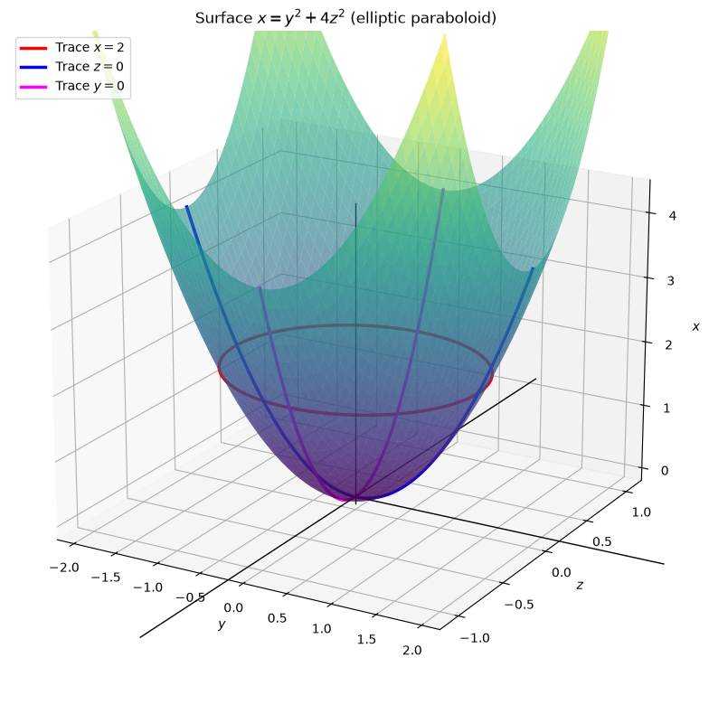
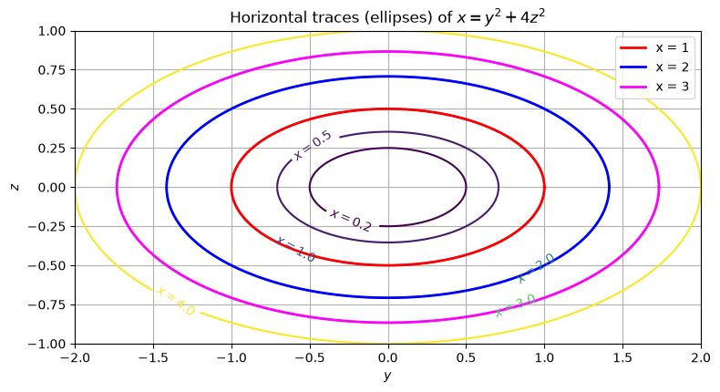
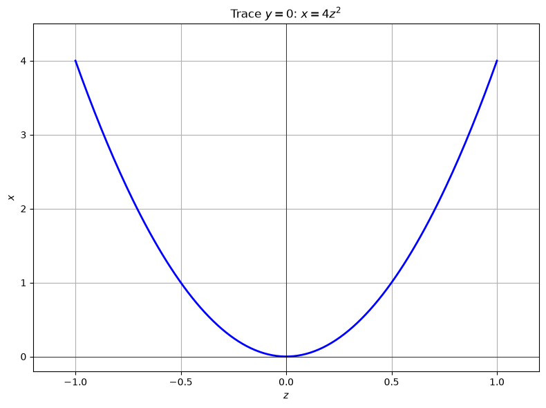
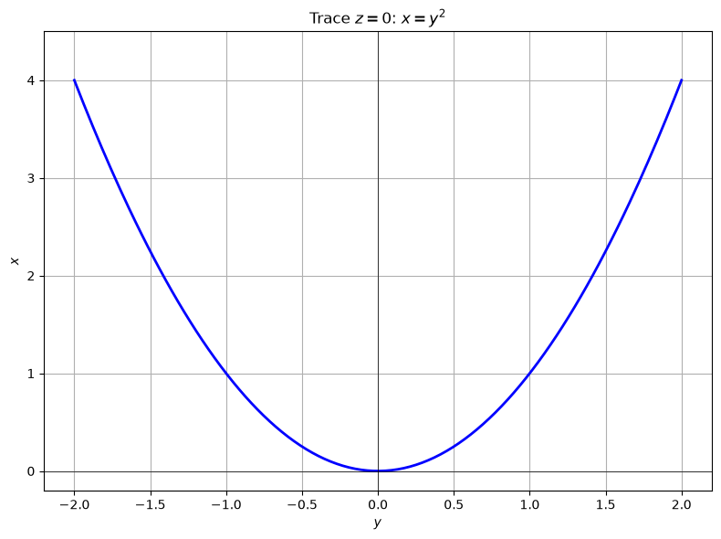
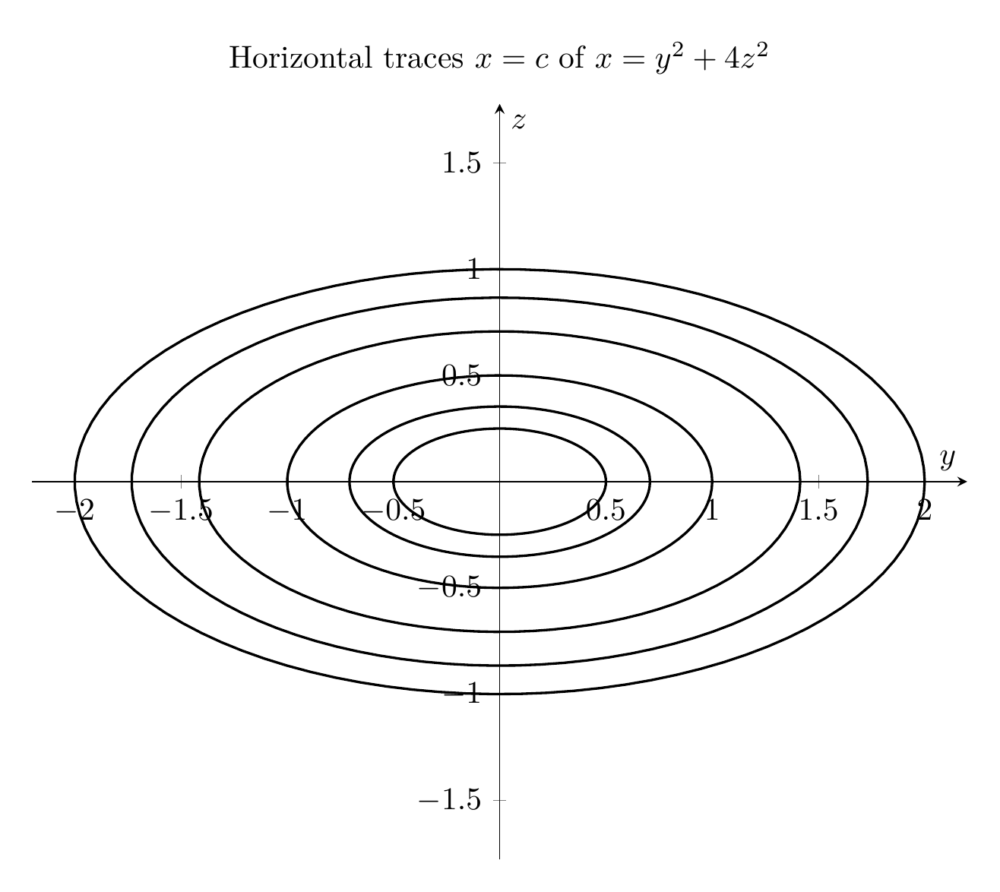
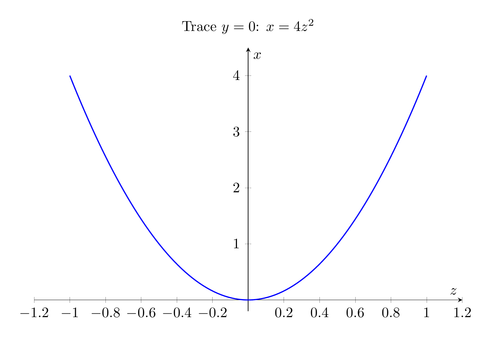
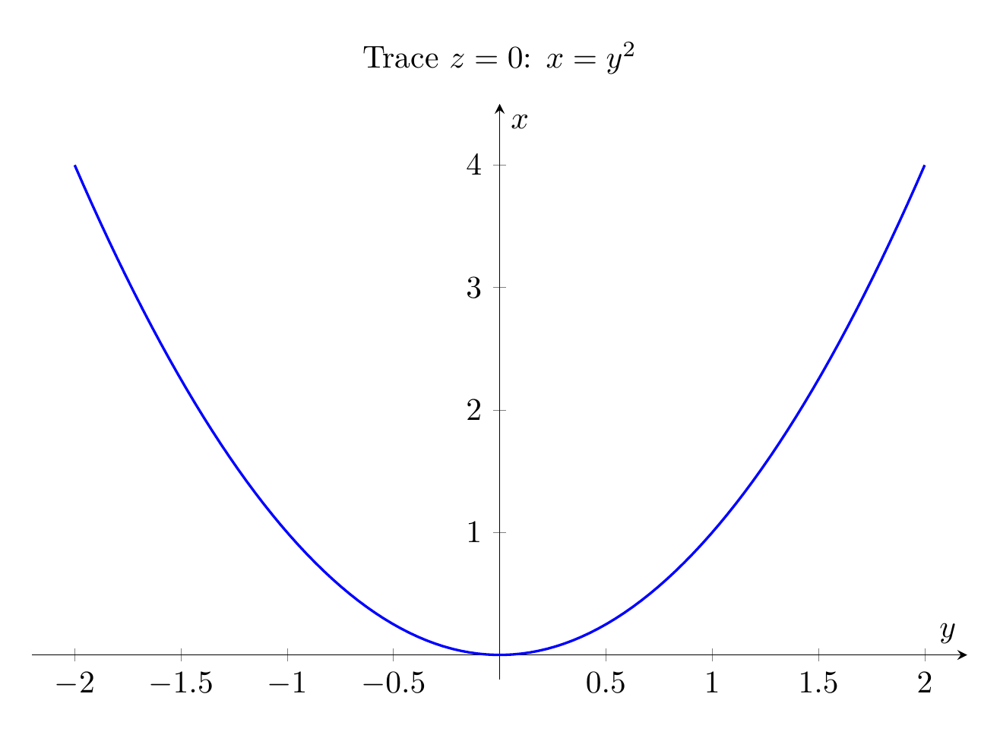

# Solution: Identify the Surface $x = y^2 + 4z^2$

## Step 1: Recall what a "trace" is
A **trace** of a surface is the curve obtained by intersecting the surface with a plane parallel to one of the coordinate planes. We examine traces in planes:
- $x = c$  (planes perpendicular to the $x$-axis),
- $y = c$  (planes perpendicular to the $y$-axis),
- $z = c$  (planes perpendicular to the $z$-axis).

## Step 2: Horizontal traces $x = c$
Set $x = c$ in the equation:

$$
c = y^2 + 4z^2
$$

- If $c < 0$, there is no real solution, so no part of the surface lies to the left of the $yz$-plane.
- If $c = 0$, the only point is $(0,0,0)$.
- If $c > 0$, divide by $c$:

$$
\frac{y^2}{c} + \frac{z^2}{c/4} = 1
$$

This is an **ellipse** in the plane $x=c$, with semi-axes $\sqrt{c}$ in the $y$-direction and $\sqrt{c}/2$ in the $z$-direction. As $c$ increases, the ellipses grow larger.

## Step 3: Vertical traces $y = c$ and $z = c$

**Trace in the plane $y = 0$:**

$$
x = 4z^2
$$

This is a **parabola** in the $xz$-plane, opening in the positive $x$-direction, with vertex at the origin.

**Trace in the plane $z = 0$:**

$$
x = y^2
$$

This is also a **parabola**, in the $xy$-plane, opening in the positive $x$-direction.

In fact, for any fixed $y=c$ or $z=c$, the equation becomes $x = \text{constant} + 4z^2$ or $x = y^2 + \text{constant}$, which are parabolas.

## Step 4: Identify the surface
A surface whose horizontal cross-sections are ellipses and whose vertical cross-sections are parabolas is an **elliptic paraboloid**.

The standard form is:

$$
\frac{x}{a} = \frac{y^2}{b^2} + \frac{z^2}{c^2}
$$

Here we can write:

$$
x = y^2 + 4z^2 \quad\Longleftrightarrow\quad x = \frac{y^2}{1^2} + \frac{z^2}{(1/2)^2}
$$

So the surface is an **elliptic paraboloid** opening along the positive $x$-axis, with vertex at the origin.

## Final Answer

$$\boxed{\text{The surface } x = y^2 + 4z^2 \text{ is an elliptic paraboloid with vertex at } (0,0,0), \text{ opening in the positive } x\text{-direction.}}$$


---









---

[PGFplots / tikz plot.](./20260825_024211_530713_utc_0800_pgfplots_0.tex)

```latex
\documentclass[border=10pt]{standalone}
\usepackage{pgfplots}
\pgfplotsset{compat=1.17}
\begin{document}
\begin{tikzpicture}
\begin{axis}[
    xlabel={$y$}, ylabel={$z$},
    xmin=-2.2, xmax=2.2,
    ymin=-1.2, ymax=1.2,
    axis equal,
    axis lines=middle,
    width=12cm,
    height=10cm,
    title={Horizontal traces $x=c$ of $x=y^2+4z^2$}
]
\pgfplotsinvokeforeach{0.25,0.5,1,2,3,4}{
    \addplot[thick, domain=0:360, samples=100, variable=\t]
        ({sqrt(#1)*cos(\t)}, {sqrt(#1)/2*sin(\t)});
}
\end{axis}
\end{tikzpicture}
\end{document}

```


[PGFplots / tikz plot.](./20260825_024211_530713_utc_0800_pgfplots_1.tex)

```latex
\documentclass[border=10pt]{standalone}
\usepackage{pgfplots}
\pgfplotsset{compat=1.17}
\begin{document}
\begin{tikzpicture}
\begin{axis}[
    xlabel={$y$}, ylabel={$z$},
    xmin=-2.2, xmax=2.2,
    ymin=-1.2, ymax=1.2,
    axis equal,
    axis lines=middle,
    width=12cm,
    height=10cm,
    title={Horizontal traces $x=c$ of $x=y^2+4z^2$}
]
\pgfplotsinvokeforeach{0.25,0.5,1,2,3,4}{
    \addplot[thick, domain=0:360, samples=100, variable=\t]
        ({sqrt(#1)*cos(\t)}, {sqrt(#1)/2*sin(\t)});
}
\end{axis}
\end{tikzpicture}
\end{document}

```



[PGFplots / tikz plot.](./20260825_024211_530713_utc_0800_pgfplots_2.tex)

```latex
\documentclass[border=10pt]{standalone}
\usepackage{pgfplots}
\pgfplotsset{compat=1.17}
\begin{document}
\begin{tikzpicture}
\begin{axis}[
    xlabel={$z$}, ylabel={$x$},
    xmin=-1.2, xmax=1.2,
    ymin=-0.2, ymax=4.5,
    axis lines=middle,
    width=12cm,
    height=8cm,
    title={Trace $y=0$: $x=4z^2$}
]
\addplot[blue, thick, domain=-1:1, samples=100] {4*x*x};
\end{axis}
\end{tikzpicture}
\end{document}

```



[PGFplots / tikz plot.](./20260825_024211_530713_utc_0800_pgfplots_3.tex)

```latex
\documentclass[border=10pt]{standalone}
\usepackage{pgfplots}
\pgfplotsset{compat=1.17}
\begin{document}
\begin{tikzpicture}
\begin{axis}[
    xlabel={$y$}, ylabel={$x$},
    xmin=-2.2, xmax=2.2,
    ymin=-0.2, ymax=4.5,
    axis lines=middle,
    width=12cm,
    height=8cm,
    title={Trace $z=0$: $x=y^2$}
]
\addplot[blue, thick, domain=-2:2, samples=100] {x*x};
\end{axis}
\end{tikzpicture}
\end{document}

```

