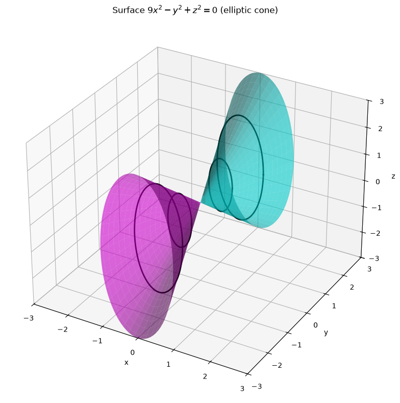
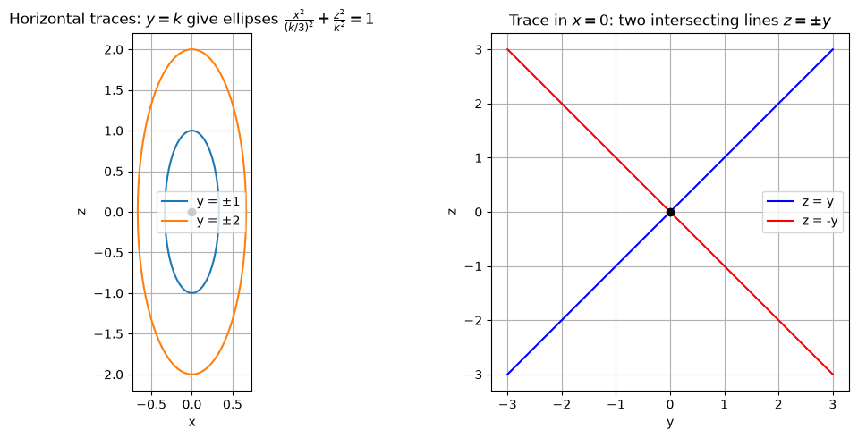
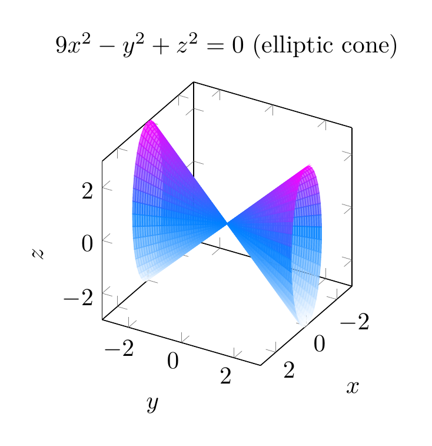
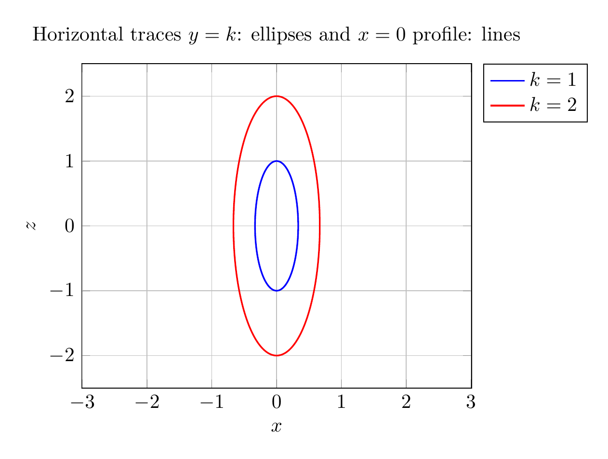

# Identifying the Surface $9x^2 - y^2 + z^2 = 0$ Using Traces

## Step 1: Rewrite the equation
Start with

$$9x^2 - y^2 + z^2 = 0$$

Solve for $y$:

$$y^2 = 9x^2 + z^2 \quad \Longrightarrow \quad y = \pm\sqrt{9x^2+z^2}$$

This already suggests a **double-napped cone** opening along the $y$-axis.

## Step 2: Horizontal traces ($y = k$, constant)
Substitute $y = k$:

$$9x^2 + z^2 = k^2$$

Divide by $k^2$:

$$\frac{x^2}{(k/3)^2} + \frac{z^2}{k^2} = 1$$

These are **ellipses** in planes parallel to the $xz$-plane. The ellipses shrink toward the origin as $|k|$ gets smaller, and they vanish to the single point $(0,0,0)$ when $k=0$.

## Step 3: Vertical traces
- **Trace in the plane $x = 0$:**
  $$-y^2 + z^2 = 0 \quad \Longrightarrow \quad z = \pm y$$
  This is a pair of intersecting straight lines, the profile of a cone.

- **Trace in the plane $z = 0$:**
  $$9x^2 - y^2 = 0 \quad \Longrightarrow \quad y = \pm 3x$$
  Again a pair of intersecting lines.

## Step 4: Conclusion
Because the horizontal traces are ellipses and the vertical traces through the axis are intersecting lines, the surface is an **elliptic cone** with axis along the $y$-axis and vertex at the origin.

$$\boxed{\text{The surface } 9x^2 - y^2 + z^2 = 0 \text{ is an elliptic cone opening along the } y\text{-axis.}}$$

---





---

[PGFplots / tikz plot.](./20260825_024110_635949_utc_0800_pgfplots_0.tex)

```latex
\documentclass[border=10pt]{standalone}
\usepackage{pgfplots}
\pgfplotsset{compat=1.18}
\begin{document}
\begin{tikzpicture}
\begin{axis}[
    view={120}{30},
    xlabel=$x$, ylabel=$y$, zlabel=$z$,
    xmin=-3, xmax=3,
    ymin=-3, ymax=3,
    zmin=-3, zmax=3,
    samples=40, samples y=40,
    colormap/cool,
    title={$9x^2-y^2+z^2=0$ (elliptic cone)},
    axis equal image,
]
\addplot3[surf, domain=0:360, y domain=0:3, shader=flat, opacity=0.7] ({y/3*cos(x)}, {y}, {y*sin(x)});
\addplot3[surf, domain=0:360, y domain=0:3, shader=flat, opacity=0.7] ({y/3*cos(x)}, {-y}, {y*sin(x)});
\end{axis}
\end{tikzpicture}
\end{document}
```



[PGFplots / tikz plot.](./20260825_024110_635949_utc_0800_pgfplots_1.tex)

```latex
\documentclass[border=10pt]{standalone}
\usepackage{pgfplots}
\pgfplotsset{compat=1.18}
\begin{document}
\begin{tikzpicture}
\begin{axis}[
    xlabel=$x$, ylabel=$z$,
    axis equal,
    title={Horizontal traces $y=k$: ellipses and $x=0$ profile: lines},
    xmin=-1.2, xmax=1.2, ymin=-2.5, ymax=2.5,
    grid=both,
    legend pos=outer north east,
]
\addplot[domain=0:360, samples=200, thick, blue] ({1/3*cos(x)}, {1*sin(x)});
\addplot[domain=0:360, samples=200, thick, red] ({2/3*cos(x)}, {2*sin(x)});
\legend{$k=1$, $k=2$}
\end{axis}
\end{tikzpicture}
\end{document}
```

