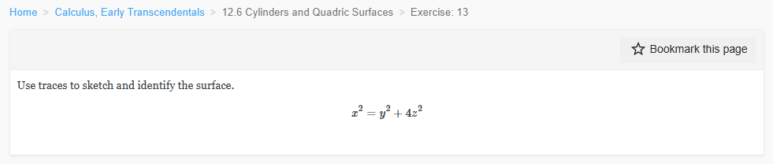
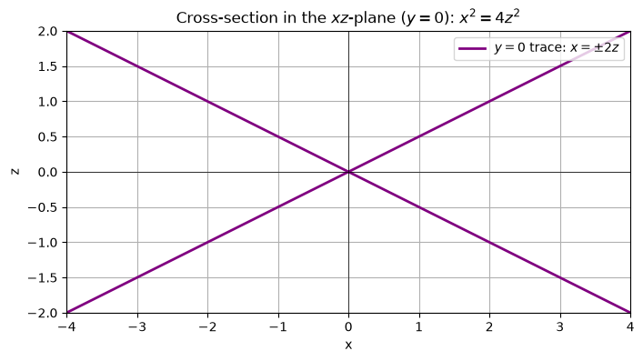
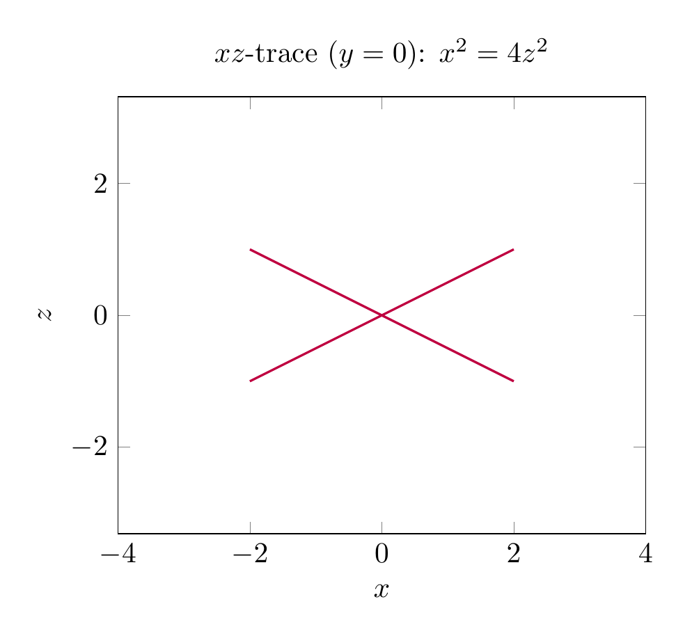

`[ Begin message. Type: HumanMessage. ]`

`[Begin Problem]`

Please solve the math problem in the image.


(Image `problem.png`. Alt text: Problem.)



`[End Problem]`

`[ End message. Type: HumanMessage. ]`

`[ Begin message. Type: AIMessage. ]`

`[Begin Answer]`

# Solution: Identify and Sketch $x^2 = y^2 + 4z^2$

## 1. Recognize the type of quadric surface

Write the equation in standard form by dividing by the right-hand side (when it is nonzero):

$$
\frac{x^2}{1} - \frac{y^2}{1} - \frac{z^2}{1/4} = 0
\quad\Longleftrightarrow\quad
x^2 = y^2 + 4z^2.
$$

This is the standard equation of an **elliptic cone** whose axis is the $x$-axis and whose vertex is the origin $(0,0,0)$. The surface has two nappes, opening in the positive and negative $x$-directions.

## 2. Use traces to confirm the shape

A trace is the intersection of the surface with a plane parallel to one of the coordinate planes.

### Trace with $x = k$ (plane perpendicular to the $x$-axis)

Substitute $x = k$:

$$
y^2 + 4z^2 = k^2.
$$

For $k \neq 0$ this is an **ellipse** in the plane $x=k$ with semi-axes

$$
\text{semi-axis in } y = |k|, \qquad \text{semi-axis in } z = \frac{|k|}{2}.
$$

For $k=0$ the trace collapses to the single point $(0,0,0)$, the vertex.

### Trace with $y = k$ (plane perpendicular to the $y$-axis)

Substitute $y = k$:

$$
x^2 - 4z^2 = k^2.
$$

This is a **hyperbola** opening in the $x$-direction. The asymptotes are $x = \pm 2z$.

### Trace with $z = k$ (plane perpendicular to the $z$-axis)

Substitute $z = k$:

$$
x^2 - y^2 = 4k^2.
$$

This is also a **hyperbola**, opening in the $x$-direction, with asymptotes $x = \pm y$.

### Coordinate-plane traces

- In the $xy$-plane ($z=0$): $x^2 = y^2$, so $x = \pm y$. These are two straight lines through the origin.
- In the $xz$-plane ($y=0$): $x^2 = 4z^2$, so $x = \pm 2z$. These are also two straight lines through the origin.

Because the coordinate-plane traces are pairs of intersecting lines, the surface is a **cone** rather than a hyperboloid.

## 3. Sketch

The sketch shows the two nappes of the elliptic cone opening along the $x$-axis. A typical horizontal trace $x=k$ is an ellipse, while vertical traces $y=k$ or $z=k$ are hyperbolas.

## 4. Final identification

$$
\boxed{\text{The surface } x^2 = y^2 + 4z^2 \text{ is an elliptic cone with axis the } x\text{-axis and vertex at the origin.}}
$$


---


(Image `20260825_024524_605089_utc_0800_pyplot_0.png`. Alt text: pyplot-generated plot.)


(Image `20260825_024524_605089_utc_0800_pyplot_1.png`. Alt text: pyplot-generated plot.)




---

[PGFplots / tikz plot.](./20260825_024524_605089_utc_0800_pgfplots_0.tex)

```latex
\documentclass[border=10pt]{standalone}
\usepackage{pgfplots}
\pgfplotsset{compat=1.18}
\begin{document}
\begin{tikzpicture}
\begin{axis}[
    width=10cm,
    view={120}{20},
    xlabel={$x$}, ylabel={$y$}, zlabel={$z$},
    xmin=-3, xmax=3,
    ymin=-3, ymax=3,
    zmin=-1.5, zmax=1.5,
    samples=40,
    samples y=40,
    colormap={bluewhite}{rgb255=(200,230,255) rgb255=(100,180,230)},
    title={$x^2=y^2+4z^2$ (elliptic cone)}
]
\addplot3[surf, shader=interp, domain=0:2.5, domain y=-2.5:2.5] ({sqrt(x^2+4*y^2)},x,y);
\addplot3[surf, shader=interp, domain=0:2.5, domain y=-2.5:2.5] ({-sqrt(x^2+4*y^2)},x,y);
% Trace ellipse x=2 (in original coordinates: x=2, y^2+4z^2=4)
\addplot3[red, thick, samples y=0, domain=0:360] ({2},{2*sin(x)},{cos(x)});
% Trace lines in coordinate planes
\addplot3[green, thick, samples y=0, domain=-3:3] (x,x,0);
\addplot3[green, thick, samples y=0, domain=-3:3] (x,-x,0);
\addplot3[purple, thick, samples y=0, domain=-1.5:1.5] (2*x,0,x);
\addplot3[purple, thick, samples y=0, domain=-1.5:1.5] (-2*x,0,x);
\end{axis}
\end{tikzpicture}
\end{document}
```


(Image `20260825_024524_605089_utc_0800_pgfplots_0.png`. Alt text: PGFplots / tikz plot (converted to PNG).)


[PGFplots / tikz plot.](./20260825_024524_605089_utc_0800_pgfplots_1.tex)

```latex
\documentclass[border=10pt]{standalone}
\usepackage{pgfplots}
\pgfplotsset{compat=1.18}
\begin{document}
\begin{tikzpicture}
\begin{axis}[
    width=8cm,
    xlabel={$x$}, ylabel={$z$},
    xmin=-4, xmax=4,
    ymin=-2, ymax=2,
    axis equal,
    title={$xz$-trace ($y=0$): $x^2=4z^2$}
]
\addplot[domain=-2:2, samples=100, purple, thick] {0.5*x};
\addplot[domain=-2:2, samples=100, purple, thick] {-0.5*x};
\end{axis}
\end{tikzpicture}
\end{document}
```


(Image `20260825_024524_605089_utc_0800_pgfplots_1.png`. Alt text: PGFplots / tikz plot (converted to PNG).)



`[End Answer]`

`[ End message. Type: AIMessage. ]`