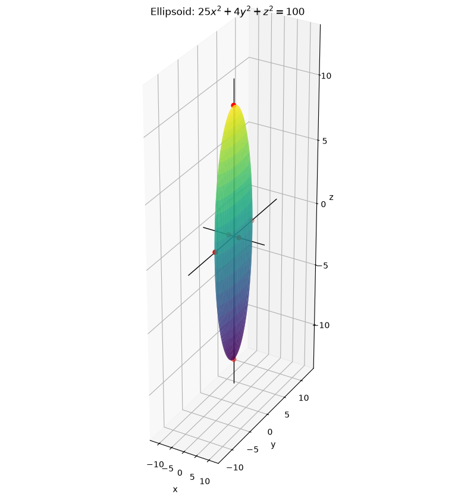
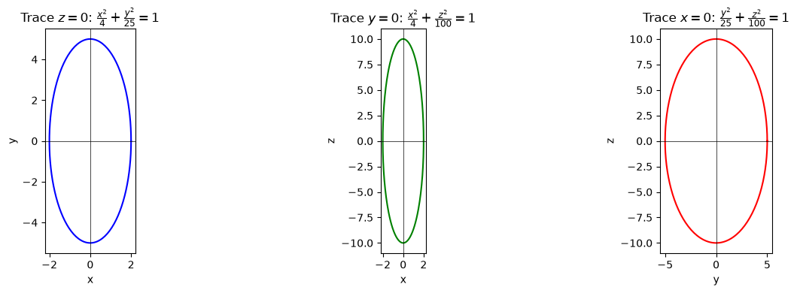
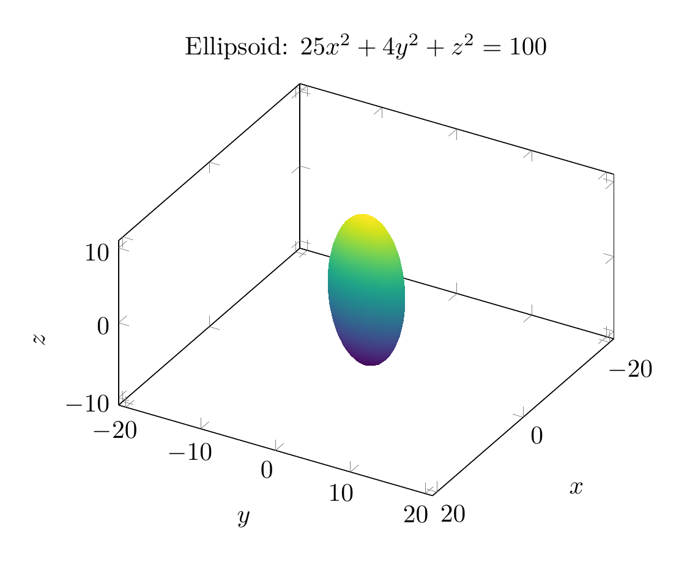
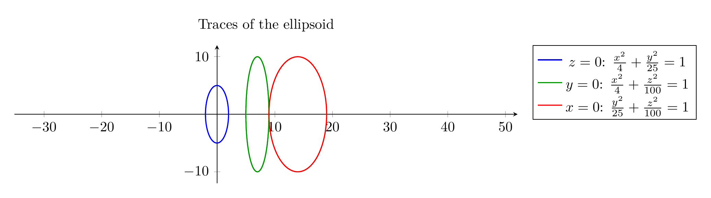

`[ Begin message. Type: AIMessage. ]`

# Identifying the Surface $25x^2+4y^2+z^2=100$

## 1. Put the equation in standard form

Divide both sides by $100$:

$$
\frac{x^2}{4}+\frac{y^2}{25}+\frac{z^2}{100}=1.
$$

This matches the standard equation of an **ellipsoid**:

$$
\frac{x^2}{a^2}+\frac{y^2}{b^2}+\frac{z^2}{c^2}=1.
$$

So $a^2=4$, $b^2=25$, $c^2=100$, giving

$$
a=2,\qquad b=5,\qquad c=10.
$$

The surface is centered at the origin and intercepts the axes at $(\pm 2,0,0)$, $(0,\pm 5,0)$, and $(0,0,\pm 10)$.

## 2. Use traces to confirm

A trace is the intersection of the surface with a plane parallel to one of the coordinate planes.

### Trace in the $xy$-plane ($z=0$)

$$
25x^2+4y^2=100 \quad\Longrightarrow\quad \frac{x^2}{4}+\frac{y^2}{25}=1.
$$

This is an ellipse with semi-axes $2$ along $x$ and $5$ along $y$.

### Trace in the $xz$-plane ($y=0$)

$$
25x^2+z^2=100 \quad\Longrightarrow\quad \frac{x^2}{4}+\frac{z^2}{100}=1.
$$

This is an ellipse with semi-axes $2$ along $x$ and $10$ along $z$.

### Trace in the $yz$-plane ($x=0$)

$$
4y^2+z^2=100 \quad\Longrightarrow\quad \frac{y^2}{25}+\frac{z^2}{100}=1.
$$

This is an ellipse with semi-axes $5$ along $y$ and $10$ along $z$.

Every horizontal or vertical trace is an ellipse (or a point when the plane is tangent), which is the defining property of an ellipsoid.

## 3. Conclusion

The surface is an **ellipsoid** centered at the origin with semi-axes $2$, $5$, and $10$ along the $x$-, $y$-, and $z$-axes, respectively.

$$\boxed{\text{The surface is an ellipsoid: } \frac{x^2}{4}+\frac{y^2}{25}+\frac{z^2}{100}=1}$$


---


(Image `20260825_024101_111203_utc_0800_pyplot_0.png`. Alt text: pyplot-generated plot.)



(Image `20260825_024101_111203_utc_0800_pyplot_1.png`. Alt text: pyplot-generated plot.)




---

[PGFplots / tikz plot.](./20260825_024101_111203_utc_0800_pgfplots_0.tex)

```latex
\documentclass[border=10pt]{standalone}
\usepackage{pgfplots}
\pgfplotsset{compat=1.18}
\begin{document}
\begin{tikzpicture}
\begin{axis}[
    view={120}{30},
    xlabel=$x$, ylabel=$y$, zlabel=$z$,
    xmin=-3, xmax=3,
    ymin=-6, ymax=6,
    zmin=-11, zmax=11,
    axis equal,
    title={Ellipsoid: $25x^2+4y^2+z^2=100$},
    colormap/viridis
]
\addplot3[
    surf,
    shader=interp,
    samples=40,
    samples y=60,
    domain=0:180,
    y domain=0:360,
    z buffer=sort
]
({2*sin(x)*cos(y)}, {5*sin(x)*sin(y)}, {10*cos(x)});
\end{axis}
\end{tikzpicture}
\end{document}

```


(Image `20260825_024101_111203_utc_0800_pgfplots_0.png`. Alt text: PGFplots / tikz plot (converted to PNG).)




[PGFplots / tikz plot.](./20260825_024101_111203_utc_0800_pgfplots_1.tex)

```latex
\documentclass[border=10pt]{standalone}
\usepackage{pgfplots}
\pgfplotsset{compat=1.18}
\begin{document}
\begin{tikzpicture}
\begin{axis}[
    width=14cm, height=5cm,
    axis equal,
    axis lines=middle,
    enlargelimits=true,
    title={Traces of the ellipsoid},
    legend pos=outer north east
]
\addplot[blue, thick, domain=0:360, samples=200, variable=\t]
({2*cos(\t)}, {5*sin(\t)});
\addplot[green!60!black, thick, domain=0:360, samples=200, variable=\t]
({2*cos(\t)+7}, {10*sin(\t)});
\addplot[red, thick, domain=0:360, samples=200, variable=\t]
({5*cos(\t)+14}, {10*sin(\t)});
\legend{$z=0$: $\frac{x^2}{4}+\frac{y^2}{25}=1$,
        $y=0$: $\frac{x^2}{4}+\frac{z^2}{100}=1$,
        $x=0$: $\frac{y^2}{25}+\frac{z^2}{100}=1$}
\end{axis}
\end{tikzpicture}
\end{document}

```


(Image `20260825_024101_111203_utc_0800_pgfplots_1.png`. Alt text: PGFplots / tikz plot (converted to PNG).)



`[ End message. Type: AIMessage. ]`