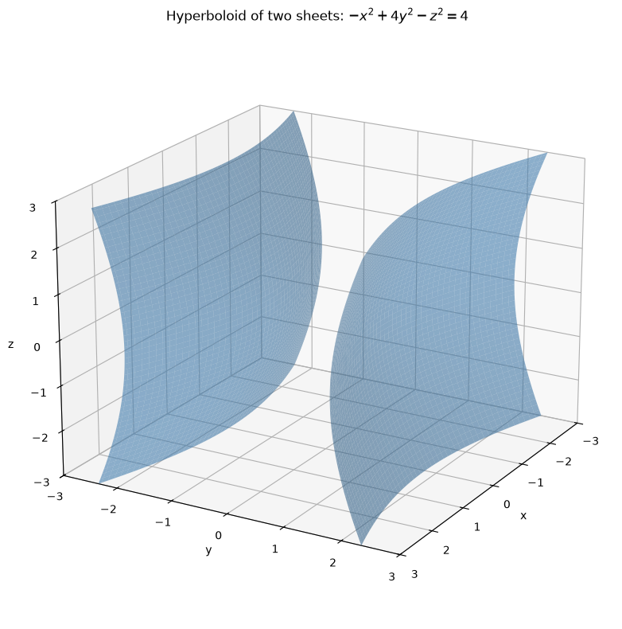
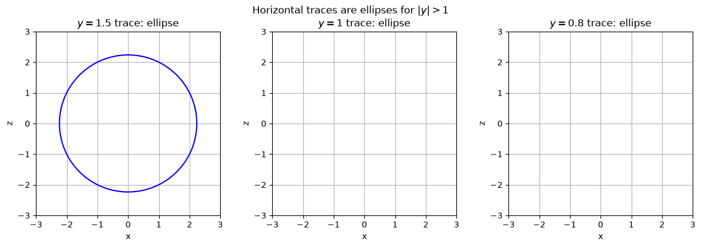
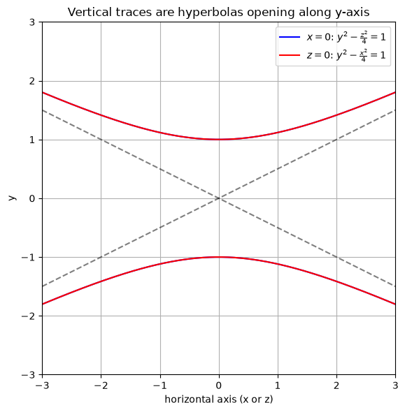
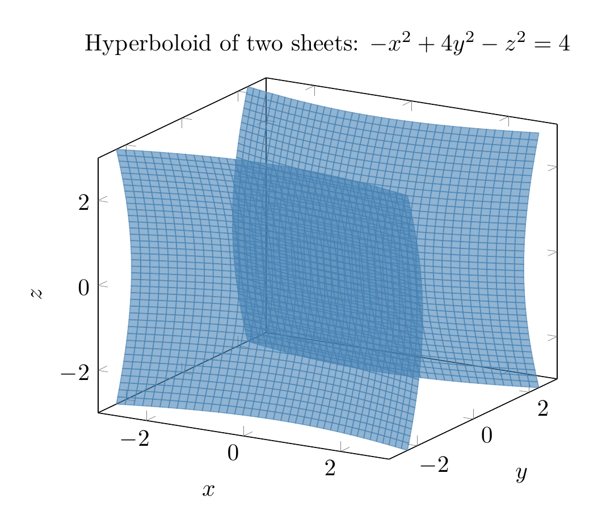
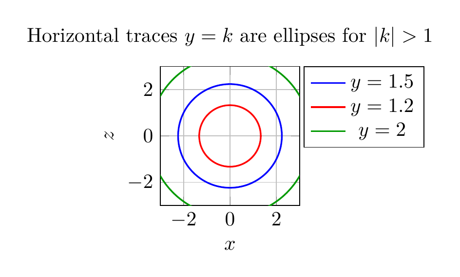
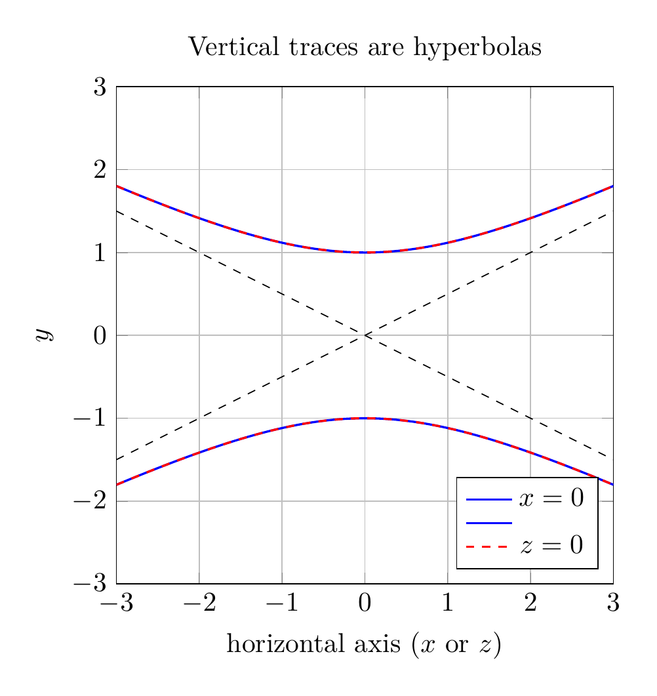

`[ Begin message. Type: HumanMessage. ]`

`[Begin Problem]`

Please solve the math problem in the image.


(Image `problem.png`. Alt text: Problem.)


`[End Problem]`

`[ End message. Type: HumanMessage. ]`

`[ Begin message. Type: AIMessage. ]`

`[Begin Answer]`

# Identifying the Surface by Traces

We are asked to sketch and identify the surface

$$
-x^2+4y^2-z^2=4.
$$

## 1. Put the equation in standard form

Divide both sides by $4$:

$$
\frac{-x^2}{4}+y^2-\frac{z^2}{4}=1
\quad\Longleftrightarrow\quad
\frac{y^2}{1}-\frac{x^2}{4}-\frac{z^2}{4}=1.
$$

This matches the standard form of a **hyperboloid of two sheets**:

$$
\frac{y^2}{a^2}-\frac{x^2}{b^2}-\frac{z^2}{c^2}=1,
$$

with $a=1$, $b=2$, $c=2$. The axis of symmetry is the $y$-axis.

## 2. Find the vertices

Set $x=z=0$:

$$
4y^2=4 \;\Rightarrow\; y^2=1 \;\Rightarrow\; y=\pm 1.
$$

So the two sheets meet the $y$-axis at $(0,1,0)$ and $(0,-1,0)$.

## 3. Use traces

### Horizontal traces: $y=k$

Substitute $y=k$:

$$
\frac{x^2}{4}+\frac{z^2}{4}=k^2-1.
$$

- If $|k|>1$, this is an **ellipse**.
- If $|k|=1$, it is a single point (the vertex).
- If $|k|<1$, there is **no real trace** (the plane misses the surface).

This confirms two separate sheets, one opening toward $+y$ and one toward $-y$.

### Vertical traces: $x=0$ and $z=0$

- With $x=0$:
  $$
  y^2-\frac{z^2}{4}=1,
  $$
  a hyperbola in the $yz$-plane.

- With $z=0$:
  $$
  y^2-\frac{x^2}{4}=1,
  $$
  a hyperbola in the $xy$-plane.

Both hyperbolas open along the $y$-axis, with asymptotes $y=\pm \tfrac{x}{2}$ and $y=\pm \tfrac{z}{2}$.

## 4. Conclusion

The surface is a **hyperboloid of two sheets**, centered at the origin, with its axis along the $y$-axis and vertices at $(0,\pm 1,0)$.

$$\boxed{\text{Hyperboloid of two sheets: } \frac{y^2}{1}-\frac{x^2}{4}-\frac{z^2}{4}=1}$$


---


(Image `20260825_024054_502725_utc_0800_pyplot_0.png`. Alt text: pyplot-generated plot.)



(Image `20260825_024054_502725_utc_0800_pyplot_1.png`. Alt text: pyplot-generated plot.)



(Image `20260825_024054_502725_utc_0800_pyplot_2.png`. Alt text: pyplot-generated plot.)




---

[PGFplots / tikz plot.](./20260825_024054_502725_utc_0800_pgfplots_0.tex)

```latex
\documentclass[border=10pt]{standalone}
\usepackage{pgfplots}
\pgfplotsset{compat=1.17}
\begin{document}
\begin{tikzpicture}
\begin{axis}[
    view={30}{20},
    xlabel=$x$, ylabel=$y$, zlabel=$z$,
    xmin=-3, xmax=3,
    ymin=-3, ymax=3,
    zmin=-3, zmax=3,
    samples=40,
    domain=-3:3,
    y domain=-3:3,
    colormap={steelblue}{rgb255=(70,130,180) rgb255=(70,130,180)},
    title={Hyperboloid of two sheets: $-x^2+4y^2-z^2=4$}
]
\addplot3[surf, opacity=0.6, shader=flat, draw=none, domain=-3:3, y domain=-3:3]
    ({x}, {sqrt(1+(x/2)^2+(y/2)^2)}, {y});
\addplot3[surf, opacity=0.6, shader=flat, draw=none, domain=-3:3, y domain=-3:3]
    ({x}, {-sqrt(1+(x/2)^2+(y/2)^2)}, {y});
\end{axis}
\end{tikzpicture}
\end{document}

```


(Image `20260825_024054_502725_utc_0800_pgfplots_0.png`. Alt text: PGFplots / tikz plot (converted to PNG).)




[PGFplots / tikz plot.](./20260825_024054_502725_utc_0800_pgfplots_1.tex)

```latex
\documentclass[border=10pt]{standalone}
\usepackage{pgfplots}
\pgfplotsset{compat=1.17}
\begin{document}
\begin{tikzpicture}
\begin{axis}[
    width=12cm, height=4cm,
    axis equal image,
    xmin=-3, xmax=3, ymin=-3, ymax=3,
    xlabel=$x$, ylabel=$z$,
    grid=both,
    title={Horizontal traces $y=k$ are ellipses for $|k|>1$},
    legend pos=outer north east
]
\def\yval{1.5}
\addplot[blue, thick, domain=0:360, samples=200, variable=\t]
    ({2*sqrt(\yval^2-1)*cos(\t)}, {2*sqrt(\yval^2-1)*sin(\t)});
\def\yvalb{1.2}
\addplot[red, thick, domain=0:360, samples=200, variable=\t]
    ({2*sqrt(\yvalb^2-1)*cos(\t)}, {2*sqrt(\yvalb^2-1)*sin(\t)});
\def\yvalc{2}
\addplot[green!60!black, thick, domain=0:360, samples=200, variable=\t]
    ({2*sqrt(\yvalc^2-1)*cos(\t)}, {2*sqrt(\yvalc^2-1)*sin(\t)});
\legend{$y=1.5$,$y=1.2$,$y=2$}
\end{axis}
\end{tikzpicture}
\end{document}

```


(Image `20260825_024054_502725_utc_0800_pgfplots_1.png`. Alt text: PGFplots / tikz plot (converted to PNG).)




[PGFplots / tikz plot.](./20260825_024054_502725_utc_0800_pgfplots_2.tex)

```latex
\documentclass[border=10pt]{standalone}
\usepackage{pgfplots}
\pgfplotsset{compat=1.17}
\begin{document}
\begin{tikzpicture}
\begin{axis}[
    width=8cm, height=8cm,
    axis equal image,
    xmin=-3, xmax=3, ymin=-3, ymax=3,
    xlabel={horizontal axis ($x$ or $z$)}, ylabel=$y$,
    grid=both,
    title={Vertical traces are hyperbolas},
    legend pos=south east
]
\addplot[blue, thick, domain=-3:3, samples=200]
    {sqrt(1+x^2/4)};
\addplot[blue, thick, domain=-3:3, samples=200]
    {-sqrt(1+x^2/4)};
\addplot[red, thick, domain=-3:3, samples=200, dashed]
    {sqrt(1+x^2/4)};
\addplot[red, thick, domain=-3:3, samples=200, dashed]
    {-sqrt(1+x^2/4)};
\addplot[black, dashed, domain=-3:3, samples=2]{x/2};
\addplot[black, dashed, domain=-3:3, samples=2]{-x/2};
\legend{$x=0$,$ $,$z=0$}
\end{axis}
\end{tikzpicture}
\end{document}

```


(Image `20260825_024054_502725_utc_0800_pgfplots_2.png`. Alt text: PGFplots / tikz plot (converted to PNG).)



`[End Answer]`

`[ End message. Type: AIMessage. ]`