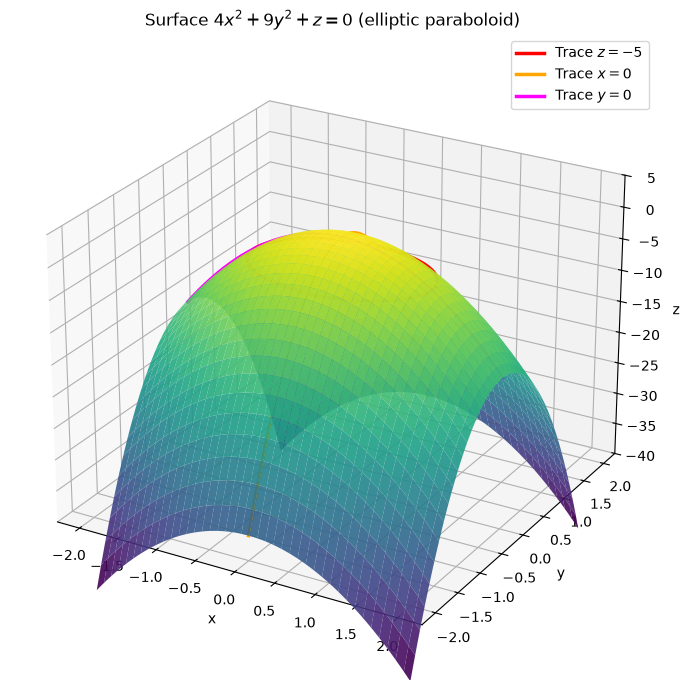
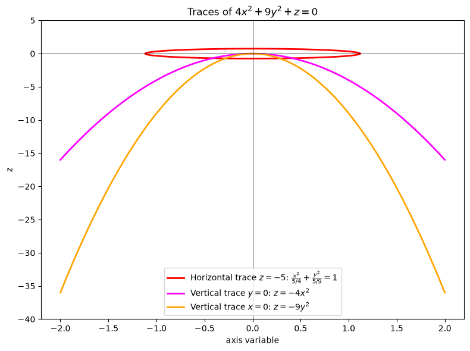
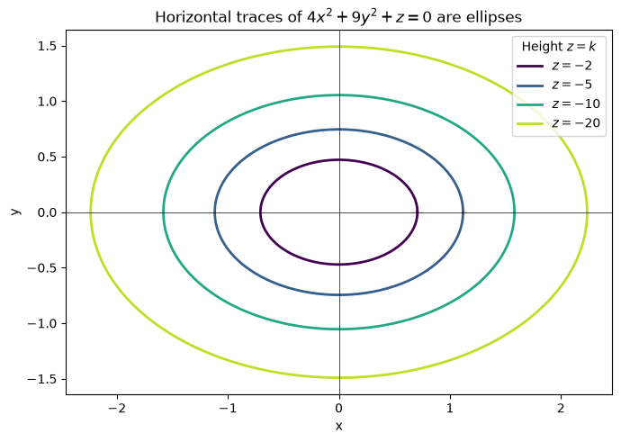
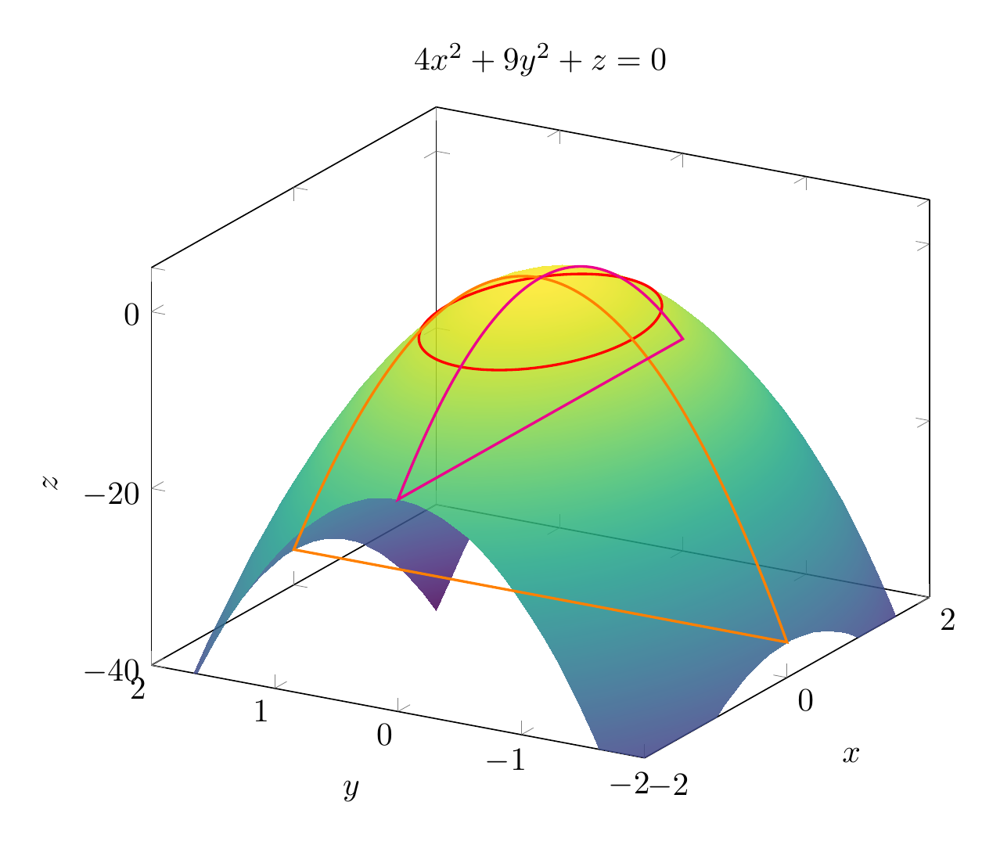
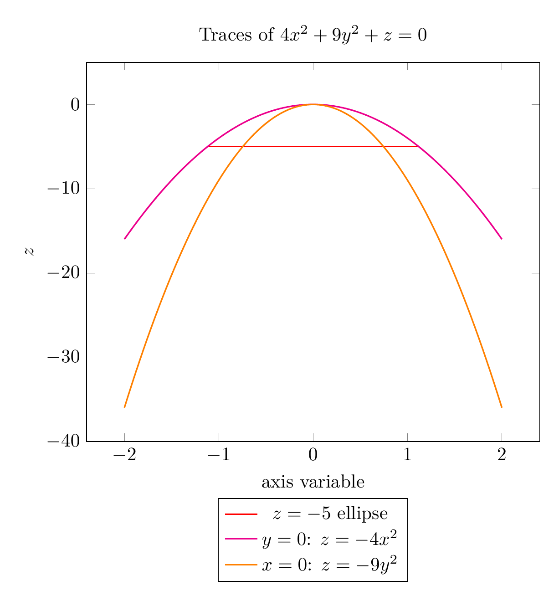
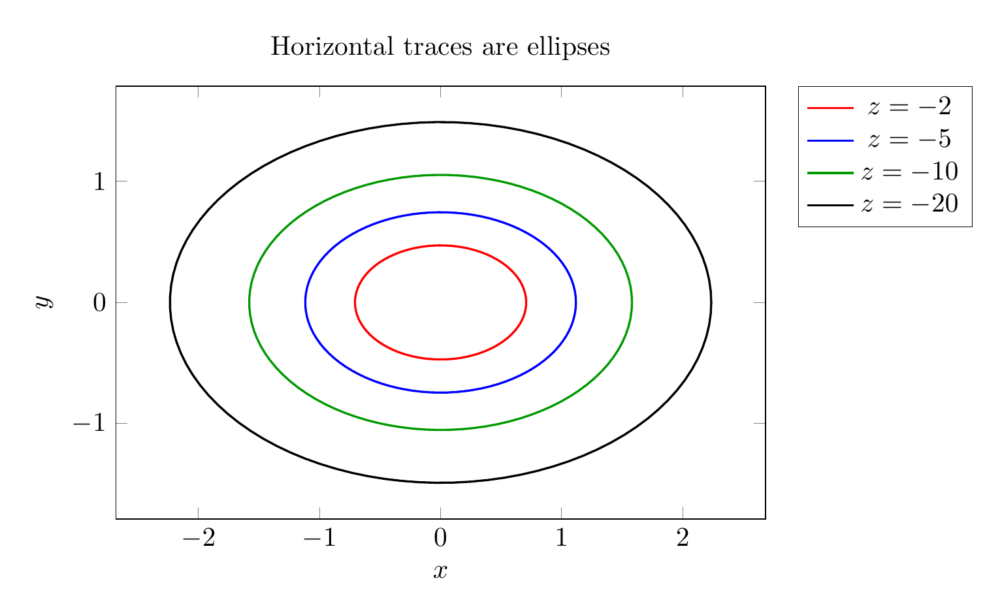

`[ Begin message. Type: AIMessage. ]`

# Using Traces to Sketch and Identify the Surface

We are asked to identify the surface

$$
4x^2+9y^2+z=0.
$$

First solve for $z$:

$$
z=-4x^2-9y^2.
$$

This is a quadratic surface.  We use **traces**—the intersections of the surface with planes parallel to the coordinate planes—to recognize it.

## 1. Horizontal traces: $z=k$

Set $z=k$:

$$
4x^2+9y^2=-k.
$$

- If $k>0$, the left side is non-negative while the right side is negative: **no real points**.
- If $k=0$, we get $x=y=0$, the single point $(0,0,0)$, the **vertex**.
- If $k<0$, divide by $-k$:

$$
\frac{x^2}{-k/4}+\frac{y^2}{-k/9}=1.
$$

These are **ellipses** with semi-axes $a=\sqrt{-k}/2$ and $b=\sqrt{-k}/3$.  As $|k|$ increases, the ellipses grow larger.

## 2. Vertical traces

**Trace in the plane $x=0$:**

$$
z=-9y^2,
$$

which is a **parabola** opening downward in the $yz$-plane.

**Trace in the plane $y=0$:**

$$
z=-4x^2,
$$

which is a **parabola** opening downward in the $xz$-plane.

## 3. Identify the surface

Since all horizontal traces are ellipses and all vertical traces through the axis are parabolas, the surface is an **elliptic paraboloid**.  Because the squared terms have negative coefficients, it opens **downward** with vertex at the origin.

$$
\boxed{\text{The surface }4x^2+9y^2+z=0\text{ is an elliptic paraboloid opening downward, with vertex at }(0,0,0).}
$$


---


(Image `20260825_024115_985623_utc_0800_pyplot_0.png`. Alt text: pyplot-generated plot.)



(Image `20260825_024115_985623_utc_0800_pyplot_1.png`. Alt text: pyplot-generated plot.)



(Image `20260825_024115_985623_utc_0800_pyplot_2.png`. Alt text: pyplot-generated plot.)




---

[PGFplots / tikz plot.](./20260825_024115_985623_utc_0800_pgfplots_0.tex)

```latex
\documentclass[border=10pt]{standalone}
\usepackage{pgfplots}
\pgfplotsset{compat=1.17}
\begin{document}
\begin{tikzpicture}
\begin{axis}[
    width=10cm,
    view={-60}{25},
    xlabel=$x$, ylabel=$y$, zlabel=$z$,
    zmin=-40, zmax=5,
    colormap/viridis,
    title={$4x^2+9y^2+z=0$},
    samples=40,
    domain=-2:2,
    y domain=-2:2,
]
\addplot3[surf, opacity=0.85, shader=interp] {-4*x^2-9*y^2};
\addplot3[red, thick, domain=0:360, samples=100, variable=\t]
    ({sqrt(5)/2*cos(\t)}, {sqrt(5)/3*sin(\t)}, -5);
\addplot3[orange, thick, domain=-2:2, samples=100]
    (0, x, -9*x^2);
\addplot3[magenta, thick, domain=-2:2, samples=100]
    (x, 0, -4*x^2);
\end{axis}
\end{tikzpicture}
\end{document}

```


(Image `20260825_024115_985623_utc_0800_pgfplots_0.png`. Alt text: PGFplots / tikz plot (converted to PNG).)




[PGFplots / tikz plot.](./20260825_024115_985623_utc_0800_pgfplots_1.tex)

```latex
\documentclass[border=10pt]{standalone}
\usepackage{pgfplots}
\pgfplotsset{compat=1.17}
\begin{document}
\begin{tikzpicture}
\begin{axis}[
    width=10cm,
    xlabel={axis variable}, ylabel=$z$,
    ymin=-40, ymax=5,
    legend style={at={(0.5,-0.15)}, anchor=north, legend columns=1},
    title={Traces of $4x^2+9y^2+z=0$},
    domain=-2:2,
    samples=100,
]
\addplot[red, thick, domain=0:360, variable=\t]
    ({sqrt(5)/2*cos(\t)}, -5);
\addlegendentry{$z=-5$ ellipse}
\addplot[magenta, thick] { -4*x^2 };
\addlegendentry{$y=0$: $z=-4x^2$}
\addplot[orange, thick] { -9*x^2 };
\addlegendentry{$x=0$: $z=-9y^2$}
\end{axis}
\end{tikzpicture}
\end{document}

```


(Image `20260825_024115_985623_utc_0800_pgfplots_1.png`. Alt text: PGFplots / tikz plot (converted to PNG).)




[PGFplots / tikz plot.](./20260825_024115_985623_utc_0800_pgfplots_2.tex)

```latex
\documentclass[border=10pt]{standalone}
\usepackage{pgfplots}
\pgfplotsset{compat=1.17}
\begin{document}
\begin{tikzpicture}
\begin{axis}[
    width=10cm,
    axis equal image,
    xlabel=$x$, ylabel=$y$,
    title={Horizontal traces are ellipses},
    legend style={at={(1.05,1)}, anchor=north west},
    domain=0:360,
    samples=100,
]
\addplot[red, thick, variable=\t] ({sqrt(2/4)*cos(\t)}, {sqrt(2/9)*sin(\t)});
\addlegendentry{$z=-2$}
\addplot[blue, thick, variable=\t] ({sqrt(5/4)*cos(\t)}, {sqrt(5/9)*sin(\t)});
\addlegendentry{$z=-5$}
\addplot[green!60!black, thick, variable=\t] ({sqrt(10/4)*cos(\t)}, {sqrt(10/9)*sin(\t)});
\addlegendentry{$z=-10$}
\addplot[black, thick, variable=\t] ({sqrt(20/4)*cos(\t)}, {sqrt(20/9)*sin(\t)});
\addlegendentry{$z=-20$}
\end{axis}
\end{tikzpicture}
\end{document}

```


(Image `20260825_024115_985623_utc_0800_pgfplots_2.png`. Alt text: PGFplots / tikz plot (converted to PNG).)



`[ End message. Type: AIMessage. ]`