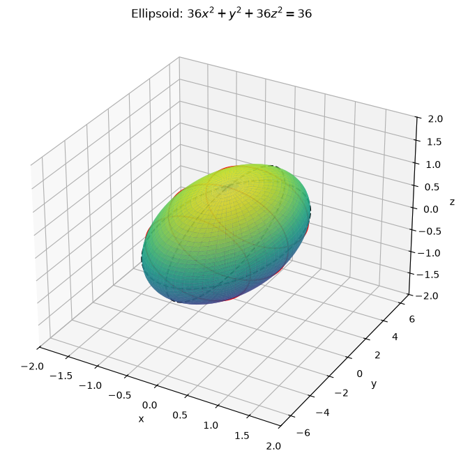
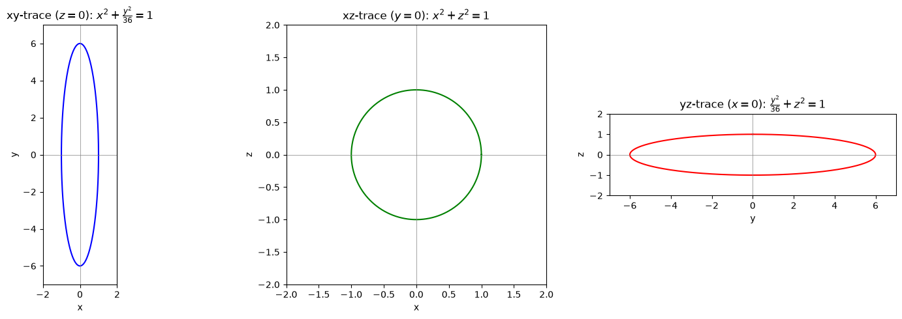
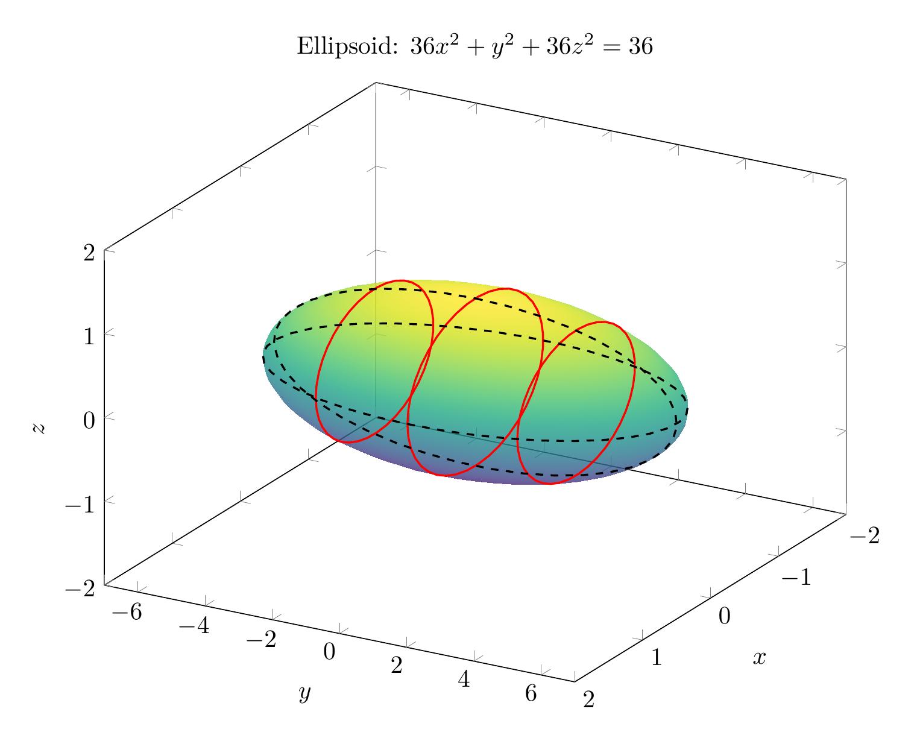
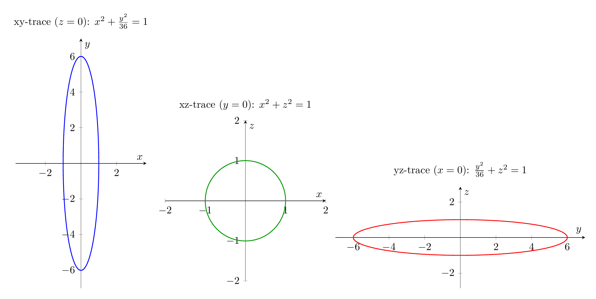

# Identifying the Surface Using Traces

We are asked to sketch and identify the surface

$$36x^2 + y^2 + 36z^2 = 36.$$

## Step 1: Write the equation in standard form

Divide both sides by $36$:

$$\frac{x^2}{1} + \frac{y^2}{36} + \frac{z^2}{1} = 1.$$

This is the standard equation of an **ellipsoid** centered at the origin with semi-axes

$$a = 1, \qquad b = 6, \qquad c = 1.$$

## Step 2: Find the traces

A trace is the intersection of the surface with a coordinate plane or a plane parallel to one.

### Horizontal traces: $y = k$

Substituting $y = k$ gives

$$x^2 + z^2 = 1 - \frac{k^2}{36}.$$

For $-6 < k < 6$, this is a **circle** of radius $\sqrt{1 - k^2/36}$. At $k = \pm 6$, the trace is a single point, and for $|k| > 6$ there is no real trace.

### Vertical trace in the $xy$-plane: $z = 0$

$$x^2 + \frac{y^2}{36} = 1,$$

an **ellipse** with semi-major axis $6$ along the $y$-axis and semi-minor axis $1$ along the $x$-axis.

### Vertical trace in the $xz$-plane: $y = 0$

$$x^2 + z^2 = 1,$$

a **circle** of radius $1$.

### Vertical trace in the $yz$-plane: $x = 0$

$$\frac{y^2}{36} + z^2 = 1,$$

an **ellipse** with semi-major axis $6$ along the $y$-axis and semi-minor axis $1$ along the $z$-axis.

## Step 3: Identify the surface

Because all traces are ellipses (or circles, which are special ellipses) and the equation has the form

$$\frac{x^2}{a^2} + \frac{y^2}{b^2} + \frac{z^2}{c^2} = 1,$$

the surface is an **ellipsoid**. It is elongated along the $y$-axis, from $(0,-6,0)$ to $(0,6,0)$, and has radius $1$ in the $x$- and $z$-directions.

$$\boxed{\text{The surface is an ellipsoid: } \frac{x^2}{1} + \frac{y^2}{36} + \frac{z^2}{1} = 1}$$

---





---

[PGFplots / tikz plot.](./20260825_024059_756835_utc_0800_pgfplots_0.tex)

```latex
\documentclass[border=10pt]{standalone}
\usepackage{pgfplots}
\pgfplotsset{compat=1.17}
\begin{document}
\begin{tikzpicture}
\begin{axis}[
    view={120}{30},
    xlabel=$x$, ylabel=$y$, zlabel=$z$,
    xmin=-2, xmax=2,
    ymin=-7, ymax=7,
    zmin=-2, zmax=2,
    width=12cm, height=10cm,
    samples=40,
    colormap/viridis,
    title={Ellipsoid: $36x^2+y^2+36z^2=36$}
]
\addplot3[
    surf,
    shader=interp,
    opacity=0.8,
    domain=0:180, domain y=0:360,
    z buffer=sort
]
({sin(x)*cos(y)}, {6*sin(x)*sin(y)}, {cos(x)});
% horizontal traces y = k
\addplot3[red, thick, samples y=0, domain=0:360]
({sqrt(1-9/36)*cos(x)}, {3}, {sqrt(1-9/36)*sin(x)});
\addplot3[red, thick, samples y=0, domain=0:360]
({sqrt(1-9/36)*cos(x)}, {-3}, {sqrt(1-9/36)*sin(x)});
\addplot3[red, thick, samples y=0, domain=0:360]
({cos(x)}, {0}, {sin(x)});
% vertical trace z=0
\addplot3[black, dashed, thick, samples y=0, domain=0:360]
({cos(x)}, {6*sin(x)}, {0});
% vertical trace x=0
\addplot3[black, dashed, thick, samples y=0, domain=0:360]
({0}, {6*sin(x)}, {cos(x)});
\end{axis}
\end{tikzpicture}
\end{document}
```



[PGFplots / tikz plot.](./20260825_024059_756835_utc_0800_pgfplots_1.tex)

```latex
\documentclass[border=10pt]{standalone}
\usepackage{pgfplots}
\pgfplotsset{compat=1.17}
\begin{document}
\begin{tikzpicture}
\begin{axis}[
    title={xy-trace ($z=0$): $x^2+\frac{y^2}{36}=1$},
    xlabel=$x$, ylabel=$y$,
    xmin=-2, xmax=2, ymin=-7, ymax=7,
    axis equal,
    width=6cm, height=10cm,
    axis lines=middle,
    samples=200
]
\addplot[blue, thick, domain=0:360] ({cos(x)},{6*sin(x)});
\end{axis}
\end{tikzpicture}
\begin{tikzpicture}
\begin{axis}[
    title={xz-trace ($y=0$): $x^2+z^2=1$},
    xlabel=$x$, ylabel=$z$,
    xmin=-2, xmax=2, ymin=-2, ymax=2,
    axis equal,
    width=7cm, height=7cm,
    axis lines=middle,
    samples=200
]
\addplot[green!60!black, thick, domain=0:360] ({cos(x)},{sin(x)});
\end{axis}
\end{tikzpicture}
\begin{tikzpicture}
\begin{axis}[
    title={yz-trace ($x=0$): $\frac{y^2}{36}+z^2=1$},
    xlabel=$y$, ylabel=$z$,
    xmin=-7, xmax=7, ymin=-2, ymax=2,
    axis equal,
    width=10cm, height=5cm,
    axis lines=middle,
    samples=200
]
\addplot[red, thick, domain=0:360] ({6*sin(x)},{cos(x)});
\end{axis}
\end{tikzpicture}
\end{document}
```

