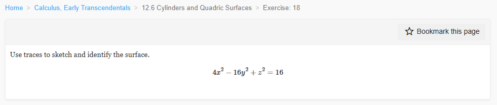
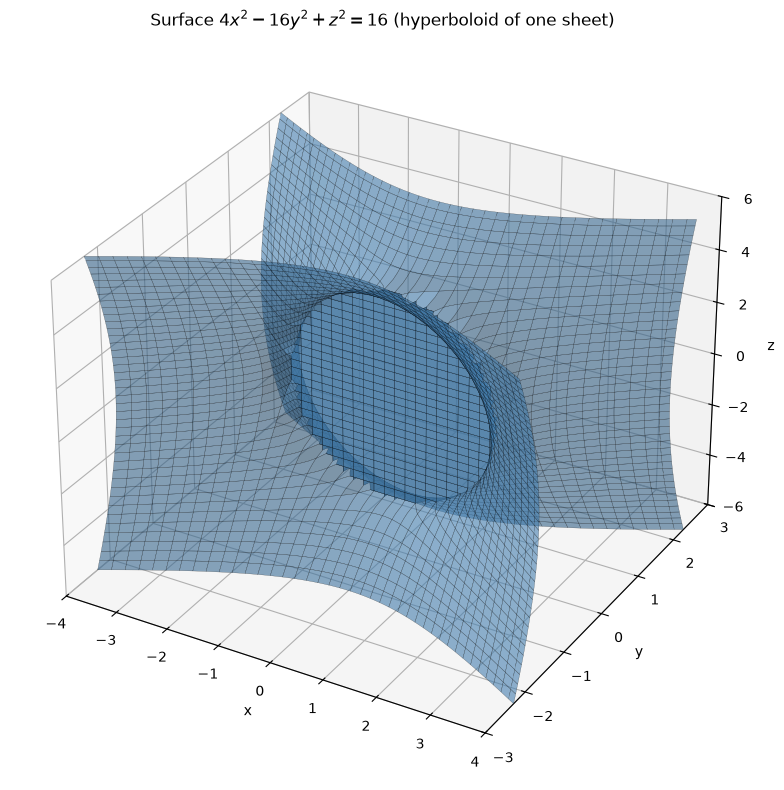
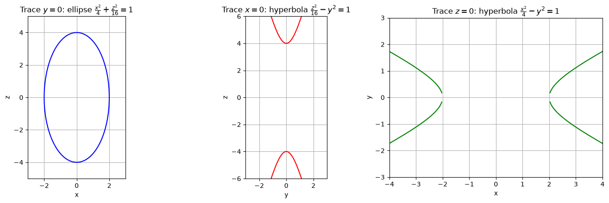
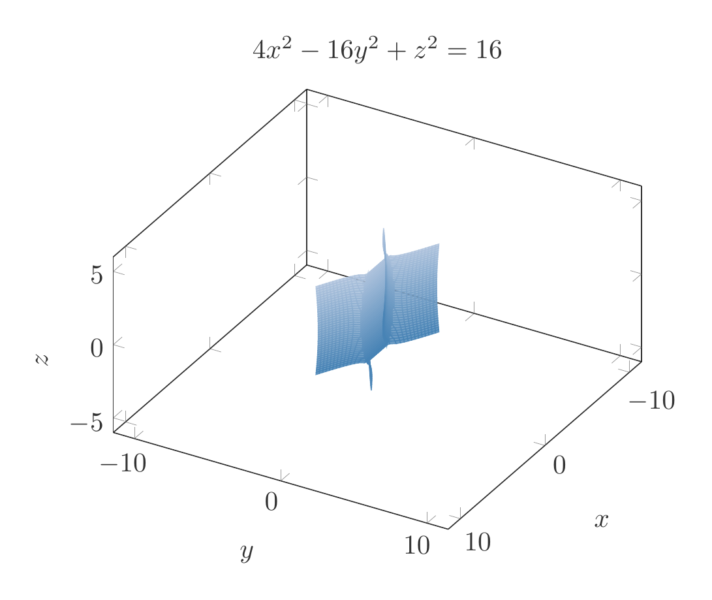
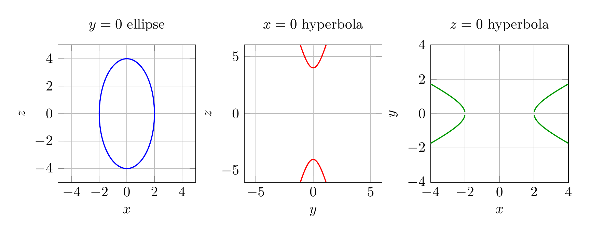

`[ Begin message. Type: HumanMessage. ]`

`[Begin Problem]`

Please solve the math problem in the image.


(Image `problem.png`. Alt text: Problem.)



`[End Problem]`

`[ End message. Type: HumanMessage. ]`

`[ Begin message. Type: AIMessage. ]`

`[Begin Answer]`

# Identifying the Surface $4x^2 - 16y^2 + z^2 = 16$ Using Traces

## 1. Write the equation in standard form
Divide both sides by $16$:

$$
\frac{x^2}{4} - y^2 + \frac{z^2}{16} = 1
$$

or

$$
\frac{x^2}{2^2} - \frac{y^2}{1^2} + \frac{z^2}{4^2} = 1.
$$

This is the standard form of a **hyperboloid of one sheet**. The negative sign is on the $y^2$-term, so the axis of the hyperboloid is the $y$-axis.

---

## 2. Find the traces

### Trace in the plane $y = k$ (horizontal cross-sections)
Set $y = k$:

$$
\frac{x^2}{4} + \frac{z^2}{16} = 1 + k^2.
$$

For every real number $k$, the right-hand side is positive, so each horizontal slice is an **ellipse**. This tells us the surface extends forever in both the positive and negative $y$-directions and is connected — a key feature of a hyperboloid of one sheet.

### Trace in the plane $x = k$
Set $x = k$:

$$
\frac{z^2}{16} - y^2 = 1 - \frac{k^2}{4}.
$$

- If $|k| < 2$, the right side is positive, so the trace is a **hyperbola** opening in the $z$-direction.
- If $|k| = 2$, the trace degenerates to two intersecting lines $z = \pm 4y$.
- If $|k| > 2$, there is no real trace.

### Trace in the plane $z = k$
Set $z = k$:

$$
\frac{x^2}{4} - y^2 = 1 - \frac{k^2}{16}.
$$

- If $|k| < 4$, the trace is a **hyperbola** opening in the $x$-direction.
- If $|k| = 4$, the trace degenerates to two intersecting lines $x = \pm 2y$.
- If $|k| > 4$, there is no real trace.

---

## 3. Identify the surface
Because the horizontal traces ($y = k$) are ellipses and the vertical traces ($x = k$ or $z = k$) are hyperbolas, the surface is a **hyperboloid of one sheet** centered at the origin with its axis along the $y$-axis.

$$
\boxed{\text{The surface } 4x^2 - 16y^2 + z^2 = 16 \text{ is a hyperboloid of one sheet.}}
$$


---


(Image `20260825_024059_980415_utc_0800_pyplot_0.png`. Alt text: pyplot-generated plot.)



(Image `20260825_024059_980415_utc_0800_pyplot_1.png`. Alt text: pyplot-generated plot.)




---

[PGFplots / tikz plot.](./20260825_024059_980415_utc_0800_pgfplots_0.tex)

```latex
\documentclass[border=10pt]{standalone}
\usepackage{pgfplots}
\pgfplotsset{compat=1.18}
\begin{document}
\begin{tikzpicture}
\begin{axis}[
    view={120}{30},
    xlabel=$x$,
    ylabel=$y$,
    zlabel=$z$,
    title={$4x^2-16y^2+z^2=16$},
    xmin=-4, xmax=4,
    ymin=-3, ymax=3,
    zmin=-6, zmax=6,
    samples=40,
    samples y=40,
    colormap={steelblue}{rgb255=(70,130,180) rgb255=(176,196,222)},
    shader=flat,
    opacity=0.8,
    axis equal
]
\addplot3[surf,domain=-4:4,y domain=-3:3,variable=\u,variable y=\v]
    ({u}, {sqrt(max((4*u^2+v^2-16)/16,0))}, {v});
\addplot3[surf,domain=-4:4,y domain=-3:3,variable=\u,variable y=\v]
    ({u}, {-sqrt(max((4*u^2+v^2-16)/16,0))}, {v});
\end{axis}
\end{tikzpicture}
\end{document}

```


(Image `20260825_024059_980415_utc_0800_pgfplots_0.png`. Alt text: PGFplots / tikz plot (converted to PNG).)




[PGFplots / tikz plot.](./20260825_024059_980415_utc_0800_pgfplots_1.tex)

```latex
\documentclass[border=10pt]{standalone}
\usepackage{pgfplots}
\usepgfplotslibrary{groupplots}
\pgfplotsset{compat=1.18}
\begin{document}
\begin{tikzpicture}
\begin{groupplot}[
    group style={group size=3 by 1, horizontal sep=1.2cm},
    axis equal,
    grid=both,
    width=5cm,
    height=5cm
]
\nextgroupplot[title={$y=0$ ellipse}, xlabel=$x$, ylabel=$z$, xmin=-3, xmax=3, ymin=-5, ymax=5]
\addplot[blue,thick,domain=0:360,samples=200] ({2*cos(x)},{4*sin(x)});

\nextgroupplot[title={$x=0$ hyperbola}, xlabel=$y$, ylabel=$z$, xmin=-3, xmax=3, ymin=-6, ymax=6]
\addplot[red,thick,domain=-3:3,samples=200] {4*sqrt(1+x^2)};
\addplot[red,thick,domain=-3:3,samples=200] {-4*sqrt(1+x^2)};

\nextgroupplot[title={$z=0$ hyperbola}, xlabel=$x$, ylabel=$y$, xmin=-4, xmax=4, ymin=-3, ymax=3]
\addplot[green!60!black,thick,domain=-4:-1,samples=200] {sqrt(x^2/4-1)};
\addplot[green!60!black,thick,domain=-4:-1,samples=200] {-sqrt(x^2/4-1)};
\addplot[green!60!black,thick,domain=1:4,samples=200] {sqrt(x^2/4-1)};
\addplot[green!60!black,thick,domain=1:4,samples=200] {-sqrt(x^2/4-1)};
\end{groupplot}
\end{tikzpicture}
\end{document}

```


(Image `20260825_024059_980415_utc_0800_pgfplots_1.png`. Alt text: PGFplots / tikz plot (converted to PNG).)



`[End Answer]`

`[ End message. Type: AIMessage. ]`