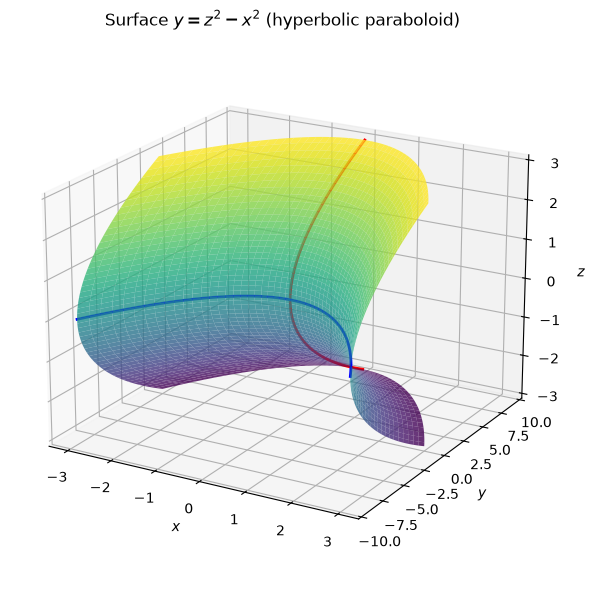
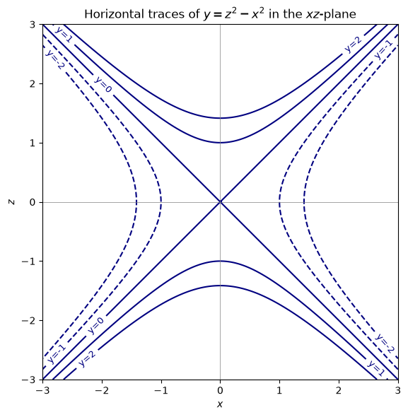
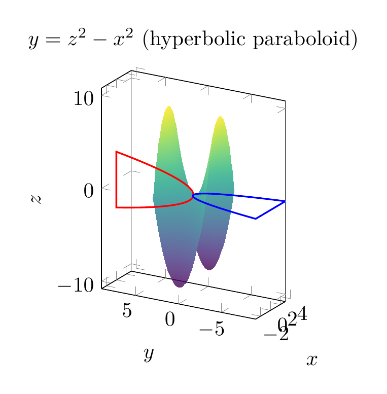
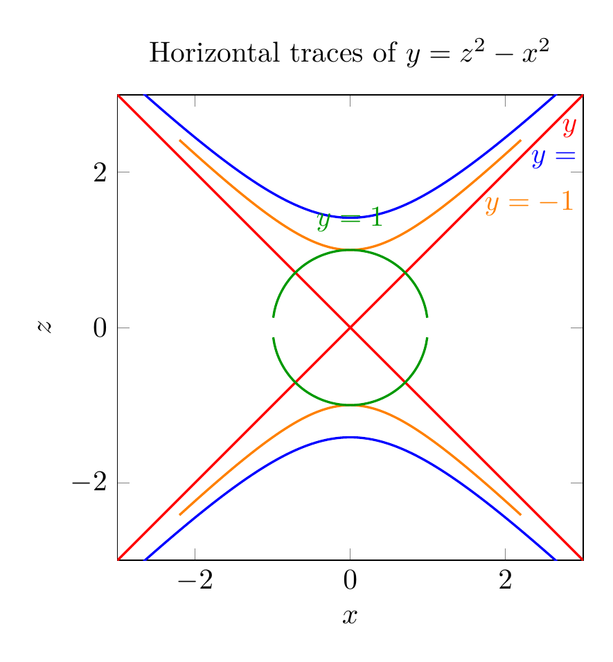

`[ Begin message. Type: HumanMessage. ]`

`[Begin Problem]`

Please solve the math problem in the image.


(Image `problem.png`. Alt text: Problem.)


`[End Problem]`

`[ End message. Type: HumanMessage. ]`

`[ Begin message. Type: AIMessage. ]`

`[Begin Answer]`

We are asked to use traces to sketch and identify the surface

$$y = z^2 - x^2.$$

## Finding the traces

A **trace** is the intersection of the surface with a plane parallel to one of the coordinate planes.

### 1. Horizontal traces: $y = k$

Set $y=k$. Then

$$z^2 - x^2 = k.$$

This is the equation of a hyperbola in the $xz$-plane (except when $k=0$).

- If $k>0$: hyperbola opening along the $z$-axis.
- If $k<0$: rewrite as $x^2 - z^2 = -k$, a hyperbola opening along the $x$-axis.
- If $k=0$: $z^2 - x^2 = 0$, so $z = \pm x$, two intersecting straight lines.

Thus every horizontal trace is a hyperbola (or a degenerate pair of lines).

### 2. Traces parallel to the $yz$-plane: $x = k$

Set $x=k$. Then

$$y = z^2 - k^2.$$

This is a parabola opening in the positive $y$-direction, with vertex at $(k, -k^2, 0)$.

### 3. Traces parallel to the $xy$-plane: $z = k$

Set $z=k$. Then

$$y = k^2 - x^2.$$

This is a parabola opening in the negative $y$-direction, with vertex at $(0, k^2, k)$.

## Identifying the surface

Since the surface has parabolic traces in two perpendicular directions and hyperbolic traces in the third direction, the surface is a **hyperbolic paraboloid**. It is often called a "saddle surface." Its saddle point is at the origin $(0,0,0)$.

The key signature is:

$$y = \frac{z^2}{b^2} - \frac{x^2}{a^2},$$

which is the standard form of a hyperbolic paraboloid opening along the $y$-axis. Here $a=b=1$.

$$\boxed{\text{The surface } y = z^2 - x^2 \text{ is a hyperbolic paraboloid (saddle surface).}}$$

---


(Image `20260825_024132_363601_utc_0800_pyplot_0.png`. Alt text: pyplot-generated plot.)



(Image `20260825_024132_363601_utc_0800_pyplot_1.png`. Alt text: pyplot-generated plot.)




---

[PGFplots / tikz plot.](./20260825_024132_363601_utc_0800_pgfplots_0.tex)

```latex
\documentclass[border=10pt]{standalone}
\usepackage{pgfplots}
\pgfplotsset{compat=1.17}
\begin{document}
\begin{tikzpicture}
\begin{axis}[
    view={-60}{20},
    xlabel=$x$,
    ylabel=$y$,
    zlabel=$z$,
    title={$y=z^2-x^2$ (hyperbolic paraboloid)},
    colormap/viridis,
    samples=50,
    domain=-3:3,
    y domain=-3:3,
    axis equal image,
]
\addplot3[surf, opacity=0.8, shader=interp] {y^2-x^2};
\addplot3[red, thick, samples=100, domain=-3:3] (0,{x^2},x);
\addplot3[blue, thick, samples=100, domain=-3:3] (x,{-x^2},0);
\end{axis}
\end{tikzpicture}
\end{document}

```


(Image `20260825_024132_363601_utc_0800_pgfplots_0.png`. Alt text: PGFplots / tikz plot (converted to PNG).)




[PGFplots / tikz plot.](./20260825_024132_363601_utc_0800_pgfplots_1.tex)

```latex
\documentclass[border=10pt]{standalone}
\usepackage{pgfplots}
\pgfplotsset{compat=1.17}
\begin{document}
\begin{tikzpicture}
\begin{axis}[
    xlabel=$x$,
    ylabel=$z$,
    title={Horizontal traces of $y=z^2-x^2$},
    axis equal image,
    xmin=-3, xmax=3,
    ymin=-3, ymax=3,
]
\addplot[blue, thick, domain=-2.8:2.8, samples=200] {sqrt(x^2+2)};
\addplot[blue, thick, domain=-2.8:2.8, samples=200] {-sqrt(x^2+2)};
\addplot[orange, thick, domain=-2.2:2.2, samples=200] {sqrt(x^2+1)};
\addplot[orange, thick, domain=-2.2:2.2, samples=200] {-sqrt(x^2+1)};
\addplot[red, thick, domain=-3:3, samples=200] {x};
\addplot[red, thick, domain=-3:3, samples=200] {-x};
\addplot[green!60!black, thick, domain=-1.4:1.4, samples=200] {sqrt(1-x^2)};
\addplot[green!60!black, thick, domain=-1.4:1.4, samples=200] {-sqrt(1-x^2)};
\node[blue, anchor=west] at (axis cs:2.2,2.2) {$y=-2$};
\node[orange, anchor=west] at (axis cs:1.6,1.6) {$y=-1$};
\node[red, anchor=west] at (axis cs:2.6,2.6) {$y=0$};
\node[green!60!black, anchor=south] at (axis cs:0,1.1) {$y=1$};
\end{axis}
\end{tikzpicture}
\end{document}

```


(Image `20260825_024132_363601_utc_0800_pgfplots_1.png`. Alt text: PGFplots / tikz plot (converted to PNG).)



`[End Answer]`

`[ End message. Type: AIMessage. ]`