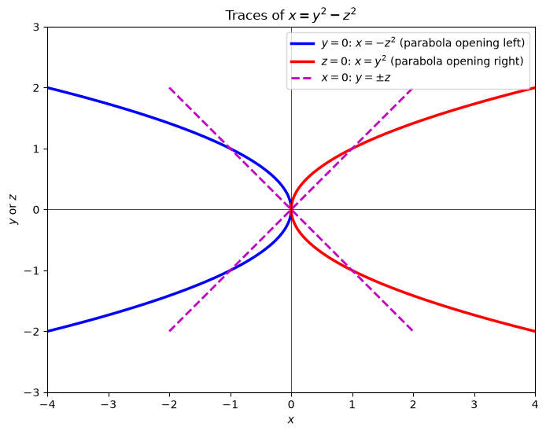
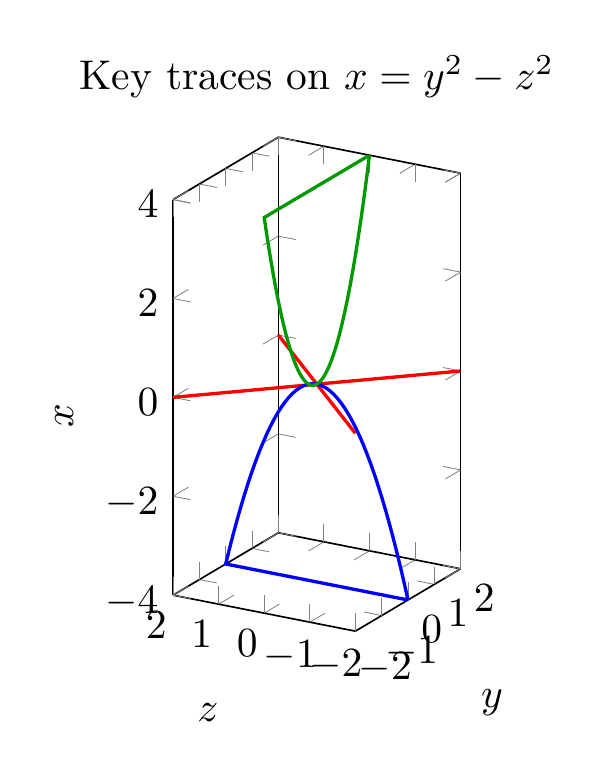
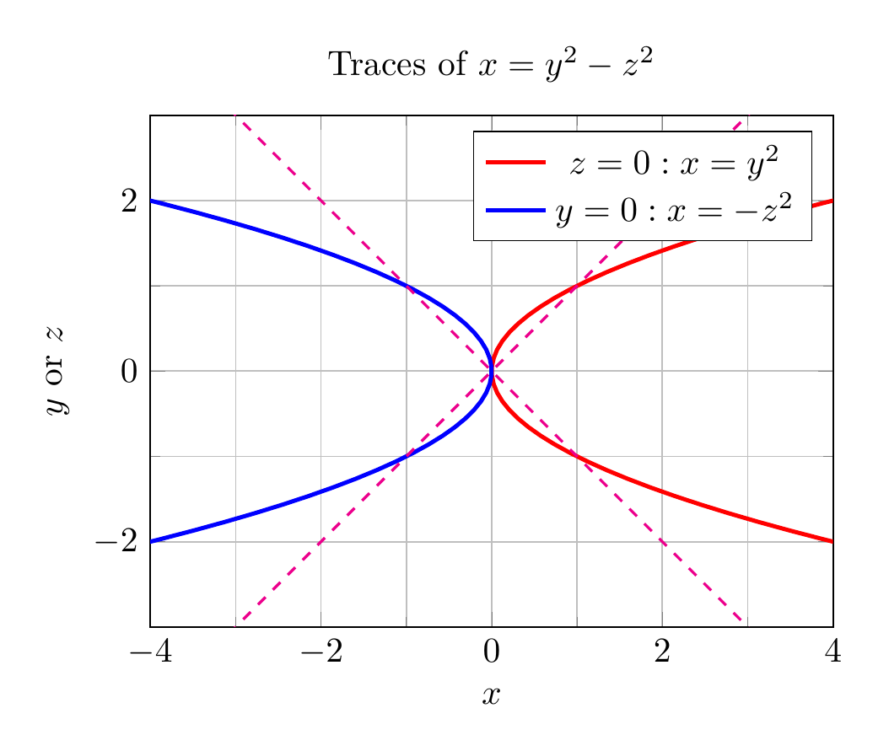

# Traces and Sketch of the Surface $x = y^2 - z^2$

## 1. Identify the surface
The equation
$$x = y^2 - z^2$$
is the standard form of a **hyperbolic paraboloid**, often called a **saddle surface**. The axis of symmetry is the $x$-axis.

## 2. Compute the traces
Traces are the curves obtained by intersecting the surface with planes parallel to the coordinate planes.

### (a) Traces parallel to the $yz$-plane: $x = k$
Substitute $x = k$:
$$y^2 - z^2 = k$$
- If $k > 0$: a hyperbola opening along the $y$-axis.
- If $k < 0$: a hyperbola opening along the $z$-axis.
- If $k = 0$: the pair of lines $y = \pm z$.

### (b) Traces parallel to the $xz$-plane: $y = k$
Substitute $y = k$:
$$x = k^2 - z^2$$
These are **parabolas** opening in the negative $x$-direction.

### (c) Traces parallel to the $xy$-plane: $z = k$
Substitute $z = k$:
$$x = y^2 - k^2$$
These are **parabolas** opening in the positive $x$-direction.

## 3. Key coordinate-plane traces
- $z = 0$: $x = y^2$ — parabola opening right in the $xy$-plane.
- $y = 0$: $x = -z^2$ — parabola opening left in the $xz$-plane.
- $x = 0$: $y = \pm z$ — two intersecting lines in the $yz$-plane.

These three curves are the most useful for sketching the surface by hand.

## 4. Conclusion
Putting the traces together, the surface rises along the positive $x$-axis in the $y$-direction and falls along the negative $x$-axis in the $z$-direction, forming a saddle shape centered at the origin.

$\boxed{\text{The surface } x = y^2 - z^2 \text{ is a hyperbolic paraboloid (saddle). Traces: } x=k \Rightarrow y^2-z^2=k \text{ (hyperbolas)},\; y=k \Rightarrow x=k^2-z^2 \text{ (left-opening parabolas)},\; z=k \Rightarrow x=y^2-k^2 \text{ (right-opening parabolas).}}$


---




---

[PGFplots / tikz plot.](./20260825_025441_394654_utc_0800_pgfplots_0.tex)

```latex
\documentclass[border=10pt]{standalone}
\usepackage{pgfplots}
\pgfplotsset{compat=1.18}
\begin{document}
\begin{tikzpicture}
\begin{axis}[
    xlabel={$y$}, ylabel={$z$}, zlabel={$x$},
    title={Key traces on $x=y^2-z^2$},
    view={-60}{20},
    xmin=-2, xmax=2, ymin=-2, ymax=2, zmin=-4, zmax=4,
    xtick={-2,-1,0,1,2},
    ytick={-2,-1,0,1,2},
    ztick={-4,-2,0,2,4},
    unit vector ratio=1 1 1,
    legend pos=outer north east
]
% x=0 trace: y = ±z
\addplot3[red, thick, samples=20, domain=-2:2] (x,x,0);
\addplot3[red, thick, samples=20, domain=-2:2] (x,-x,0);
% y=0 trace: x = -z^2
\addplot3[blue, thick, samples=50, variable=\t, domain=-2:2] (0,\t,{-\t*\t});
% z=0 trace: x = y^2
\addplot3[green!60!black, thick, samples=50, variable=\t, domain=-2:2] (\t,0,{\t*\t});
\end{axis}
\end{tikzpicture}
\end{document}

```



[PGFplots / tikz plot.](./20260825_025441_394654_utc_0800_pgfplots_1.tex)

```latex
\documentclass[border=10pt]{standalone}
\usepackage{pgfplots}
\pgfplotsset{compat=1.18}
\begin{document}
\begin{tikzpicture}
\begin{axis}[
    axis equal image,
    xlabel={$x$}, ylabel={$y$ or $z$},
    title={Traces of $x=y^2-z^2$},
    xmin=-4, xmax=4, ymin=-3, ymax=3,
    samples=100,
    legend pos=north east,
    grid=both,
    minor tick num=1
]
\addplot[red, very thick] ({x^2},{x});
\addlegendentry{$z=0: x=y^2$}
\addplot[blue, very thick] ({-x^2},{x});
\addlegendentry{$y=0: x=-z^2$}
\addplot[magenta, thick, dashed] ({x},{x});
\addplot[magenta, thick, dashed] ({x},{-x});
\end{axis}
\end{tikzpicture}
\end{document}

```

