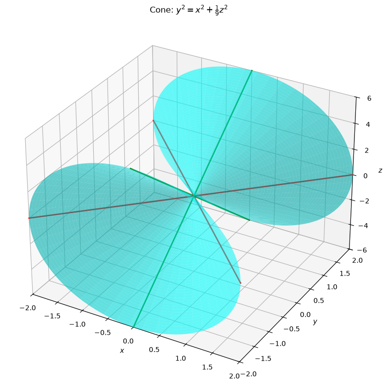
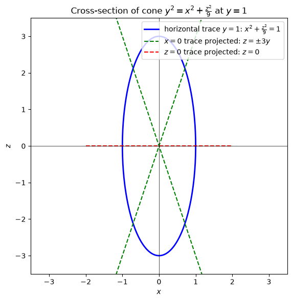
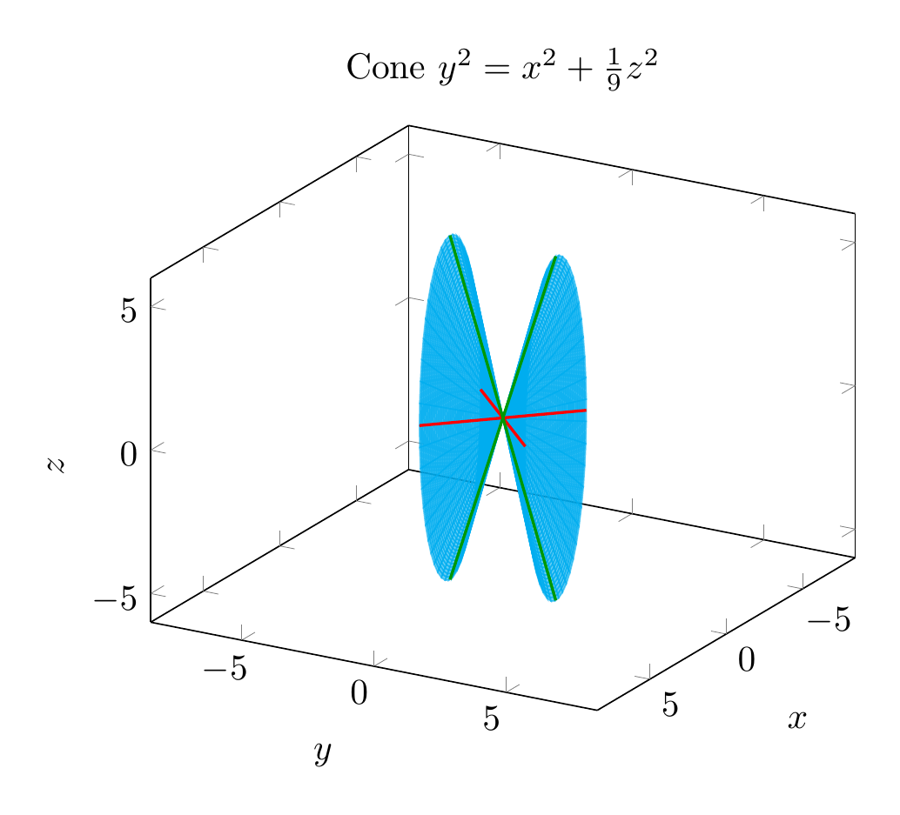
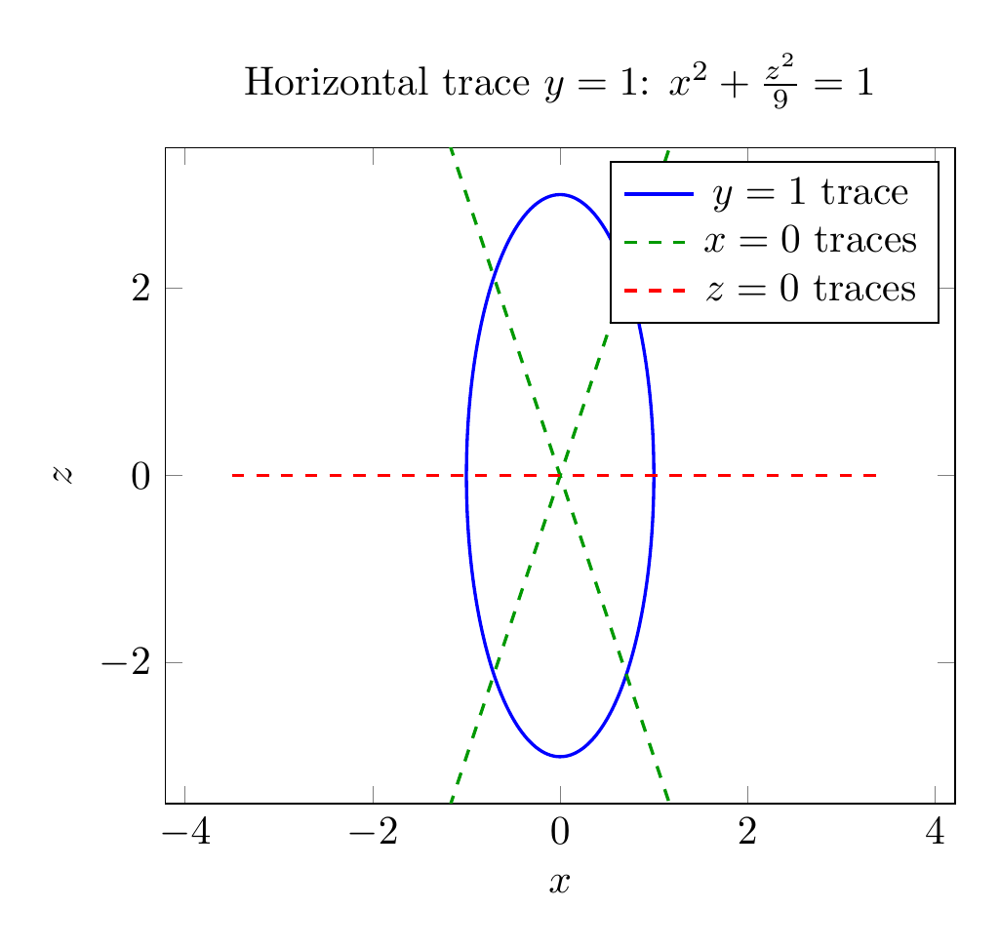

`[ Begin message. Type: AIMessage. ]`

**Solution**

We are asked to reduce the equation to a standard form, classify the surface, and sketch it.

Given equation:

$$y^2 = x^2 + \frac{1}{9}z^2$$

Move all terms to one side:

$$x^2 - y^2 + \frac{z^2}{9} = 0$$

Equivalently,

$$x^2 + \frac{z^2}{9} = y^2$$

or in standard form

$$\frac{x^2}{1} + \frac{z^2}{9} = \frac{y^2}{1}.$$

This matches the standard form of an **elliptic cone** whose axis is the $y$-axis:

$$\frac{x^2}{a^2} + \frac{z^2}{c^2} = \frac{y^2}{b^2}.$$

Here $a=1$, $b=1$, $c=3$.

**Classification:** The surface is an **elliptic cone** (a circular cone would require equal coefficients on $x^2$ and $z^2$; here they differ, so it is elliptical).

**Key traces:**
- Horizontal traces $y=k$ are ellipses:
  $$\frac{x^2}{k^2} + \frac{z^2}{9k^2} = 1.$$
- The trace in the $xz$-plane ($y=0$) is just the origin.
- The trace in the $xy$-plane ($z=0$) is the pair of lines $y=\pm x$.
- The trace in the $yz$-plane ($x=0$) is the pair of lines $y=\pm \frac{z}{3}$.

These straight-line traces confirm the surface is a cone with vertex at the origin opening in the positive and negative $y$-directions.

$$\boxed{\frac{x^2}{1} + \frac{z^2}{9} = \frac{y^2}{1},\;\text{elliptic cone}}$$


---


(Image `20260825_024132_067421_utc_0800_pyplot_0.png`. Alt text: pyplot-generated plot.)



(Image `20260825_024132_067421_utc_0800_pyplot_1.png`. Alt text: pyplot-generated plot.)




---

[PGFplots / tikz plot.](./20260825_024132_067421_utc_0800_pgfplots_0.tex)

```latex
\documentclass[border=10pt]{standalone}
\usepackage{pgfplots}
\pgfplotsset{compat=1.17}
\begin{document}
\begin{tikzpicture}
\begin{axis}[
    view={120}{20},
    xlabel=$x$,
    ylabel=$y$,
    zlabel=$z$,
    title={Cone $y^2=x^2+\frac{1}{9}z^2$},
    xmin=-2, xmax=2,
    ymin=-2, ymax=2,
    zmin=-6, zmax=6,
    axis equal,
    colormap={mycm}{color=(cyan) color=(cyan)},
    samples=50,
    samples y=50,
    domain=0:2,
    y domain=0:360,
]
\addplot3[surf,opacity=0.6,shader=flat] ({x*cos(y)},{x},{3*x*sin(y)});
\addplot3[surf,opacity=0.6,shader=flat] ({x*cos(y)},{-x},{3*x*sin(y)});
\addplot3[red,thick,domain=-2:2,samples=100] (x,x,0);
\addplot3[red,thick,domain=-2:2,samples=100] (x,-x,0);
\addplot3[green!60!black,thick,domain=-6:6,samples=100] (0,x/3,x);
\addplot3[green!60!black,thick,domain=-6:6,samples=100] (0,-x/3,x);
\end{axis}
\end{tikzpicture}
\end{document}

```


(Image `20260825_024132_067421_utc_0800_pgfplots_0.png`. Alt text: PGFplots / tikz plot (converted to PNG).)




[PGFplots / tikz plot.](./20260825_024132_067421_utc_0800_pgfplots_1.tex)

```latex
\documentclass[border=10pt]{standalone}
\usepackage{pgfplots}
\pgfplotsset{compat=1.17}
\begin{document}
\begin{tikzpicture}
\begin{axis}[
    xlabel=$x$,
    ylabel=$z$,
    title={Horizontal trace $y=1$: $x^2+\frac{z^2}{9}=1$},
    xmin=-3.5, xmax=3.5,
    ymin=-3.5, ymax=3.5,
    axis equal,
    samples=200,
]
\addplot[blue,thick,domain=0:360] ({cos(x)},{3*sin(x)});
\addplot[green!60!black,dashed,thick,domain=-2:2] {3*x};
\addplot[green!60!black,dashed,thick,domain=-2:2] {-3*x};
\addplot[red,dashed,thick,domain=-3.5:3.5] {0};
\legend{$y=1$ trace, $x=0$ traces, , $z=0$ traces}
\end{axis}
\end{tikzpicture}
\end{document}

```


(Image `20260825_024132_067421_utc_0800_pgfplots_1.png`. Alt text: PGFplots / tikz plot (converted to PNG).)



`[ End message. Type: AIMessage. ]`