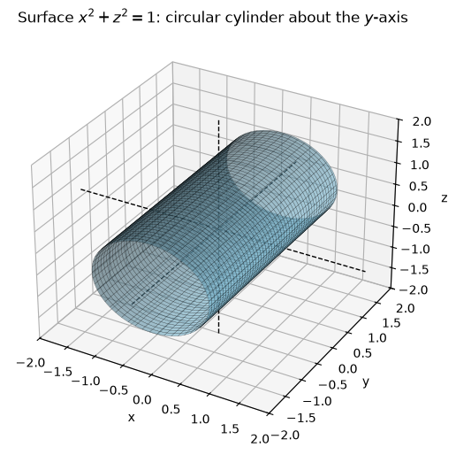
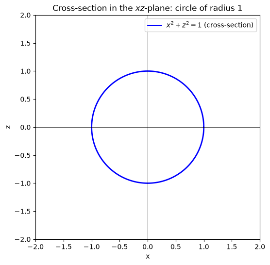
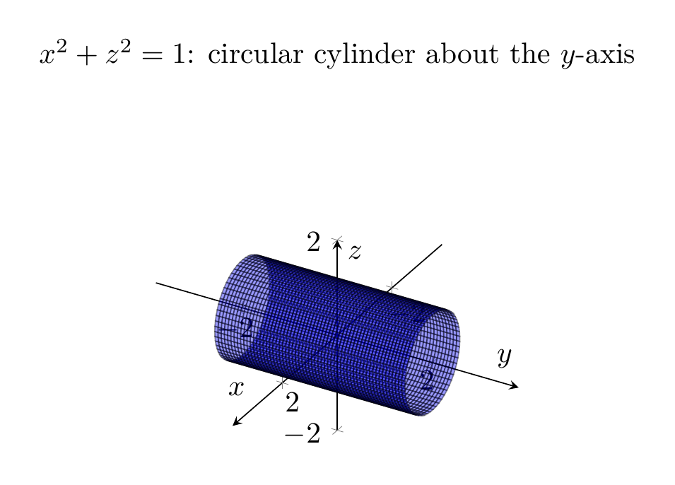
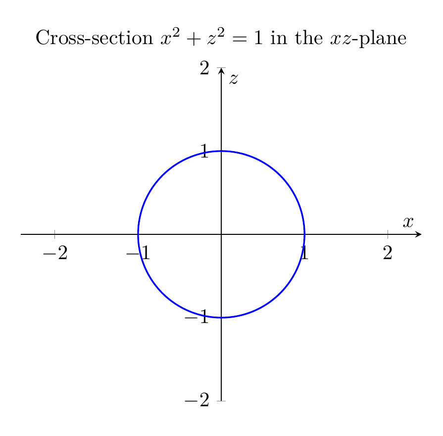

# Describing and Sketching the Surface \(x^2+z^2=1\)

## Step 1: Identify the variables present
The equation
\[
x^2+z^2=1
\]
contains only the variables \(x\) and \(z\). The variable \(y\) is **missing**.

In three dimensions, when one variable is missing from an equation, the graph is a **cylinder** whose rulings (straight-line generators) are parallel to the axis of the missing variable. Here \(y\) is missing, so the rulings are parallel to the \(y\)-axis.

## Step 2: Identify the cross-section in the \(xz\)-plane
Setting \(y=0\) gives
\[
x^2+z^2=1,
\]
which is a **circle of radius 1 centered at the origin** in the \(xz\)-plane.

## Step 3: Describe the full surface
Because the equation does not restrict \(y\), every point on that circle can be moved freely in the \(y\)-direction. Therefore the surface is the set
\[
\{(x,y,z)\in\mathbb{R}^3 : x^2+z^2=1,\; y\in\mathbb{R}\}.
\]
This is a **right circular cylinder of radius 1** whose axis is the \(y\)-axis.

A convenient parametrization is
\[
x=\cos t,\qquad y=s,\qquad z=\sin t,\qquad 0\le t<2\pi,\; s\in\mathbb{R}.
\]
Indeed,
\[
x^2+z^2=\cos^2 t+\sin^2 t=1.
\]

## Step 4: Summary of traces
| Plane | Trace |
|---|---|
| \(xz\)-plane, \(y=0\) | Circle \(x^2+z^2=1\) |
| \(xy\)-plane, \(z=0\) | Pair of lines \(x=\pm 1\) parallel to the \(y\)-axis |
| \(yz\)-plane, \(x=0\) | Pair of lines \(z=\pm 1\) parallel to the \(y\)-axis |

## Final Answer
\[
\boxed{\text{The surface }x^2+z^2=1\text{ is a right circular cylinder of radius }1\text{ centered on the }y\text{-axis.}}
\]

The accompanying 3D plots show the cylinder extending in the \(y\)-direction, and the 2D plots show its circular cross-section in the \(xz\)-plane.

---





---

[PGFplots / tikz plot.](./20260825_024020_161903_utc_0800_pgfplots_0.tex)

```latex
\documentclass[border=10pt]{standalone}
\usepackage{pgfplots}
\pgfplotsset{compat=1.18}
\begin{document}
\begin{tikzpicture}
\begin{axis}[
    view={120}{30},
    xlabel={$x$}, ylabel={$y$}, zlabel={$z$},
    xmin=-2, xmax=2, ymin=-2, ymax=2, zmin=-2, zmax=2,
    axis equal,
    axis lines=center,
    samples=60, samples y=60,
    title={$x^2+z^2=1$: circular cylinder about the $y$-axis}
]
\addplot3[surf, domain=0:360, y domain=-2:2, z buffer=sort,
    variable=\u, variable y=\v,
    color=blue, opacity=0.4, faceted color=black]
({cos(u)}, {v}, {sin(u)});
\end{axis}
\end{tikzpicture}
\end{document}

```



[PGFplots / tikz plot.](./20260825_024020_161903_utc_0800_pgfplots_1.tex)

```latex
\documentclass[border=10pt]{standalone}
\usepackage{pgfplots}
\pgfplotsset{compat=1.18}
\begin{document}
\begin{tikzpicture}
\begin{axis}[
    axis equal,
    axis lines=center,
    xlabel={$x$}, ylabel={$z$},
    xmin=-2, xmax=2, ymin=-2, ymax=2,
    title={Cross-section $x^2+z^2=1$ in the $xz$-plane}
]
\addplot[blue, thick, domain=0:360, samples=200, variable=\t]
({cos(t)}, {sin(t)});
\end{axis}
\end{tikzpicture}
\end{document}

```

