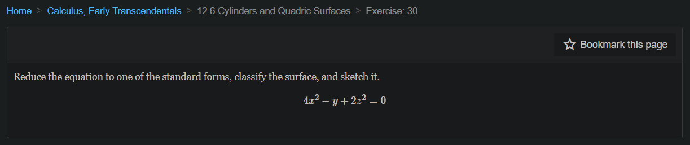
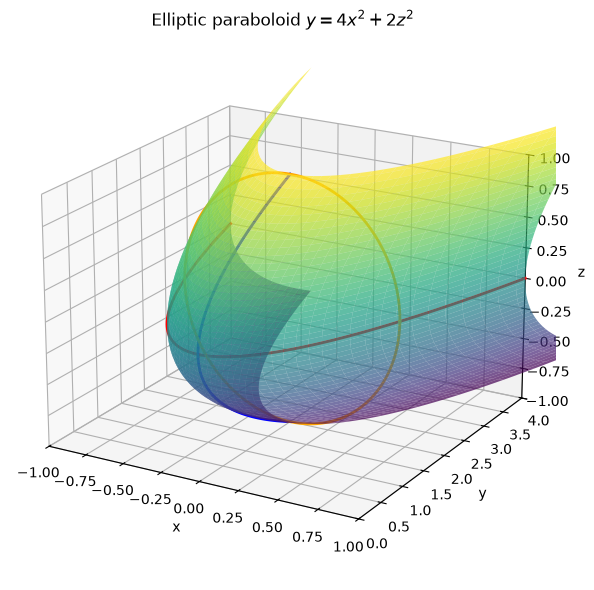
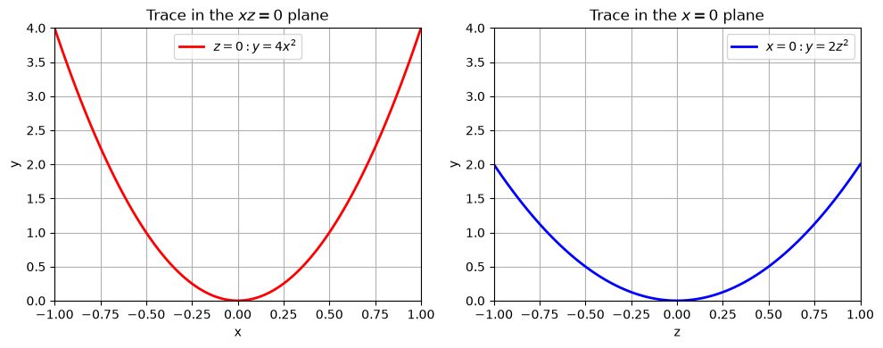
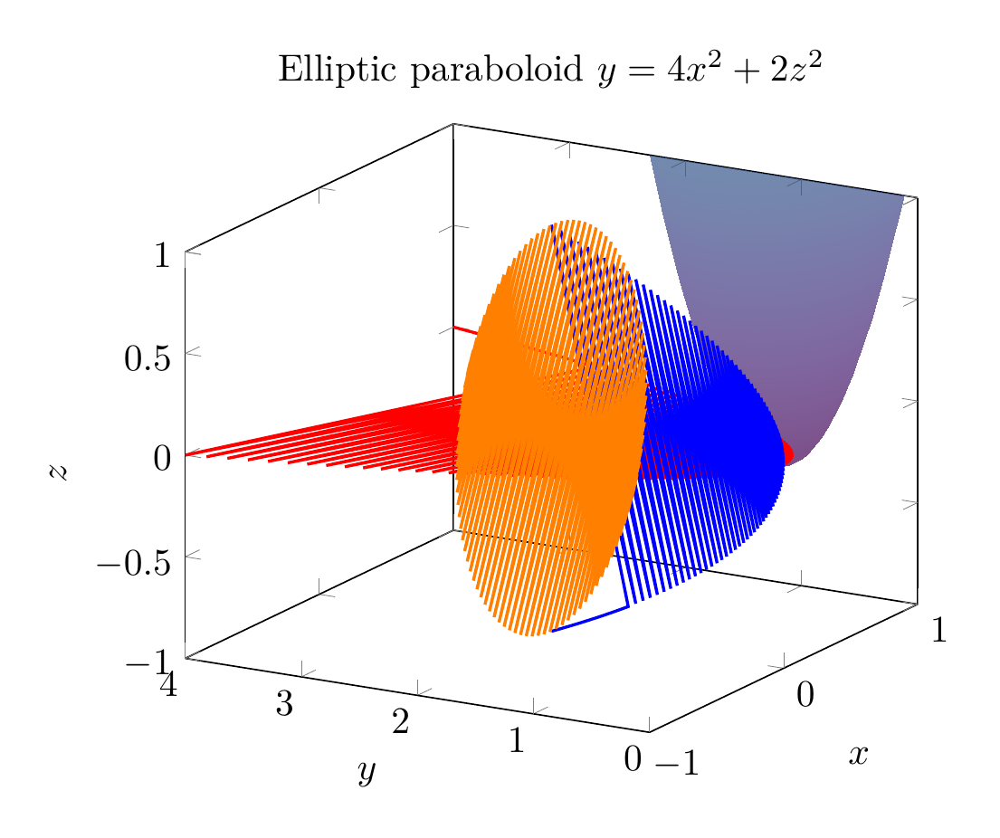
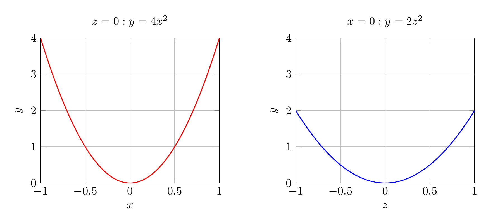

`[ Begin message. Type: HumanMessage. ]`

`[Begin Problem]`

Please solve the math problem in the image.


(Image `problem.png`. Alt text: Problem.)



`[End Problem]`

`[ End message. Type: HumanMessage. ]`

`[ Begin message. Type: AIMessage. ]`

`[Begin Answer]`

# Reducing and Classifying the Surface

We are asked to reduce the equation

$$4x^2 - y + 2z^2 = 0$$

to a standard form, classify the surface, and sketch it.

## Step 1: Solve for the linear variable

The only variable that appears to the first power is $y$. Solve for $y$:

$$y = 4x^2 + 2z^2.$$

## Step 2: Write in standard form

Divide both sides so the right-hand side is a sum of squares equal to $1$:

$$y = \frac{x^2}{\frac14} + \frac{z^2}{\frac12}.$$

This matches the standard form of an **elliptic paraboloid** that opens in the positive $y$-direction:

$$y = \frac{x^2}{a^2} + \frac{z^2}{c^2}, \qquad a^2 = \frac14,\; c^2 = \frac12.$$

Thus $a = \frac12$ and $c = \frac{1}{\sqrt2}$.

## Step 3: Classify the surface

The surface is an **elliptic paraboloid**.

- Its vertex is at the origin $(0,0,0)$.
- It opens in the direction of increasing $y$.
- Cross-sections with planes $y = k$ ($k>0$) are ellipses:
  $$\frac{x^2}{k/4} + \frac{z^2}{k/2} = 1.$$
- Cross-sections with planes $z = 0$ and $x = 0$ are parabolas:
  $$z=0:\; y = 4x^2, \qquad x=0:\; y = 2z^2.$$

## Final Answer

$$\boxed{y = \frac{x^2}{1/4} + \frac{z^2}{1/2},\quad \text{an elliptic paraboloid opening in the positive } y\text{-direction}}$$


---


(Image `20260825_024137_209154_utc_0800_pyplot_0.png`. Alt text: pyplot-generated plot.)



(Image `20260825_024137_209154_utc_0800_pyplot_1.png`. Alt text: pyplot-generated plot.)




---

[PGFplots / tikz plot.](./20260825_024137_209154_utc_0800_pgfplots_0.tex)

```latex
\documentclass[border=10pt]{standalone}
\usepackage{pgfplots}
\pgfplotsset{compat=1.18}
\begin{document}
\begin{tikzpicture}
\begin{axis}[
    xlabel=$x$, ylabel=$y$, zlabel=$z$,
    domain=-1:1, y domain=-1:1,
    samples=40,
    colormap/viridis,
    view={-60}{20},
    z buffer=sort,
    xmin=-1, xmax=1,
    ymin=0, ymax=4,
    zmin=-1, zmax=1,
    title={Elliptic paraboloid $y=4x^2+2z^2$}
]
\addplot3[surf, opacity=0.7, shader=interp] {4*x^2+2*y^2};
\addplot3[red, thick, samples=100, domain=-1:1] ({x},{4*x^2},{0});
\addplot3[blue, thick, samples=100, domain=-1:1] ({0},{2*x^2},{x});
\addplot3[orange, thick, samples=100, domain=0:360] ({sqrt(0.5)*cos(x)},{2},{sin(x)});
\end{axis}
\end{tikzpicture}
\end{document}

```


(Image `20260825_024137_209154_utc_0800_pgfplots_0.png`. Alt text: PGFplots / tikz plot (converted to PNG).)




[PGFplots / tikz plot.](./20260825_024137_209154_utc_0800_pgfplots_1.tex)

```latex
\documentclass[border=10pt]{standalone}
\usepackage{pgfplots}
\pgfplotsset{compat=1.18}
\begin{document}
\begin{tikzpicture}
\begin{axis}[
    width=7cm, height=6cm,
    xlabel=$x$, ylabel=$y$,
    xmin=-1, xmax=1,
    ymin=0, ymax=4,
    grid=major,
    title={$z=0: y=4x^2$}
]
\addplot[red, thick, domain=-1:1, samples=100] {4*x^2};
\end{axis}
\end{tikzpicture}
\hspace{1cm}
\begin{tikzpicture}
\begin{axis}[
    width=7cm, height=6cm,
    xlabel=$z$, ylabel=$y$,
    xmin=-1, xmax=1,
    ymin=0, ymax=4,
    grid=major,
    title={$x=0: y=2z^2$}
]
\addplot[blue, thick, domain=-1:1, samples=100] {2*x^2};
\end{axis}
\end{tikzpicture}
\end{document}

```


(Image `20260825_024137_209154_utc_0800_pgfplots_1.png`. Alt text: PGFplots / tikz plot (converted to PNG).)



`[End Answer]`

`[ End message. Type: AIMessage. ]`