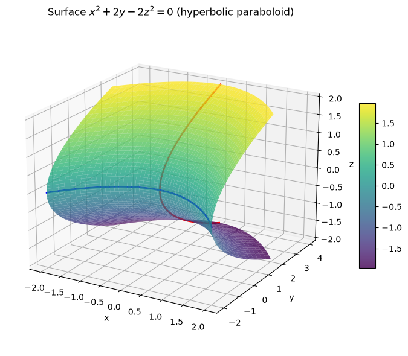
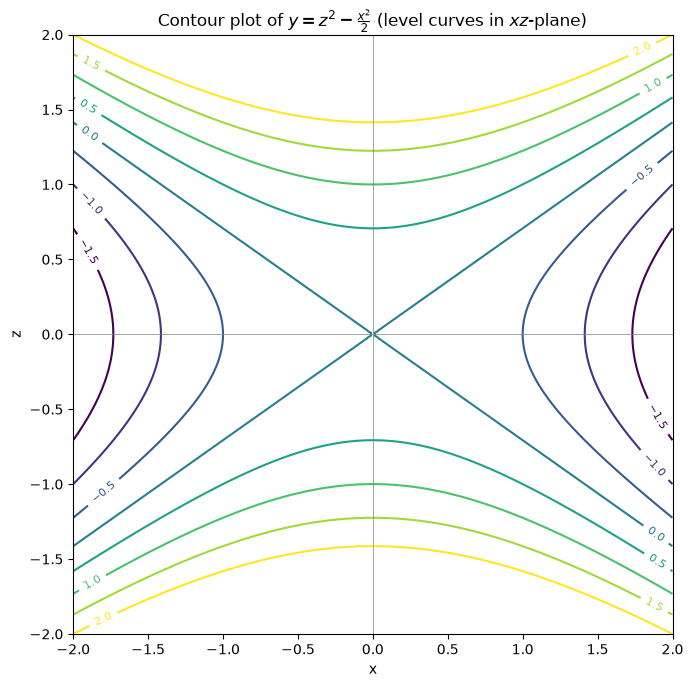
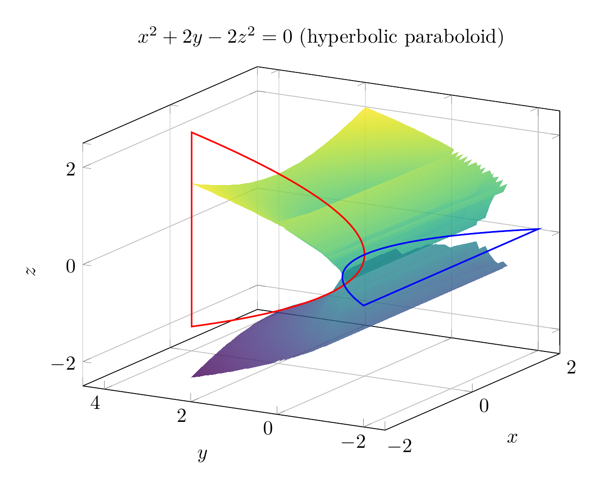
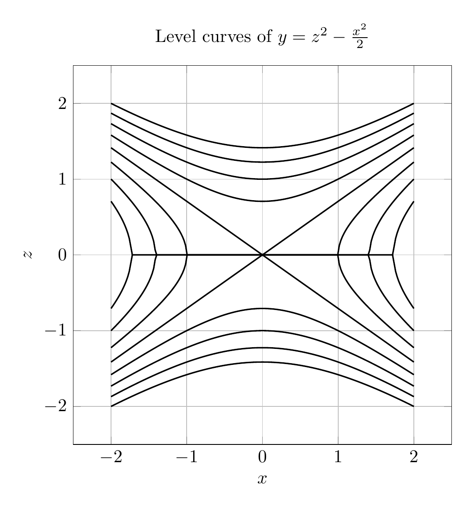

We are asked to reduce the equation

\[
x^2+2y-2z^2=0
\]

to a standard form, classify the surface, and sketch it.

### Step 1: Solve for \(y\)

Since \(y\) appears only linearly, isolate it:

\[
2y = 2z^2 - x^2
\]

\[
y = z^2 - \frac{x^2}{2}
\]

This is the standard form of a **hyperbolic paraboloid** opening in the positive \(y\)-direction.

### Step 2: Classify the surface

A hyperbolic paraboloid has the general standard form

\[
y = \frac{z^2}{b^2} - \frac{x^2}{a^2}
\]

Comparing with

\[
y = z^2 - \frac{x^2}{2}
\]

we see \(b=1\) and \(a=\sqrt{2}\). Thus the surface is a **hyperbolic paraboloid** (a "saddle" surface).

### Step 3: Cross-sections

- **Plane \(y=k\) (horizontal):**

  \[
  z^2 - \frac{x^2}{2} = k
  \]

  These are hyperbolas. For \(k>0\), the hyperbolas open along the \(z\)-axis; for \(k<0\), they open along the \(x\)-axis; for \(k=0\), we get the degenerate pair of lines

  \[
  z = \pm \frac{x}{\sqrt{2}}
  \]

- **Plane \(x=0\):**

  \[
  y = z^2
  \]

  This is a parabola opening in the positive \(y\)-direction.

- **Plane \(z=0\):**

  \[
  y = -\frac{x^2}{2}
  \]

  This is a parabola opening in the negative \(y\)-direction.

Because the cross-sections are parabolas in two perpendicular directions and hyperbolas in horizontal planes, the surface is a saddle-shaped hyperbolic paraboloid.

### Final Answer

\[
\boxed{y = z^2 - \frac{x^2}{2}, \quad \text{hyperbolic paraboloid}}
\]


---





---

[PGFplots / tikz plot.](./20260825_024204_101642_utc_0800_pgfplots_0.tex)

```latex
\documentclass[border=10pt]{standalone}
\usepackage{pgfplots}
\pgfplotsset{compat=1.17}
\begin{document}
\begin{tikzpicture}
\begin{axis}[
    xlabel={$x$}, ylabel={$y$}, zlabel={$z$},
    title={$x^2+2y-2z^2=0$ (hyperbolic paraboloid)},
    view={-60}{20},
    colormap/viridis,
    samples=40,
    domain=-2:2,
    y domain=-2:2,
    zmin=-2.5, zmax=2.5,
    ymin=-2.5, ymax=4.5,
    grid=major,
    width=10cm,
    height=8cm
]
\addplot3[surf, shader=interp, opacity=0.8] {sqrt((x^2+2*y)/2)};
\addplot3[surf, shader=interp, opacity=0.8] {-sqrt((x^2+2*y)/2)};
\addplot3[red, thick, samples=100, variable=\t, domain=-2:2] (0, \t^2, \t);
\addplot3[blue, thick, samples=100, variable=\t, domain=-2:2] (\t, -\t^2/2, 0);
\end{axis}
\end{tikzpicture}
\end{document}

```



[PGFplots / tikz plot.](./20260825_024204_101642_utc_0800_pgfplots_1.tex)

```latex
\documentclass[border=10pt]{standalone}
\usepackage{pgfplots}
\pgfplotsset{compat=1.17}
\begin{document}
\begin{tikzpicture}
\begin{axis}[
    xlabel={$x$}, ylabel={$z$},
    title={Level curves of $y=z^2-\frac{x^2}{2}$},
    width=9cm,
    height=9cm,
    axis equal,
    xmin=-2.5, xmax=2.5,
    ymin=-2.5, ymax=2.5,
    grid=major,
    colormap/viridis,
    legend pos=south east
]
\foreach \c in {-1.5,-1,-0.5,0,0.5,1,1.5,2}{
    \addplot[thick, domain=-2:2, samples=200, forget plot] ({x}, {sqrt(max(\c+x^2/2,0))});
    \addplot[thick, domain=-2:2, samples=200, forget plot] ({x}, {-sqrt(max(\c+x^2/2,0))});
}
\end{axis}
\end{tikzpicture}
\end{document}

```

