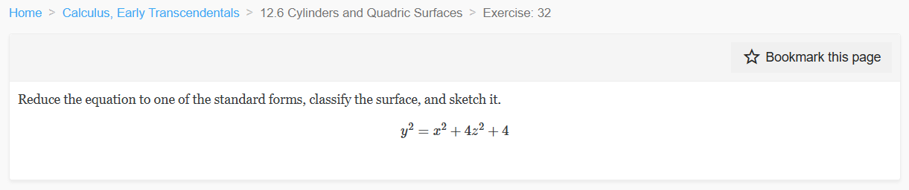
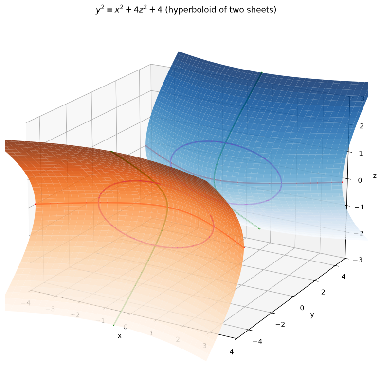
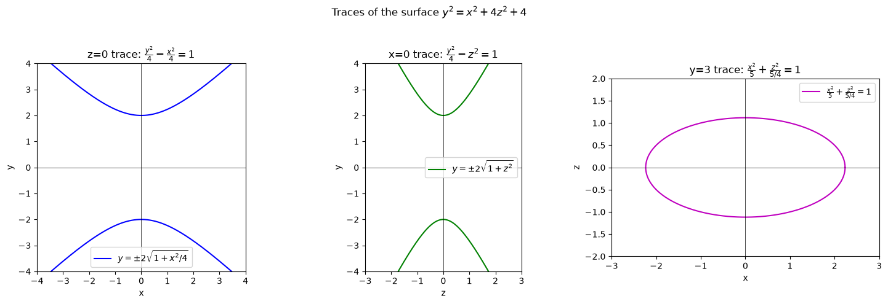
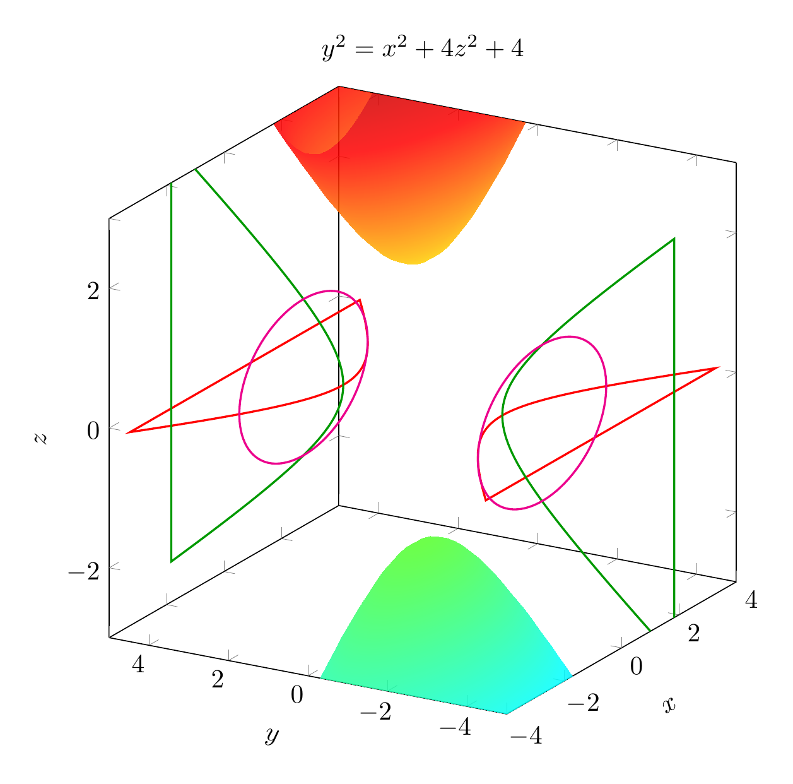
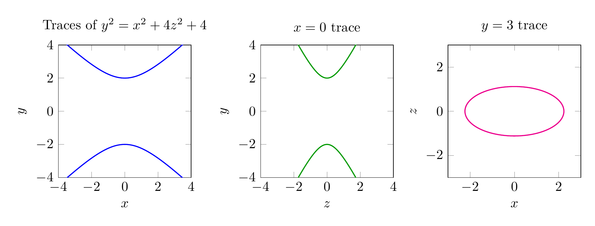

`[ Begin message. Type: HumanMessage. ]`

`[Begin Problem]`

Please solve the math problem in the image.


(Image `problem.png`. Alt text: Problem.)



`[End Problem]`

`[ End message. Type: HumanMessage. ]`

`[ Begin message. Type: AIMessage. ]`

`[Begin Answer]`

We are asked to reduce the equation

$$y^2=x^2+4z^2+4$$

to a standard form, classify the surface, and sketch it.

## Step 1: Move all terms to one side

Subtract $x^2$, $4z^2$, and $4$ from both sides:

$$y^2-x^2-4z^2=4.$$

## Step 2: Divide by 4 to make the right-hand side 1

$$\frac{y^2}{4}-\frac{x^2}{4}-\frac{z^2}{1}=1.$$

This can also be written as

$$\frac{y^2}{2^2}-\frac{x^2}{2^2}-\frac{z^2}{1^2}=1.$$

## Step 3: Identify the surface

The standard form of a **hyperboloid of two sheets** is

$$\frac{x^2}{a^2}+\frac{y^2}{b^2}-\frac{z^2}{c^2}=1 \quad\text{or}\quad \frac{z^2}{c^2}-\frac{x^2}{a^2}-\frac{y^2}{b^2}=1,$$

where two variables have negative coefficients and one has a positive coefficient, giving two separate sheets.

Our equation has $y^2$ positive and both $x^2$ and $z^2$ negative. Therefore the surface is a **hyperboloid of two sheets** whose axis of symmetry is the $y$-axis.

## Step 4: Key features

- **Vertices:** Set $x=0$ and $z=0$, giving $y^2=4$, so $y=\pm 2$. The vertices are $(0,2,0)$ and $(0,-2,0)$.
- **Traces:**
  - In the plane $y=k$ with $|k|>2$: $\frac{x^2}{4}+\frac{z^2}{(k^2-4)/4}=1$, which are ellipses. The sheets grow outward as $|y|$ increases.
  - In the plane $x=0$: $\frac{y^2}{4}-z^2=1$, a hyperbola opening along the $y$-axis.
  - In the plane $z=0$: $\frac{y^2}{4}-\frac{x^2}{4}=1$, also a hyperbola opening along the $y$-axis.
- **No points exist with** $-2<y<2$, because then the left side would be negative while the right side is $1$.

## Final answer

$$\boxed{\frac{y^2}{4}-\frac{x^2}{4}-\frac{z^2}{1}=1}$$

The surface is a **hyperboloid of two sheets** symmetric about the $y$-axis, with vertices at $(0,\pm 2,0)$.

---


(Image `20260825_024237_045395_utc_0800_pyplot_0.png`. Alt text: pyplot-generated plot.)



(Image `20260825_024237_045395_utc_0800_pyplot_1.png`. Alt text: pyplot-generated plot.)




---

[PGFplots / tikz plot.](./20260825_024237_045395_utc_0800_pgfplots_0.tex)

```latex
\documentclass[border=10pt]{standalone}
\usepackage{pgfplots}
\pgfplotsset{compat=1.17}
\begin{document}
\begin{tikzpicture}
\begin{axis}[
    view={-60}{20},
    xlabel=$x$, ylabel=$y$, zlabel=$z$,
    xlabel style={sloped like x axis},
    ylabel style={sloped like y axis},
    zlabel style={sloped like z axis},
    xmin=-4, xmax=4,
    ymin=-5, ymax=5,
    zmin=-3, zmax=3,
    samples=30,
    samples y=30,
    colormap/bluered,
    title={$y^2=x^2+4z^2+4$},
    width=10cm, height=10cm
]
\addplot3[surf, shader=interp, domain=-4:4, y domain=-3:3, opacity=0.85] {2*sqrt(1+x^2/4+y^2)};
\addplot3[surf, shader=interp, domain=-4:4, y domain=-3:3, opacity=0.85] {-2*sqrt(1+x^2/4+y^2)};
% z=0 trace hyperbola
\addplot3[red, thick, domain=-4:4, samples=100, variable=\t] ({\t},{2*sqrt(1+\t^2/4)},0);
\addplot3[red, thick, domain=-4:4, samples=100, variable=\t] ({\t},{-2*sqrt(1+\t^2/4)},0);
% x=0 trace hyperbola
\addplot3[green!60!black, thick, domain=-3:3, samples=100, variable=\t] (0,{2*sqrt(1+\t^2)},\t);
\addplot3[green!60!black, thick, domain=-3:3, samples=100, variable=\t] (0,{-2*sqrt(1+\t^2)},\t);
% y=3 ellipse
\addplot3[magenta, thick, domain=0:360, samples=100, variable=\theta] ({2*sqrt(5/4)*cos(\theta)},3,{sqrt(5/4)*sin(\theta)});
\addplot3[magenta, thick, domain=0:360, samples=100, variable=\theta] ({2*sqrt(5/4)*cos(\theta)},-3,{sqrt(5/4)*sin(\theta)});
\end{axis}
\end{tikzpicture}
\end{document}

```


(Image `20260825_024237_045395_utc_0800_pgfplots_0.png`. Alt text: PGFplots / tikz plot (converted to PNG).)




[PGFplots / tikz plot.](./20260825_024237_045395_utc_0800_pgfplots_1.tex)

```latex
\documentclass[border=10pt]{standalone}
\usepackage{pgfplots}
\pgfplotsset{compat=1.17}
\begin{document}
\begin{tikzpicture}
\begin{axis}[
    title={Traces of $y^2=x^2+4z^2+4$},
    xlabel=$x$, ylabel=$y$,
    xmin=-4, xmax=4, ymin=-4, ymax=4,
    axis equal,
    width=5cm, height=5cm,
    samples=100
]
\addplot[blue, thick, domain=-4:4] {2*sqrt(1+x^2/4)};
\addplot[blue, thick, domain=-4:4] {-2*sqrt(1+x^2/4)};
\end{axis}
\end{tikzpicture}
\begin{tikzpicture}
\begin{axis}[
    title={$x=0$ trace},
    xlabel=$z$, ylabel=$y$,
    xmin=-3, xmax=3, ymin=-4, ymax=4,
    axis equal,
    width=5cm, height=5cm,
    samples=100
]
\addplot[green!60!black, thick, domain=-3:3] {2*sqrt(1+x^2)};
\addplot[green!60!black, thick, domain=-3:3] {-2*sqrt(1+x^2)};
\end{axis}
\end{tikzpicture}
\begin{tikzpicture}
\begin{axis}[
    title={$y=3$ trace},
    xlabel=$x$, ylabel=$z$,
    xmin=-3, xmax=3, ymin=-2, ymax=2,
    axis equal,
    width=5cm, height=5cm,
    samples=100
]
\addplot[magenta, thick, domain=0:360, variable=\theta] ({2*sqrt(5/4)*cos(\theta)},{sqrt(5/4)*sin(\theta)});
\end{axis}
\end{tikzpicture}
\end{document}

```


(Image `20260825_024237_045395_utc_0800_pgfplots_1.png`. Alt text: PGFplots / tikz plot (converted to PNG).)



`[End Answer]`

`[ End message. Type: AIMessage. ]`