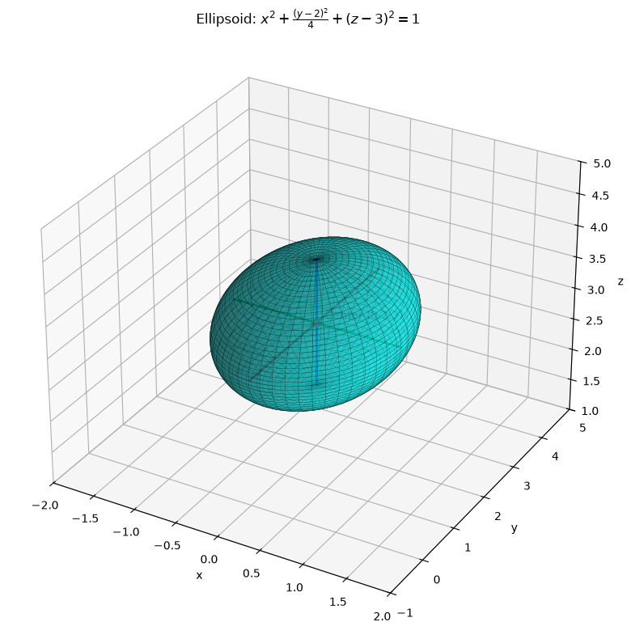
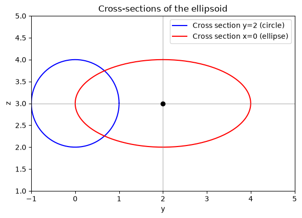
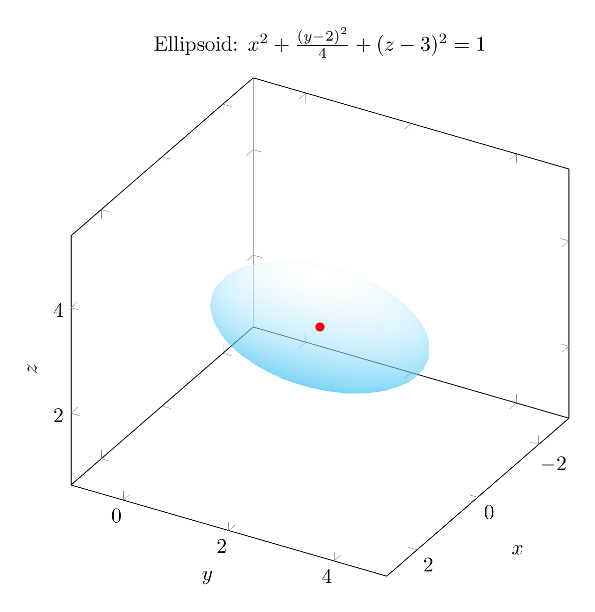
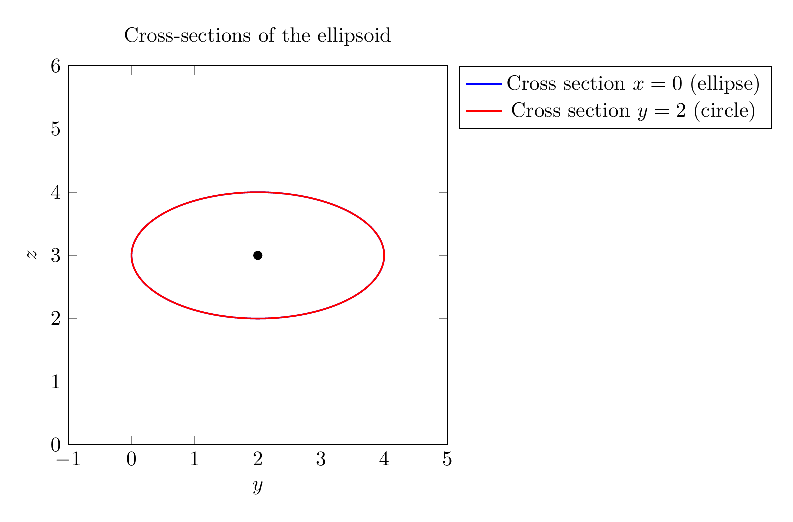

We are asked to reduce the equation

$$4x^2+y^2+4z^2-4y-24z+36=0$$

to a standard form, classify the surface, and sketch it.

**Step 1: Group the variables and complete the square.**

Group the $y$ terms and the $z$ terms:

$$4x^2 + (y^2-4y) + 4(z^2-6z) + 36 = 0.$$

Complete the square:
- $y^2-4y = (y-2)^2 - 4$
- $z^2-6z = (z-3)^2 - 9$, so $4(z^2-6z) = 4(z-3)^2 - 36$

Substituting back:

$$4x^2 + (y-2)^2 - 4 + 4(z-3)^2 - 36 + 36 = 0.$$

The constant terms cancel:

$$4x^2 + (y-2)^2 + 4(z-3)^2 = 4.$$

**Step 2: Divide by 4 to obtain the standard form.**

$$\frac{x^2}{1} + \frac{(y-2)^2}{4} + \frac{(z-3)^2}{1} = 1.$$

This is the standard equation of an **ellipsoid** centered at $(0,2,3)$ with semi-axes $a=1$ in the $x$-direction, $b=2$ in the $y$-direction, and $c=1$ in the $z$-direction.

**Classification:** The surface is an ellipsoid.

**Sketch:** The ellipsoid is centered at $(0,2,3)$. It extends:
- from $x=-1$ to $x=1$,
- from $y=0$ to $y=4$,
- from $z=2$ to $z=4$.

Cross-sections parallel to the $xz$-plane (with $y=2$) are circles of radius $1$, while cross-sections parallel to the $yz$-plane (with $x=0$) are ellipses with semi-axes $2$ and $1$.

$$\boxed{\frac{x^2}{1} + \frac{(y-2)^2}{4} + \frac{(z-3)^2}{1} = 1,\ \text{an ellipsoid centered at }(0,2,3)}$$


---





---

[PGFplots / tikz plot.](./20260825_024208_606197_utc_0800_pgfplots_0.tex)

```latex
\documentclass[border=10pt]{standalone}
\usepackage{pgfplots}
\pgfplotsset{compat=1.17}
\begin{document}
\begin{tikzpicture}
\begin{axis}[
    view={120}{30},
    xlabel=$x$, ylabel=$y$, zlabel=$z$,
    xmin=-2, xmax=2,
    ymin=-1, ymax=5,
    zmin=1, zmax=5,
    width=10cm, height=10cm,
    axis equal,
    title={Ellipsoid: $x^2+\frac{(y-2)^2}{4}+(z-3)^2=1$}
]
\addplot3[
    surf,
    shader=interp,
    opacity=0.6,
    colormap={cyanwhite}{color=(cyan) color=(white)},
    domain=0:360,
    y domain=0:180,
    samples=40,
    z buffer=sort
]
({sin(y)*cos(x)}, {2*sin(y)*sin(x)+2}, {cos(y)+3});
\addplot3[only marks, mark=*, red] coordinates {(0,2,3)};
\end{axis}
\end{tikzpicture}
\end{document}

```



[PGFplots / tikz plot.](./20260825_024208_606197_utc_0800_pgfplots_1.tex)

```latex
\documentclass[border=10pt]{standalone}
\usepackage{pgfplots}
\pgfplotsset{compat=1.17}
\begin{document}
\begin{tikzpicture}
\begin{axis}[
    xlabel=$y$, ylabel=$z$,
    xmin=-1, xmax=5,
    ymin=1, ymax=5,
    axis equal,
    width=8cm, height=8cm,
    title={Cross-sections of the ellipsoid},
    legend pos=outer north east
]
\addplot[blue, thick, domain=0:360, samples=200, variable=\t]
({2*sin(\t)+2}, {cos(\t)+3});
\addlegendentry{Cross section $x=0$ (ellipse)}
\addplot[red, thick, domain=0:360, samples=200, variable=\t]
({2*sin(\t)+2}, {cos(\t)+3});
\addlegendentry{Cross section $y=2$ (circle)}
\addplot[only marks, mark=*, black] coordinates {(2,3)};
\end{axis}
\end{tikzpicture}
\end{document}

```

