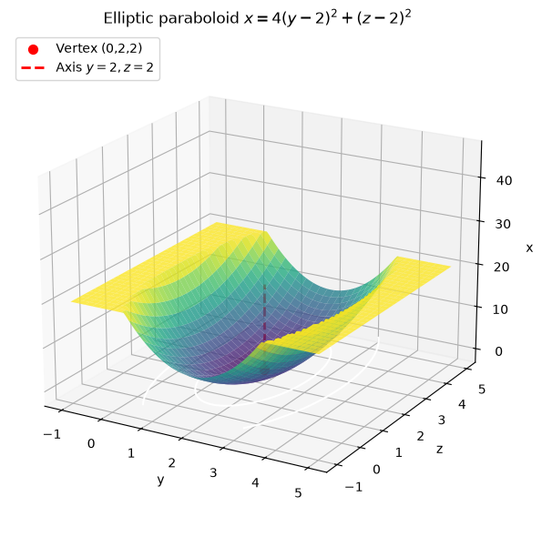
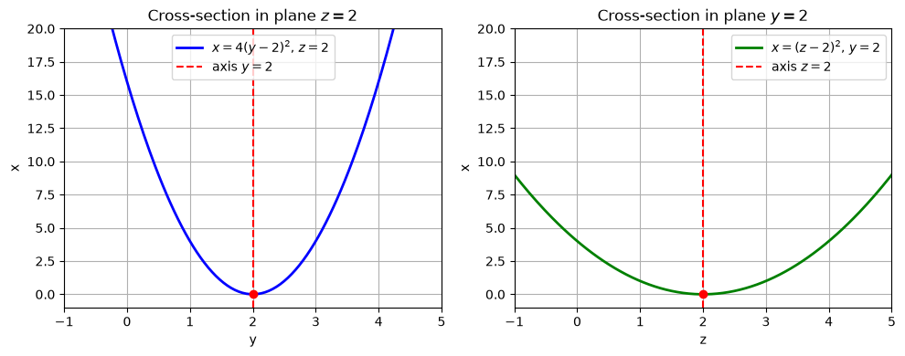
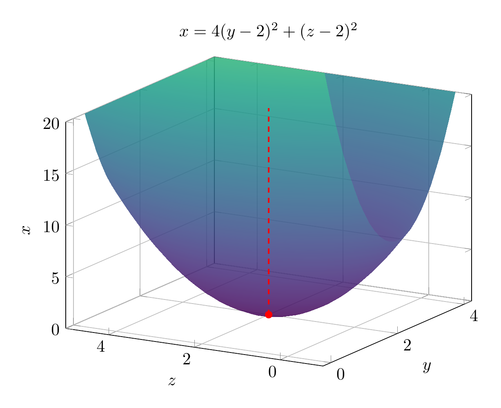
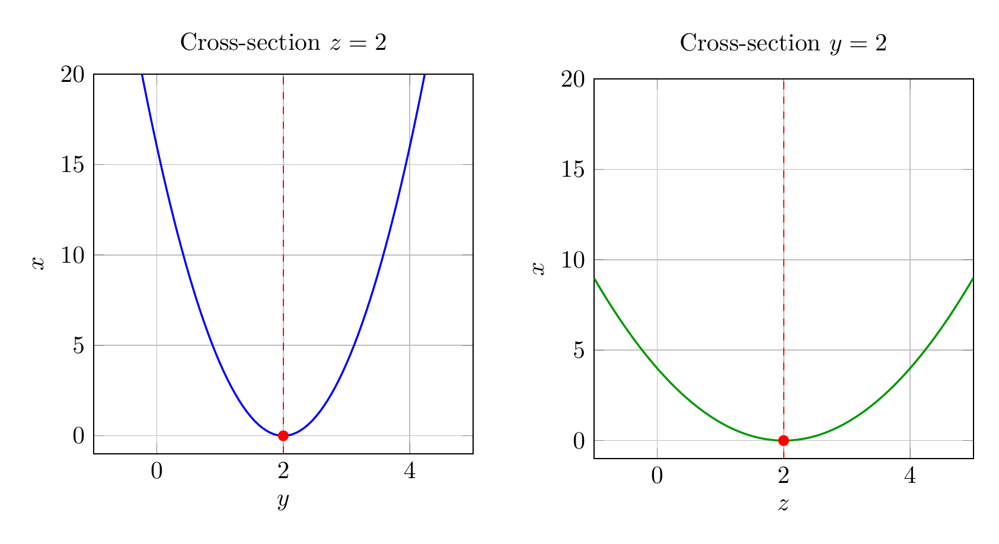

We are asked to reduce the equation

$$4y^2+z^2-x-16y-4z+20=0$$

to a standard form, classify the surface, and sketch it.

**Step 1: Group the variables.**

Group the $y$ terms and the $z$ terms, and isolate $x$:

$$(4y^2-16y)+(z^2-4z)=x-20.$$

**Step 2: Complete the square.**

Factor the $4$ out of the $y$ terms:

$$4(y^2-4y)+(z^2-4z)=x-20.$$

Complete the square inside each group:

$$4\bigl[(y-2)^2-4\bigr]+\bigl[(z-2)^2-4\bigr]=x-20.$$

Distribute the constants:

$$4(y-2)^2-16+(z-2)^2-4=x-20.$$

Combine the constants on the left:

$$4(y-2)^2+(z-2)^2-20=x-20.$$

Add $20$ to both sides:

$$\boxed{x=4(y-2)^2+(z-2)^2}.$$

**Step 3: Classify the surface.**

The equation has the form

$$x=\frac{(y-k)^2}{a^2}+\frac{(z-\ell)^2}{b^2},$$

with vertex at $(0,2,2)$ and axis of symmetry parallel to the $x$-axis. Because both squared terms are added on the right and the left side is linear in $x$, this is an **elliptic paraboloid** opening in the positive $x$-direction.

The cross-sections parallel to the $x\!y$-plane ($z=2$) are parabolas $x=4(y-2)^2$, and cross-sections parallel to the $x\!z$-plane ($y=2$) are parabolas $x=(z-2)^2$. Cross-sections perpendicular to the axis (i.e. planes $x=c>0$) are ellipses

$$\frac{(y-2)^2}{c/4}+\frac{(z-2)^2}{c}=1.$$

So the surface is an **elliptic paraboloid** with vertex $(0,2,2)$ opening toward increasing $x$.

**Final answer:**

$$\boxed{x=4(y-2)^2+(z-2)^2,\quad\text{elliptic paraboloid}}.$$

---





---

[PGFplots / tikz plot.](./20260825_024224_661132_utc_0800_pgfplots_0.tex)

```latex
\documentclass[border=10pt]{standalone}
\usepackage{pgfplots}
\pgfplotsset{compat=1.17}
\begin{document}
\begin{tikzpicture}
\begin{axis}[
    xlabel={$y$}, ylabel={$z$}, zlabel={$x$},
    title={$x=4(y-2)^2+(z-2)^2$},
    view={-60}{20},
    colormap/viridis,
    samples=40,
    domain=-1:5,
    y domain=-1:5,
    zmin=0, zmax=20,
    axis equal image=false,
    width=10cm, height=8cm,
    grid=both,
]
\addplot3[surf,shader=interp,opacity=0.85] {4*(x-2)^2+(y-2)^2};
\addplot3[red,mark=*,mark size=2pt] coordinates {(2,2,0)};
\addplot3[red,dashed,thick] coordinates {(2,2,0) (2,2,20)};
\end{axis}
\end{tikzpicture}
\end{document}

```



[PGFplots / tikz plot.](./20260825_024224_661132_utc_0800_pgfplots_1.tex)

```latex
\documentclass[border=10pt]{standalone}
\usepackage{pgfplots}
\pgfplotsset{compat=1.17}
\begin{document}
\begin{tikzpicture}
\begin{axis}[
    xlabel={$y$}, ylabel={$x$},
    title={Cross-section $z=2$},
    xmin=-1, xmax=5, ymin=-1, ymax=20,
    grid=both,
    width=7cm, height=7cm,
]
\addplot[blue,thick,domain=-1:5,samples=100] {4*(x-2)^2};
\addplot[red,dashed] coordinates {(2,-1) (2,20)};
\addplot[red,mark=*,mark size=2pt] coordinates {(2,0)};
\end{axis}
\end{tikzpicture}
\hspace{0.5cm}
\begin{tikzpicture}
\begin{axis}[
    xlabel={$z$}, ylabel={$x$},
    title={Cross-section $y=2$},
    xmin=-1, xmax=5, ymin=-1, ymax=20,
    grid=both,
    width=7cm, height=7cm,
]
\addplot[green!60!black,thick,domain=-1:5,samples=100] {(x-2)^2};
\addplot[red,dashed] coordinates {(2,-1) (2,20)};
\addplot[red,mark=*,mark size=2pt] coordinates {(2,0)};
\end{axis}
\end{tikzpicture}
\end{document}

```

