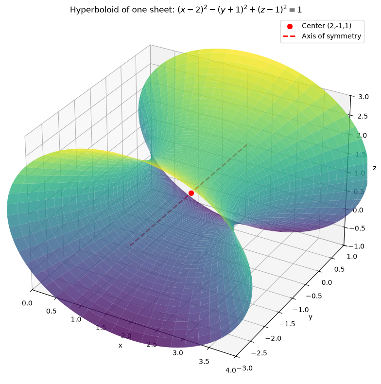
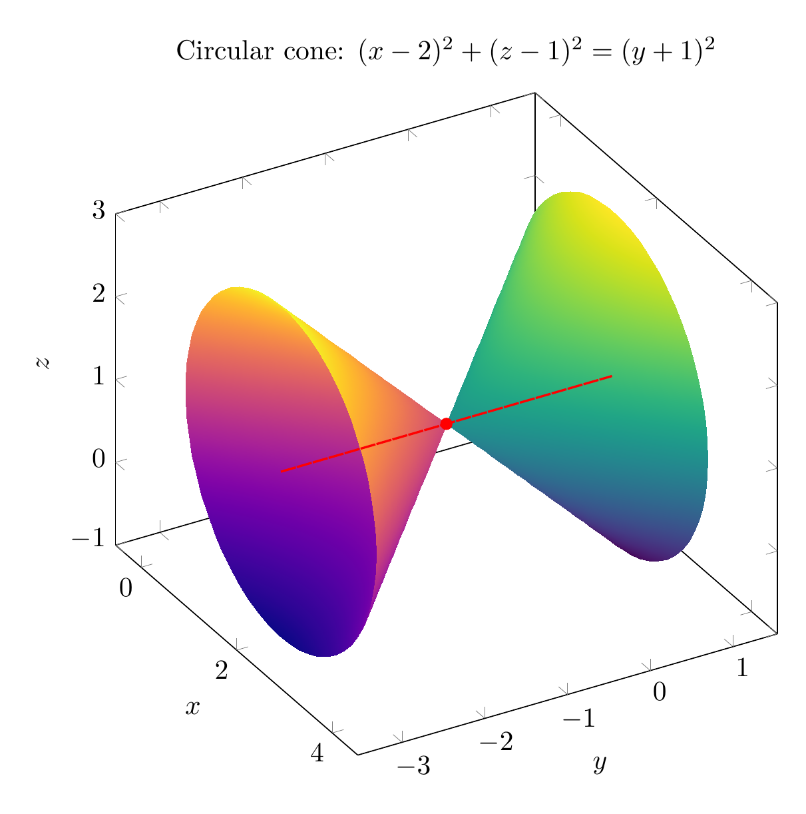
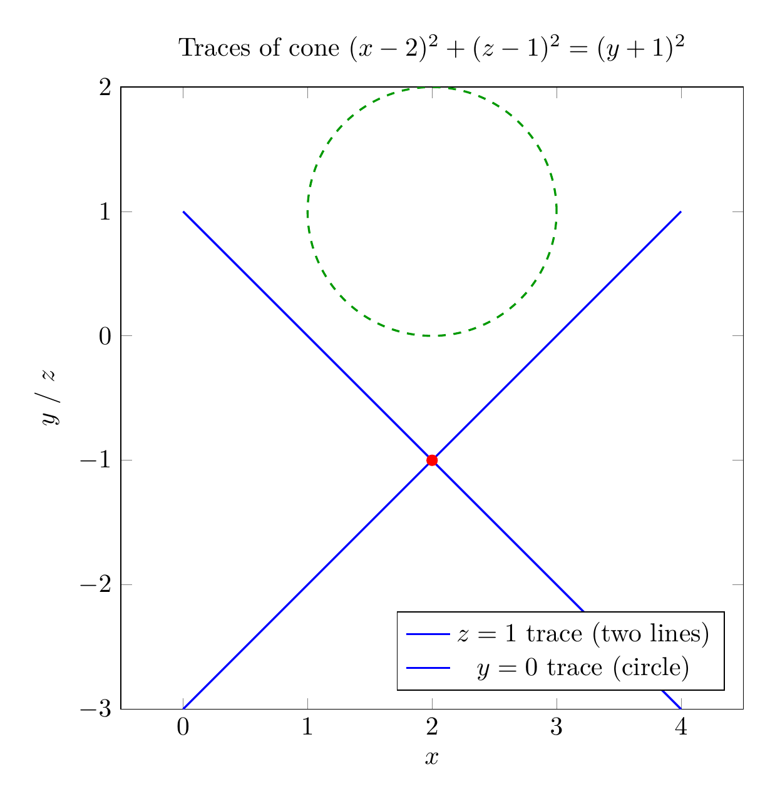

We are asked to reduce

$$x^2-y^2+z^2-4x-2y-2z+4=0$$

to a standard form, classify the surface, and sketch it.

### Step 1: Complete the square
Group the terms by variable:

$$(x^2-4x) - (y^2+2y) + (z^2-2z) + 4 = 0.$$

Complete each square:
- $x^2-4x = (x-2)^2 - 4$
- $y^2+2y = (y+1)^2 - 1$, so $-(y^2+2y) = -(y+1)^2 + 1$
- $z^2-2z = (z-1)^2 - 1$

Substituting gives

$$(x-2)^2 - 4 - (y+1)^2 + 1 + (z-1)^2 - 1 + 4 = 0.$$

The constants cancel: $-4+1-1+4 = 0$.  Hence

$$(x-2)^2 - (y+1)^2 + (z-1)^2 = 0.$$

Move the negative term to the other side:

$$(x-2)^2 + (z-1)^2 = (y+1)^2.$$

### Step 2: Classify the surface
The equation has two positive squared terms on one side equal to a single squared term on the other side.  This is the standard form of a **circular cone** (a degenerate quadric surface).  It is circular because the coefficients of $(x-2)^2$ and $(z-1)^2$ are equal.

- **Vertex:** $(2,-1,1)$
- **Axis:** the line $x=2,\; z=1$, which is parallel to the $y$-axis
- **Opening angle:** $45^\circ$, since the radius $\sqrt{(x-2)^2+(z-1)^2}$ equals $|y+1|$.

### Step 3: Sketch
The 3D plot shows the two nappes of the cone meeting at the vertex $(2,-1,1)$, with axis along the $y$-direction.  The 2D trace plot illustrates that a horizontal slice perpendicular to the axis gives a circle, while a slice through the axis gives two intersecting straight lines.

$$\boxed{(x-2)^2 + (z-1)^2 = (y+1)^2, \text{ a circular cone with vertex }(2,-1,1)\text{ and axis parallel to the }y\text{-axis}}$$


---




---

[PGFplots / tikz plot.](./20260825_024326_510780_utc_0800_pgfplots_0.tex)

```latex
\documentclass[border=10pt]{standalone}
\usepackage{pgfplots}
\pgfplotsset{compat=1.17}
\begin{document}
\begin{tikzpicture}
\begin{axis}[
    view={60}{30},
    xlabel={$x$}, ylabel={$y$}, zlabel={$z$},
    xmin=0, xmax=4,
    ymin=-3, ymax=1,
    zmin=-1, zmax=3,
    width=10cm, height=10cm,
    axis equal,
    title={Circular cone: $(x-2)^2+(z-1)^2=(y+1)^2$},
    colormap/viridis,
]
\addplot3[surf, shader=interp, domain=0:2, y domain=0:360, samples=40, samples y=60, z buffer=sort]
    ({2+x*cos(y)}, {-1+x}, {1+x*sin(y)});
\addplot3[surf, shader=interp, domain=0:2, y domain=0:360, samples=40, samples y=60, z buffer=sort, colormap/plasma]
    ({2+x*cos(y)}, {-1-x}, {1+x*sin(y)});
\addplot3[only marks, mark=*, red] coordinates {(2,-1,1)};
\addplot3[red, dashed, thick, domain=-3:1, samples=2] ({2},{x},{1});
\end{axis}
\end{tikzpicture}
\end{document}

```



[PGFplots / tikz plot.](./20260825_024326_510780_utc_0800_pgfplots_1.tex)

```latex
\documentclass[border=10pt]{standalone}
\usepackage{pgfplots}
\pgfplotsset{compat=1.17}
\begin{document}
\begin{tikzpicture}
\begin{axis}[
    axis equal,
    xlabel={$x$}, ylabel={$y$ / $z$},
    xmin=0, xmax=4,
    ymin=-3, ymax=2,
    width=10cm, height=10cm,
    title={Traces of cone $(x-2)^2+(z-1)^2=(y+1)^2$},
    legend pos=south east,
]
\addplot[blue, thick, domain=0:4, samples=200] {x-3};
\addplot[blue, thick, domain=0:4, samples=200] {1-x};
\addlegendentry{$z=1$ trace (two lines)}
\addplot[green!60!black, dashed, thick, domain=0:360, samples=200] ({2+cos(x)}, {1+sin(x)});
\addlegendentry{$y=0$ trace (circle)}
\addplot[only marks, mark=*, red] coordinates {(2,-1)};
\end{axis}
\end{tikzpicture}
\end{document}

```

