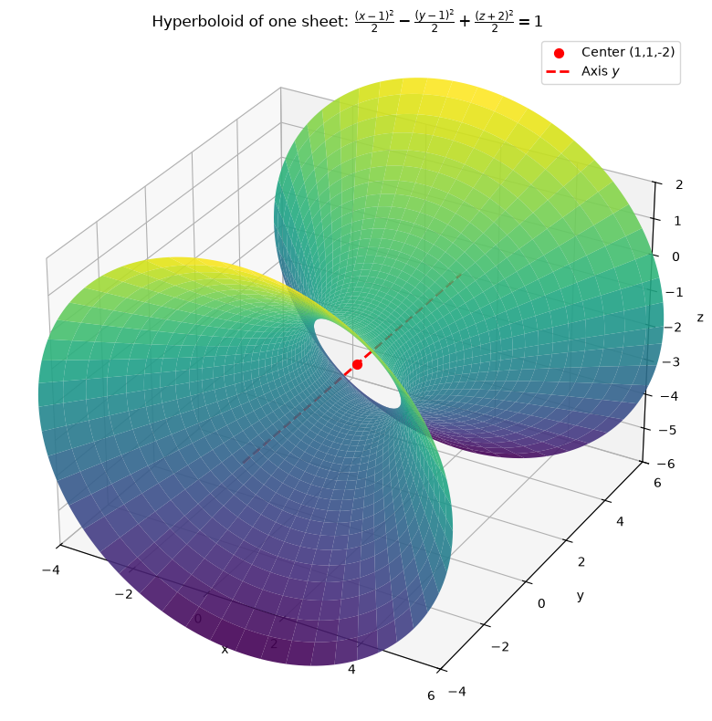
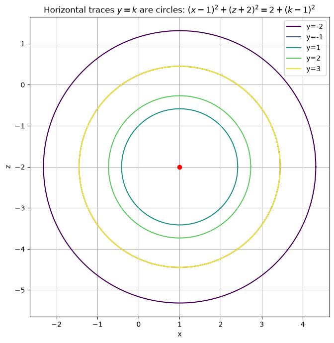
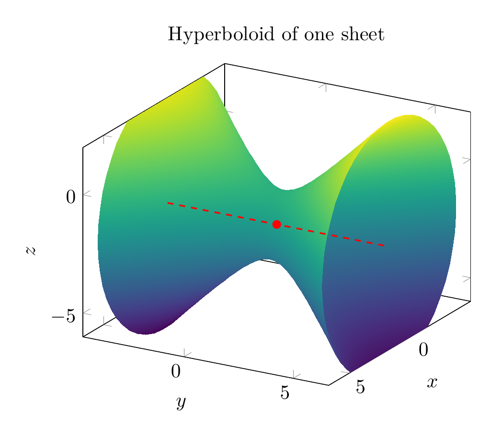
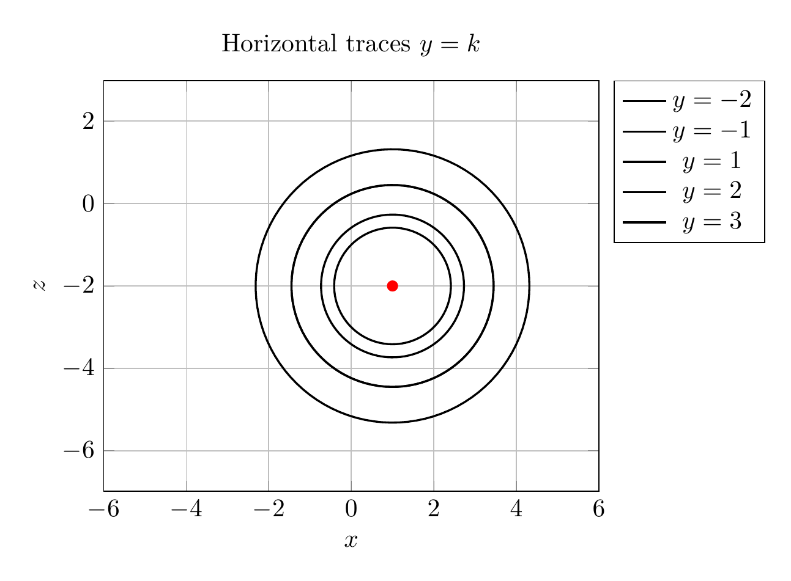

`[ Begin message. Type: AIMessage. ]`

# Reduce, Classify, and Sketch the Quadric Surface

We are asked to reduce the equation

$$x^2-y^2+z^2-2x+2y+4z+2=0$$

to one of the standard forms, classify the surface, and sketch it.

## Step 1: Complete the square in each variable

Group the terms by variable:

$$(x^2-2x) - (y^2-2y) + (z^2+4z) + 2 = 0.$$

Complete each square:

- $x^2-2x = (x-1)^2 - 1$
- $y^2-2y = (y-1)^2 - 1$, so $-(y^2-2y) = -(y-1)^2 + 1$
- $z^2+4z = (z+2)^2 - 4$

Substitute back:

$$(x-1)^2 - 1 - (y-1)^2 + 1 + (z+2)^2 - 4 + 2 = 0.$$

The constants cancel: $-1+1-4+2 = -2$, so

$$(x-1)^2 - (y-1)^2 + (z+2)^2 - 2 = 0,$$

or equivalently

$$(x-1)^2 - (y-1)^2 + (z+2)^2 = 2.$$

## Step 2: Write in standard form

Divide by $2$:

$$\boxed{\frac{(x-1)^2}{2} - \frac{(y-1)^2}{2} + \frac{(z+2)^2}{2} = 1}$$

## Step 3: Classify the surface

This is the standard form of a **hyperboloid of one sheet**:

$$\frac{(x-h)^2}{a^2} - \frac{(y-k)^2}{b^2} + \frac{(z-l)^2}{c^2} = 1.$$

Here:
- Center: $(h,k,l) = (1,1,-2)$
- $a^2=b^2=c^2=2$, so $a=b=c=\sqrt{2}$
- The **negative sign** is on the $y$-term, so the axis of the hyperboloid is parallel to the $y$-axis.

A hyperboloid of one sheet is a connected (single-sheeted) surface that is obtained by rotating a hyperbola around its non-transverse axis; its horizontal cross-sections perpendicular to the $y$-axis are circles.

## Step 4: Sketch / visualization notes

- The narrowest cross-section occurs at $y=1$:
  $$(x-1)^2 + (z+2)^2 = 2,$$
  a circle of radius $\sqrt{2}$ centered at $(1,-2)$ in the $xz$-plane.
- As $|y-1|$ increases, the radius of the circular cross-section grows as $\sqrt{2+(y-1)^2}$.
- The surface opens outward along the $y$-direction.

## Final answer

$$\boxed{\frac{(x-1)^2}{2} - \frac{(y-1)^2}{2} + \frac{(z+2)^2}{2} = 1}$$

The surface is a **hyperboloid of one sheet** centered at $(1,1,-2)$ with axis parallel to the $y$-axis.


---


(Image `20260825_024250_300406_utc_0800_pyplot_0.png`. Alt text: pyplot-generated plot.)



(Image `20260825_024250_300406_utc_0800_pyplot_1.png`. Alt text: pyplot-generated plot.)




---

[PGFplots / tikz plot.](./20260825_024250_300406_utc_0800_pgfplots_0.tex)

```latex
\documentclass[border=10pt]{standalone}
\usepackage{pgfplots}
\pgfplotsset{compat=1.17}
\begin{document}
\begin{tikzpicture}
\begin{axis}[
    view={120}{20},
    xlabel=$x$,
    ylabel=$y$,
    zlabel=$z$,
    title={Hyperboloid of one sheet},
    xmin=-4,xmax=6,
    ymin=-4,ymax=6,
    zmin=-6,zmax=2,
    axis equal,
    colormap/viridis,
    samples=50,
    samples y=50,
    domain=-2:2,
    y domain=0:360,
]
\addplot3[surf,shader=interp,z buffer=sort]
({1+sqrt(2)*cosh(x)*cos(y)},
 {1+sqrt(2)*sinh(x)},
 {-2+sqrt(2)*cosh(x)*sin(y)});
\addplot3[red,thick,dashed] coordinates {(1,-4,-2) (1,6,-2)};
\addplot3[only marks,mark=*,red] coordinates {(1,1,-2)};
\end{axis}
\end{tikzpicture}
\end{document}

```


(Image `20260825_024250_300406_utc_0800_pgfplots_0.png`. Alt text: PGFplots / tikz plot (converted to PNG).)




[PGFplots / tikz plot.](./20260825_024250_300406_utc_0800_pgfplots_1.tex)

```latex
\documentclass[border=10pt]{standalone}
\usepackage{pgfplots}
\pgfplotsset{compat=1.17}
\begin{document}
\begin{tikzpicture}
\begin{axis}[
    axis equal,
    xlabel=$x$,
    ylabel=$z$,
    title={Horizontal traces $y=k$},
    xmin=-6,xmax=6,
    ymin=-6,ymax=2,
    grid=both,
    legend pos=outer north east,
]
\pgfplotsinvokeforeach{-2,-1,1,2,3}{
\pgfmathsetmacro{\r}{sqrt(2+(#1-1)^2)}
\addplot[thick,domain=0:360,samples=100] ({1+\r*cos(x)},{-2+\r*sin(x)});
\addlegendentryexpanded{$y=#1$}
}
\addplot[only marks,mark=*,red] coordinates {(1,-2)};
\end{axis}
\end{tikzpicture}
\end{document}

```


(Image `20260825_024250_300406_utc_0800_pgfplots_1.png`. Alt text: PGFplots / tikz plot (converted to PNG).)



`[ End message. Type: AIMessage. ]`