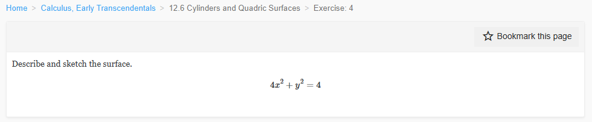
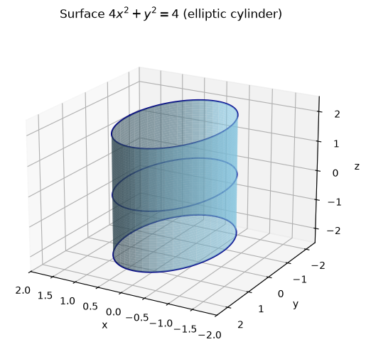
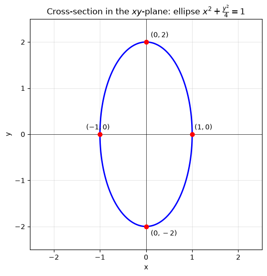
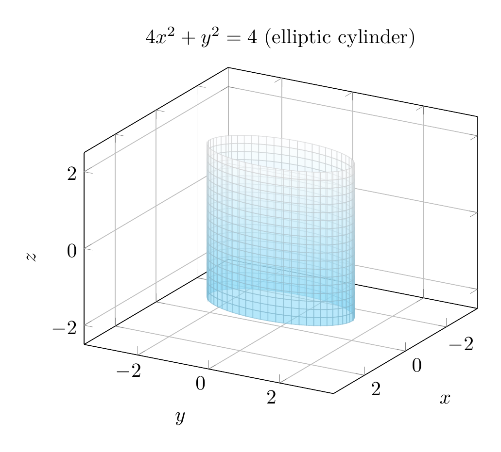
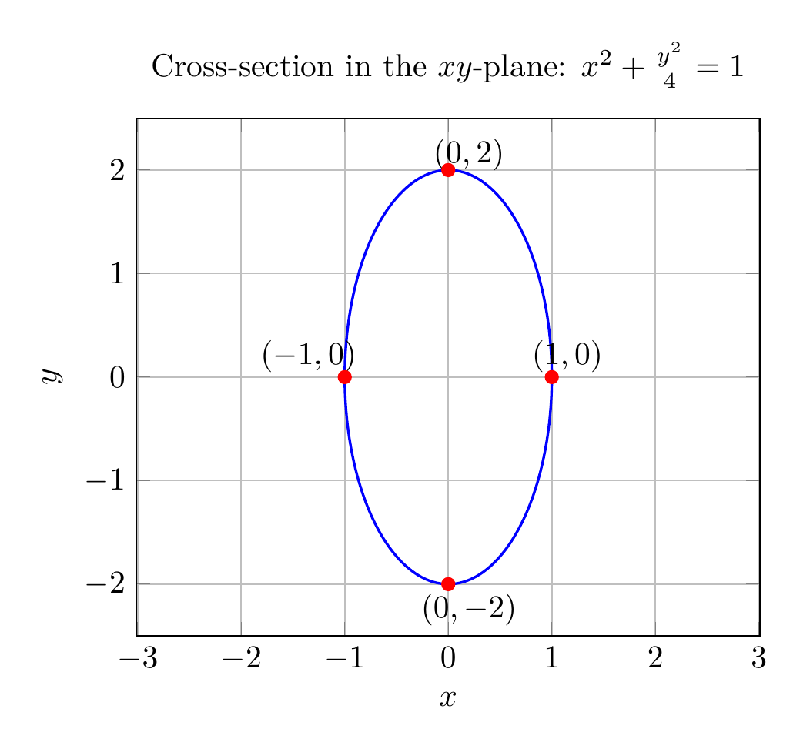

`[ Begin message. Type: HumanMessage. ]`

`[Begin Problem]`

Please solve the math problem in the image.


(Image `problem.png`. Alt text: Problem.)



`[End Problem]`

`[ End message. Type: HumanMessage. ]`

`[ Begin message. Type: AIMessage. ]`

`[Begin Answer]`

## Solution

We are asked to describe and sketch the surface

$$4x^2+y^2=4.$$

### Step 1: Rewrite in standard form
Divide both sides by $4$:

$$x^2+\frac{y^2}{4}=1.$$

This is the equation of an **ellipse** in the $xy$-plane with

- semi-minor axis $a=1$ along the $x$-axis,
- semi-major axis $b=2$ along the $y$-axis.

The intercepts are $(\pm 1,0,0)$ and $(0,\pm 2,0)$.

### Step 2: Identify the surface in 3D
The equation $4x^2+y^2=4$ does **not** involve $z$. That means for every fixed value of $z$, the cross-section parallel to the $xy$-plane is the same ellipse. Therefore the surface is a **cylinder** whose rulings (straight-line generators) are parallel to the $z$-axis and whose directrix is the ellipse $x^2+\frac{y^2}{4}=1$.

More specifically, it is an **elliptic cylinder** extending infinitely in both the positive and negative $z$-directions.

### Step 3: Summary

- **Type of surface:** elliptic cylinder.
- **Axis of the cylinder:** the $z$-axis (rulings parallel to $z$-axis).
- **Cross-section perpendicular to the axis:** ellipse $x^2+\frac{y^2}{4}=1$, with vertices $(\pm 1,0,z)$ and $(0,\pm 2,z)$ for every $z$.

$$\boxed{\text{The surface }4x^2+y^2=4\text{ is an elliptic cylinder with rulings parallel to the }z\text{-axis and directrix ellipse }x^2+\frac{y^2}{4}=1.}$$


---


(Image `20260825_024021_496106_utc_0800_pyplot_0.png`. Alt text: pyplot-generated plot.)



(Image `20260825_024021_496106_utc_0800_pyplot_1.png`. Alt text: pyplot-generated plot.)




---

[PGFplots / tikz plot.](./20260825_024021_496106_utc_0800_pgfplots_0.tex)

```latex
\documentclass[border=10pt]{standalone}
\usepackage{pgfplots}
\pgfplotsset{compat=1.18}
\begin{document}
\begin{tikzpicture}
\begin{axis}[
    xlabel={$x$}, ylabel={$y$}, zlabel={$z$},
    xmin=-2, xmax=2, ymin=-2.5, ymax=2.5, zmin=-2.5, zmax=2.5,
    axis equal,
    view={120}{20},
    grid=major,
    title={$4x^2+y^2=4$ (elliptic cylinder)},
    samples=60, samples y=20
]
\addplot3[surf, domain=0:360, y domain=-2:2, z buffer=sort, opacity=0.6, colormap={bw}{color=(cyan!50) color=(white)}]
    ({cos(x)}, {2*sin(x)}, {y});
\end{axis}
\end{tikzpicture}
\end{document}

```


(Image `20260825_024021_496106_utc_0800_pgfplots_0.png`. Alt text: PGFplots / tikz plot (converted to PNG).)




[PGFplots / tikz plot.](./20260825_024021_496106_utc_0800_pgfplots_1.tex)

```latex
\documentclass[border=10pt]{standalone}
\usepackage{pgfplots}
\pgfplotsset{compat=1.18}
\begin{document}
\begin{tikzpicture}
\begin{axis}[
    xlabel={$x$}, ylabel={$y$},
    xmin=-2, xmax=2, ymin=-2.5, ymax=2.5,
    axis equal,
    grid=major,
    title={Cross-section in the $xy$-plane: $x^2+\frac{y^2}{4}=1$},
    samples=200
]
\addplot[blue, thick, domain=0:360] ({cos(x)}, {2*sin(x)});
\addplot[only marks, mark=*, red] coordinates {(1,0) (-1,0) (0,2) (0,-2)};
\node at (axis cs:1.15,0.2) {$(1,0)$};
\node at (axis cs:-1.35,0.2) {$(-1,0)$};
\node at (axis cs:0.2,2.15) {$(0,2)$};
\node at (axis cs:0.2,-2.25) {$(0,-2)$};
\end{axis}
\end{tikzpicture}
\end{document}

```


(Image `20260825_024021_496106_utc_0800_pgfplots_1.png`. Alt text: PGFplots / tikz plot (converted to PNG).)



`[End Answer]`

`[ End message. Type: AIMessage. ]`