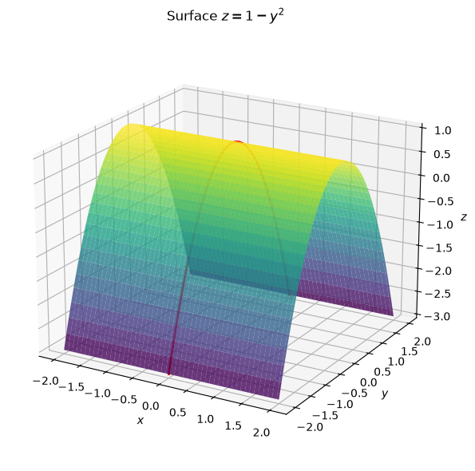
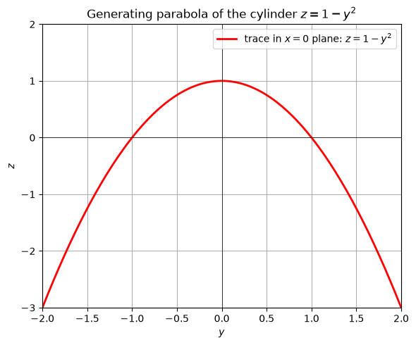
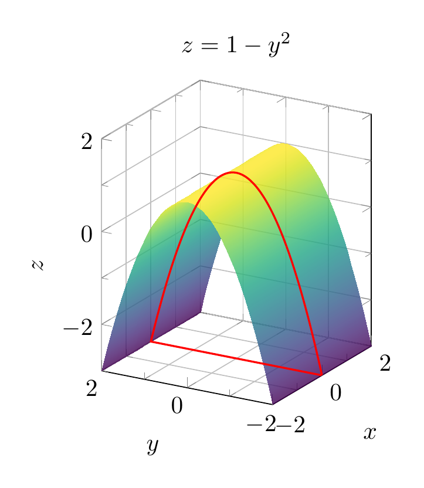
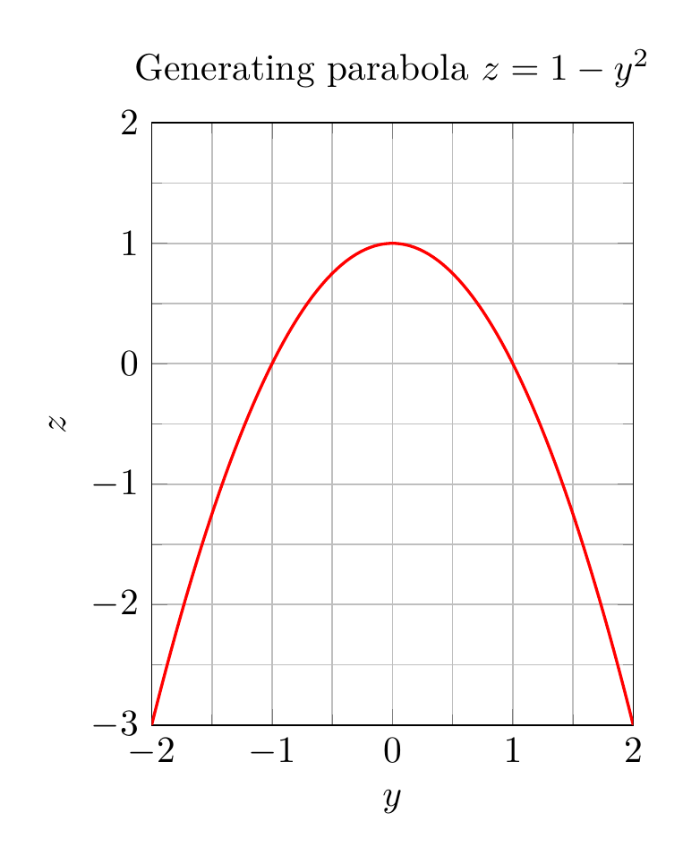

`[ Begin message. Type: AIMessage. ]`

# Solution: Describe and sketch $z = 1 - y^2$

## Analysis

The equation

$$
z = 1 - y^2
$$

involves the variables $y$ and $z$, but **not** $x$. In three-dimensional space, when one variable is missing from an equation, the surface is a **cylinder** whose rulings (generating lines) are parallel to the axis of the missing variable. Here $x$ is missing, so the rulings are parallel to the $x$-axis.

### Cross-sections (traces)

- **Plane $x = k$** (any constant $k$): the trace is the parabola
  $$
  z = 1 - y^2,
  $$
  opening downward in the $yz$-plane, with vertex at $(k, 0, 1)$.

- **Plane $y = k$**: the trace is the horizontal line
  $$
  z = 1 - k^2,
  $$
  parallel to the $x$-axis.

- **Plane $z = k$** (with $k \le 1$): the trace consists of the two lines
  $$
  y = \pm\sqrt{1-k},
  $$
  both parallel to the $x$-axis.

Since every slice perpendicular to the $x$-axis gives the same downward-opening parabola, the surface is a **parabolic cylinder**.

## Description

The surface $z = 1 - y^2$ is a **parabolic cylinder** generated by translating the parabola $z = 1 - y^2$ in the $yz$-plane along the $x$-axis. The parabola opens in the negative $z$-direction and has vertex $(0,0,1)$. The cylinder extends infinitely in both the positive and negative $x$-directions.

## Final Answer

$\boxed{\text{The surface } z = 1 - y^2 \text{ is a parabolic cylinder with rulings parallel to the } x\text{-axis, generated by the downward-opening parabola } z = 1 - y^2 \text{ in the } yz\text{-plane.}}$


---


(Image `20260825_024016_698824_utc_0800_pyplot_0.png`. Alt text: pyplot-generated plot.)



(Image `20260825_024016_698824_utc_0800_pyplot_1.png`. Alt text: pyplot-generated plot.)




---

[PGFplots / tikz plot.](./20260825_024016_698824_utc_0800_pgfplots_0.tex)

```latex
\documentclass[border=10pt]{standalone}
\usepackage{pgfplots}
\pgfplotsset{compat=1.18}
\begin{document}
\begin{tikzpicture}
\begin{axis}[
    xlabel={$x$}, ylabel={$y$}, zlabel={$z$},
    title={$z = 1 - y^2$},
    view={-60}{20},
    colormap/viridis,
    samples=50, samples y=50,
    domain=-2:2, y domain=-2:2,
    zmin=-3, zmax=2,
    axis equal image,
    grid=both,
    minor tick num=1
]
\addplot3[surf, opacity=0.8, shader=interp] {1 - y^2};
\addplot3[red, thick, domain=-2:2, samples=100] (0, x, {1 - x^2});
\end{axis}
\end{tikzpicture}
\end{document}

```


(Image `20260825_024016_698824_utc_0800_pgfplots_0.png`. Alt text: PGFplots / tikz plot (converted to PNG).)




[PGFplots / tikz plot.](./20260825_024016_698824_utc_0800_pgfplots_1.tex)

```latex
\documentclass[border=10pt]{standalone}
\usepackage{pgfplots}
\pgfplotsset{compat=1.18}
\begin{document}
\begin{tikzpicture}
\begin{axis}[
    xlabel={$y$}, ylabel={$z$},
    title={Generating parabola $z=1-y^2$},
    xmin=-2, xmax=2,
    ymin=-3, ymax=2,
    axis equal image,
    grid=both,
    minor tick num=1
]
\addplot[red, thick, domain=-2:2, samples=100] {1 - x^2};
\end{axis}
\end{tikzpicture}
\end{document}

```


(Image `20260825_024016_698824_utc_0800_pgfplots_1.png`. Alt text: PGFplots / tikz plot (converted to PNG).)



`[ End message. Type: AIMessage. ]`