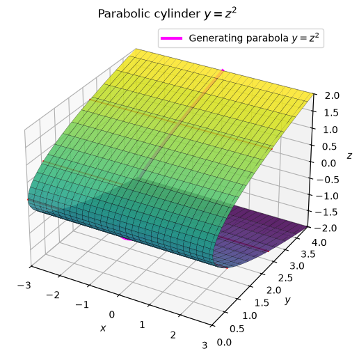
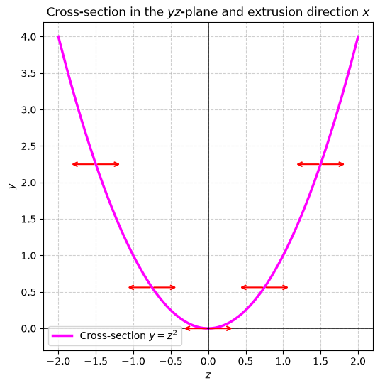
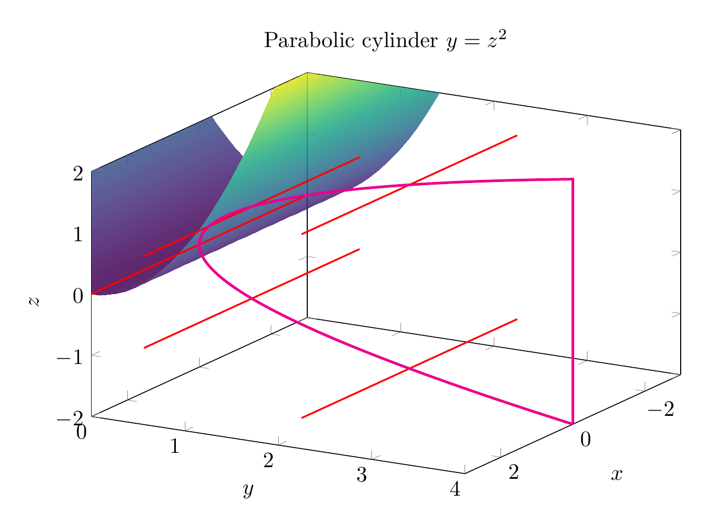
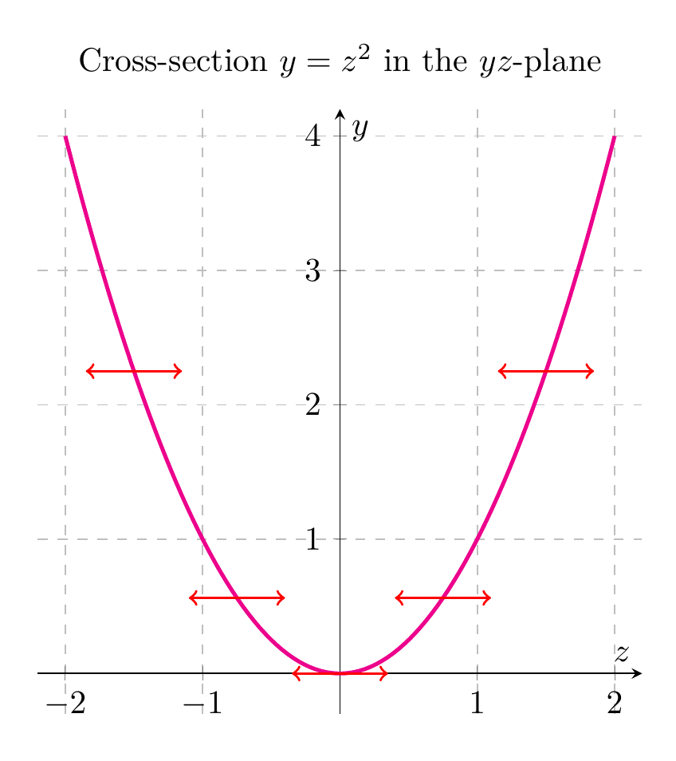

`[ Begin message. Type: HumanMessage. ]`

`[Begin Problem]`

Please solve the math problem in the image.


(Image `problem.png`. Alt text: Problem.)


`[End Problem]`

`[ End message. Type: HumanMessage. ]`

`[ Begin message. Type: AIMessage. ]`

`[Begin Answer]`

# Describing and Sketching the Surface $y = z^2$

## Step 1: Identify the type of surface
The equation

$$y = z^2$$

is an equation in three variables $x, y, z$, but notice that $x$ does **not** appear. In general, when one variable is missing from a surface equation, the surface is a **cylinder** whose rulings (straight-line generators) are parallel to the axis of the missing variable. Here $x$ is missing, so the rulings are parallel to the $x$-axis.

## Step 2: Find the generating curve
To obtain the surface, take the curve defined by $y = z^2$ in the $yz$-plane (where $x = 0$) and translate every point of that curve parallel to the $x$-axis. The curve $y = z^2$ is a **parabola** opening in the positive $y$-direction with vertex at the origin.

Therefore, $y = z^2$ is a **parabolic cylinder**.

## Step 3: Cross-sections
- **Planes $x = c$** (perpendicular to the $x$-axis): the cross-section is the parabola $y = z^2$ for every value of $c$. These are all congruent parabolas.
- **Planes $z = c$** (perpendicular to the $z$-axis): the cross-section is the horizontal line $y = c^2$, confirming that the surface extends infinitely in the $x$-direction at height $y = c^2$.
- **Planes $y = c$** with $c > 0$: the cross-section consists of the two lines $z = \sqrt{c}$ and $z = -\sqrt{c}$, both parallel to the $x$-axis. If $c = 0$, it is the $x$-axis; if $c < 0$, there is no cross-section.

## Step 4: Sketch
The 3D plot shows the parabolic cylinder with its rulings parallel to the $x$-axis. The magenta curve is the generating parabola $y = z^2$ in the $yz$-plane. The 2D plot shows the same generating parabola with arrows indicating the extrusion direction along the $x$-axis.

$$\boxed{\text{The surface } y = z^2 \text{ is a parabolic cylinder with rulings parallel to the } x\text{-axis, generated by translating the parabola } y = z^2 \text{ in the } yz\text{-plane along the } x\text{-direction.}}$$


---


(Image `20260825_024035_141456_utc_0800_pyplot_0.png`. Alt text: pyplot-generated plot.)



(Image `20260825_024035_141456_utc_0800_pyplot_1.png`. Alt text: pyplot-generated plot.)




---

[PGFplots / tikz plot.](./20260825_024035_141456_utc_0800_pgfplots_0.tex)

```latex
\documentclass[border=10pt]{standalone}
\usepackage{pgfplots}
\pgfplotsset{compat=1.18}
\begin{document}
\begin{tikzpicture}
\begin{axis}[
    view={120}{25},
    xlabel=$x$, ylabel=$y$, zlabel=$z$,
    xmin=-3, xmax=3,
    ymin=0, ymax=4,
    zmin=-2, zmax=2,
    title={Parabolic cylinder $y=z^2$},
    width=11cm, height=8cm,
    colormap/viridis,
]
\addplot3[surf, shader=interp, domain=-3:3, domain y=-2:2, samples=40, samples y=40, opacity=0.85] {y^2};
% rulings parallel to x-axis
\addplot3[red, thick, domain=-3:3, samples=2] ({x},{2.25},{-1.5});
\addplot3[red, thick, domain=-3:3, samples=2] ({x},{0.5625},{-0.75});
\addplot3[red, thick, domain=-3:3, samples=2] ({x},{0},{0});
\addplot3[red, thick, domain=-3:3, samples=2] ({x},{0.5625},{0.75});
\addplot3[red, thick, domain=-3:3, samples=2] ({x},{2.25},{1.5});
% generating parabola in the yz-plane
\addplot3[magenta, very thick, domain=-2:2, samples=100] ({0},{x^2},{x});
\end{axis}
\end{tikzpicture}
\end{document}
```


(Image `20260825_024035_141456_utc_0800_pgfplots_0.png`. Alt text: PGFplots / tikz plot (converted to PNG).)




[PGFplots / tikz plot.](./20260825_024035_141456_utc_0800_pgfplots_1.tex)

```latex
\documentclass[border=10pt]{standalone}
\usepackage{pgfplots}
\pgfplotsset{compat=1.18}
\begin{document}
\begin{tikzpicture}
\begin{axis}[
    xlabel=$z$, ylabel=$y$,
    xmin=-2.2, xmax=2.2,
    ymin=-0.3, ymax=4.2,
    title={Cross-section $y=z^2$ in the $yz$-plane},
    width=8cm, height=8cm,
    axis lines=middle,
    grid=both,
    grid style={dashed, gray!50},
]
\addplot[magenta, very thick, domain=-2:2, samples=100] {x^2};
\addplot[red, ->, thick, domain=0:0.35] ({-1.5+x},{2.25});
\addplot[red, ->, thick, domain=0:0.35] ({-1.5-x},{2.25});
\addplot[red, ->, thick, domain=0:0.35] ({-0.75+x},{0.5625});
\addplot[red, ->, thick, domain=0:0.35] ({-0.75-x},{0.5625});
\addplot[red, ->, thick, domain=0:0.35] ({0+x},{0});
\addplot[red, ->, thick, domain=0:0.35] ({0-x},{0});
\addplot[red, ->, thick, domain=0:0.35] ({0.75+x},{0.5625});
\addplot[red, ->, thick, domain=0:0.35] ({0.75-x},{0.5625});
\addplot[red, ->, thick, domain=0:0.35] ({1.5+x},{2.25});
\addplot[red, ->, thick, domain=0:0.35] ({1.5-x},{2.25});
\end{axis}
\end{tikzpicture}
\end{document}
```


(Image `20260825_024035_141456_utc_0800_pgfplots_1.png`. Alt text: PGFplots / tikz plot (converted to PNG).)



`[End Answer]`

`[ End message. Type: AIMessage. ]`