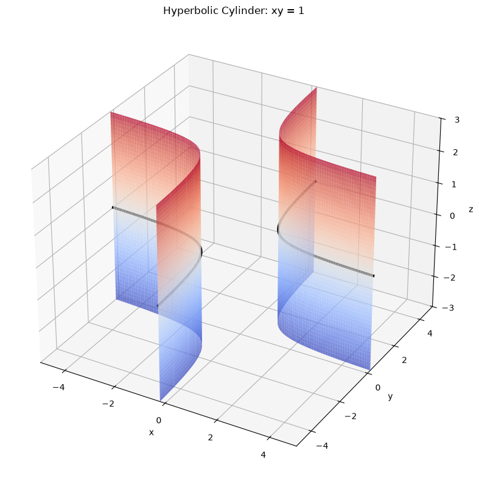
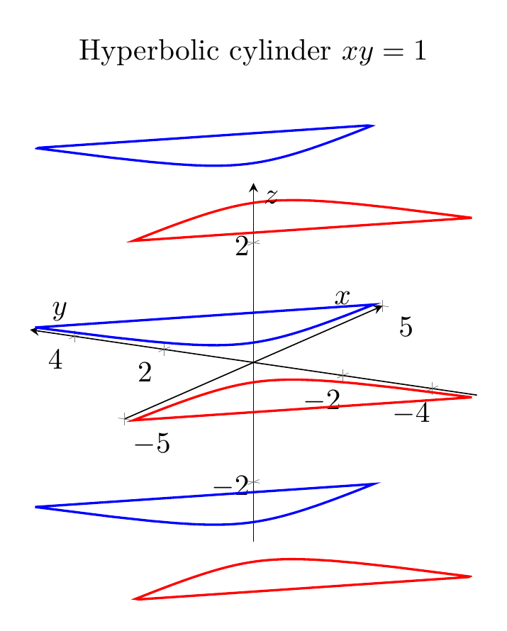
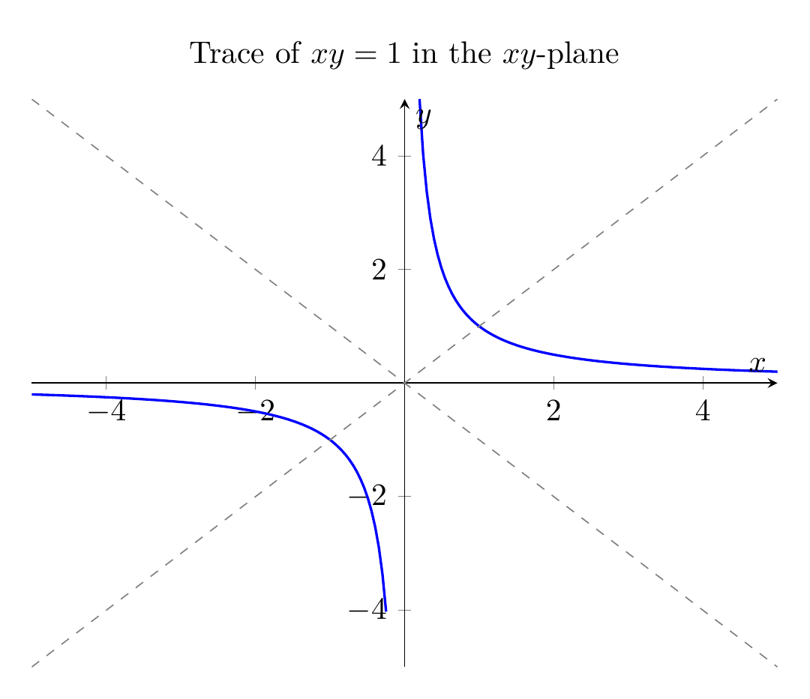

# Solution: Describe and sketch the surface $xy = 1$

## 1. Identify the type of surface

The equation $xy = 1$ does **not** contain the variable $z$. That means for every fixed value of $z$, the cross-section (or trace) in the plane $z = k$ is exactly the same curve:

$$xy = 1 \quad \text{(in the plane } z = k\text{)}.$$

A surface whose equation is missing one of the three variables is a **cylinder** whose rulings are parallel to the axis of the missing variable. Since $z$ is missing, the rulings are parallel to the $z$-axis.

The trace in the $xy$-plane is the hyperbola $xy = 1$. Therefore, the surface is a **hyperbolic cylinder** generated by translating the hyperbola $xy = 1$ straight up and down parallel to the $z$-axis.

## 2. Standard form of the hyperbola

To see that $xy = 1$ is indeed a hyperbola, rotate the $xy$-axes by $45^{\circ}$. Use the rotation

$$
x = \frac{u - v}{\sqrt{2}}, \qquad y = \frac{u + v}{\sqrt{2}}.
$$

Then

$$
xy = \frac{(u - v)(u + v)}{2} = \frac{u^{2} - v^{2}}{2}.
$$

So $xy = 1$ becomes

$$
\frac{u^{2}}{2} - \frac{v^{2}}{2} = 1.
$$

This is a hyperbola in standard form with:

- transverse axis along the $u$-axis (the line $y = x$ in the original coordinates),
- conjugate axis along the $v$-axis (the line $y = -x$),
- vertices at $(u, v) = (\pm\sqrt{2}, 0)$, which in $(x, y)$ coordinates are $(1, 1)$ and $(-1, -1)$,
- asymptotes $v = \pm u$, which are exactly the original $x$- and $y$-axes.

## 3. Sketch of the surface

- In the $xy$-plane, draw the two branches of the hyperbola $xy = 1$, one in the first quadrant and one in the third quadrant, approaching the $x$- and $y$-axes as asymptotes.
- Because $z$ is free, slide every point of this hyperbola parallel to the $z$-axis. The result is a cylinder whose cross-section perpendicular to the $z$-axis is always the same hyperbola.
- The surface extends infinitely in both the positive and negative $z$-directions.

## 4. Final answer

The surface $xy = 1$ in $\mathbb{R}^{3}$ is a **hyperbolic cylinder** with rulings parallel to the $z$-axis, whose base hyperbola in the $xy$-plane has the standard form

$$\boxed{\frac{u^{2}}{2} - \frac{v^{2}}{2} = 1}$$

after a $45^{\circ}$ rotation of the $xy$-axes.


---




---

[PGFplots / tikz plot.](./20260825_025407_537363_utc_0800_pgfplots_0.tex)

```latex
\documentclass[border=10pt]{standalone}
\usepackage{pgfplots}
\pgfplotsset{compat=1.17}
\begin{document}
\begin{tikzpicture}
\begin{axis}[
    width=10cm, height=8cm,
    xlabel={$x$}, ylabel={$y$}, zlabel={$z$},
    xmin=-5, xmax=5, ymin=-5, ymax=5, zmin=-3, zmax=3,
    axis lines=middle,
    view={-60}{20},
    title={Hyperbolic cylinder $xy=1$},
    legend pos=outer north east
]
% Positive branch at several z-levels
\addplot3[blue, thick, domain=0.2:5, samples=50](x,1/x,-3);
\addplot3[blue, thick, domain=0.2:5, samples=50](x,1/x,0);
\addplot3[blue, thick, domain=0.2:5, samples=50](x,1/x,3);
% Negative branch at several z-levels
\addplot3[red, thick, domain=-5:-0.2, samples=50](x,1/x,-3);
\addplot3[red, thick, domain=-5:-0.2, samples=50](x,1/x,0);
\addplot3[red, thick, domain=-5:-0.2, samples=50](x,1/x,3);
% Vertical ruling lines to suggest the cylinder
\addplot3[gray, thin, domain=-3:3, samples=20](2,0.5,z);
\addplot3[gray, thin, domain=-3:3, samples=20](3,1/3,z);
\addplot3[gray, thin, domain=-3:3, samples=20](4,0.25,z);
\addplot3[gray, thin, domain=-3:3, samples=20](-2,-0.5,z);
\addplot3[gray, thin, domain=-3:3, samples=20](-3,-1/3,z);
\addplot3[gray, thin, domain=-3:3, samples=20](-4,-0.25,z);
\end{axis}
\end{tikzpicture}
\end{document}

```



[PGFplots / tikz plot.](./20260825_025407_537363_utc_0800_pgfplots_1.tex)

```latex
\documentclass[border=10pt]{standalone}
\usepackage{pgfplots}
\pgfplotsset{compat=1.17}
\begin{document}
\begin{tikzpicture}
\begin{axis}[
    width=10cm, height=8cm,
    xlabel={$x$}, ylabel={$y$},
    xmin=-5, xmax=5, ymin=-5, ymax=5,
    axis lines=middle,
    samples=100,
    domain=-5:5,
    restrict y to domain=-5:5,
    title={Trace of $xy=1$ in the $xy$-plane}
]
\addplot[blue, thick, domain=-5:-0.2] {1/x};
\addplot[blue, thick, domain=0.2:5] {1/x};
\addplot[dashed, gray, domain=-5:5] {x};
\addplot[dashed, gray, domain=-5:5] {-x};
\end{axis}
\end{tikzpicture}
\end{document}

```

