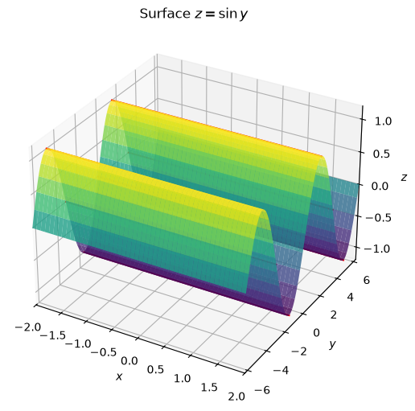
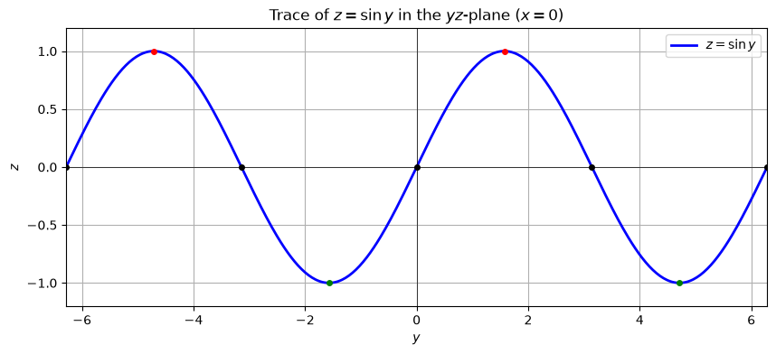
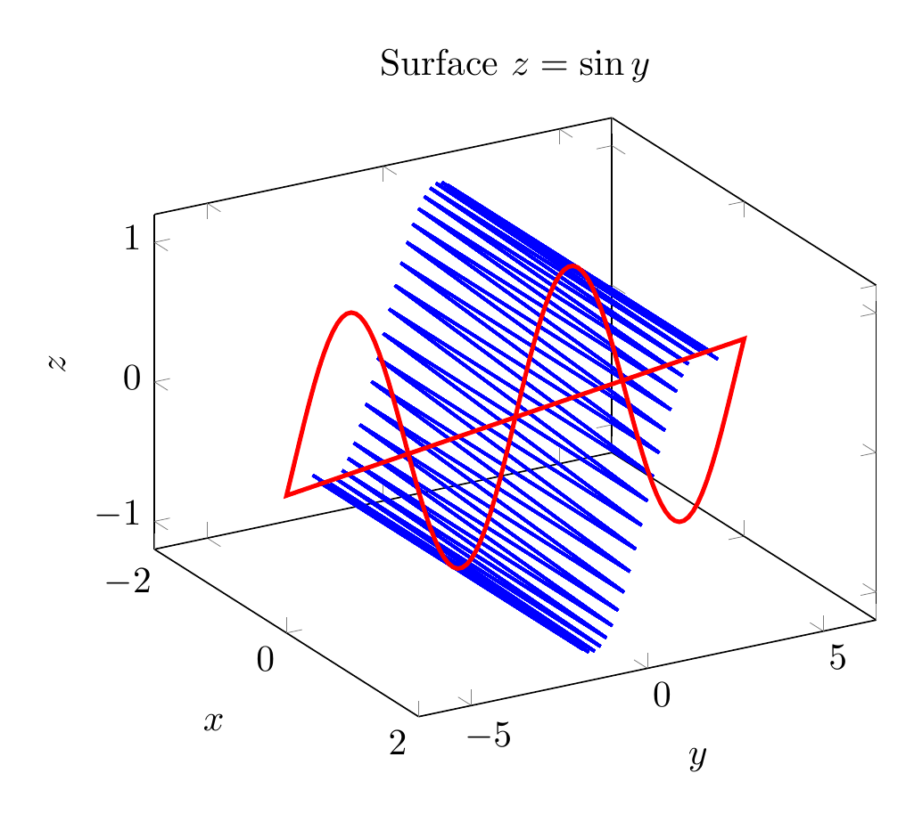
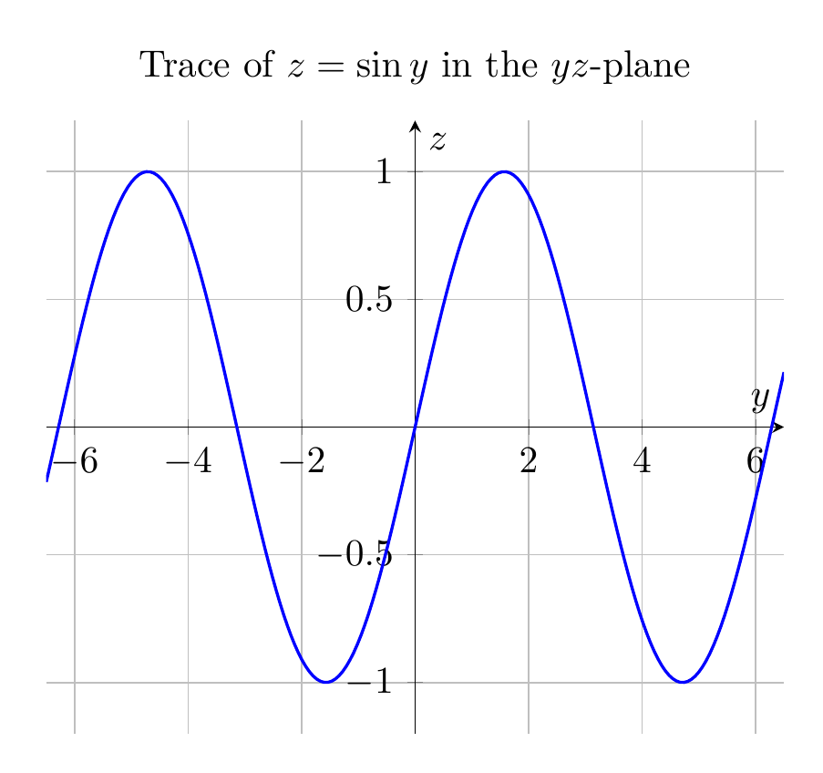

`[ Begin message. Type: AIMessage. ]`

# Solution: Describe and sketch the surface $z = \sin y$

## Step 1: Identify the type of surface
The equation

$$z = \sin y$$

does **not** contain the variable $x$. In three dimensions, when one variable is missing from an equation, the graph is a **cylinder** whose rulings (straight-line generators) are parallel to the axis of the missing variable. Here the missing variable is $x$, so the rulings are parallel to the $x$-axis.

## Step 2: Find the generating curve
The generating curve is the trace in the plane perpendicular to the rulings — in this case, the $yz$-plane (where $x=0$):

$$z = \sin y \quad \text{in the } yz\text{-plane}.$$

This is the familiar sine wave with:
- amplitude $1$,
- period $2\pi$,
- zeros at $y = k\pi$ for integers $k$,
- maxima $z=1$ at $y = \frac{\pi}{2} + 2k\pi$,
- minima $z=-1$ at $y = \frac{3\pi}{2} + 2k\pi$.

## Step 3: Form the surface
Take the sine curve in the $yz$-plane and translate it parallel to the $x$-axis through every value of $x$. The resulting surface is a **sinusoidal cylinder** (or a "sine-wave cylinder") extending infinitely in both the positive and negative $x$-directions.

Every horizontal cross-section perpendicular to the $x$-axis is the same sine curve $z=\sin y$, and every line on the surface parallel to the $x$-axis lies entirely on the surface.

## Summary

$$\boxed{\text{The surface } z=\sin y \text{ is a cylinder with rulings parallel to the } x\text{-axis, generated by the sine curve } z=\sin y \text{ in the } yz\text{-plane.}}$$


---


(Image `20260825_024202_000800_utc_0800_pyplot_0.png`. Alt text: pyplot-generated plot.)



(Image `20260825_024202_000800_utc_0800_pyplot_1.png`. Alt text: pyplot-generated plot.)




---

[PGFplots / tikz plot.](./20260825_024202_000800_utc_0800_pgfplots_0.tex)

```latex
\documentclass[border=10pt]{standalone}
\usepackage{pgfplots}
\pgfplotsset{compat=1.17}
\begin{document}
\begin{tikzpicture}
\begin{axis}[
    xlabel={$x$}, ylabel={$y$}, zlabel={$z$},
    title={Surface $z=\sin y$},
    view={60}{30},
    xmin=-2, xmax=2,
    ymin=-6.5, ymax=6.5,
    zmin=-1.2, zmax=1.2
]
\foreach \y in {-6.2832,-5.4978,-4.7124,-3.927,-3.1416,-2.3562,-1.5708,-0.7854,0,0.7854,1.5708,2.3562,3.1416,3.927,4.7124,5.4978,6.2832}{
    \addplot3[blue, thick, domain=-2:2] (x,\y,{sin(deg(\y))});
}
\addplot3[red, very thick, domain=-6.5:6.5, samples=100] (0,x,{sin(deg(x))});
\end{axis}
\end{tikzpicture}
\end{document}

```


(Image `20260825_024202_000800_utc_0800_pgfplots_0.png`. Alt text: PGFplots / tikz plot (converted to PNG).)




[PGFplots / tikz plot.](./20260825_024202_000800_utc_0800_pgfplots_1.tex)

```latex
\documentclass[border=10pt]{standalone}
\usepackage{pgfplots}
\pgfplotsset{compat=1.17}
\begin{document}
\begin{tikzpicture}
\begin{axis}[
    xlabel={$y$}, ylabel={$z$},
    title={Trace of $z=\sin y$ in the $yz$-plane},
    xmin=-6.5, xmax=6.5,
    ymin=-1.2, ymax=1.2,
    samples=200,
    grid=major,
    axis lines=middle
]
\addplot[blue, thick, domain=-6.5:6.5] {sin(deg(x))};
\end{axis}
\end{tikzpicture}
\end{document}

```


(Image `20260825_024202_000800_utc_0800_pgfplots_1.png`. Alt text: PGFplots / tikz plot (converted to PNG).)



`[ End message. Type: AIMessage. ]`