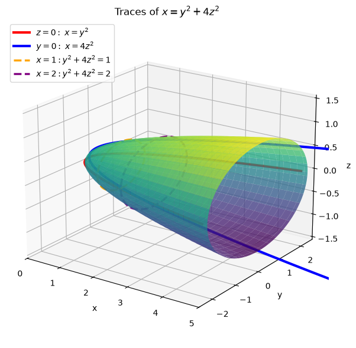
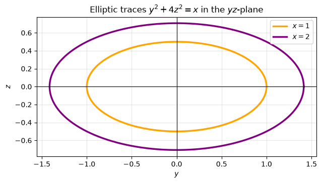
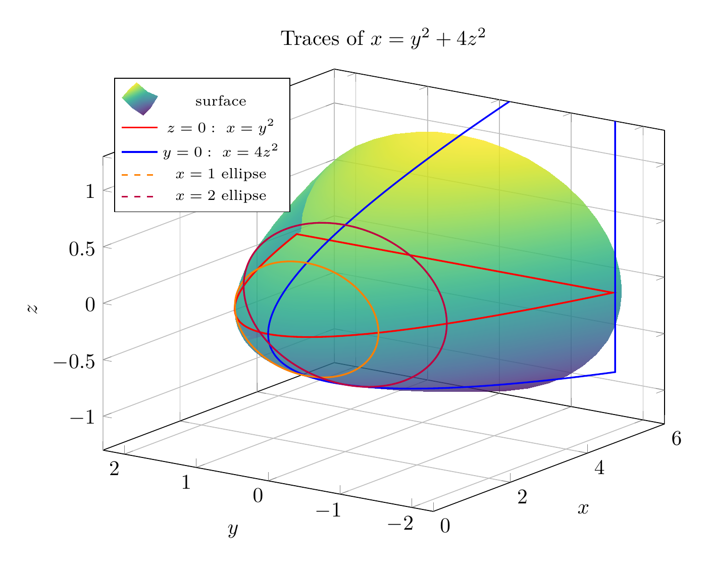
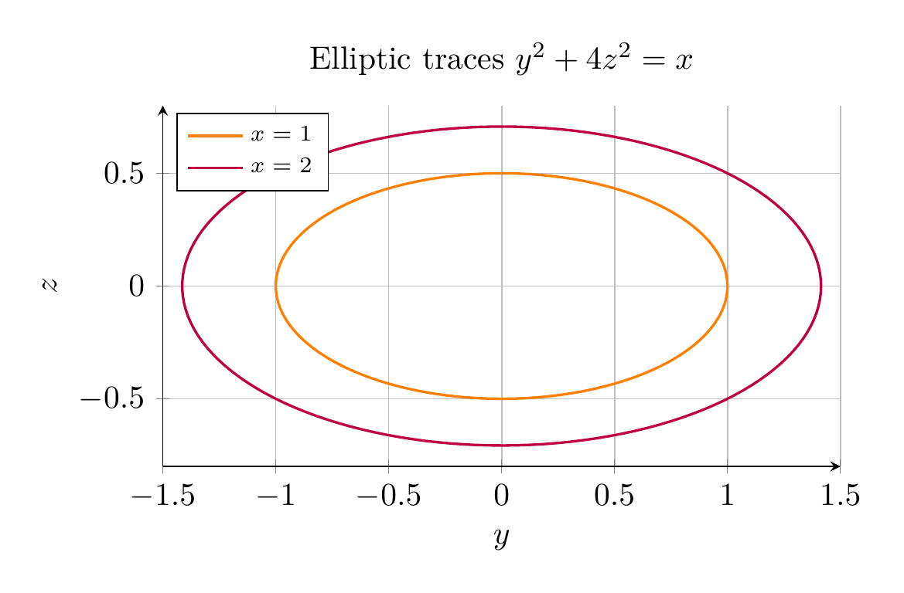

`[ Begin message. Type: AIMessage. ]`

To identify the surface, examine traces.

For a vertical slice perpendicular to the $x$-axis, set $x=k$:

\[
k=y^2+4z^2.
\]

If $k>0$, then

\[
\frac{y^2}{k}+\frac{z^2}{k/4}=1,
\]

so the trace is an ellipse with $y$-semiaxis $\sqrt{k}$ and $z$-semiaxis $\frac{\sqrt{k}}{2}$. If $k=0$, the trace is the single point $(0,0,0)$. If $k<0$, there is no real trace.

The coordinate-plane traces are:

\[
z=0:\quad x=y^2,
\]

a parabola opening in the positive $x$-direction, and

\[
y=0:\quad x=4z^2,
\]

also a parabola opening in the positive $x$-direction.

Thus the cross-sections are ellipses that grow as $x$ increases, and the surface has vertex at the origin and opens along the positive $x$-axis. Therefore the surface is an elliptic paraboloid.

\[
\boxed{\text{The surface }x=y^2+4z^2\text{ is an elliptic paraboloid opening in the positive }x\text{-direction.}}
\]

---


(Image `20260824_172932_819467_utc_0800_pyplot_0.png`. Alt text: pyplot-generated plot.)



(Image `20260824_172932_819467_utc_0800_pyplot_1.png`. Alt text: pyplot-generated plot.)




---

[PGFplots / tikz plot.](./20260824_172932_819467_utc_0800_pgfplots_0.tex)

```latex
\documentclass[border=10pt]{standalone}
\usepackage{pgfplots}
\pgfplotsset{compat=1.18}
\begin{document}
\begin{tikzpicture}
\begin{axis}[
  width=11cm, height=9cm,
  xlabel={$x$}, ylabel={$y$}, zlabel={$z$},
  view={-55}{20},
  xmin=0, xmax=6, ymin=-2.3, ymax=2.3, zmin=-1.3, zmax=1.3,
  grid=major,
  colormap/viridis,
  legend style={at={(0.02,0.98)}, anchor=north west, font=\scriptsize},
  title={Traces of $x=y^2+4z^2$},
]
\addplot3[
  surf,
  shader=interp,
  domain=0:5,
  y domain=0:360,
  samples=35,
  samples y=45,
  opacity=0.82,
] ({x},{sqrt(x)*cos(y)},{0.5*sqrt(x)*sin(y)});
\addlegendentry{surface}
\addplot3[red, thick, domain=-2.2:2.2, samples=120] ({x^2},{x},{0});
\addlegendentry{$z=0:\ x=y^2$}
\addplot3[blue, thick, domain=-1.5:1.5, samples=120] ({4*x^2},{0},{x});
\addlegendentry{$y=0:\ x=4z^2$}
\addplot3[orange, thick, dashed, domain=0:360, samples=150] ({1},{sqrt(1)*cos(x)},{0.5*sqrt(1)*sin(x)});
\addlegendentry{$x=1$ ellipse}
\addplot3[purple, thick, dashed, domain=0:360, samples=150] ({2},{sqrt(2)*cos(x)},{0.5*sqrt(2)*sin(x)});
\addlegendentry{$x=2$ ellipse}
\end{axis}
\end{tikzpicture}
\end{document}
```


(Image `20260824_172932_819467_utc_0800_pgfplots_0.png`. Alt text: PGFplots / tikz plot (converted to PNG).)




[PGFplots / tikz plot.](./20260824_172932_819467_utc_0800_pgfplots_1.tex)

```latex
\documentclass[border=10pt]{standalone}
\usepackage{pgfplots}
\pgfplotsset{compat=1.18}
\begin{document}
\begin{tikzpicture}
\begin{axis}[
  width=9cm, height=8cm,
  xlabel={$y$}, ylabel={$z$},
  xmin=-1.5, xmax=1.5, ymin=-0.8, ymax=0.8,
  grid=major,
  axis lines=left,
  axis equal image,
  legend style={at={(0.02,0.98)}, anchor=north west, font=\scriptsize},
  title={Elliptic traces $y^2+4z^2=x$},
]
\addplot[orange, thick, domain=0:360, samples=150] ({sqrt(1)*cos(x)},{0.5*sqrt(1)*sin(x)});
\addlegendentry{$x=1$}
\addplot[purple, thick, domain=0:360, samples=150] ({sqrt(2)*cos(x)},{0.5*sqrt(2)*sin(x)});
\addlegendentry{$x=2$}
\end{axis}
\end{tikzpicture}
\end{document}
```


(Image `20260824_172932_819467_utc_0800_pgfplots_1.png`. Alt text: PGFplots / tikz plot (converted to PNG).)



`[ End message. Type: AIMessage. ]`