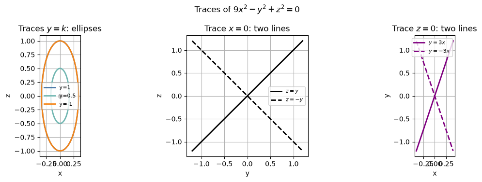
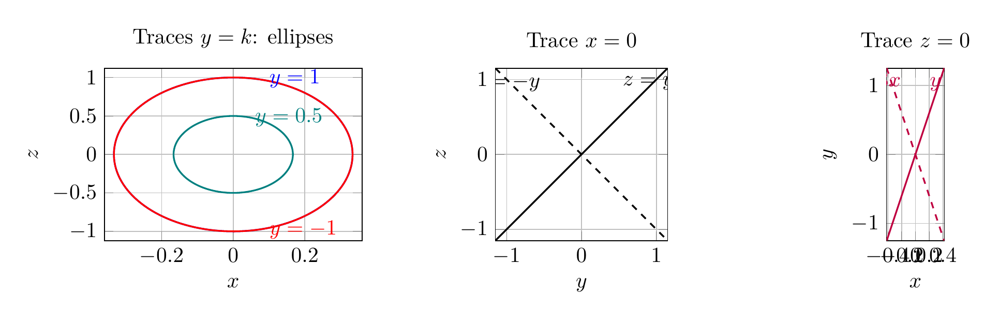

`[ Begin message. Type: HumanMessage. ]`

`[Begin Problem]`

Please solve the math problem in the image.


(Image `problem.png`. Alt text: Problem.)


`[End Problem]`

`[ End message. Type: HumanMessage. ]`

`[ Begin message. Type: AIMessage. ]`

`[Begin Answer]`

To identify the surface, rewrite the equation as

$$
9x^2-y^2+z^2=0 \quad\Longleftrightarrow\quad y^2=9x^2+z^2.
$$

Now examine traces:

1. **Planes \(y=k\):**

$$
9x^2+z^2=k^2.
$$

For \(k\neq 0\), these are ellipses in the \(xz\)-plane. The \(x\)-semi-axis is \(|k|/3\), and the \(z\)-semi-axis is \(|k|\). For \(k=0\), the ellipse shrinks to the origin.

2. **Plane \(x=0\):**

$$
-y^2+z^2=0 \quad\Longleftrightarrow\quad z=\pm y,
$$

so the trace is two intersecting lines.

3. **Plane \(z=0\):**

$$
9x^2-y^2=0 \quad\Longleftrightarrow\quad y=\pm 3x,
$$

so this trace is also two intersecting lines.

These traces show a cone with vertex at the origin, axis along the \(y\)-axis, and elliptical cross-sections perpendicular to that axis. Therefore, the surface is an **elliptic cone**.

$$
\boxed{\text{The surface }9x^2-y^2+z^2=0\text{ is an elliptic cone with axis along the }y\text{-axis.}}
$$

---


(Image `20260824_173335_571522_utc_0800_pyplot_0.png`. Alt text: pyplot-generated plot.)


(Image `20260824_173335_571522_utc_0800_pyplot_1.png`. Alt text: pyplot-generated plot.)




---

[PGFplots / tikz plot.](./20260824_173335_571522_utc_0800_pgfplots_0.tex)

```latex
\documentclass[border=10pt]{standalone}
\usepackage{pgfplots}
\pgfplotsset{compat=1.18}
\begin{document}
\begin{tikzpicture}
\begin{axis}[
    view={-60}{22},
    xlabel={$x$}, ylabel={$y$}, zlabel={$z$},
    xmin=-0.45, xmax=0.45,
    ymin=-1.2, ymax=1.2,
    zmin=-1.2, zmax=1.2,
    grid=major,
    width=11cm, height=9cm,
    title={$9x^2-y^2+z^2=0$: elliptic cone}
]
% Upper nappe mesh
\addplot3[
    mesh,
    samples=30,
    samples y=35,
    domain=0:1.2,
    y domain=0:360,
    draw=blue!45,
    thick
] ({(x/3)*cos(y)}, {x}, {x*sin(y)});
% Lower nappe mesh
\addplot3[
    mesh,
    samples=30,
    samples y=35,
    domain=0:1.2,
    y domain=0:360,
    draw=red!60,
    thick
] ({(x/3)*cos(y)}, {-x}, {x*sin(y)});
% y=1 and y=-1 ellipses
\addplot3[domain=0:360, samples=120, thick, color=teal, no markers] ({(1/3)*cos(x)}, {1}, {sin(x)});
\addplot3[domain=0:360, samples=120, thick, color=red, no markers] ({(1/3)*cos(x)}, {-1}, {sin(x)});
% Coordinate-plane traces
\addplot3[domain=-1.2:1.2, samples=80, thick, black, no markers] ({0}, {x}, {x});
\addplot3[domain=-1.2:1.2, samples=80, thick, purple, no markers] ({x/3}, {x}, {0});
\legend{upper nappe, lower nappe, $y=1$ ellipse, $y=-1$ ellipse, $x=0$, $z=0$}
\end{axis}
\end{tikzpicture}
\end{document}
```


(Image `20260824_173335_571522_utc_0800_pgfplots_0.png`. Alt text: PGFplots / tikz plot (converted to PNG).)


[PGFplots / tikz plot.](./20260824_173335_571522_utc_0800_pgfplots_1.tex)

```latex
\documentclass[border=10pt]{standalone}
\usepackage{pgfplots}
\pgfplotsset{compat=1.18}
\begin{document}
\begin{tikzpicture}
\begin{axis}[
    width=5.8cm, height=4.4cm,
    xlabel={$x$}, ylabel={$z$},
    xmin=-0.36, xmax=0.36, ymin=-1.12, ymax=1.12,
    grid=major,
    title={Traces $y=k$: ellipses}
]
\addplot[domain=0:360, samples=150, thick, blue, no markers] ({cos(x)/3}, {sin(x)});
\addplot[domain=0:360, samples=150, thick, teal, no markers] ({0.5*cos(x)/3}, {0.5*sin(x)});
\addplot[domain=0:360, samples=150, thick, red, no markers] ({cos(x)/3}, {-sin(x)});
\node[blue, anchor=west] at (axis cs:0.08,0.98) {$y=1$};
\node[teal, anchor=west] at (axis cs:0.04,0.48) {$y=0.5$};
\node[red, anchor=west] at (axis cs:0.08,-0.98) {$y=-1$};
\end{axis}

\begin{axis}[
    width=5.8cm, height=4.4cm,
    at={(6.4cm,0)},
    xlabel={$y$}, ylabel={$z$},
    xmin=-1.15, xmax=1.15, ymin=-1.15, ymax=1.15,
    grid=major, axis equal image,
    title={Trace $x=0$}
]
\addplot[domain=-1.15:1.15, samples=50, thick, black, no markers] (x, x);
\addplot[domain=-1.15:1.15, samples=50, thick, black, dashed, no markers] (x, -x);
\node[black, anchor=west] at (axis cs:0.45,0.95) {$z=y$};
\node[black, anchor=east] at (axis cs:-0.45,0.95) {$z=-y$};
\end{axis}

\begin{axis}[
    width=5.8cm, height=4.4cm,
    at={(12.8cm,0)},
    xlabel={$x$}, ylabel={$y$},
    xmin=-0.42, xmax=0.42, ymin=-1.25, ymax=1.25,
    grid=major, axis equal image,
    title={Trace $z=0$}
]
\addplot[domain=-0.42:0.42, samples=50, thick, purple, no markers] (x, 3*x);
\addplot[domain=-0.42:0.42, samples=50, thick, purple, dashed, no markers] (x, -3*x);
\node[purple, anchor=west] at (axis cs:0.10,1.05) {$y=3x$};
\node[purple, anchor=east] at (axis cs:-0.10,1.05) {$y=-3x$};
\end{axis}
\end{tikzpicture}
\end{document}
```


(Image `20260824_173335_571522_utc_0800_pgfplots_1.png`. Alt text: PGFplots / tikz plot (converted to PNG).)



`[End Answer]`

`[ End message. Type: AIMessage. ]`