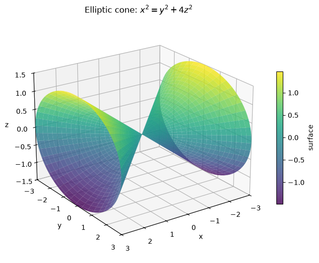
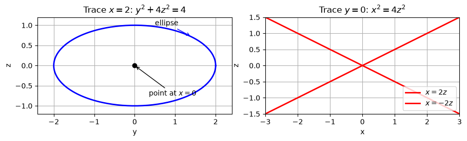
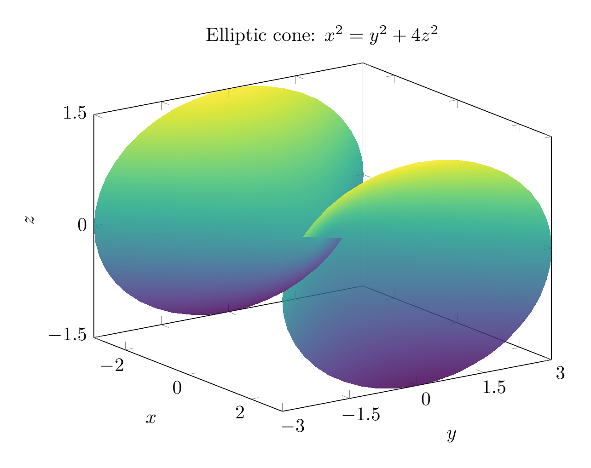
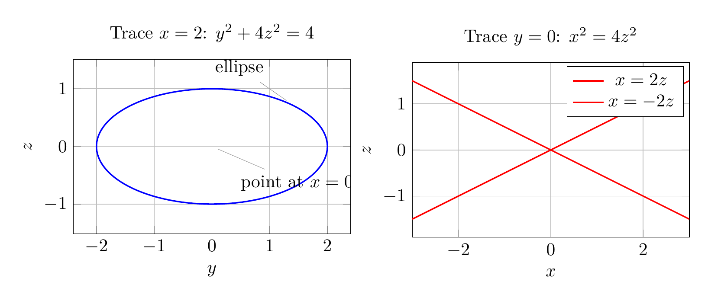

`[ Begin message. Type: HumanMessage. ]`

`[Begin Problem]`

Please solve the math problem in the image.


(Image `problem.png`. Alt text: Problem.)


`[End Problem]`

`[ End message. Type: HumanMessage. ]`

`[ Begin message. Type: AIMessage. ]`

`[Begin Answer]`

We identify the quadric surface by comparing its traces with the standard forms.

Given
\[
x^2=y^2+4z^2,
\]
move everything to one side:
\[
x^2-y^2-4z^2=0.
\]

### Traces

1. **Trace in planes \(x=c\):**
   \[
   c^2=y^2+4z^2.
   \]
   For \(c\neq 0\), this is an ellipse in the \(yz\)-plane. For \(c=0\), it degenerates to the single point \((0,0,0)\).

2. **Trace in planes \(y=c\):**
   \[
   x^2=c^2+4z^2,
   \]
   or
   \[
   x^2-4z^2=c^2.
   \]
   This is a hyperbola for \(c\neq 0\). When \(c=0\), it becomes the pair of lines
   \[
   x=\pm 2z.
   \]

3. **Trace in planes \(z=c\):**
   \[
   x^2=y^2+4c^2,
   \]
   or
   \[
   x^2-y^2=4c^2.
   \]
   This is also a hyperbola for \(c\neq 0\). When \(c=0\), it becomes the pair of lines
   \[
   x=\pm y.
   \]

Because the planes perpendicular to the \(x\)-axis give ellipses that shrink to a point at the origin, while the other coordinate-plane traces give hyperbolas or intersecting lines, the surface is an **elliptic cone** with axis along the \(x\)-axis.

A useful parametrization is
\[
x=u,\qquad y=u\cos\theta,\qquad z=\frac u2\sin\theta.
\]
Indeed,
\[
y^2+4z^2=u^2\cos^2\theta+4\left(\frac u2\sin\theta\right)^2
=u^2(\cos^2\theta+\sin^2\theta)=u^2=x^2.
\]

\[
\boxed{\text{The surface }x^2=y^2+4z^2\text{ is an elliptic cone opening along the }x\text{-axis.}}
\]

---


(Image `20260824_173538_251669_utc_0800_pyplot_0.png`. Alt text: pyplot-generated plot.)



(Image `20260824_173538_251669_utc_0800_pyplot_1.png`. Alt text: pyplot-generated plot.)




---

[PGFplots / tikz plot.](./20260824_173538_251669_utc_0800_pgfplots_0.tex)

```latex
\documentclass[border=10pt]{standalone}
\usepackage{pgfplots}
\pgfplotsset{compat=1.18}
\begin{document}
\begin{tikzpicture}
\begin{axis}[
    title={Elliptic cone: $x^2=y^2+4z^2$},
    xlabel={$x$}, ylabel={$y$}, zlabel={$z$},
    view={55}{22},
    domain=-3:3,
    y domain=0:2*pi,
    samples=45,
    samples y=45,
    colormap/viridis,
    width=10cm,
    height=8cm,
    zmin=-1.5, zmax=1.5,
    ytick={-3,-1.5,0,1.5,3},
    ztick={-1.5,0,1.5},
]
\addplot3[surf,shader=interp,opacity=0.85]
({x},{x*cos(deg(y))},{0.5*x*sin(deg(y))});
\end{axis}
\end{tikzpicture}
\end{document}
```


(Image `20260824_173538_251669_utc_0800_pgfplots_0.png`. Alt text: PGFplots / tikz plot (converted to PNG).)




[PGFplots / tikz plot.](./20260824_173538_251669_utc_0800_pgfplots_1.tex)

```latex
\documentclass[border=10pt]{standalone}
\usepackage{pgfplots}
\pgfplotsset{compat=1.18}
\begin{document}
\begin{tikzpicture}
\begin{axis}[
    title={Trace $x=2$: $y^2+4z^2=4$},
    xlabel={$y$}, ylabel={$z$},
    axis equal,
    grid=both,
    width=7cm,
    height=5cm,
    xmin=-2.4, xmax=2.4,
    ymin=-1.2, ymax=1.2,
]
\addplot[domain=0:360, samples=120, blue, thick]
({2*cos(x)}, {sin(x)});
\node[pin=above left:{ellipse}] at (axis cs:1.4,0.72) {};
\node[pin=below right:{point at $x=0$}] at (axis cs:0,0) {};
\end{axis}
\end{tikzpicture}

\begin{tikzpicture}
\begin{axis}[
    title={Trace $y=0$: $x^2=4z^2$},
    xlabel={$x$}, ylabel={$z$},
    axis equal,
    grid=both,
    width=7cm,
    height=5cm,
    xmin=-3, xmax=3,
    ymin=-1.5, ymax=1.5,
]
\addplot[domain=-3:3, red, thick] {0.5*x};
\addplot[domain=-3:3, red, thick] {-0.5*x};
\addlegendentry{$x=2z$};
\addlegendentry{$x=-2z$};
\end{axis}
\end{tikzpicture}
\end{document}
```


(Image `20260824_173538_251669_utc_0800_pgfplots_1.png`. Alt text: PGFplots / tikz plot (converted to PNG).)



`[End Answer]`

`[ End message. Type: AIMessage. ]`