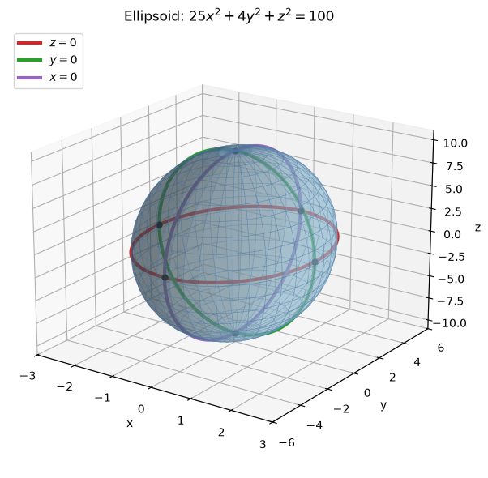
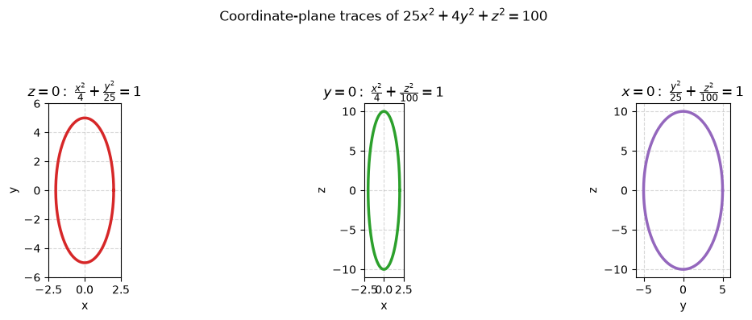
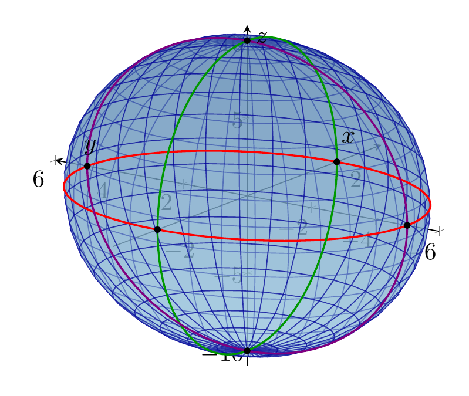
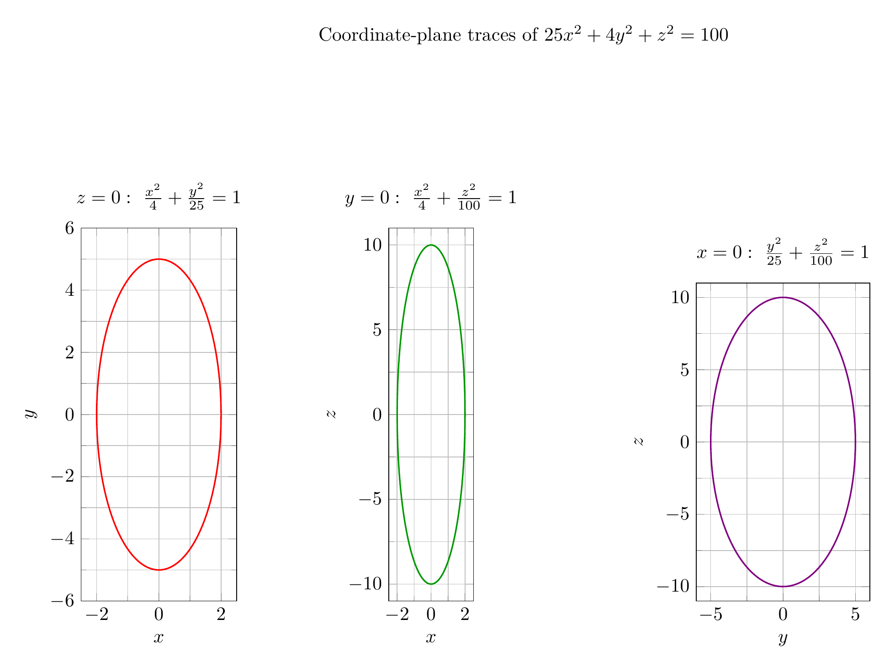

`[ Begin message. Type: HumanMessage. ]`

`[Begin Problem]`

Please solve the math problem in the image.


(Image `problem.png`. Alt text: Problem.)


`[End Problem]`

`[ End message. Type: HumanMessage. ]`

`[ Begin message. Type: AIMessage. ]`

`[Begin Answer]`

To identify the surface, put the equation in standard quadric-surface form by dividing by $100$:

$$
25x^2+4y^2+z^2=100
\quad\Longrightarrow\quad
\frac{x^2}{4}+\frac{y^2}{25}+\frac{z^2}{100}=1.
$$

This has the form

$$
\frac{x^2}{a^2}+\frac{y^2}{b^2}+\frac{z^2}{c^2}=1,
$$

so the surface is an ellipsoid centered at the origin with semi-axis lengths

$$
a=2,\qquad b=5,\qquad c=10.
$$

The coordinate-plane traces are ellipses:

- In the plane $z=0$:

$$
\frac{x^2}{4}+\frac{y^2}{25}=1,
$$

an ellipse with $x$-intercepts $\pm 2$ and $y$-intercepts $\pm 5$.

- In the plane $y=0$:

$$
\frac{x^2}{4}+\frac{z^2}{100}=1,
$$

an ellipse with $x$-intercepts $\pm 2$ and $z$-intercepts $\pm 10$.

- In the plane $x=0$:

$$
\frac{y^2}{25}+\frac{z^2}{100}=1,
$$

an ellipse with $y$-intercepts $\pm 5$ and $z$-intercepts $\pm 10$.

Thus the surface is an ellipsoid stretched most in the $z$-direction, less in the $y$-direction, and least in the $x$-direction.

$$
\boxed{\text{The surface is an ellipsoid centered at the origin with semi-axes }2,5,10.}
$$

---


(Image `20260824_173745_594679_utc_0800_pyplot_0.png`. Alt text: pyplot-generated plot.)



(Image `20260824_173745_594679_utc_0800_pyplot_1.png`. Alt text: pyplot-generated plot.)




---

[PGFplots / tikz plot.](./20260824_173745_594679_utc_0800_pgfplots_0.tex)

```latex
\documentclass[border=10pt]{standalone}
\usepackage{pgfplots}
\pgfplotsset{compat=1.18}
\begin{document}
\begin{tikzpicture}
\begin{axis}[
  view={-55}{20},
  width=11cm, height=9cm,
  xlabel={$x$}, ylabel={$y$}, zlabel={$z$},
  xmin=-3, xmax=3, ymin=-6, ymax=6, zmin=-11, zmax=11,
  grid=none,
  axis lines=center,
  colormap={ellipsoidblue}{rgb255(0cm)=(157,202,225); rgb255(1cm)=(76,120,168)},
]
\addplot3[
  surf,
  domain=0:360,
  y domain=0:180,
  samples=35,
  samples y=20,
  shader=flat,
  opacity=0.55,
  draw=blue!60!black
]
({2*sin(y)*cos(x)}, {5*sin(y)*sin(x)}, {10*cos(y)});

\addplot3[domain=0:360, samples=120, red, thick]
({2*cos(x)}, {5*sin(x)}, 0);

\addplot3[domain=0:360, samples=120, green!60!black, thick]
({2*cos(x)}, 0, {10*sin(x)});

\addplot3[domain=0:360, samples=120, violet, thick]
(0, {5*cos(x)}, {10*sin(x)});

\addplot3[only marks, mark=*, mark size=1.2pt, black]
coordinates {(2,0,0) (-2,0,0) (0,5,0) (0,-5,0) (0,0,10) (0,0,-10)};
\end{axis}
\end{tikzpicture}
\end{document}
```


(Image `20260824_173745_594679_utc_0800_pgfplots_0.png`. Alt text: PGFplots / tikz plot (converted to PNG).)




[PGFplots / tikz plot.](./20260824_173745_594679_utc_0800_pgfplots_1.tex)

```latex
\documentclass[border=10pt]{standalone}
\usepackage{pgfplots}
\pgfplotsset{compat=1.18}
\begin{document}
\begin{tikzpicture}
\node[anchor=south] at (8.2cm,10.2cm) {Coordinate-plane traces of $25x^2+4y^2+z^2=100$};

\begin{axis}[
  at={(0,0)},
  anchor=south west,
  width=4.8cm, height=8.5cm,
  xlabel={$x$}, ylabel={$y$},
  xmin=-2.5, xmax=2.5, ymin=-6, ymax=6,
  grid=both,
  minor tick num=1,
  title={$z=0:\ \frac{x^2}{4}+\frac{y^2}{25}=1$},
  axis equal image=true,
]
\addplot[domain=0:360, samples=120, red, thick] ({2*cos(x)}, {5*sin(x)});
\end{axis}

\begin{axis}[
  at={(5.7cm,0)},
  anchor=south west,
  width=4.8cm, height=8.5cm,
  xlabel={$x$}, ylabel={$z$},
  xmin=-2.5, xmax=2.5, ymin=-11, ymax=11,
  grid=both,
  minor tick num=1,
  title={$y=0:\ \frac{x^2}{4}+\frac{z^2}{100}=1$},
  axis equal image=true,
]
\addplot[domain=0:360, samples=120, green!60!black, thick] ({2*cos(x)}, {10*sin(x)});
\end{axis}

\begin{axis}[
  at={(11.4cm,0)},
  anchor=south west,
  width=4.8cm, height=8.5cm,
  xlabel={$y$}, ylabel={$z$},
  xmin=-6, xmax=6, ymin=-11, ymax=11,
  grid=both,
  minor tick num=1,
  title={$x=0:\ \frac{y^2}{25}+\frac{z^2}{100}=1$},
  axis equal image=true,
]
\addplot[domain=0:360, samples=120, violet, thick] ({5*cos(x)}, {10*sin(x)});
\end{axis}
\end{tikzpicture}
\end{document}
```


(Image `20260824_173745_594679_utc_0800_pgfplots_1.png`. Alt text: PGFplots / tikz plot (converted to PNG).)



`[End Answer]`

`[ End message. Type: AIMessage. ]`