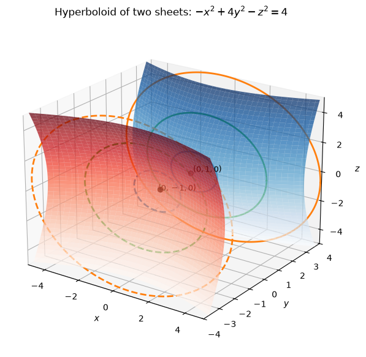
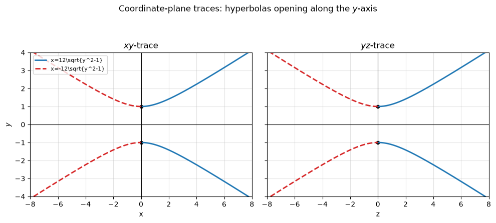
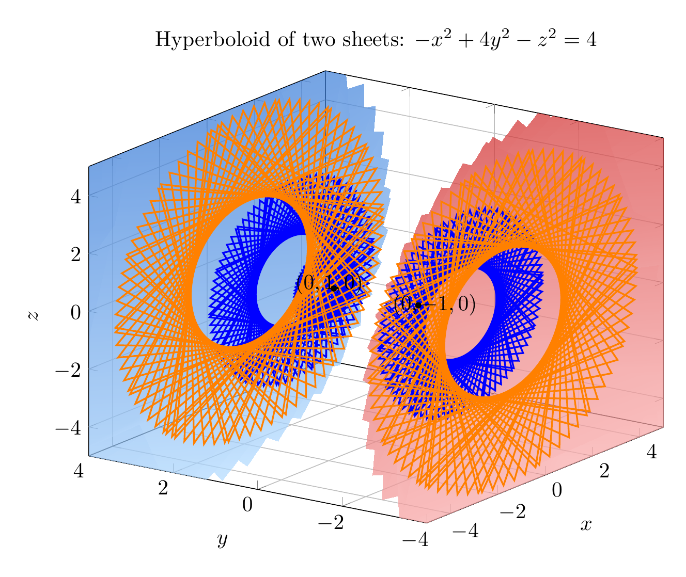
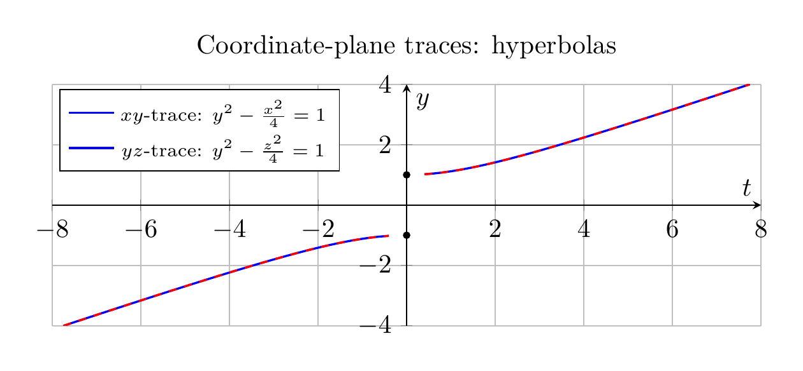

`[ Begin message. Type: HumanMessage. ]`

`[Begin Problem]`

Please solve the math problem in the image.


(Image `problem.png`. Alt text: Problem.)


`[End Problem]`

`[ End message. Type: HumanMessage. ]`

`[ Begin message. Type: AIMessage. ]`

`[Begin Answer]`

Start by putting the equation in standard quadric-surface form:

\[
-x^2+4y^2-z^2=4
\]

Divide by \(4\):

\[
y^2-\frac{x^2}{4}-\frac{z^2}{4}=1.
\]

This has one positive squared term and two negative squared terms, so it is a hyperboloid of two sheets. The positive variable is \(y\), so the sheets open along the \(y\)-axis.

Using traces:

- Horizontal traces \(y=k\):

\[
x^2+z^2=4(k^2-1).
\]

For \(|k|>1\), these are circles. At \(k=\pm 1\), the trace is a single point, \((0,\pm1,0)\). For \(|k|<1\), there is no real trace.

- The \(xy\)-trace, \(z=0\):

\[
y^2-\frac{x^2}{4}=1,
\]

a hyperbola opening along the \(y\)-axis.

- The \(yz\)-trace, \(x=0\):

\[
y^2-\frac{z^2}{4}=1,
\]

also a hyperbola opening along the \(y\)-axis.

Therefore, the surface is a hyperboloid of two sheets with vertices at \((0,1,0)\) and \((0,-1,0)\), opening in the \(+\!y\) and \(-\!y\) directions.

\[
\boxed{\text{Hyperboloid of two sheets, axis along the }y\text{-axis}}
\]

---


(Image `20260824_174041_914022_utc_0800_pyplot_0.png`. Alt text: pyplot-generated plot.)



(Image `20260824_174041_914022_utc_0800_pyplot_1.png`. Alt text: pyplot-generated plot.)




---

[PGFplots / tikz plot.](./20260824_174041_914022_utc_0800_pgfplots_0.tex)

```latex
\documentclass[border=10pt]{standalone}
\usepackage{pgfplots}
\pgfplotsset{compat=1.18}
\begin{document}
\begin{tikzpicture}
\begin{axis}[
    view={-55}{22},
    width=11cm,
    height=9cm,
    xlabel={$x$},
    ylabel={$y$},
    zlabel={$z$},
    title={Hyperboloid of two sheets: $-x^2+4y^2-z^2=4$},
    xmin=-5, xmax=5,
    ymin=-4, ymax=4,
    zmin=-5, zmax=5,
    grid=major,
]
\addplot3[
    surf,
    shader=interp,
    opacity=0.72,
    domain=1:4,
    y domain=0:360,
    samples=25,
    samples y=45,
    colormap={upper}{rgb255=(180,220,255); rgb255=(40,110,210)},
]
({2*sqrt(x^2-1)*cos(deg(y))}, {x}, {2*sqrt(x^2-1)*sin(deg(y))});
\addplot3[
    surf,
    shader=interp,
    opacity=0.72,
    domain=-4:-1,
    y domain=0:360,
    samples=25,
    samples y=45,
    colormap={lower}{rgb255=(255,190,190); rgb255=(210,50,50)},
]
({2*sqrt(x^2-1)*cos(deg(y))}, {x}, {2*sqrt(x^2-1)*sin(deg(y))});
\addplot3+[domain=0:360, samples=90, thick, blue, no markers]
({2*sqrt(1.2^2-1)*cos(deg(x))}, {1.2}, {2*sqrt(1.2^2-1)*sin(deg(x))});
\addplot3+[domain=0:360, samples=90, thick, blue, dashed, no markers]
({2*sqrt(2^2-1)*cos(deg(x))}, {2}, {2*sqrt(2^2-1)*sin(deg(x))});
\addplot3+[domain=0:360, samples=90, thick, orange, dashed, no markers]
({2*sqrt(3^2-1)*cos(deg(x))}, {3}, {2*sqrt(3^2-1)*sin(deg(x))});
\addplot3+[domain=0:360, samples=90, thick, blue, dashed, no markers]
({2*sqrt(2^2-1)*cos(deg(x))}, {-2}, {2*sqrt(2^2-1)*sin(deg(x))});
\addplot3+[domain=0:360, samples=90, thick, orange, dashed, no markers]
({2*sqrt(3^2-1)*cos(deg(x))}, {-3}, {2*sqrt(3^2-1)*sin(deg(x))});
\addplot3[only marks, mark=*, mark size=1.3pt, black] coordinates {(0,1,0) (0,-1,0)};
\node at (axis cs:0.25,1.25,0) {$(0,1,0)$};
\node at (axis cs:0.25,-1.25,0) {$(0,-1,0)$};
\end{axis}
\end{tikzpicture}
\end{document}
```


(Image `20260824_174041_914022_utc_0800_pgfplots_0.png`. Alt text: PGFplots / tikz plot (converted to PNG).)




[PGFplots / tikz plot.](./20260824_174041_914022_utc_0800_pgfplots_1.tex)

```latex
\documentclass[border=10pt]{standalone}
\usepackage{pgfplots}
\pgfplotsset{compat=1.18}
\begin{document}
\begin{tikzpicture}
\begin{axis}[
    width=11cm,
    height=4.8cm,
    xlabel={$t$},
    ylabel={$y$},
    title={Coordinate-plane traces: hyperbolas},
    xmin=-8, xmax=8,
    ymin=-4, ymax=4,
    axis lines=middle,
    grid=major,
    legend style={at={(0.01,0.98)}, anchor=north west, font=\scriptsize},
]
\addplot[domain=-4:-1.02, samples=120, thick, blue] ({-2*sqrt(x^2-1)}, {x});
\addplot[domain=1.02:4, samples=120, thick, blue] ({2*sqrt(x^2-1)}, {x});
\addlegendentry{$xy$-trace: $y^2-\frac{x^2}{4}=1$}
\addplot[domain=-4:-1.02, samples=120, thick, red, dashed] ({-2*sqrt(x^2-1)}, {x});
\addplot[domain=1.02:4, samples=120, thick, red, dashed] ({2*sqrt(x^2-1)}, {x});
\addlegendentry{$yz$-trace: $y^2-\frac{z^2}{4}=1$}
\addplot[only marks, mark=*, mark size=1.2pt, black] coordinates {(0,1) (0,-1)};
\end{axis}
\end{tikzpicture}
\end{document}
```


(Image `20260824_174041_914022_utc_0800_pgfplots_1.png`. Alt text: PGFplots / tikz plot (converted to PNG).)



`[End Answer]`

`[ End message. Type: AIMessage. ]`