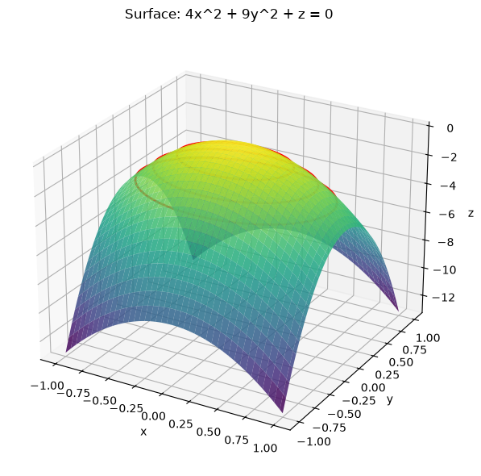
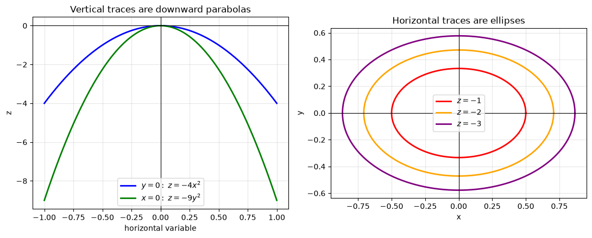
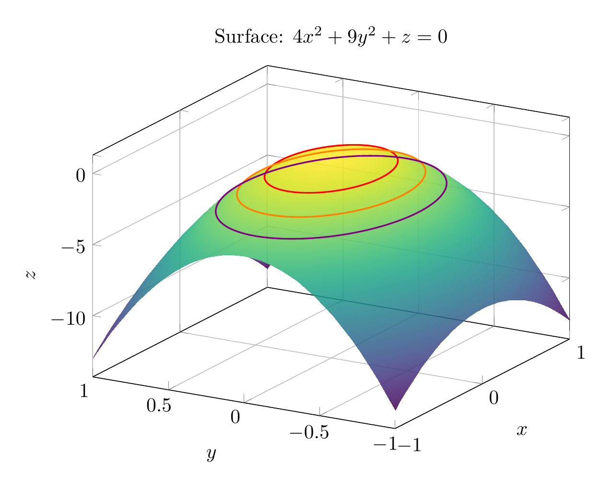
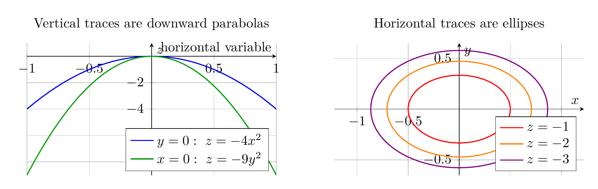

`[ Begin message. Type: AIMessage. ]`

Rewrite the equation by solving for \(z\):

\[
4x^2+9y^2+z=0 \quad\Longrightarrow\quad z=-4x^2-9y^2.
\]

Now use traces.

Horizontal traces \(z=c\):

\[
4x^2+9y^2=-c.
\]

For \(c<0\), this is an ellipse centered at the origin:

\[
\frac{x^2}{(-c)/4}+\frac{y^2}{(-c)/9}=1,
\]

with \(x\)-semiaxis \(\sqrt{-c}/2\) and \(y\)-semiaxis \(\sqrt{-c}/3\). For \(c=0\), the trace is the single point \((0,0,0)\), and for \(c>0\), there is no real trace.

Vertical traces:

\[
y=0 \implies z=-4x^2,
\]

\[
x=0 \implies z=-9y^2.
\]

Both are downward-opening parabolas. Thus the surface has vertex at the origin, opens downward along the \(z\)-axis, and has elliptical horizontal cross-sections.

\[
\boxed{\text{The surface is an elliptic paraboloid opening downward along the }z\text{-axis, with vertex }(0,0,0).}
\]

---


(Image `20260824_174740_215749_utc_0800_pyplot_0.png`. Alt text: pyplot-generated plot.)



(Image `20260824_174740_215749_utc_0800_pyplot_1.png`. Alt text: pyplot-generated plot.)




---

[PGFplots / tikz plot.](./20260824_174740_215749_utc_0800_pgfplots_0.tex)

```latex
\documentclass[border=10pt]{standalone}
\usepackage{pgfplots}
\pgfplotsset{compat=1.18}
\begin{document}
\begin{tikzpicture}
\begin{axis}[
  width=10cm, height=8cm,
  xlabel=$x$, ylabel=$y$, zlabel=$z$,
  title={Surface: $4x^2+9y^2+z=0$},
  view={-60}{25},
  domain=-1:1,
  y domain=-1:1,
  samples=35,
  samples y=35,
  colormap/viridis,
  grid=major
]
\addplot3[surf, shader=interp, opacity=0.85] {-4*x^2-9*y^2};
\addplot3+[domain=0:2*pi, samples=120, no marks, thick, red]
  ({sqrt(1/4)*cos(deg(x))},{sqrt(1/9)*sin(deg(x))},{-1});
\addplot3+[domain=0:2*pi, samples=120, no marks, thick, orange]
  ({sqrt(2/4)*cos(deg(x))},{sqrt(2/9)*sin(deg(x))},{-2});
\addplot3+[domain=0:2*pi, samples=120, no marks, thick, violet]
  ({sqrt(3/4)*cos(deg(x))},{sqrt(3/9)*sin(deg(x))},{-3});
\end{axis}
\end{tikzpicture}
\end{document}
```


(Image `20260824_174740_215749_utc_0800_pgfplots_0.png`. Alt text: PGFplots / tikz plot (converted to PNG).)




[PGFplots / tikz plot.](./20260824_174740_215749_utc_0800_pgfplots_1.tex)

```latex
\documentclass[border=10pt]{standalone}
\usepackage{pgfplots}
\usepgfplotslibrary{groupplots}
\pgfplotsset{compat=1.18}
\begin{document}
\begin{tikzpicture}
\begin{groupplot}[
  group style={group size=2 by 1, horizontal sep=1.5cm},
  width=8cm, height=5cm,
  axis lines=middle,
  grid=major,
  enlargelimits=false
]
\nextgroupplot[
  xlabel={horizontal variable},
  ylabel={$z$},
  title={Vertical traces are downward parabolas},
  legend pos=south east,
  xmin=-1, xmax=1,
  ymin=-9, ymax=1
]
\addplot[blue, thick, domain=-1:1, samples=100] {-4*x^2};
\addlegendentry{$y=0:\ z=-4x^2$}
\addplot[green!60!black, thick, domain=-1:1, samples=100] {-9*x^2};
\addlegendentry{$x=0:\ z=-9y^2$}

\nextgroupplot[
  xlabel={$x$},
  ylabel={$y$},
  title={Horizontal traces are ellipses},
  axis equal,
  xmin=-0.9, xmax=0.9,
  ymin=-0.65, ymax=0.65,
  legend pos=south east
]
\addplot[red, thick, domain=0:360, samples=120] ({sqrt(1/4)*cos(x)},{sqrt(1/9)*sin(x)});
\addlegendentry{$z=-1$}
\addplot[orange, thick, domain=0:360, samples=120] ({sqrt(2/4)*cos(x)},{sqrt(2/9)*sin(x)});
\addlegendentry{$z=-2$}
\addplot[violet, thick, domain=0:360, samples=120] ({sqrt(3/4)*cos(x)},{sqrt(3/9)*sin(x)});
\addlegendentry{$z=-3$}
\end{groupplot}
\end{tikzpicture}
\end{document}
```


(Image `20260824_174740_215749_utc_0800_pgfplots_1.png`. Alt text: PGFplots / tikz plot (converted to PNG).)



`[ End message. Type: AIMessage. ]`