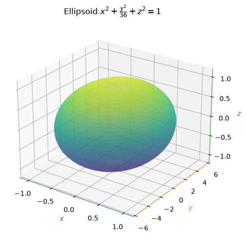
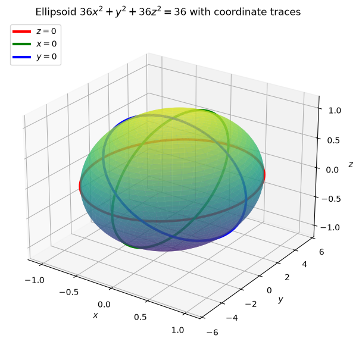
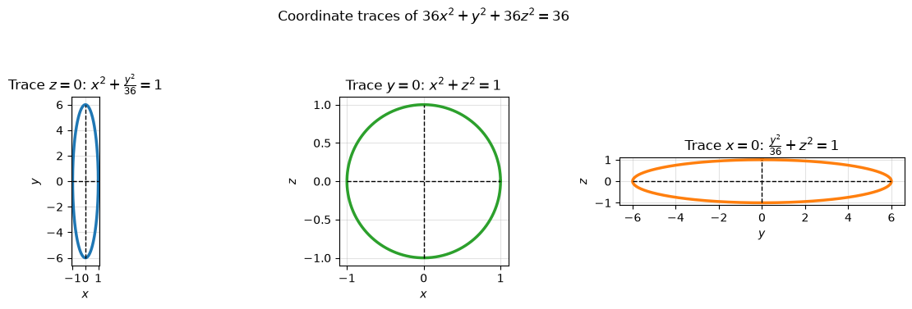
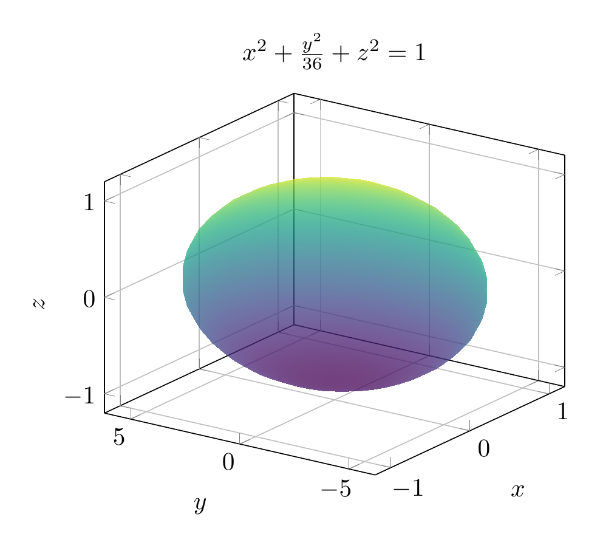
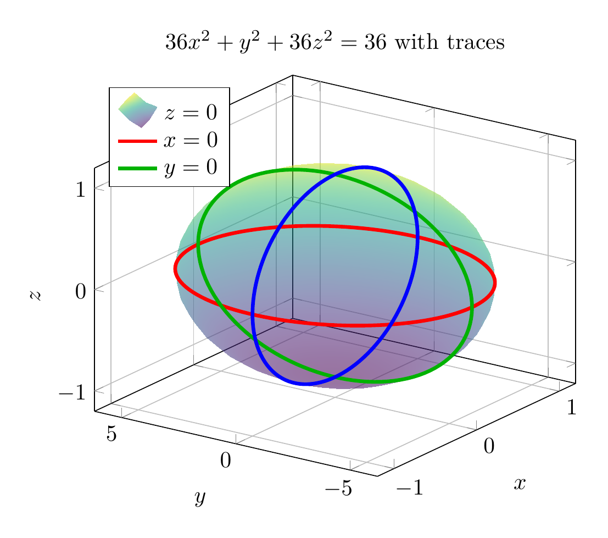
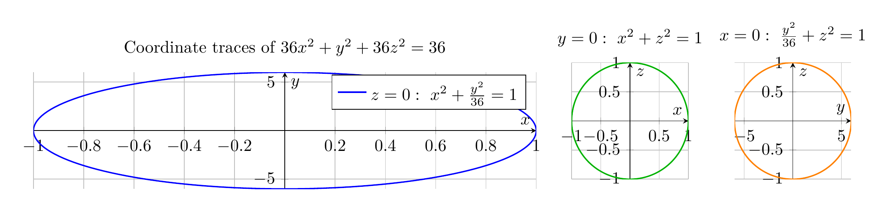

Divide the equation by 36:

$$
36x^2+y^2+36z^2=36
\quad\Longrightarrow\quad
x^2+\frac{y^2}{36}+z^2=1.
$$

This has the standard ellipsoid form

$$
\frac{x^2}{a^2}+\frac{y^2}{b^2}+\frac{z^2}{c^2}=1,
$$

with

$$
a=1,\qquad b=6,\qquad c=1.
$$

So the surface is an ellipsoid centered at the origin, stretched along the $y$-axis.

Useful traces:

- In the $xy$-plane, $z=0$:

$$
x^2+\frac{y^2}{36}=1,
$$

an ellipse with $x$-intercepts $\pm 1$ and $y$-intercepts $\pm 6$.

- In the $xz$-plane, $y=0$:

$$
x^2+z^2=1,
$$

a circle of radius $1$.

- In the $yz$-plane, $x=0$:

$$
\frac{y^2}{36}+z^2=1,
$$

an ellipse with $y$-intercepts $\pm 6$ and $z$-intercepts $\pm 1$.

The coordinate-axis intercepts are

$$
(\pm 1,0,0),\qquad (0,\pm 6,0),\qquad (0,0,\pm 1).
$$

Therefore the surface is a prolate ellipsoid/spheroid centered at the origin and elongated in the $y$-direction.

$$
\boxed{\text{The surface }36x^2+y^2+36z^2=36\text{ is an ellipsoid }x^2+\frac{y^2}{36}+z^2=1.}
$$

---







---

[PGFplots / tikz plot.](./20260824_174924_566685_utc_0800_pgfplots_0.tex)

```latex
\documentclass[border=10pt]{standalone}
\usepackage{pgfplots}
\pgfplotsset{compat=1.18}
\begin{document}
\begin{tikzpicture}
\begin{axis}[
    width=8cm,
    view={-55}{25},
    xlabel={$x$},
    ylabel={$y$},
    zlabel={$z$},
    title={$x^2+\frac{y^2}{36}+z^2=1$},
    xmin=-1.2, xmax=1.2,
    ymin=-6.2, ymax=6.2,
    zmin=-1.2, zmax=1.2,
    grid=major
]
\addplot3[
    surf,
    shader=interp,
    opacity=0.75,
    colormap/viridis,
    domain=0:360,
    y domain=0:180,
    samples=35,
    samples y=20
]
({cos(x)*sin(y)}, {6*sin(x)*sin(y)}, {cos(y)});
\end{axis}
\end{tikzpicture}
\end{document}
```



[PGFplots / tikz plot.](./20260824_174924_566685_utc_0800_pgfplots_1.tex)

```latex
\documentclass[border=10pt]{standalone}
\usepackage{pgfplots}
\pgfplotsset{compat=1.18}
\begin{document}
\begin{tikzpicture}
\begin{axis}[
    width=9cm,
    view={-55}{25},
    xlabel={$x$},
    ylabel={$y$},
    zlabel={$z$},
    title={$36x^2+y^2+36z^2=36$ with traces},
    xmin=-1.2, xmax=1.2,
    ymin=-6.2, ymax=6.2,
    zmin=-1.2, zmax=1.2,
    grid=major,
    legend style={at={(0.03,0.97)}, anchor=north west}
]
\addplot3[
    surf,
    shader=interp,
    opacity=0.55,
    colormap/viridis,
    domain=0:360,
    y domain=0:180,
    samples=35,
    samples y=20
]
({cos(x)*sin(y)}, {6*sin(x)*sin(y)}, {cos(y)});
\addplot3[domain=0:360, samples=120, red, ultra thick]
({cos(x)}, {6*sin(x)}, {0});
\addlegendentry{$z=0$}
\addplot3[domain=0:360, samples=120, green!70!black, ultra thick]
({0}, {6*sin(x)}, {cos(x)});
\addlegendentry{$x=0$}
\addplot3[domain=0:360, samples=120, blue, ultra thick]
({cos(x)}, {0}, {sin(x)});
\addlegendentry{$y=0$}
\end{axis}
\end{tikzpicture}
\end{document}
```



[PGFplots / tikz plot.](./20260824_174924_566685_utc_0800_pgfplots_2.tex)

```latex
\documentclass[border=10pt]{standalone}
\usepackage{pgfplots}
\pgfplotsset{compat=1.18}
\begin{document}
\begin{tikzpicture}
\begin{axis}[
    width=12cm,
    height=4cm,
    title={Coordinate traces of $36x^2+y^2+36z^2=36$},
    grid=major,
    axis lines=middle,
    xlabel={$x$},
    ylabel={$y$}
]
\addplot[domain=0:360, samples=160, blue, thick] ({cos(x)}, {6*sin(x)});
\addlegendentry{$z=0:\ x^2+\frac{y^2}{36}=1$}
\end{axis}
\end{tikzpicture}

\begin{tikzpicture}
\begin{axis}[
    width=4cm,
    height=4cm,
    title={$y=0:\ x^2+z^2=1$},
    grid=major,
    axis lines=middle,
    xlabel={$x$},
    ylabel={$z$}
]
\addplot[domain=0:360, samples=160, green!70!black, thick] ({cos(x)}, {sin(x)});
\end{axis}
\end{tikzpicture}

\begin{tikzpicture}
\begin{axis}[
    width=4cm,
    height=4cm,
    title={$x=0:\ \frac{y^2}{36}+z^2=1$},
    grid=major,
    axis lines=middle,
    xlabel={$y$},
    ylabel={$z$}
]
\addplot[domain=0:360, samples=160, orange, thick] ({6*sin(x)}, {cos(x)});
\end{axis}
\end{tikzpicture}
\end{document}
```

