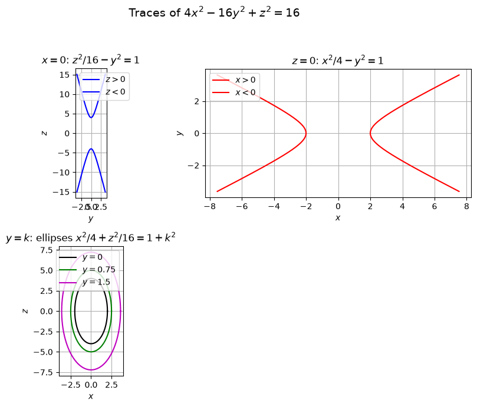
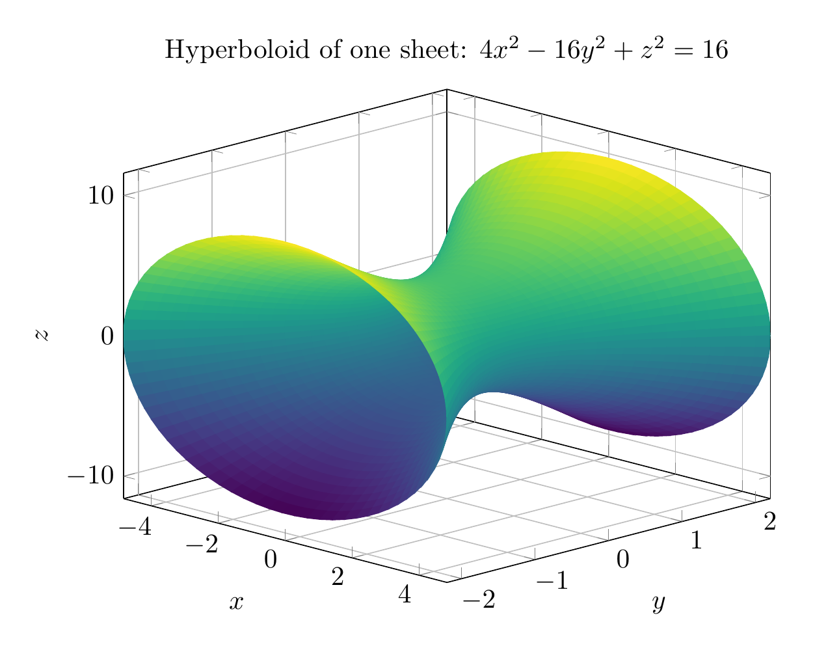
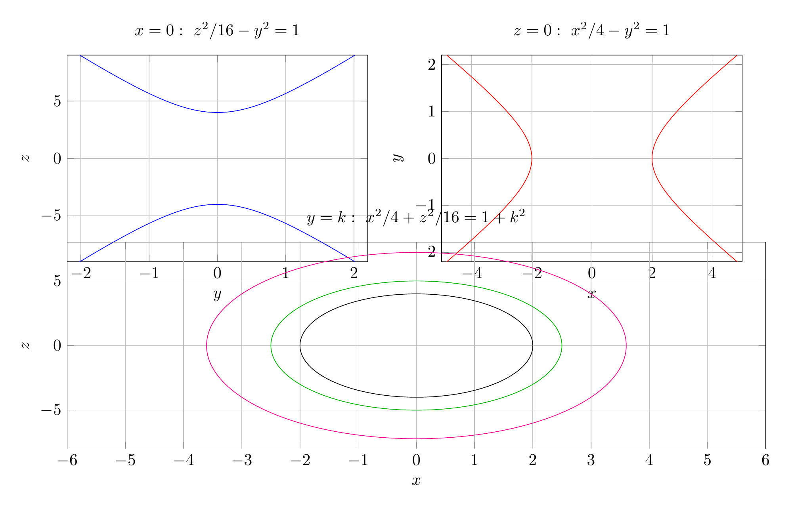

Divide the equation by $16$:

$$
\frac{x^2}{4}-y^2+\frac{z^2}{16}=1.
$$

Use coordinate-plane and parallel traces.

For $y=k$:

$$
\frac{x^2}{4}+\frac{z^2}{16}=1+k^2,
$$

so each horizontal trace parallel to the $xz$-plane is an ellipse. At $k=0$,

$$
\frac{x^2}{4}+\frac{z^2}{16}=1,
$$

with $x$-semi-axis $2$ and $z$-semi-axis $4$. As $|k|$ increases, the ellipses get larger.

For $x=0$:

$$
\frac{z^2}{16}-y^2=1,
$$

a hyperbola opening in the $\pm z$ directions.

For $z=0$:

$$
\frac{x^2}{4}-y^2=1,
$$

a hyperbola opening in the $\pm x$ directions.

Thus the surface is connected, has elliptical cross-sections in planes $y=k$, and hyperbolic traces in the $xy$- and $yz$-planes. Therefore it is a hyperboloid of one sheet with axis along the $y$-axis.

A useful parametrization is

$$
x=2\sqrt{1+y^2}\cos\theta,\qquad
z=4\sqrt{1+y^2}\sin\theta.
$$

$$
\boxed{\text{The surface }4x^2-16y^2+z^2=16\text{ is a hyperboloid of one sheet, with axis along the }y\text{-axis.}}
$$

---




---

[PGFplots / tikz plot.](./20260824_175034_296299_utc_0800_pgfplots_0.tex)

```latex
\documentclass[border=10pt]{standalone}
\usepackage{pgfplots}
\pgfplotsset{compat=1.18}
\begin{document}
\begin{tikzpicture}
\begin{axis}[
    view={45}{20},
    xlabel={$x$}, ylabel={$y$}, zlabel={$z$},
    title={Hyperboloid of one sheet: $4x^2-16y^2+z^2=16$},
    grid=major,
    width=10cm, height=8cm,
    domain=0:2*pi, samples=80,
    y domain=-2.2:2.2, samples y=40,
    colormap/viridis
]
\addplot3[surf, shader=flat] ({2*sqrt(1+y^2)*cos(deg(x))}, y, {4*sqrt(1+y^2)*sin(deg(x))});
\end{axis}
\end{tikzpicture}
\end{document}
```



[PGFplots / tikz plot.](./20260824_175034_296299_utc_0800_pgfplots_1.tex)

```latex
\documentclass[border=10pt]{standalone}
\usepackage{pgfplots}
\pgfplotsset{compat=1.18}
\begin{document}
\begin{tikzpicture}
\begin{axis}[
    width=8cm, height=6cm, at={(0cm,4cm)},
    xlabel={$y$}, ylabel={$z$}, grid=major,
    title={$x=0:\ z^2/16-y^2=1$},
    xmin=-2.2, xmax=2.2, ymin=-9, ymax=9
]
\addplot[blue, domain=-2:2, samples=200] ({sinh(x)}, {4*cosh(x)});
\addplot[blue, domain=-2:2, samples=200] ({sinh(x)}, {-4*cosh(x)});
\end{axis}

\begin{axis}[
    width=8cm, height=6cm, at={(8cm,4cm)},
    xlabel={$x$}, ylabel={$y$}, grid=major,
    title={$z=0:\ x^2/4-y^2=1$},
    xmin=-5, xmax=5, ymin=-2.2, ymax=2.2
]
\addplot[red, domain=-2:2, samples=200] ({2*cosh(x)}, {sinh(x)});
\addplot[red, domain=-2:2, samples=200] ({-2*cosh(x)}, {sinh(x)});
\end{axis}

\begin{axis}[
    width=16.5cm, height=6cm, at={(0cm,0cm)},
    xlabel={$x$}, ylabel={$z$}, grid=major,
    title={$y=k:\ x^2/4+z^2/16=1+k^2$},
    xmin=-6, xmax=6, ymin=-8, ymax=8
]
\addplot[black, domain=0:360, samples=200] ({2*cos(x)}, {4*sin(x)});
\addplot[green!70!black, domain=0:360, samples=200] ({2*sqrt(1+0.75^2)*cos(x)}, {4*sqrt(1+0.75^2)*sin(x)});
\addplot[magenta, domain=0:360, samples=200] ({2*sqrt(1+1.5^2)*cos(x)}, {4*sqrt(1+1.5^2)*sin(x)});
\end{axis}
\end{tikzpicture}
\end{document}
```

