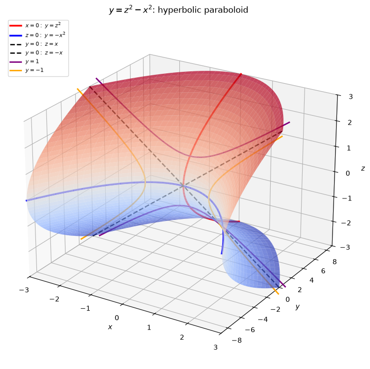
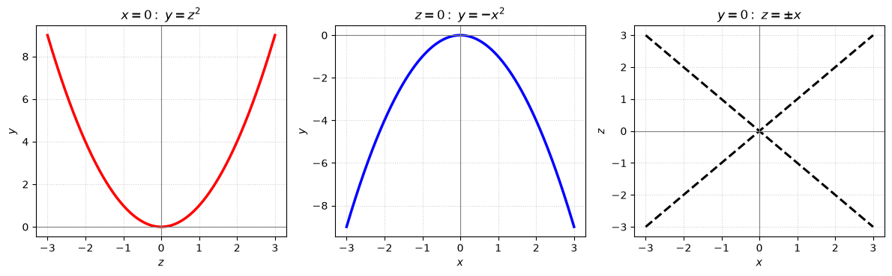
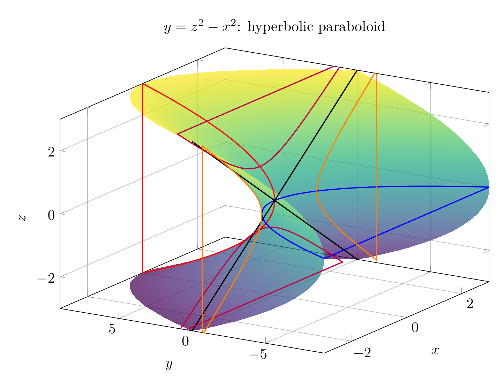
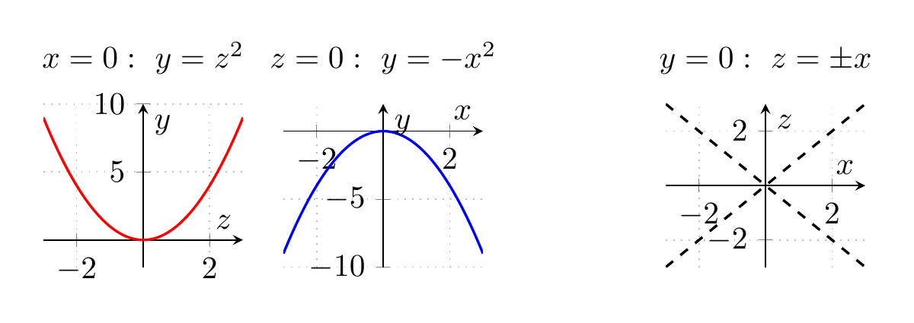

`[ Begin message. Type: AIMessage. ]`

We identify the surface by looking at its traces.

Given
$$
y=z^2-x^2.
$$

### Traces

**1. Horizontal traces \(y=k\).**

Set \(y=k\):
$$
k=z^2-x^2.
$$

- If \(k>0\), this is a hyperbola opening in the \(z\)-direction.
- If \(k<0\), this is a hyperbola opening in the \(x\)-direction.
- If \(k=0\), the trace degenerates to two intersecting lines:
$$
z^2-x^2=0 \implies z=\pm x.
$$

**2. Traces in planes \(x=k\).**

Set \(x=k\):
$$
y=z^2-k^2.
$$

For each fixed \(x=k\), this is a parabola opening upward in the \(yz\)-plane, shifted downward by \(k^2\).

**3. Traces in planes \(z=k\).**

Set \(z=k\):
$$
y=k^2-x^2.
$$

For each fixed \(z=k\), this is a parabola opening downward in the \(xy\)-plane, shifted upward by \(k^2\).

Thus the surface has hyperbolic horizontal traces and parabolic vertical traces, so it is a **hyperbolic paraboloid**, with a saddle point at the origin. In standard form,

$$
y=\frac{z^2}{1^2}-\frac{x^2}{1^2}.
$$

Therefore the surface is

$$
\boxed{\text{a hyperbolic paraboloid}}
$$

---


(Image `20260824_175241_699760_utc_0800_pyplot_0.png`. Alt text: pyplot-generated plot.)



(Image `20260824_175241_699760_utc_0800_pyplot_1.png`. Alt text: pyplot-generated plot.)




---

[PGFplots / tikz plot.](./20260824_175241_699760_utc_0800_pgfplots_0.tex)

```latex
\documentclass[tikz,border=10pt]{standalone}
\usepackage{pgfplots}
\pgfplotsset{compat=1.18}
\begin{document}
\begin{tikzpicture}
\begin{axis}[
    width=12cm, height=9cm,
    view={-58}{24},
    xlabel={$x$}, ylabel={$y$}, zlabel={$z$},
    title={$y=z^2-x^2$: hyperbolic paraboloid},
    grid=major,
    xmin=-3, xmax=3,
    ymin=-9, ymax=9,
    zmin=-3, zmax=3,
    colormap/viridis,
]
\addplot3[
    surf,
    domain=-3:3,
    y domain=-3:3,
    samples=35,
    shader=interp,
    opacity=0.72
] ({x},{y^2-x^2},{y});

% x=0 trace: y=z^2
\addplot3[domain=-3:3, samples=100, thick, red] ({0},{x^2},{x});
% z=0 trace: y=-x^2
\addplot3[domain=-3:3, samples=100, thick, blue] ({x},{-x^2},{0});
% y=0 traces: z=\pm x
\addplot3[domain=-3:3, samples=100, thick, black, dashed] ({x},{0},{x});
\addplot3[domain=-3:3, samples=100, thick, black, dashed] ({x},{0},{-x});
% y=1 hyperbola: z^2-x^2=1
\addplot3[domain=-3:3, samples=100, thick, purple] ({x},{1},{sqrt(x^2+1)});
\addplot3[domain=-3:3, samples=100, thick, purple] ({x},{1},{-sqrt(x^2+1)});
% y=-1 hyperbola: z^2-x^2=-1
\addplot3[domain=-3:3, samples=100, thick, orange] ({sqrt(x^2+1)},{-1},{x});
\addplot3[domain=-3:3, samples=100, thick, orange] ({-sqrt(x^2+1)},{-1},{x});
\end{axis}
\end{tikzpicture}
\end{document}
```


(Image `20260824_175241_699760_utc_0800_pgfplots_0.png`. Alt text: PGFplots / tikz plot (converted to PNG).)




[PGFplots / tikz plot.](./20260824_175241_699760_utc_0800_pgfplots_1.tex)

```latex
\documentclass[tikz,border=10pt]{standalone}
\usepackage{pgfplots}
\pgfplotsset{compat=1.18}
\begin{document}
\begin{tikzpicture}
\begin{axis}[
    name=plot1,
    width=3.8cm, height=3.4cm,
    xlabel={$z$}, ylabel={$y$},
    title={$x=0:\ y=z^2$},
    grid=both,
    grid style={dotted},
    axis lines=middle,
    ymin=-2, ymax=10,
    xmin=-3, xmax=3
]
\addplot[domain=-3:3, samples=100, thick, red] {x^2};
\end{axis}

\begin{axis}[
    at={(plot1.east)}, anchor=west, xshift=0.45cm,
    width=3.8cm, height=3.4cm,
    xlabel={$x$}, ylabel={$y$},
    title={$z=0:\ y=-x^2$},
    grid=both,
    grid style={dotted},
    axis lines=middle,
    ymin=-10, ymax=2,
    xmin=-3, xmax=3
]
\addplot[domain=-3:3, samples=100, thick, blue] {-x^2};
\end{axis}

\begin{axis}[
    at={(plot1.east)}, anchor=west, xshift=4.7cm,
    width=3.8cm, height=3.4cm,
    xlabel={$x$}, ylabel={$z$},
    title={$y=0:\ z=\pm x$},
    grid=both,
    grid style={dotted},
    axis lines=middle,
    ymin=-3, ymax=3,
    xmin=-3, xmax=3
]
\addplot[domain=-3:3, samples=100, thick, black, dashed] {x};
\addplot[domain=-3:3, samples=100, thick, black, dashed] {-x};
\end{axis}
\end{tikzpicture}
\end{document}
```


(Image `20260824_175241_699760_utc_0800_pgfplots_1.png`. Alt text: PGFplots / tikz plot (converted to PNG).)



`[ End message. Type: AIMessage. ]`