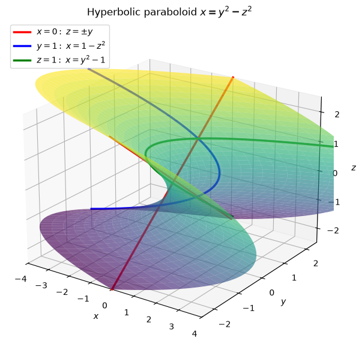
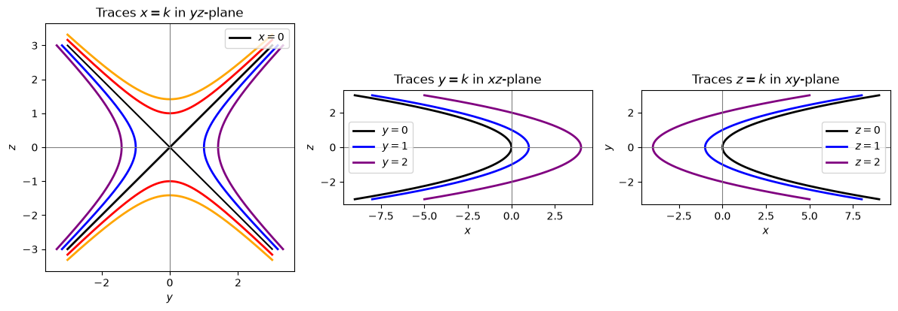
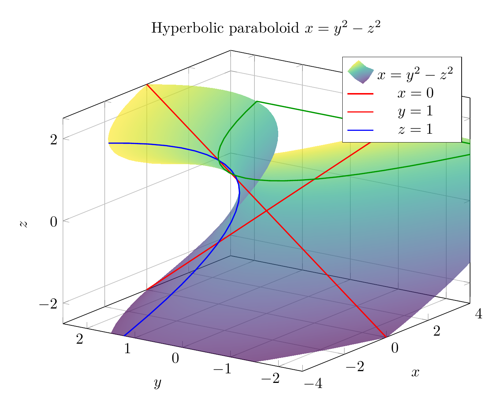
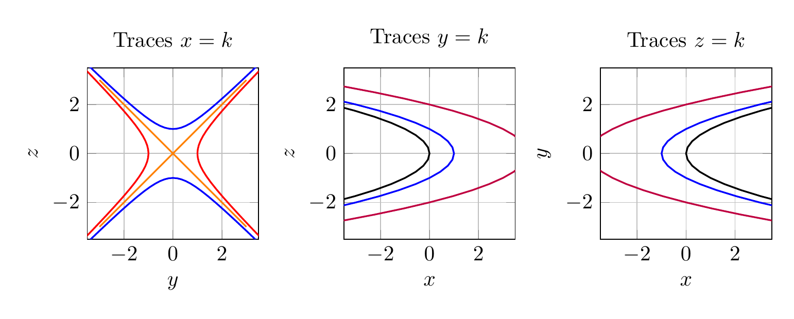

`[ Begin message. Type: AIMessage. ]`

To identify the surface $x=y^2-z^2$, examine traces in planes parallel to the coordinate planes.

- Traces $x=k$: $y^2-z^2=k$. These are hyperbolas when $k\neq 0$. For $k>0$, the hyperbolas open in the $y$-direction; for $k<0$, they open in the $z$-direction. For $k=0$, the trace is the pair of lines $z=\pm y$.
- Traces $y=k$: $x=k^2-z^2$. These are parabolas opening in the negative $x$-direction.
- Traces $z=k$: $x=y^2-k^2$. These are parabolas opening in the positive $x$-direction.

Since one squared variable appears with a positive sign and the other with a negative sign, while the remaining variable is linear, the surface is a hyperbolic paraboloid, or saddle surface, oriented along the $x$-axis.

$\boxed{\text{The surface is a hyperbolic paraboloid }x=y^2-z^2.}$

---


(Image `20260824_175431_516296_utc_0800_pyplot_0.png`. Alt text: pyplot-generated plot.)



(Image `20260824_175431_516296_utc_0800_pyplot_1.png`. Alt text: pyplot-generated plot.)




---

[PGFplots / tikz plot.](./20260824_175431_516296_utc_0800_pgfplots_0.tex)

```latex
\documentclass[border=10pt]{standalone}
\usepackage{pgfplots}
\pgfplotsset{compat=1.18}
\begin{document}
\begin{tikzpicture}
\begin{axis}[
    width=11cm, height=9cm,
    view={-55}{22},
    xlabel=$x$, ylabel=$y$, zlabel=$z$,
    title={Hyperbolic paraboloid $x=y^2-z^2$},
    grid=major,
    colormap/viridis,
    xmin=-4, xmax=4,
    ymin=-2.5, ymax=2.5,
    zmin=-2.5, zmax=2.5
]
\addplot3[
    surf,
    domain=-2.5:2.5,
    y domain=-2.5:2.5,
    samples=35,
    shader=interp,
    opacity=0.65
] ({x*x-y*y},{x},{y});

\addplot3[domain=-2.5:2.5, red, thick] ({0},{x},{x});
\addplot3[domain=-2.5:2.5, red, thick] ({0},{x},{-x});
\addplot3[domain=-2.5:2.5, blue, thick] ({1-y*y},{1},{y});
\addplot3[domain=-2.5:2.5, green!60!black, thick] ({x*x-1},{x},{1});

\legend{$x=y^2-z^2$,$x=0$,$y=1$,$z=1$}
\end{axis}
\end{tikzpicture}
\end{document}
```


(Image `20260824_175431_516296_utc_0800_pgfplots_0.png`. Alt text: PGFplots / tikz plot (converted to PNG).)




[PGFplots / tikz plot.](./20260824_175431_516296_utc_0800_pgfplots_1.tex)

```latex
\documentclass[border=10pt]{standalone}
\usepackage{pgfplots}
\usepgfplotslibrary{groupplots}
\pgfplotsset{compat=1.18}
\begin{document}
\begin{tikzpicture}
\begin{groupplot}[
    group style={group size=3 by 1, horizontal sep=1.4cm},
    width=5.2cm, height=4.4cm,
    grid=major,
    axis equal image,
    xmin=-3.5, xmax=3.5,
    ymin=-3.5, ymax=3.5
]
\nextgroupplot[xlabel=$y$, ylabel=$z$, title={Traces $x=k$}]
\addplot[domain=-3:3, orange, thick] ({x},{x});
\addplot[domain=-3:3, orange, thick] ({x},{-x});
\addplot[domain=-2:2, red, thick] ({cosh(x)},{sinh(x)});
\addplot[domain=-2:2, red, thick] ({-cosh(x)},{sinh(x)});
\addplot[domain=-2:2, blue, thick] ({sinh(x)},{cosh(x)});
\addplot[domain=-2:2, blue, thick] ({sinh(x)},{-cosh(x)});

\nextgroupplot[xlabel=$x$, ylabel=$z$, title={Traces $y=k$}]
\addplot[domain=-3:3, black, thick] ({-x*x},{x});
\addplot[domain=-3:3, blue, thick] ({1-x*x},{x});
\addplot[domain=-3:3, purple, thick] ({4-x*x},{x});

\nextgroupplot[xlabel=$x$, ylabel=$y$, title={Traces $z=k$}]
\addplot[domain=-3:3, black, thick] ({x*x},{x});
\addplot[domain=-3:3, blue, thick] ({x*x-1},{x});
\addplot[domain=-3:3, purple, thick] ({x*x-4},{x});
\end{groupplot}
\end{tikzpicture}
\end{document}
```


(Image `20260824_175431_516296_utc_0800_pgfplots_1.png`. Alt text: PGFplots / tikz plot (converted to PNG).)



`[ End message. Type: AIMessage. ]`