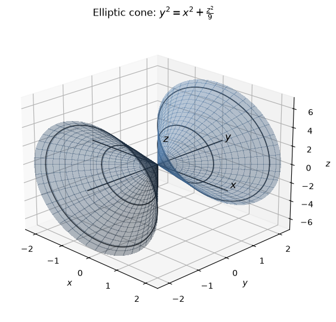
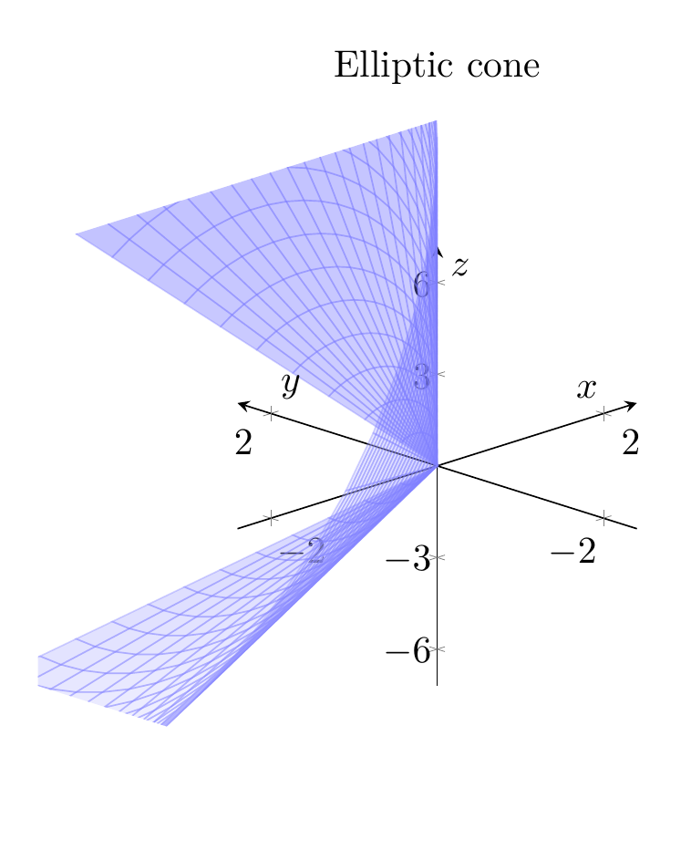
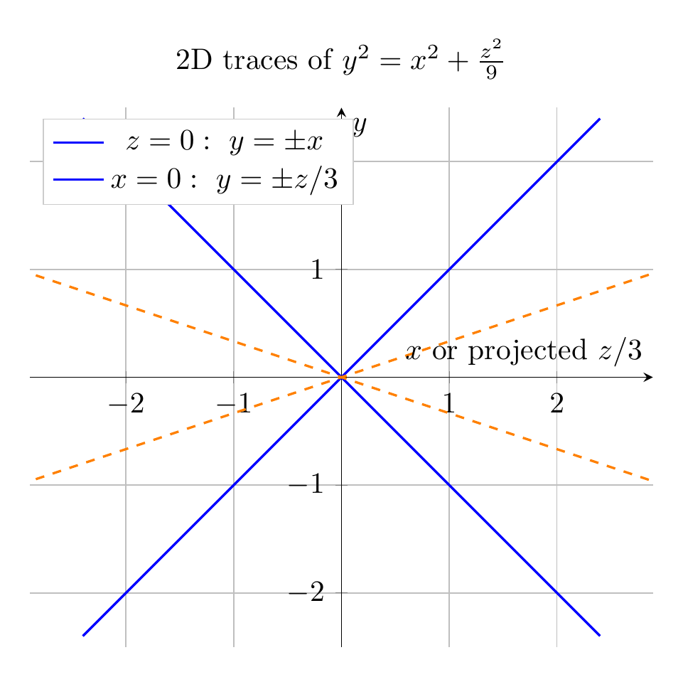

Rewrite the equation as

$$
x^2+\frac{z^2}{9}-y^2=0,
$$

or, in standard cone form,

$$
\frac{y^2}{1^2}=\frac{x^2}{1^2}+\frac{z^2}{3^2}.
$$

This matches the standard form of an elliptic cone, with the $y$-axis playing the role of the cone’s axis.

To sketch it, look at traces:

- For a horizontal slice $y=c$,

$$
x^2+\frac{z^2}{9}=c^2
\quad\Longleftrightarrow\quad
\frac{x^2}{c^2}+\frac{z^2}{(3c)^2}=1,
$$

so the cross-section is an ellipse with semi-axes $|c|$ in the $x$-direction and $3|c|$ in the $z$-direction.

- In the plane $z=0$,

$$
y^2=x^2 \quad\Rightarrow\quad y=\pm x.
$$

- In the plane $x=0$,

$$
y^2=\frac{z^2}{9} \quad\Rightarrow\quad y=\pm \frac z3.
$$

Thus the surface is a double elliptic cone with vertex at the origin, opening in both the positive and negative $y$-directions.

$\boxed{\frac{y^2}{1^2}=\frac{x^2}{1^2}+\frac{z^2}{3^2};\ \text{elliptic cone with axis along the }y\text{-axis and vertex }(0,0,0)}$

---




---

[PGFplots / tikz plot.](./20260825_013830_801452_utc_0800_pgfplots_0.tex)

```latex
\documentclass[border=10pt]{standalone}
\usepackage{pgfplots}
\pgfplotsset{compat=1.18}
\begin{document}
\begin{tikzpicture}
\begin{axis}[
  width=9cm,
  height=8cm,
  axis lines=center,
  xlabel=$x$, ylabel=$y$, zlabel=$z$,
  xmin=-2.4, xmax=2.4,
  ymin=-2.4, ymax=2.4,
  zmin=-7.2, zmax=7.2,
  view={-45}{22},
  title={Elliptic cone},
  samples=45,
  samples y=24,
  domain=-2.2:2.2,
  y domain=0:2*pi,
  grid=major,
  ztick={-6,-3,0,3,6},
]
\addplot3[
  surf,
  shader=flat,
  opacity=0.35,
  colormap={bluewhite}{color=(white) color=(blue)},
  draw=blue!50,
  domain=-2.2:2.2,
  y domain=0:2*pi,
  variable=t,
  variable y=u,
] ({u*cos(deg(t))}, {u}, {3*u*sin(deg(t))});
\end{axis}
\end{tikzpicture}
\end{document}

```



[PGFplots / tikz plot.](./20260825_013830_801452_utc_0800_pgfplots_1.tex)

```latex
\documentclass[border=10pt]{standalone}
\usepackage{pgfplots}
\pgfplotsset{compat=1.18}
\begin{document}
\begin{tikzpicture}
\begin{axis}[
  width=9cm,
  height=8cm,
  axis lines=center,
  xlabel={$x$ or projected $z/3$},
  ylabel={$y$},
  xmin=-2.5, xmax=2.5,
  ymin=-2.5, ymax=2.5,
  grid=major,
  axis equal,
  title={2D traces of $y^2=x^2+\frac{z^2}{9}$},
  legend style={at={(0.02,0.98)}, anchor=north west, draw=black!20}
]
\addplot[blue, thick, domain=-2.4:2.4, samples=100] {x};
\addplot[blue, thick, domain=-2.4:2.4, samples=100] {-x};
\addlegendentry{$z=0:\ y=\pm x$};
\addplot[orange, thick, dashed, domain=-7.2:7.2, samples=100] {x/3};
\addplot[orange, thick, dashed, domain=-7.2:7.2, samples=100] {-x/3};
\addlegendentry{$x=0:\ y=\pm z/3$};
\end{axis}
\end{tikzpicture}
\end{document}

```

