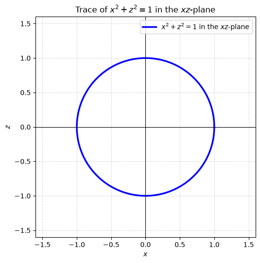
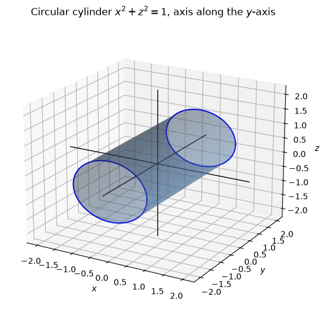
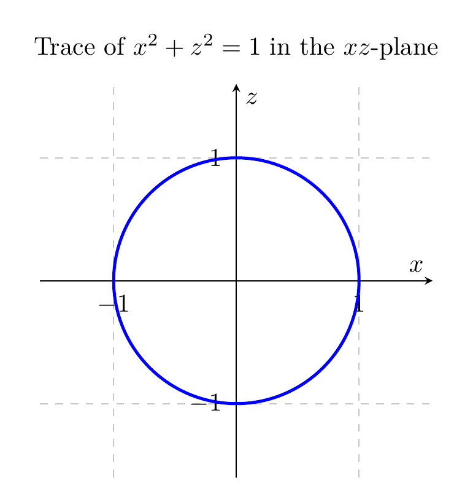
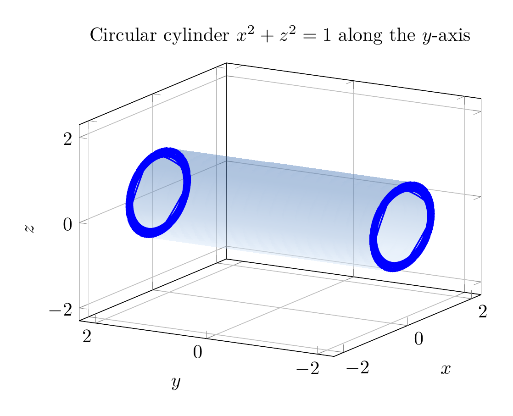

`[ Begin message. Type: AIMessage. ]`

The equation is
$$
x^2+z^2=1.
$$

Since the variable $y$ does not appear, the condition only restricts $x$ and $z$. In every plane $y=k$, the trace is the same circle
$$
x^2+z^2=1
$$
in the $xz$-plane. Therefore the surface is the lateral surface of a circular cylinder of radius $1$ whose axis is the $y$-axis.

A convenient parameterization is
$$
\mathbf r(\theta,y)=(\cos\theta,\;y,\;\sin\theta),\qquad 0\le \theta<2\pi,\; -\infty<y<\infty.
$$

So the surface is not a sphere or a disk; it is a cylinder extending infinitely in both directions along the $y$-axis.

$$
\boxed{\text{The surface }x^2+z^2=1\text{ is a circular cylinder of radius }1\text{ with axis along the }y\text{-axis.}}
$$

---


(Image `20260824_172131_354522_utc_0800_pyplot_0.png`. Alt text: pyplot-generated plot.)



(Image `20260824_172131_354522_utc_0800_pyplot_1.png`. Alt text: pyplot-generated plot.)




---

[PGFplots / tikz plot.](./20260824_172131_354522_utc_0800_pgfplots_0.tex)

```latex
\documentclass[border=10pt]{standalone}
\usepackage{pgfplots}
\pgfplotsset{compat=1.18}
\begin{document}
\begin{tikzpicture}
\begin{axis}[
    axis lines=center,
    xlabel={$x$},
    ylabel={$z$},
    axis equal,
    grid=both,
    grid style={dashed,gray!45},
    xmin=-1.6, xmax=1.6,
    ymin=-1.6, ymax=1.6,
    width=7cm,
    height=7cm,
    title={Trace of $x^2+z^2=1$ in the $xz$-plane}
]
\addplot[blue, very thick, domain=0:360, samples=200]
    ({cos(x)}, {sin(x)});
\end{axis}
\end{tikzpicture}
\end{document}
```


(Image `20260824_172131_354522_utc_0800_pgfplots_0.png`. Alt text: PGFplots / tikz plot (converted to PNG).)




[PGFplots / tikz plot.](./20260824_172131_354522_utc_0800_pgfplots_1.tex)

```latex
\documentclass[border=10pt]{standalone}
\usepackage{pgfplots}
\pgfplotsset{compat=1.18}
\begin{document}
\begin{tikzpicture}
\begin{axis}[
    view={-60}{20},
    xlabel={$x$},
    ylabel={$y$},
    zlabel={$z$},
    xmin=-2.3, xmax=2.3,
    ymin=-2.3, ymax=2.3,
    zmin=-2.3, zmax=2.3,
    width=9cm,
    height=7cm,
    grid=major,
    title={Circular cylinder $x^2+z^2=1$ along the $y$-axis}
]
\addplot3[
    surf,
    shader=interp,
    opacity=0.45,
    faceted color=white,
    colormap={bluegray}{rgb255=(219,235,252) rgb255=(69,117,180)},
    domain=0:360,
    y domain=-2.2:2.2,
    samples=50,
    samples y=20
]
({cos(deg(x))}, {y}, {sin(deg(x))});

\addplot3+[domain=0:360, samples=80, smooth, blue, thick, mark=none]
    ({cos(deg(x))}, {-2.2}, {sin(deg(x))});
\addplot3+[domain=0:360, samples=80, smooth, blue, thick, mark=none]
    ({cos(deg(x))}, {2.2}, {sin(deg(x))});
\end{axis}
\end{tikzpicture}
\end{document}
```


(Image `20260824_172131_354522_utc_0800_pgfplots_1.png`. Alt text: PGFplots / tikz plot (converted to PNG).)



`[ End message. Type: AIMessage. ]`