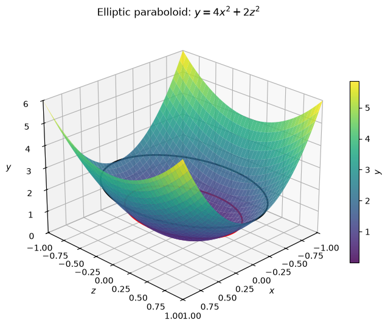
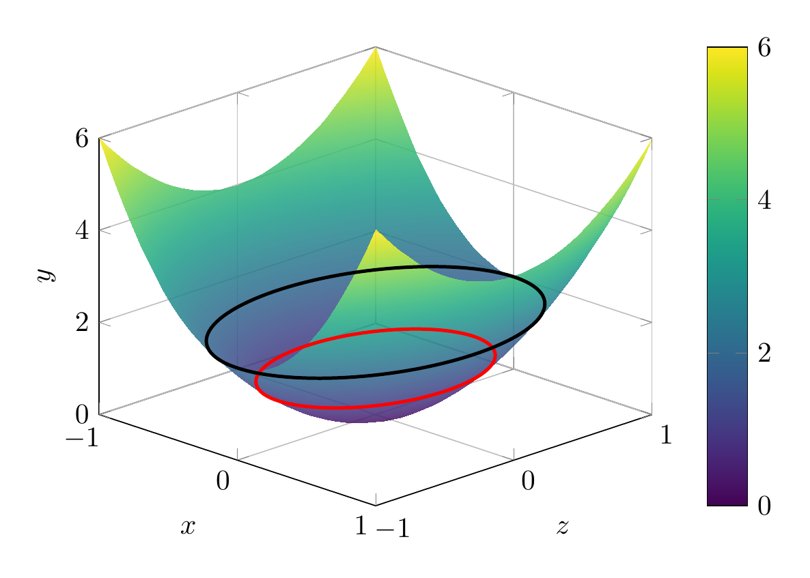

`[ Begin message. Type: AIMessage. ]`

Given
$$
4x^2-y+2z^2=0.
$$

Move the linear term to the other side:

$$
y=4x^2+2z^2.
$$

This is already in standard form for an elliptic paraboloid. The standard form is

$$
y=ax^2+bz^2,\qquad a>0,\ b>0.
$$

So the surface is an **elliptic paraboloid opening in the positive $y$-direction**, with vertex at the origin.

Useful traces:

- In the plane $y=0$: $4x^2+2z^2=0$, so only the point $(0,0,0)$.
- In the plane $y=c>0$:
  $$
  4x^2+2z^2=c,
  $$
  an ellipse.
- In the plane $z=0$:
  $$
  y=4x^2,
  $$
  a parabola opening in the positive $y$-direction.
- In the plane $x=0$:
  $$
  y=2z^2,
  $$
  also a parabola opening in the positive $y$-direction.

Therefore, the surface is an elliptic paraboloid opening upward along the $y$-axis.

\[
\boxed{\text{Elliptic paraboloid, } y=4x^2+2z^2}
\]

---


(Image `20260825_013921_712719_utc_0800_pyplot_0.png`. Alt text: pyplot-generated plot.)




---

[PGFplots / tikz plot.](./20260825_013921_712719_utc_0800_pgfplots_0.tex)

```latex
\documentclass[tikz,border=10pt]{standalone}
\usepackage{pgfplots}
\pgfplotsset{compat=1.18}
\begin{document}
\begin{tikzpicture}
\begin{axis}[
    xlabel={$x$}, ylabel={$z$}, zlabel={$y$},
    view={45}{25},
    domain=-1:1, y domain=-1:1,
    samples=35, samples y=35,
    xmin=-1, xmax=1, ymin=-1, ymax=1, zmin=0, zmax=6,
    colormap/viridis,
    colorbar,
    grid=major
]
\addplot3[surf, shader=interp, opacity=0.85] {4*x^2 + 2*y^2};
\addplot3[red, very thick, domain=0:360, samples=120]
    ({sqrt(1/4)*cos(x)}, {sqrt(1/2)*sin(x)}, {1});
\addplot3[black, very thick, domain=0:360, samples=120]
    ({sqrt(2/4)*cos(x)}, {sqrt(2/2)*sin(x)}, {2});
\end{axis}
\end{tikzpicture}
\end{document}
```


(Image `20260825_013921_712719_utc_0800_pgfplots_0.png`. Alt text: PGFplots / tikz plot (converted to PNG).)



`[ End message. Type: AIMessage. ]`