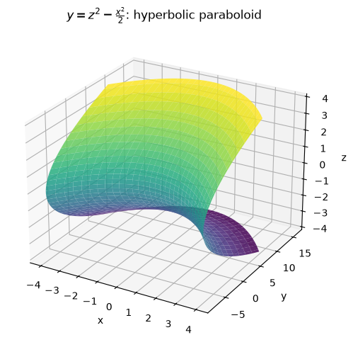
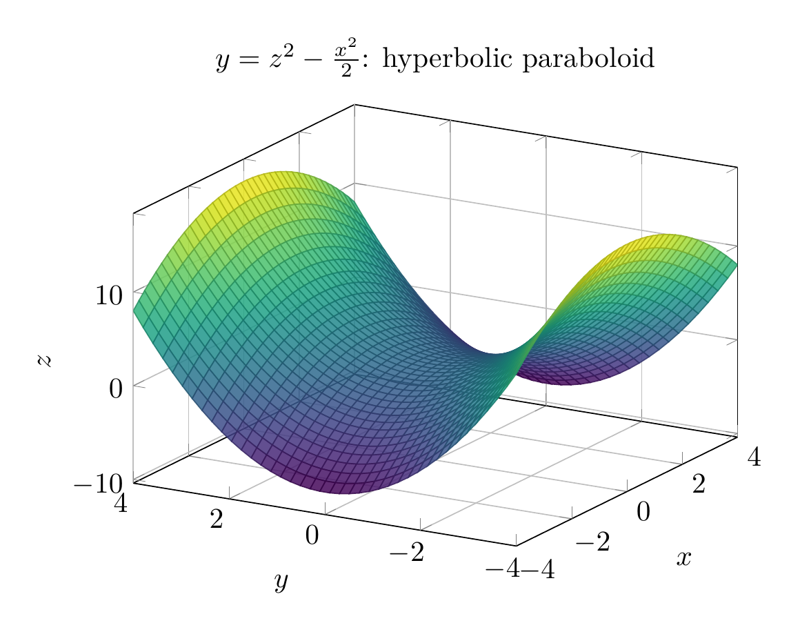

We want to reduce

$$
x^2+2y-2z^2=0
$$

to a standard quadric-surface form.

Solve for $y$:

$$
2y=2z^2-x^2
$$

so

$$
\boxed{y=z^2-\frac{x^2}{2}}.
$$

This is a standard form of a **hyperbolic paraboloid**, because it has one squared variable with a positive coefficient and one squared variable with a negative coefficient, and the remaining variable is linear.

A common standard form is

$$
y=\frac{z^2}{b^2}-\frac{x^2}{a^2}.
$$

Here,

$$
b^2=1,\qquad a^2=2.
$$

So the surface is a hyperbolic paraboloid opening upward in the $z$-direction and downward in the $x$-direction.

Useful traces:

- In the plane $z=0$:

$$
y=-\frac{x^2}{2},
$$

a downward-opening parabola.

- In the plane $x=0$:

$$
y=z^2,
$$

an upward-opening parabola.

- In the plane $y=0$:

$$
x^2=2z^2,
$$

two intersecting lines.

Therefore, the equation represents a **hyperbolic paraboloid**.

$$
\boxed{y=z^2-\frac{x^2}{2}\text{, a hyperbolic paraboloid}}
$$

The sketch is shown below.


---



---

[PGFplots / tikz plot.](./20260825_021108_115034_utc_0800_pgfplots_0.tex)

```latex
\documentclass[border=10pt]{standalone}
\usepackage{pgfplots}
\pgfplotsset{compat=1.18}
\begin{document}
\begin{tikzpicture}
\begin{axis}[
    width=9cm, height=7cm,
    xlabel={$x$}, ylabel={$y$}, zlabel={$z$},
    title={$y=z^2-\frac{x^2}{2}$: hyperbolic paraboloid},
    view={-60}{25},
    grid=major,
    colormap/viridis,
    samples=40,
    domain=-4:4,
    y domain=-4:4
]
\addplot3[surf, opacity=0.85] {y^2 - x^2/2};
\end{axis}
\end{tikzpicture}
\end{document}

```

