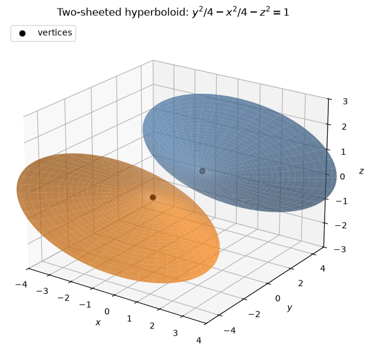
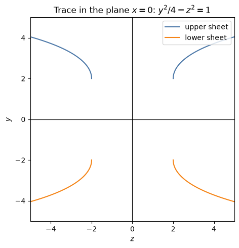
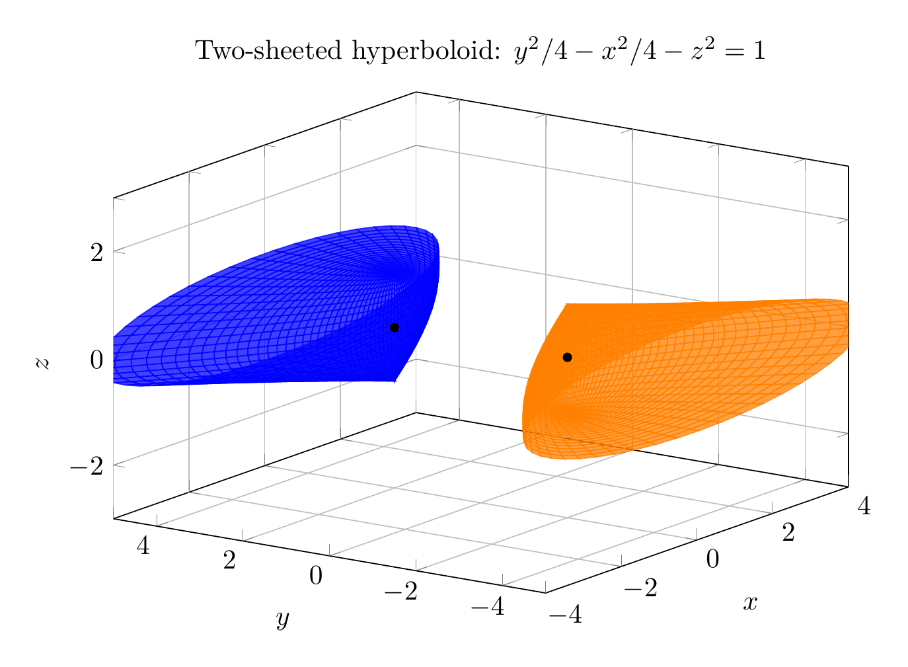
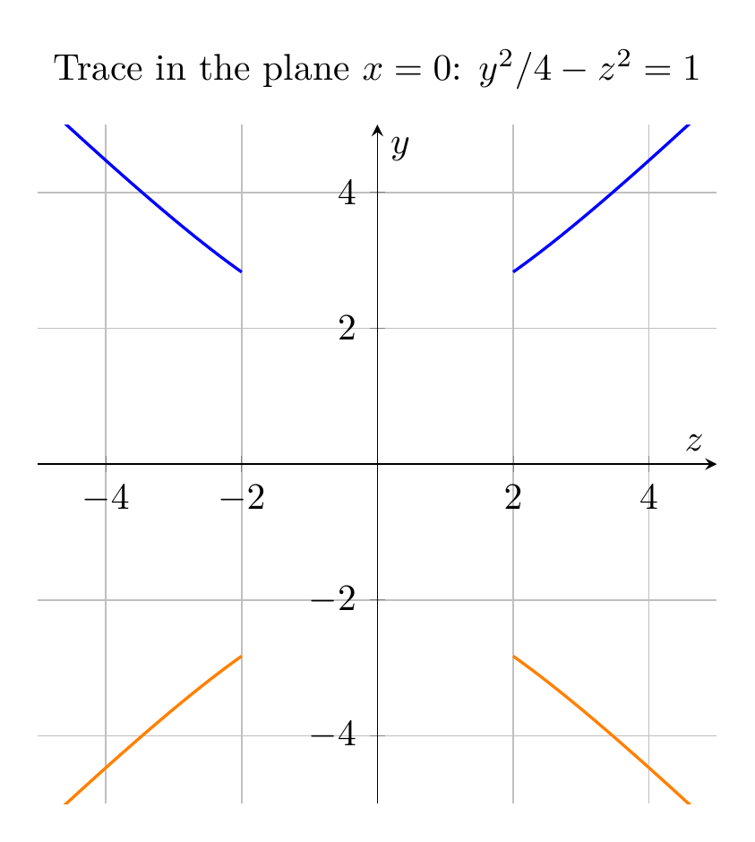

Given
$$
y^2=x^2+4z^2+4,
$$
move the $x^2$ and $z^2$ terms to the left:
$$
y^2-x^2-4z^2=4.
$$
Divide by $4$:
$$
\frac{y^2}{4}-\frac{x^2}{4}-z^2=1.
$$
Equivalently,
$$
\frac{y^2}{2^2}-\frac{x^2}{2^2}-\frac{z^2}{1^2}=1.
$$

This is the standard form of a **two-sheeted hyperboloid** whose axis is the $y$-axis. The positive squared term is the $y$-term, so the two sheets open in the positive and negative $y$ directions. The vertices are at
$$
(0,2,0)\quad\text{and}\quad(0,-2,0).
$$

A useful way to sketch it is to look at traces:

- In the plane $x=0$:
  $$
  \frac{y^2}{4}-z^2=1,
  $$
  a hyperbola opening upward and downward.
- In the plane $z=0$:
  $$
  \frac{y^2}{4}-\frac{x^2}{4}=1,
  $$
  also a hyperbola opening upward and downward.
- For $|y|>2$, horizontal traces $y=k$ are ellipses:
  $$
  \frac{x^2}{4}+z^2=\frac{k^2-4}{4}.
  $$
- For $|y|<2$, there are no real points.

Therefore the surface consists of two separate bowl-like sheets, one above $y=2$ and one below $y=-2$.

$$
\boxed{\frac{y^2}{4}-\frac{x^2}{4}-z^2=1,\ \text{two-sheeted hyperboloid with axis along the }y\text{-axis}.}
$$

---





---

[PGFplots / tikz plot.](./20260825_021210_697061_utc_0800_pgfplots_0.tex)

```latex
\documentclass[border=10pt]{standalone}
\usepackage{pgfplots}
\pgfplotsset{compat=1.18}
\pgfplotsset{trig format plots=rad}
\begin{document}
\begin{tikzpicture}
\begin{axis}[
    width=11cm,
    height=8cm,
    xlabel=$x$,
    ylabel=$y$,
    zlabel=$z$,
    title={Two-sheeted hyperboloid: $y^2/4-x^2/4-z^2=1$},
    view={-55}{22},
    xmin=-4, xmax=4,
    ymin=-5, ymax=5,
    zmin=-3, zmax=3,
    grid=major,
    colormap={twosheet}{color=(orange) color=(blue)}
]
\addplot3[
    surf,
    domain=0:1.55,
    y domain=0:2*pi,
    samples=35,
    samples y=50,
    shader=flat,
    opacity=0.75,
    color=blue
]
({2*sinh(x)*cos(y)}, {2*cosh(x)}, {sin(y)});

\addplot3[
    surf,
    domain=0:1.55,
    y domain=0:2*pi,
    samples=35,
    samples y=50,
    shader=flat,
    opacity=0.75,
    color=orange
]
({2*sinh(x)*cos(y)}, {-2*cosh(x)}, {sin(y)});

\addplot3[only marks, mark=*, mark size=1.5pt, black] coordinates {(0,2,0) (0,-2,0)};
\end{axis}
\end{tikzpicture}
\end{document}
```



[PGFplots / tikz plot.](./20260825_021210_697061_utc_0800_pgfplots_1.tex)

```latex
\documentclass[border=10pt]{standalone}
\usepackage{pgfplots}
\pgfplotsset{compat=1.18}
\begin{document}
\begin{tikzpicture}
\begin{axis}[
    width=9cm,
    height=8cm,
    xlabel=$z$,
    ylabel=$y$,
    title={Trace in the plane $x=0$: $y^2/4-z^2=1$},
    xmin=-5, xmax=5,
    ymin=-5, ymax=5,
    axis lines=center,
    grid=major,
    axis equal image,
    domain=2:5,
    samples=200
]
\addplot[blue, thick] ({x}, {2*sqrt(1+x^2/4)});
\addplot[blue, thick] ({-x}, {2*sqrt(1+x^2/4)});
\addplot[orange, thick] ({x}, {-2*sqrt(1+x^2/4)});
\addplot[orange, thick] ({-x}, {-2*sqrt(1+x^2/4)});
\end{axis}
\end{tikzpicture}
\end{document}
```

