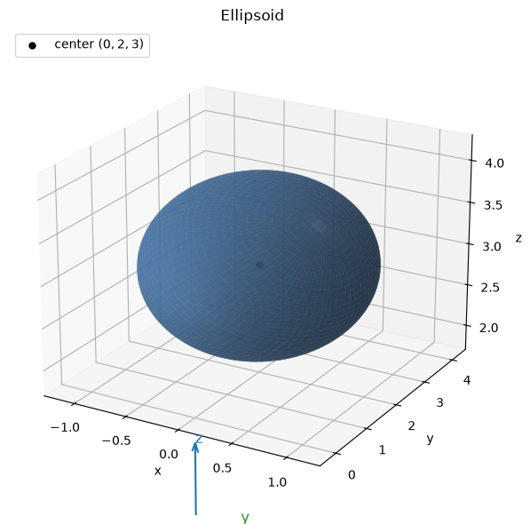
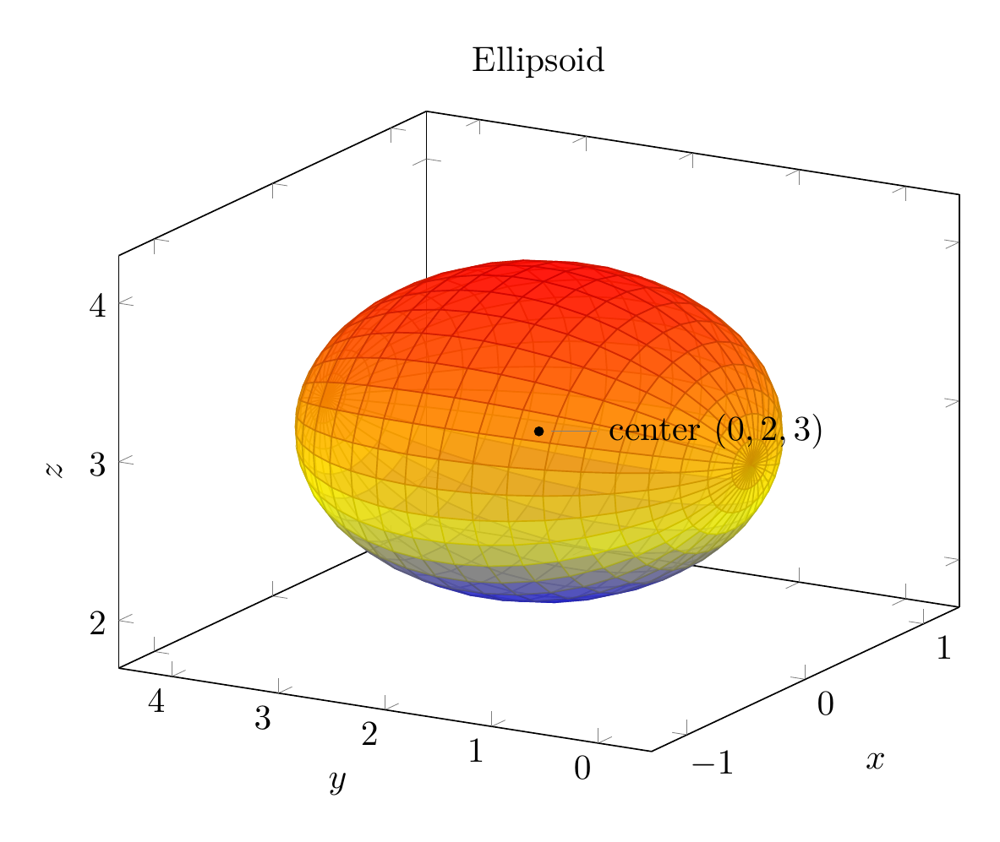

`[ Begin message. Type: HumanMessage. ]`

`[Begin Problem]`

Please solve the math problem in the image.


(Image `problem.png`. Alt text: Problem.)


`[End Problem]`

`[ End message. Type: HumanMessage. ]`

`[ Begin message. Type: AIMessage. ]`

`[Begin Answer]`

Complete the square in the variables that appear linearly.

\[
4x^2+y^2+4z^2-4y-24z+36=0
\]

Group the \(y\)- and \(z\)-terms:

\[
4x^2+(y^2-4y)+4(z^2-6z)+36=0.
\]

Complete the square:

\[
y^2-4y=(y-2)^2-4,
\]

and

\[
z^2-6z=(z-3)^2-9.
\]

So

\[
4x^2+\bigl((y-2)^2-4\bigr)+4\bigl((z-3)^2-9\bigr)+36=0.
\]

Simplify:

\[
4x^2+(y-2)^2+4(z-3)^2-4=0,
\]

hence

\[
4x^2+(y-2)^2+4(z-3)^2=4.
\]

Divide by \(4\):

\[
\boxed{x^2+\frac{(y-2)^2}{4}+(z-3)^2=1}.
\]

This is the standard form of an ellipsoid:

\[
\frac{(x-0)^2}{1^2}+\frac{(y-2)^2}{2^2}+\frac{(z-3)^2}{1^2}=1.
\]

Therefore the surface is an ellipsoid centered at

\[
\boxed{(0,2,3)}
\]

with semiaxes

\[
\boxed{1,\ 2,\ 1}
\]

in the \(x\)-, \(y\)-, and \(z\)-directions, respectively. It is elongated along the \(y\)-axis.

The sketch is shown below, together with representative elliptical cross-sections.


---


(Image `20260825_021436_415825_utc_0800_pyplot_0.png`. Alt text: pyplot-generated plot.)



(Image `20260825_021436_415825_utc_0800_pyplot_1.png`. Alt text: pyplot-generated plot.)


---

[PGFplots / tikz plot.](./20260825_021436_415825_utc_0800_pgfplots_0.tex)

```latex
\documentclass[border=10pt]{standalone}
\usepackage{pgfplots}
\pgfplotsset{compat=1.18}
\begin{document}
\begin{tikzpicture}
\begin{axis}[
  width=10cm, height=8cm,
  view={-60}{22},
  xlabel={$x$}, ylabel={$y$}, zlabel={$z$},
  xmin=-1.3, xmax=1.3, ymin=-0.5, ymax=4.5, zmin=1.7, zmax=4.3,
  grid=none,
  title={Ellipsoid}
]
\addplot3[
  surf,
  opacity=0.75,
  domain=0:2*pi,
  y domain=0:pi,
  samples=35,
  samples y=22
]
({cos(deg(x))*sin(deg(y))},
 {2+2*cos(deg(y))},
 {3+sin(deg(x))*sin(deg(y))});
\addplot3[only marks, mark=*, mark size=1.2pt, black] coordinates {(0,2,3)};
\node[pin=right:{center $(0,2,3)$}] at (axis cs:0,2,3) {};
\end{axis}
\end{tikzpicture}
\end{document}
```


(Image `20260825_021436_415825_utc_0800_pgfplots_0.png`. Alt text: PGFplots / tikz plot (converted to PNG).)




[PGFplots / tikz plot.](./20260825_021436_415825_utc_0800_pgfplots_1.tex)

```latex
\documentclass[border=10pt]{standalone}
\usepackage{pgfplots}
\pgfplotsset{compat=1.18}
\begin{document}
\begin{tikzpicture}
\begin{axis}[
  width=7cm, height=6cm,
  axis equal image,
  xmin=-1.4, xmax=1.4, ymin=-0.4, ymax=4.4,
  xlabel={$x$}, ylabel={$y$},
  title={Cross-section $z=3$},
  grid=both,
  grid style={line width=.1pt, draw=gray!30},
  major grid style={line width=.2pt, draw=gray!50},
  enlarge x limits=false,
  enlarge y limits=false
]
\addplot[domain=0:360, samples=120, fill=blue, fill opacity=0.45, draw=blue]
  ({cos(x)}, {2+2*sin(x)}) -- cycle;
\end{axis}

\begin{axis}[
  width=7cm, height=6cm,
  at={(8cm,0)},
  axis equal image,
  xmin=-0.4, xmax=4.4, ymin=1.7, ymax=4.3,
  xlabel={$y$}, ylabel={$z$},
  title={Cross-section $x=0$},
  grid=both,
  grid style={line width=.1pt, draw=gray!30},
  major grid style={line width=.2pt, draw=gray!50},
  enlarge x limits=false,
  enlarge y limits=false
]
\addplot[domain=0:360, samples=120, fill=orange, fill opacity=0.45, draw=orange]
  ({2+2*cos(x)}, {3+sin(x)}) -- cycle;
\end{axis}
\end{tikzpicture}
\end{document}
```


(Image `20260825_021436_415825_utc_0800_pgfplots_1.png`. Alt text: PGFplots / tikz plot (converted to PNG).)


`[End Answer]`

`[ End message. Type: AIMessage. ]`