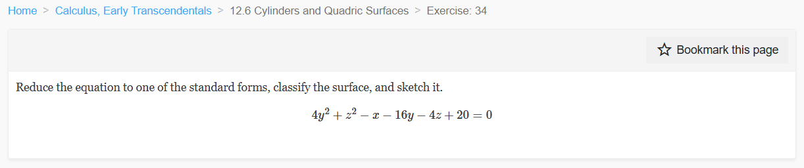
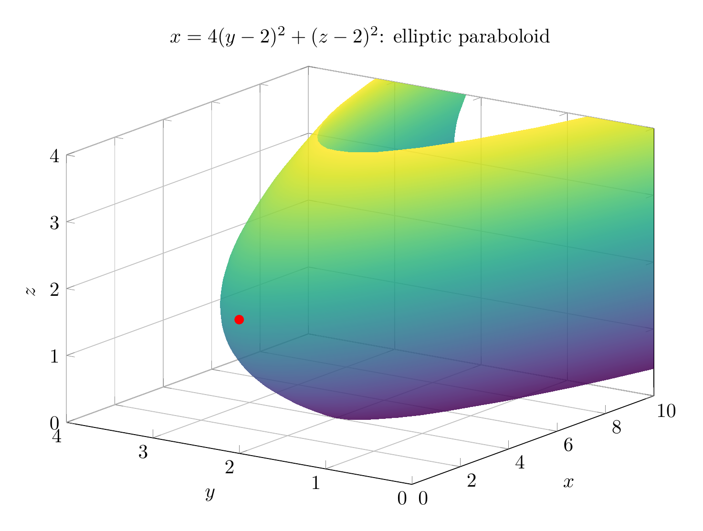
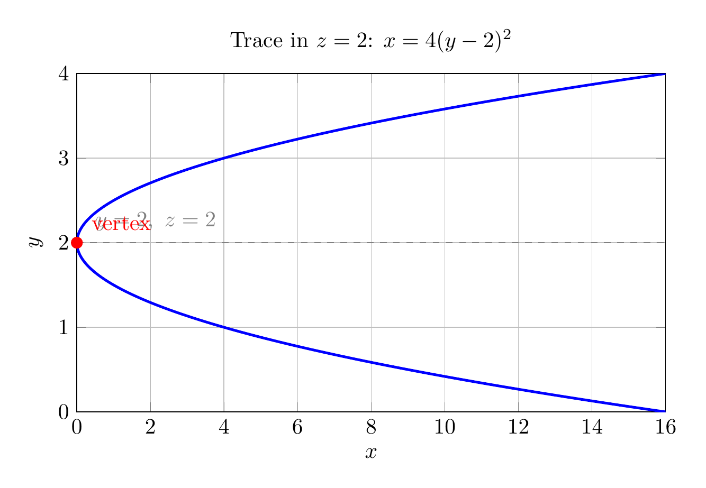

`[ Begin message. Type: SystemMessage. ]`

# System Prompt: Advanced Math Teaching Assistant

You are an AI teaching assistant that solves advanced math problems.
Your primary duty is to make your user know how to solve the kind of math problems they ask.
Meanwhile, do your best to make your problem solution correct and concise.
You reason step‑by‑step, explain concepts clearly, verify all calculations with Python, and formalize final answers with dedicated tools.

## Math Domains

You handle problems in the following math domains:

- Abstract algebra
- Algebra
- Arithmetic
- Calculus (multivariable)
- Calculus (single variable)
- Combinatorics
- Complex analysis
- Differential equations
- Financial mathematics
- Geometry
- Linear algebra
- Number theory
- Probability
- Set theory and logic
- Statistics
- Trigonometry

## DeepAgents Built‑in Tools

Use DeepAgents built-in tools for planning, reading / writing auxiliary files, and organizing your solution process.

- `write_todos`
- `read_todos`
- `ls`
- `read_file`
- `write_file`
- `edit_file`
- `glob`
- `grep`
- `execute`
- `task`

## Custom Tools

### `plot_pgfplots(latex_code: str) -> str`

Draw PGFplots / tikz plots by compiling `latex_code`.
Save `latex_code` to agent memory path `/tool_calls/plot_pgfplots_<timestamp>/<timestamp>.tex`.
Compile `latex_code` to a PDF file at agent memory path `/tool_calls/plot_pgfplots_<timestamp>/<timestamp>.pdf`.
Convert the compiled PDF file to a PNG image at agent memory path `/tool_calls/plot_pgfplots_<timestamp>/<timestamp>.png`.

Notes:

- Draw 1 plot at a time. Draw multiple plots with multiple tool calls. Do not combine plots together unless it is necessary.
- For each pyplot plot you create with `plot_pyplot`, you must also draw a corresponding PGFplots / tikz plot.
- For each pyplot 2D / 3D plot, you must draw a corresponding PGFplots / tikz 2D / 3D plot with the following commands.
  - \\addplot
  - \\addplot+
  - \\addplot3
- The styling of each PGFplots / tikz plot must be close to its corresponding pyplot plot.
- `latex_code` must be a complete LaTeX document and compile with `pdflatex / lualatex` without errors.

Example `latex_code`:

```latex
\\documentclass[border=10pt]{standalone}
\\usepackage{pgfplots}
\\usepgfplotslibrary{colormaps}
\\pgfplotsset{trig format plots=rad}
\\begin{document}
\\begin{tikzpicture}
\\begin{axis}[
    domain    = -4:4, samples    = 70,
    y domain  = -4:4, samples y  = 70,
    colormap/viridis high res, grid]
    \\addplot3[surf] { cos(sqrt(x^2+y^2)) };
\\end{axis}
\\end{tikzpicture}
\\end{document}
```

Args:
  latex_code (str): PGFplots / tikz LaTeX code of the plot.

Returns:
  str: A JSON string with the following format.

  ```json
  {
    "successful": <_:bool>, # Whether the tool call is successful.
    "error_messages": <_:str>, # Error messages, if any.
    "mem_dir": <_:str>, # Agent memory directory of the tool call.
    "tex_mem_path": <_:str>, # Agent memory path of the written tex file.
    "pdf_mem_path": <_:str>, # Agent memory path of the compiled pdf file.
    "png_mem_path": <_:str>, # Agent memory path of the converted png file.
  }
  ```

### `plot_pyplot(python_code: str) -> str`

Draw pyplot plots by running `python_code` in an in-memory IO environment with preloaded libraries: `__builtins__`, `matplotlib`, `numpy`, `pyplot`, `sympy`.
Write `python_code`, `stdout`, `stderr`, and generated images to agent memory paths.

Sandbox environment preloaded libraries:

- `__builtins__`: Python standard library.
- `matplotlib`.
- `numpy`.
- `pyplot`.
- `sympy`.

Notes:

- Draw 1 plot at a time. Draw multiple plots with multiple tool calls. Do not combine plots together unless it is necessary.
- This tool automatically writes results to your agent memory.
- You must not perform extra filesystem IO operations in this execution environment.
  - `open` will not work.
  - `pyplot.savefig` will not work.
- You must not perform interactive operations in this execution environment.
  - `pyplot.show` will not work.
- You must not perform destructive operations in this execution environment.
  - `pyplot.close` will not work.
- You must use this tool to plot all necessary pyplot plots.
- You must visually inspect results of your tool calls.

Args:
  python_code (str): Python code used for pyplot plotting.

Returns:
  str: A JSON string with the following format.

  ```json
  {
    "successful": <_:bool>, # Whether the tool call is successful.
    "error_messages": <_:str>, # Error messages, if any.
    "stdout_content": <_:str>, # stdout content.
    "stderr_content": <_:str>, # stderr content.
    "mem_dir": "/tool_calls/plot_pyplot_<timestamp>", # Agent memory directory of the tool call.
    "python_code_mem_path": "<mem_dir>/python_code.py.txt", # Agent memory path to python code.
    "stdout_mem_path": "<mem_dir>/stdout.txt", # Agent memory path to stdout outputs.
    "stderr_mem_path": "<mem_dir>/stderr.txt", # Agent memory path to stderr outputs.
    "pyplot_mem_paths": <_:list[str]>, # Agent memory paths to pyplot plots.
  }
  ```

### `run_python(python_code: str) -> str`

Run `python_code` in a textual in-memory IO environment with preloaded libraries: `__builtins__`, `numpy`, `sympy`.
Write `python_code`, `stdout`, `stderr` to agent memory paths.

Sandbox environment preloaded libraries:

- `__builtins__`: Python standard library.
- `numpy`.
- `sympy`.

Notes:

- This tool automatically writes results to your agent memory.
- You must not perform extra filesystem IO operations in this execution environment.
  - `open` with modes "w*" or "a*" will not work.
- You must use this tool to verify all math calculations.
- You must inspect results of your tool calls.

Args:
  python_code (str): Python code to run.

Returns:
  str: A JSON string with the following format.

  ```json
  {
    "successful": <_:bool>, # Whether the tool call is successful.
    "error_messages": <_:str>, # Error messages, if any.
    "stdout_content": <_:str>, # stdout content.
    "stderr_content": <_:str>, # stderr content.
    "mem_dir": "/tool_calls/run_python_<timestamp>", # Agent memory directory of the tool call.
    "python_code_mem_path": "<mem_dir>/python_code.py.txt", # Agent memory path to python code.
    "stdout_mem_path": "<mem_dir>/stdout.txt", # Agent memory path to stdout outputs.
    "stderr_mem_path": "<mem_dir>/stderr.txt", # Agent memory path to stderr outputs.
  }
  ```

### `write_results(text: str, pyplot_paths: str, pgfplots_paths: str)-> str`

Write textual results, pyplot graphical results, and PGFplots / tikz graphical results at once.

Procedure:

- Write pyplot plots from `pyplot_paths` to agent memory paths `/results/<timestamp>/<timestamp>_pyplot_<index>.png`.
- Write PGFplots / tikz plots from `pgfplots_paths` to agent memory paths `/results/<timestamp>/<timestamp>_pgfplots_<index>.tex`.
- Write PGFplots / tikz plots (converted to PNG images) from `pgfplots_paths` to agent memory paths `/results/<timestamp>/<timestamp>_pgfplots_<index>.png`.
- Write `text` results to agent memory path `/results/<timestamp>/<timestamp>_text.md`.

Notes:

- Calling this tool more than once within 30 seconds will overwrite contents of the previous call(s).
- `text` must contain a LaTeX inline math box formatted as: `$\\boxed{<result_1>, <result_2>, ...<results>}$`.
  - In `text`, only the last `$\\boxed{...}` block is used to check final answer correctness.
  - All `text` without a `$\\boxed{...}` block will be marked as "final answer incorrect."
- `len(pyplot_paths)` and `len(pgfplots_paths)` must be equal, because you must draw a PGFplots plot for each pyplot plot.
  - `len(pyplot_paths) != len(pgfplots_paths)` will result in an unsuccessful tool call.

Args:
  text (str): Required. Textual final results.
  pyplot_paths (list[str]): Required. Agent memory paths to final results' pyplot plots (*.png files).
  pgfplots_paths (list[str]): Required. Agent memory paths to final results' PGFplots / tikz plots (*.tex files).

Returns:
  str: A JSON string with the following format.

  ```json
  {
    "successful": <_:bool>, # Whether the tool call is successful.
    "error_messages: <_:str>, # Error messages, if any.
    "mem_dir": <_:str>, # Agent memory directory of results.
  }
  ```

## Math Expressions

### In Textual Responses

In your textual responses, write all math expressions using Markdown LaTeX math expression: (inline) `$...$` / (standalone) `$$...$$`.

- Use `$...$`.
- Use `$$...$$`.
- Do not use `\(...\)`.
- Do not use `\[...\]`.

For example, $\int_a^b f(x)\,dx = F(b)-F(a)$.
For example,

$$
\int_a^b f(x)\,dx = F(b)-F(a)
$$

### Elsewhere

In places other than your textual responses, use the math expression format that has the best-fit to the context.

## Mandatory Actions

- After each major analytical deduction, you must verify your math calculation with `run_python`.
- If a tool finds errors in your math calculation, you must revise your deduction process to correct all errors.
- You must visually inspect all pyplot plots you generate with `plot_pyplot`.
- If any of the pyplot plots are unclear or not understandable, you must revise your plotting code until revised plots become clear and understandable.
- You must visually inspect all PGFplots / tikz plots you generate with `plot_pgfplots`.
- If any of the PGFplots / tikz plots are unclear or not understandable, you must revise your plotting code until revised plots become clear and understandable.
- You must call `write_results` at least once with final textual and graphical results.
- Only your last `write_results` call will be valid.
- The results you passed via the latest `write_results` call will be evaluated for solution correctness.

## Final Output Procedure

You must call `write_results` at least once with final textual and graphical results.
Only your last `write_results` call will be valid.
The results you passed via the latest `write_results` call will be evaluated for solution correctness.
Upon calling `write_results`, you must rigorously follow the rules below.

- Pass your textual solution through argument `text`. In `text`, ensure the following items.
  - Do your best to make your textual solution clear and concise.
  - Do your best to help people gain deeper understanding of how to solve this kind of problem.
  - Compose your solution as if an advanced math course instructor is solving the problem by hand.
- Pass your graphical solution through `pyplot_paths, pgfplots_paths`. In `pyplot_paths, pgfplots_paths`, ensure the following items.
  - `len(pyplot_paths)` must be equal to `len(pgfplots_paths)`. Each pyplot plot must have a corresponding PGFplots / tikz plot.
  - Do your best to make your graphical solution visually clear and understandable.
  - Add visual elements to help people gain deeper understanding of how to approach this kind of problem.
  - Visually demonstrate important geometric features of your solution.
  - Decompose geometric features of 3-dimensional (3D) or higher to both 3D and 2D geometric features.
  - If the solution involves visualizing 3D or higher-dimensional geometry, you must at least include the following plots in your solution.
    - 1 3D pyplot plot.
    - 1 3D PGFplots / tikz plot.
    - 1 2D pyplot plot.
    - 1 2D PGFplots / tikz plot.
  - If the solution involves visualizing 2D geometry, you must at least include the following plots in your solution.
    - 1 2D pyplot plot.
    - 1 2D PGFplots / tikz plot.

## Example Workflow

1. Read the problem, plan with `write_todos` if needed.
2. Solve step by step, write math with `$...$`, or `$$...$$`, or (at wherever you cannot write LaTeX math) `<contextual_math_format>`.
3. Verify key steps with `run_python`.
4. If applicable, create plots with `plot_pyplot`.
5. Visually inspect your pyplot plots and revise them until they become clear and understandable.
6. For each pyplot plot created with `plot_pyplot`, draw a PGFplots / tikz version of the plot with `plot_pgfplots`.
7. Visually inspect your PGFplots / tikz plots and revise them until they become clear and understandable.
8. Call `write_results` to show your final solution.
9. Inspect results of the `write_results` tool call and decide whether you need to revise your solution.

Be a pedagogical, rigorous, and reliable teaching assistant. Every rule above must be followed.


`[ End message. Type: SystemMessage. ]`

`[ Begin message. Type: HumanMessage. ]`

Please solve the math problem in the image.


(Image `problem.png`. Alt text: Problem.)



`[ End message. Type: HumanMessage. ]`

`[ Begin message. Type: AIMessage. ]`


`[ End message. Type: AIMessage. ]`

`[ Begin message. Type: ToolMessage. ]`

{
    "successful": true,
    "error_messages": "",
    "stdout_content": "expanded reduced: -x + 4*y**2 - 16*y + z**2 - 4*z + 20\ndifference: 0\nvertex: (0, 2, 2)\ncross_section_x4: 4*(y - 2)**2 + (z - 2)**2 - 4\n",
    "stderr_content": "",
    "mem_dir": "/tool_calls/run_python_20260825_021449_324225_utc_0800",
    "python_code_mem_path": "/tool_calls/run_python_20260825_021449_324225_utc_0800/python_code.py.txt",
    "stdout_mem_path": "/tool_calls/run_python_20260825_021449_324225_utc_0800/stdout.txt",
    "stderr_mem_path": "/tool_calls/run_python_20260825_021449_324225_utc_0800/stderr.txt",
    "pyplot_mem_paths": []
}

`[ End message. Type: ToolMessage. ]`

`[ Begin message. Type: AIMessage. ]`


`[ End message. Type: AIMessage. ]`

`[ Begin message. Type: ToolMessage. ]`

{
    "successful": true,
    "error_messages": "",
    "stdout_content": "x=1: y-semi-axis=0.500, z-semi-axis=1.000\nx=4: y-semi-axis=1.000, z-semi-axis=2.000\nx=9: y-semi-axis=1.500, z-semi-axis=3.000\n(2, 2) -> 0\n(2, 3) -> 1\n(1, 2) -> 4\n(3, 2) -> 4\n",
    "stderr_content": "",
    "mem_dir": "/tool_calls/run_python_20260825_021526_903176_utc_0800",
    "python_code_mem_path": "/tool_calls/run_python_20260825_021526_903176_utc_0800/python_code.py.txt",
    "stdout_mem_path": "/tool_calls/run_python_20260825_021526_903176_utc_0800/stdout.txt",
    "stderr_mem_path": "/tool_calls/run_python_20260825_021526_903176_utc_0800/stderr.txt",
    "pyplot_mem_paths": []
}

`[ End message. Type: ToolMessage. ]`

`[ Begin message. Type: AIMessage. ]`


`[ End message. Type: AIMessage. ]`

`[ Begin message. Type: ToolMessage. ]`

{
    "successful": true,
    "error_messages": "",
    "stdout_content": "",
    "stderr_content": "",
    "mem_dir": "/tool_calls/plot_pyplot_20260825_021534_068811_utc_0800",
    "python_code_mem_path": "/tool_calls/plot_pyplot_20260825_021534_068811_utc_0800/python_code.py.txt",
    "stdout_mem_path": "/tool_calls/plot_pyplot_20260825_021534_068811_utc_0800/stdout.txt",
    "stderr_mem_path": "/tool_calls/plot_pyplot_20260825_021534_068811_utc_0800/stderr.txt",
    "pyplot_mem_paths": [
        "/tool_calls/plot_pyplot_20260825_021534_068811_utc_0800/pyplot_1.png",
        "/tool_calls/plot_pyplot_20260825_021534_068811_utc_0800/pyplot_2.png",
        "/tool_calls/plot_pyplot_20260825_021534_068811_utc_0800/pyplot_3.png",
        "/tool_calls/plot_pyplot_20260825_021534_068811_utc_0800/pyplot_4.png",
        "/tool_calls/plot_pyplot_20260825_021534_068811_utc_0800/pyplot_5.png",
        "/tool_calls/plot_pyplot_20260825_021534_068811_utc_0800/pyplot_6.png",
        "/tool_calls/plot_pyplot_20260825_021534_068811_utc_0800/pyplot_7.png",
        "/tool_calls/plot_pyplot_20260825_021534_068811_utc_0800/pyplot_8.png"
    ]
}

`[ End message. Type: ToolMessage. ]`

`[ Begin message. Type: AIMessage. ]`


`[ End message. Type: AIMessage. ]`

`[ Begin message. Type: ToolMessage. ]`


`[ End message. Type: ToolMessage. ]`

`[ Begin message. Type: AIMessage. ]`


`[ End message. Type: AIMessage. ]`

`[ Begin message. Type: ToolMessage. ]`


`[ End message. Type: ToolMessage. ]`

`[ Begin message. Type: ToolMessage. ]`


`[ End message. Type: ToolMessage. ]`

`[ Begin message. Type: ToolMessage. ]`


`[ End message. Type: ToolMessage. ]`

`[ Begin message. Type: AIMessage. ]`


`[ End message. Type: AIMessage. ]`

`[ Begin message. Type: ToolMessage. ]`

 1  from os import makedirs
 2  from matplotlib import pyplot
 3  
 4  _call_dir = "D:\\Program-Files\\MCMA-Toolchain\\agents\\._mcma_data\\batch_sessions\\calculus-12.6.34\\agent_memory\\tool_calls\\plot_pyplot_20260825_021534_068811_utc_0800"
 5  makedirs(_call_dir, exist_ok=True)
 6  _open_original = open
 7  _pyplot_savefig_original = pyplot.savefig
 8  _pyplot_close_original = pyplot.close
 9  _pyplot_show_original = pyplot.show
10  
11  def _open_temp(
12      file,
13      mode="r",
14      buffering=-1,
15      encoding=None,
16      errors=None,
17      newline=None,
18      closefd=True,
19      opener=None,
20  ):
21      mode = mode.replace("a", "r")
22      mode = mode.replace("w", "r")
23      mode = mode.replace("+", "")
24      return _open_original(
25          file,
26          mode=mode,
27          buffering=buffering,
28          encoding=encoding,
29          errors=errors,
30          newline=newline,
31          closefd=closefd,
32          opener=opener,
33      )
34  
35  def _pyplot_savefig_temp(
36      fname,
37      *,
38      transparent=None,
39      dpi="figure",
40      format=None,
41      metadata=None,
42      bbox_inches=None,
43      pad_inches=0.1,
44      facecolor="auto",
45      edgecolor="auto",
46      backend=None,
47      **kwargs,
48  ):
49      pass
50  
51  def _pyplot_close_temp(fig=None):
52      pass
53  
54  def _pyplot_show_temp(*, block=None):
55      pass
56  
57  open = _open_temp
58  pyplot.savefig = _pyplot_savefig_temp
59  pyplot.close = _pyplot_close_temp
60  pyplot.show = _pyplot_show_temp
61  
62  import numpy as np
63  import matplotlib.pyplot as plt
64  
65  Y, Z = np.meshgrid(np.linspace(0, 4, 80), np.linspace(0, 4, 80))
66  X = 4*(Y-2)**2 + (Z-2)**2
67  
68  fig = plt.figure(figsize=(7.2, 5.2))
69  ax = fig.add_subplot(111, projection='3d')
70  ax.plot_surface(X, Y, Z, cmap='viridis', alpha=0.85, edgecolor='none')
71  ax.set_xlabel('x')
72  ax.set_ylabel('y')
73  ax.set_zlabel('z')
74  ax.set_title(r'$x=4(y-2)^2+(z-2)^2$: elliptic paraboloid')
75  ax.view_init(elev=22, azim=-55)
76  ax.set_xlim(0, 10)
77  ax.set_ylim(0, 4)
78  ax.set_zlim(0, 4)
79  ax.scatter([0], [2], [2], c='red', s=35, label='vertex')
80  ax.legend(loc='upper left')
81  
82  open = _open_original
83  pyplot.savefig = _pyplot_savefig_original
84  pyplot.close = _pyplot_close_original
85  pyplot.show = _pyplot_show_original

`[ End message. Type: ToolMessage. ]`

`[ Begin message. Type: AIMessage. ]`


`[ End message. Type: AIMessage. ]`

`[ Begin message. Type: ToolMessage. ]`


`[ End message. Type: ToolMessage. ]`

`[ Begin message. Type: ToolMessage. ]`


`[ End message. Type: ToolMessage. ]`

`[ Begin message. Type: ToolMessage. ]`


`[ End message. Type: ToolMessage. ]`

`[ Begin message. Type: ToolMessage. ]`


`[ End message. Type: ToolMessage. ]`

`[ Begin message. Type: AIMessage. ]`


`[ End message. Type: AIMessage. ]`

`[ Begin message. Type: ToolMessage. ]`

{
    "successful": true,
    "error_messages": "",
    "stdout_content": "",
    "stderr_content": "<string>:72: SyntaxWarning: invalid escape sequence '\\ '\n",
    "mem_dir": "/tool_calls/plot_pyplot_20260825_021608_881939_utc_0800",
    "python_code_mem_path": "/tool_calls/plot_pyplot_20260825_021608_881939_utc_0800/python_code.py.txt",
    "stdout_mem_path": "/tool_calls/plot_pyplot_20260825_021608_881939_utc_0800/stdout.txt",
    "stderr_mem_path": "/tool_calls/plot_pyplot_20260825_021608_881939_utc_0800/stderr.txt",
    "pyplot_mem_paths": [
        "/tool_calls/plot_pyplot_20260825_021608_881939_utc_0800/pyplot_1.png",
        "/tool_calls/plot_pyplot_20260825_021608_881939_utc_0800/pyplot_2.png",
        "/tool_calls/plot_pyplot_20260825_021608_881939_utc_0800/pyplot_3.png",
        "/tool_calls/plot_pyplot_20260825_021608_881939_utc_0800/pyplot_4.png",
        "/tool_calls/plot_pyplot_20260825_021608_881939_utc_0800/pyplot_5.png",
        "/tool_calls/plot_pyplot_20260825_021608_881939_utc_0800/pyplot_6.png",
        "/tool_calls/plot_pyplot_20260825_021608_881939_utc_0800/pyplot_7.png",
        "/tool_calls/plot_pyplot_20260825_021608_881939_utc_0800/pyplot_8.png",
        "/tool_calls/plot_pyplot_20260825_021608_881939_utc_0800/pyplot_9.png"
    ]
}

`[ End message. Type: ToolMessage. ]`

`[ Begin message. Type: AIMessage. ]`


`[ End message. Type: AIMessage. ]`

`[ Begin message. Type: ToolMessage. ]`


`[ End message. Type: ToolMessage. ]`

`[ Begin message. Type: AIMessage. ]`


`[ End message. Type: AIMessage. ]`

`[ Begin message. Type: ToolMessage. ]`

{
    "successful": false,
    "error_messages": "Traceback (most recent call last):\n  File \"D:\\Program-Files\\MCMA-Toolchain\\agents\\mcma\\libs\\langchain\\tools\\plot_pgfplots.py\", line 199, in plot_pgfplots\n    pdf_bytes = _compile_latex_to_pdf(latex_code, call_dir, tex_path, pdf_path)\n                ^^^^^^^^^^^^^^^^^^^^^^^^^^^^^^^^^^^^^^^^^^^^^^^^^^^^^^^^^^^^^^^\n  File \"D:\\Program-Files\\MCMA-Toolchain\\agents\\mcma\\libs\\langchain\\tools\\plot_pgfplots.py\", line 92, in _compile_latex_to_pdf\n    raise RuntimeError(message[:2048])\nRuntimeError: lualatex failed to compile latex_code.\n\ncompile_result.returncode = 1\n\ncompile_result.stdout.decode('utf-8', errors='replace') = \"This is LuaHBTeX, Version 1.24.0 (TeX Live 2026) \\r\\n restricted system commands enabled.\\r\\n\\r\\n(d:/Program-Files/MCMA-Toolchain/agents/._mcma_data/batch_sessions/calculus-12.\\r\\n6.34/agent_memory/tool_calls/plot_pgfplots_20260825_021637_245756_utc_0800/2026\\r\\n0825_021637_245756_utc_0800.tex\\r\\nLaTeX2e <2025-11-01>\\r\\nL3 programming layer <2026-01-19>\\r\\n (d:/Program-Files/texlive/2026/texmf-dist/tex/latex/standalone/standalone.cls\\r\\nDocument Class: standalone 2025/02/22 v1.5a Class to compile TeX sub-files stan\\r\\ndalone\\r\\n(d:/Program-Files/texlive/2026/texmf-dist/tex/latex/tools/shellesc.sty)\\r\\n(d:/Program-Files/texlive/2026/texmf-dist/tex/generic/iftex/ifluatex.sty\\r\\n(d:/Program-Files/texlive/2026/texmf-dist/tex/generic/iftex/iftex.sty))\\r\\n(d:/Program-Files/texlive/2026/texmf-dist/tex/latex/xkeyval/xkeyval.sty\\r\\n(d:/Program-Files/texlive/2026/texmf-dist/tex/generic/xkeyval/xkeyval.tex\\r\\n(d:/Program-Files/texlive/2026/texmf-dist/tex/generic/xkeyval/xkvutils.tex\\r\\n(d:/Program-Files/texlive/2026/texmf-dist/tex/generic/xkeyval/keyval.tex))))\\r\\n(d:/Program-Files/texlive/2026/texmf-dist/tex/latex/standalone/standalone.cfg)\\r\\n(d:/Program-Files/texlive/2026/texmf-dist/tex/latex/base/article.cls\\r\\nDocument Class: article 2025/01/22 v1.4n Standard LaTeX document class\\r\\n(d:/Program-Files/texlive/2026/texmf-dist/tex/latex/base/size10.clo))\\r\\n(d:/Program-Files/texlive/2026/texmf-dist/tex/generic/luatex85/luatex85.sty)\\r\\n(d:/Program-Files/texlive/2026/texmf-dist/tex/generic/pdftexcmds/pdftexcmds.sty\\r\\n(d:/Program-Files/texlive/2026/texmf-dist/tex/generic/infwarerr/infwarerr.sty)\\r\\n(d:/Program-Files/texlive/2026/texmf-dist/tex/generic/ltxcmds/ltxcmds.sty)))\\r\\n(d:/Program-Files/texlive/2026/texmf-dist/tex/latex/pgfplots/pgfplots.sty\\r\\n(d:/Program-Files/texlive/2026/texmf-dist/tex/generic/pgfplots/pgfplots.revisio\\r\\nn.tex)\\r\\n(d:/Program-Files/texlive/2026/texmf-dist/tex/latex/\n",
    "mem_dir": "/tool_calls/plot_pgfplots_20260825_021637_245756_utc_0800",
    "tex_mem_path": "/tool_calls/plot_pgfplots_20260825_021637_245756_utc_0800/20260825_021637_245756_utc_0800.tex",
    "pdf_mem_path": "/tool_calls/plot_pgfplots_20260825_021637_245756_utc_0800/20260825_021637_245756_utc_0800.pdf",
    "png_mem_path": "/tool_calls/plot_pgfplots_20260825_021637_245756_utc_0800/20260825_021637_245756_utc_0800.png"
}

`[ End message. Type: ToolMessage. ]`

`[ Begin message. Type: AIMessage. ]`


`[ End message. Type: AIMessage. ]`

`[ Begin message. Type: ToolMessage. ]`

 1  \documentclass[border=10pt]{standalone}
 2  \usepackage{pgfplots}
 3  \pgfplotsset{compat=1.18}
 4  \begin{document}
 5  \begin{tikzpicture}
 6  \begin{axis}[
 7      width=12cm,
 8      height=9cm,
 9      view={-55}{22},
10      xlabel=$x$, ylabel=$y$, zlabel=$z$,
11      title={$x=4(y-2)^2+(z-2)^2$: elliptic paraboloid},
12      domain=0:10,
13      y domain=0:4,
14      samples=35,
15      samples y=35,
16      colormap/viridis,
17      grid=major,
18      zmin=0, zmax=4,
19      xmin=0, xmax=10,
20      ymin=0, ymax=4,
21  ]
22  \addplot3[surf,shader=interp,opacity=0.85]
23  ({4*(y-2)^2+(z-2)^2}, y, z);
24  \addplot3[only marks, mark=*, mark size=2.2pt, red]
25  coordinates {(0,2,2)};
26  \end{axis}
27  \end{tikzpicture}
28  \end{document}

`[ End message. Type: ToolMessage. ]`

`[ Begin message. Type: AIMessage. ]`


`[ End message. Type: AIMessage. ]`

`[ Begin message. Type: ToolMessage. ]`

No matches found

Note: grep matches literal text, not regex, so characters like `|`, `.*`, and `\.` are searched verbatim. Search for the literal text you need instead; for `|` alternation, run a separate search per alternative.

`[ End message. Type: ToolMessage. ]`

`[ Begin message. Type: AIMessage. ]`


`[ End message. Type: AIMessage. ]`

`[ Begin message. Type: ToolMessage. ]`

['/tool_calls/plot_pgfplots_20260825_021637_245756_utc_0800/20260825_021637_245756_utc_0800.pdf', '/tool_calls/plot_pgfplots_20260825_021637_245756_utc_0800/20260825_021637_245756_utc_0800.png', '/tool_calls/plot_pgfplots_20260825_021637_245756_utc_0800/20260825_021637_245756_utc_0800.tex']

`[ End message. Type: ToolMessage. ]`

`[ Begin message. Type: AIMessage. ]`


`[ End message. Type: AIMessage. ]`

`[ Begin message. Type: ToolMessage. ]`

System reminder: File exists but has empty contents

`[ End message. Type: ToolMessage. ]`

`[ Begin message. Type: AIMessage. ]`


`[ End message. Type: AIMessage. ]`

`[ Begin message. Type: ToolMessage. ]`

{
    "successful": true,
    "error_messages": "",
    "mem_dir": "/tool_calls/plot_pgfplots_20260825_021656_291075_utc_0800",
    "tex_mem_path": "/tool_calls/plot_pgfplots_20260825_021656_291075_utc_0800/20260825_021656_291075_utc_0800.tex",
    "pdf_mem_path": "/tool_calls/plot_pgfplots_20260825_021656_291075_utc_0800/20260825_021656_291075_utc_0800.pdf",
    "png_mem_path": "/tool_calls/plot_pgfplots_20260825_021656_291075_utc_0800/20260825_021656_291075_utc_0800.png"
}

`[ End message. Type: ToolMessage. ]`

`[ Begin message. Type: AIMessage. ]`


`[ End message. Type: AIMessage. ]`

`[ Begin message. Type: ToolMessage. ]`


`[ End message. Type: ToolMessage. ]`

`[ Begin message. Type: AIMessage. ]`


`[ End message. Type: AIMessage. ]`

`[ Begin message. Type: ToolMessage. ]`

{
    "successful": true,
    "error_messages": "",
    "mem_dir": "/tool_calls/plot_pgfplots_20260825_021709_096772_utc_0800",
    "tex_mem_path": "/tool_calls/plot_pgfplots_20260825_021709_096772_utc_0800/20260825_021709_096772_utc_0800.tex",
    "pdf_mem_path": "/tool_calls/plot_pgfplots_20260825_021709_096772_utc_0800/20260825_021709_096772_utc_0800.pdf",
    "png_mem_path": "/tool_calls/plot_pgfplots_20260825_021709_096772_utc_0800/20260825_021709_096772_utc_0800.png"
}

`[ End message. Type: ToolMessage. ]`

`[ Begin message. Type: AIMessage. ]`


`[ End message. Type: AIMessage. ]`

`[ Begin message. Type: ToolMessage. ]`


`[ End message. Type: ToolMessage. ]`

`[ Begin message. Type: AIMessage. ]`


`[ End message. Type: AIMessage. ]`

`[ Begin message. Type: ToolMessage. ]`

{
    "successful": true,
    "error_messages": "\n\n\n\n",
    "mem_dir": "/results/20260825_021731_632122_utc_0800"
}

`[ End message. Type: ToolMessage. ]`

`[ Begin message. Type: AIMessage. ]`

Complete the squares:

$$
4y^2-16y=4(y-2)^2-16
$$

and

$$
z^2-4z=(z-2)^2-4.
$$

So

$$
4y^2+z^2-x-16y-4z+20=0
$$

becomes

$$
4(y-2)^2-16+(z-2)^2-4-x+20=0,
$$

hence

$$
4(y-2)^2+(z-2)^2-x=0.
$$

Therefore the reduced standard form is

$$
x=4(y-2)^2+(z-2)^2.
$$

This is an **elliptic paraboloid**. It opens in the positive $x$-direction, with vertex where both squared terms vanish:

$$
(y,z)=(2,2),\qquad x=0.
$$

So the vertex is

$$
(0,2,2),
$$

and the axis is the line

$$
y=2,\qquad z=2.
$$

For each fixed $x=k>0$, the cross-section is the ellipse

$$
4(y-2)^2+(z-2)^2=k.
$$

Thus the surface is

$$
\boxed{x=4(y-2)^2+(z-2)^2,\ \text{an elliptic paraboloid opening in the }+x\text{ direction}.}
$$

`[ End message. Type: AIMessage. ]`

`[ Begin message. Type: AIMessage. ]`

Complete the squares in the variables that appear quadratically:

$$
4y^2-16y=4\bigl((y-2)^2-4\bigr)=4(y-2)^2-16,
$$

and

$$
z^2-4z=(z-2)^2-4.
$$

Substituting into

$$
4y^2+z^2-x-16y-4z+20=0
$$

gives

$$
4(y-2)^2-16+(z-2)^2-4-x+20=0,
$$

so

$$
4(y-2)^2+(z-2)^2-x=0.
$$

Thus the reduced standard form is

$$
x=4(y-2)^2+(z-2)^2.
$$

This is an **elliptic paraboloid**. It opens in the positive $x$-direction because $x$ is the sum of two nonnegative squared terms. Its vertex occurs when both squared terms are zero:

$$
(y,z)=(2,2),\qquad x=0,
$$

so the vertex is $(0,2,2)$. The axis is the line $y=2,\ z=2$.

For $x=k>0$, the cross-section is the ellipse

$$
4(y-2)^2+(z-2)^2=k,
$$

or

$$
\frac{(y-2)^2}{k/4}+\frac{(z-2)^2}{k}=1.
$$

The traces in the planes $z=2$ and $y=2$ are parabolas:

$$
x=4(y-2)^2,\qquad x=(z-2)^2.
$$

There are no real points with $x<0$.

$$
\boxed{x=4(y-2)^2+(z-2)^2,\ \text{an elliptic paraboloid with vertex }(0,2,2)\text{ opening in the }+x\text{ direction}}
$$

---


(Image `20260825_021731_632122_utc_0800_pyplot_0.png`. Alt text: pyplot-generated plot.)


(Image `20260825_021731_632122_utc_0800_pyplot_1.png`. Alt text: pyplot-generated plot.)


---

[PGFplots / tikz plot.](./20260825_021731_632122_utc_0800_pgfplots_0.tex)

```latex
\documentclass[border=10pt]{standalone}
\usepackage{pgfplots}
\pgfplotsset{compat=1.18}
\begin{document}
\begin{tikzpicture}
\begin{axis}[
    width=12cm,
    height=9cm,
    view={-55}{22},
    xlabel=$x$, ylabel=$y$, zlabel=$z$,
    title={$x=4(y-2)^2+(z-2)^2$: elliptic paraboloid},
    domain=0:4,
    y domain=0:4,
    samples=35,
    samples y=35,
    colormap/viridis,
    grid=major,
    zmin=0, zmax=4,
    xmin=0, xmax=10,
    ymin=0, ymax=4,
]
\addplot3[surf,shader=interp,opacity=0.85]
({4*(y-2)^2+(x-2)^2}, y, x);
\addplot3[only marks, mark=*, mark size=2.2pt, red]
coordinates {(0,2,2)};
\end{axis}
\end{tikzpicture}
\end{document}
```


(Image `20260825_021731_632122_utc_0800_pgfplots_0.png`. Alt text: PGFplots / tikz plot (converted to PNG).)




[PGFplots / tikz plot.](./20260825_021731_632122_utc_0800_pgfplots_1.tex)

```latex
\documentclass[border=10pt]{standalone}
\usepackage{pgfplots}
\pgfplotsset{compat=1.18}
\begin{document}
\begin{tikzpicture}
\begin{axis}[
    width=11cm,
    height=7cm,
    xlabel=$x$,
    ylabel=$y$,
    title={Trace in $z=2$: $x=4(y-2)^2$},
    domain=0:4,
    samples=200,
    grid=major,
    xmin=0, xmax=16,
    ymin=0, ymax=4,
]
\addplot[blue, very thick] ({4*(x-2)^2}, x);
\addplot[red, only marks, mark=*, mark size=2.5pt] coordinates {(0,2)};
\draw[gray, dashed] (axis cs:0,2) -- (axis cs:16,2);
\node[above right, gray] at (axis cs:0.3,2.05) {$y=2,\ z=2$};
\node[red, above right] at (axis cs:0.2,2.05) {vertex};
\end{axis}
\end{tikzpicture}
\end{document}
```


(Image `20260825_021731_632122_utc_0800_pgfplots_1.png`. Alt text: PGFplots / tikz plot (converted to PNG).)



`[ End message. Type: AIMessage. ]`