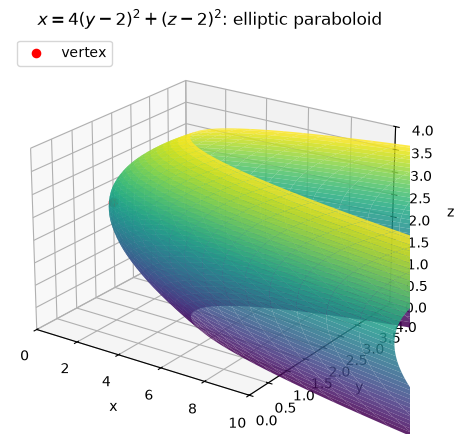
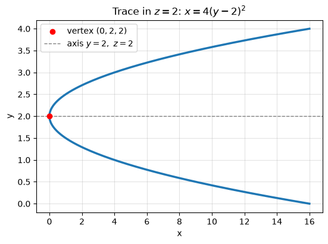
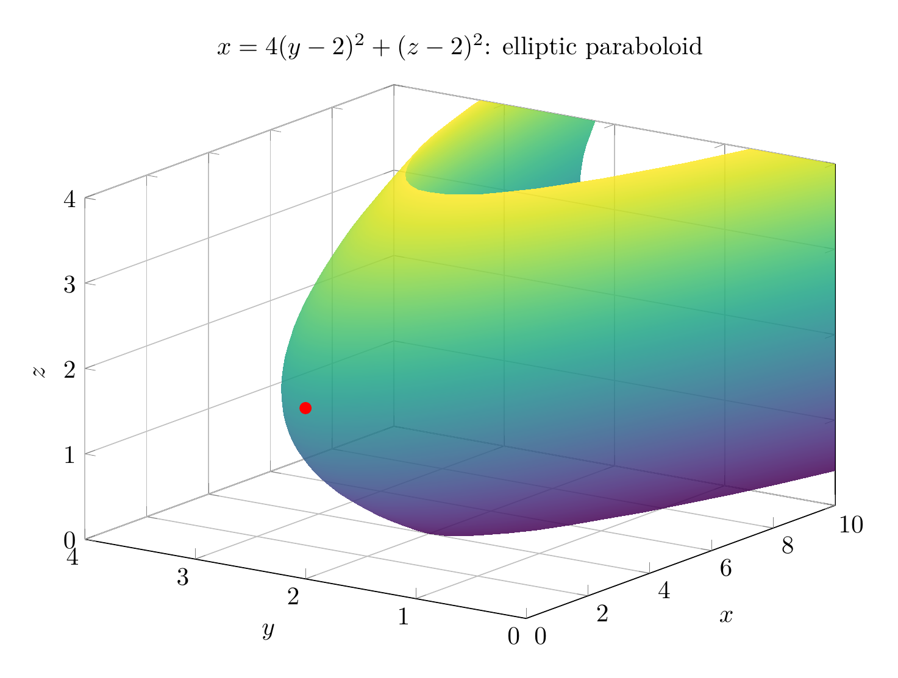
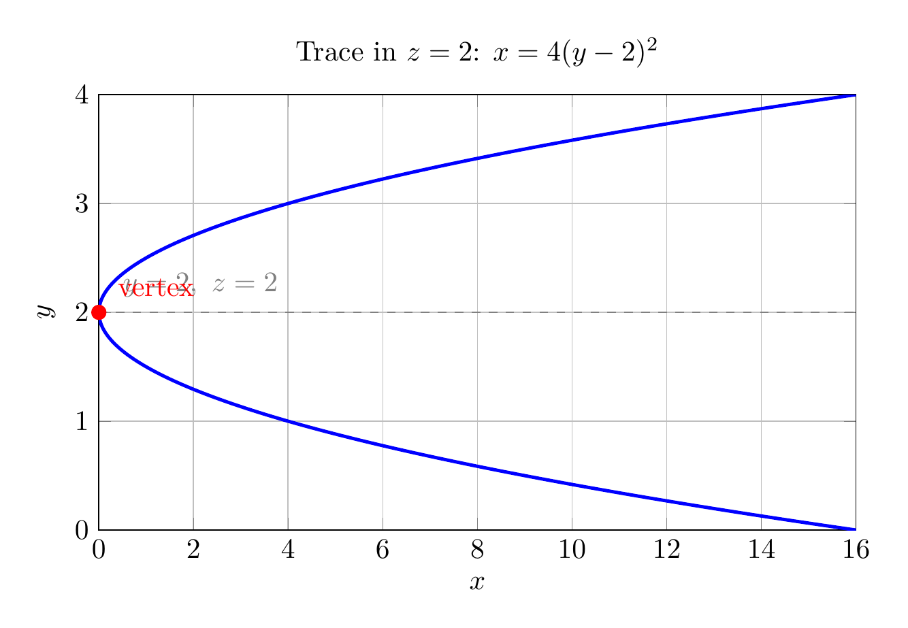

Complete the squares in the variables that appear quadratically:

$$
4y^2-16y=4\bigl((y-2)^2-4\bigr)=4(y-2)^2-16,
$$

and

$$
z^2-4z=(z-2)^2-4.
$$

Substituting into

$$
4y^2+z^2-x-16y-4z+20=0
$$

gives

$$
4(y-2)^2-16+(z-2)^2-4-x+20=0,
$$

so

$$
4(y-2)^2+(z-2)^2-x=0.
$$

Thus the reduced standard form is

$$
x=4(y-2)^2+(z-2)^2.
$$

This is an **elliptic paraboloid**. It opens in the positive $x$-direction because $x$ is the sum of two nonnegative squared terms. Its vertex occurs when both squared terms are zero:

$$
(y,z)=(2,2),\qquad x=0,
$$

so the vertex is $(0,2,2)$. The axis is the line $y=2,\ z=2$.

For $x=k>0$, the cross-section is the ellipse

$$
4(y-2)^2+(z-2)^2=k,
$$

or

$$
\frac{(y-2)^2}{k/4}+\frac{(z-2)^2}{k}=1.
$$

The traces in the planes $z=2$ and $y=2$ are parabolas:

$$
x=4(y-2)^2,\qquad x=(z-2)^2.
$$

There are no real points with $x<0$.

$$
\boxed{x=4(y-2)^2+(z-2)^2,\ \text{an elliptic paraboloid with vertex }(0,2,2)\text{ opening in the }+x\text{ direction}}
$$

---





---

[PGFplots / tikz plot.](./20260825_021731_632122_utc_0800_pgfplots_0.tex)

```latex
\documentclass[border=10pt]{standalone}
\usepackage{pgfplots}
\pgfplotsset{compat=1.18}
\begin{document}
\begin{tikzpicture}
\begin{axis}[
    width=12cm,
    height=9cm,
    view={-55}{22},
    xlabel=$x$, ylabel=$y$, zlabel=$z$,
    title={$x=4(y-2)^2+(z-2)^2$: elliptic paraboloid},
    domain=0:4,
    y domain=0:4,
    samples=35,
    samples y=35,
    colormap/viridis,
    grid=major,
    zmin=0, zmax=4,
    xmin=0, xmax=10,
    ymin=0, ymax=4,
]
\addplot3[surf,shader=interp,opacity=0.85]
({4*(y-2)^2+(x-2)^2}, y, x);
\addplot3[only marks, mark=*, mark size=2.2pt, red]
coordinates {(0,2,2)};
\end{axis}
\end{tikzpicture}
\end{document}
```



[PGFplots / tikz plot.](./20260825_021731_632122_utc_0800_pgfplots_1.tex)

```latex
\documentclass[border=10pt]{standalone}
\usepackage{pgfplots}
\pgfplotsset{compat=1.18}
\begin{document}
\begin{tikzpicture}
\begin{axis}[
    width=11cm,
    height=7cm,
    xlabel=$x$,
    ylabel=$y$,
    title={Trace in $z=2$: $x=4(y-2)^2$},
    domain=0:4,
    samples=200,
    grid=major,
    xmin=0, xmax=16,
    ymin=0, ymax=4,
]
\addplot[blue, very thick] ({4*(x-2)^2}, x);
\addplot[red, only marks, mark=*, mark size=2.5pt] coordinates {(0,2)};
\draw[gray, dashed] (axis cs:0,2) -- (axis cs:16,2);
\node[above right, gray] at (axis cs:0.3,2.05) {$y=2,\ z=2$};
\node[red, above right] at (axis cs:0.2,2.05) {vertex};
\end{axis}
\end{tikzpicture}
\end{document}
```

