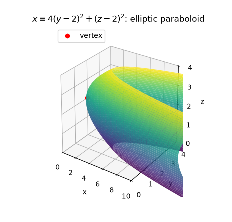
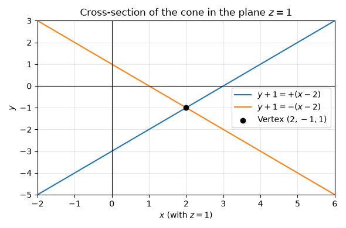
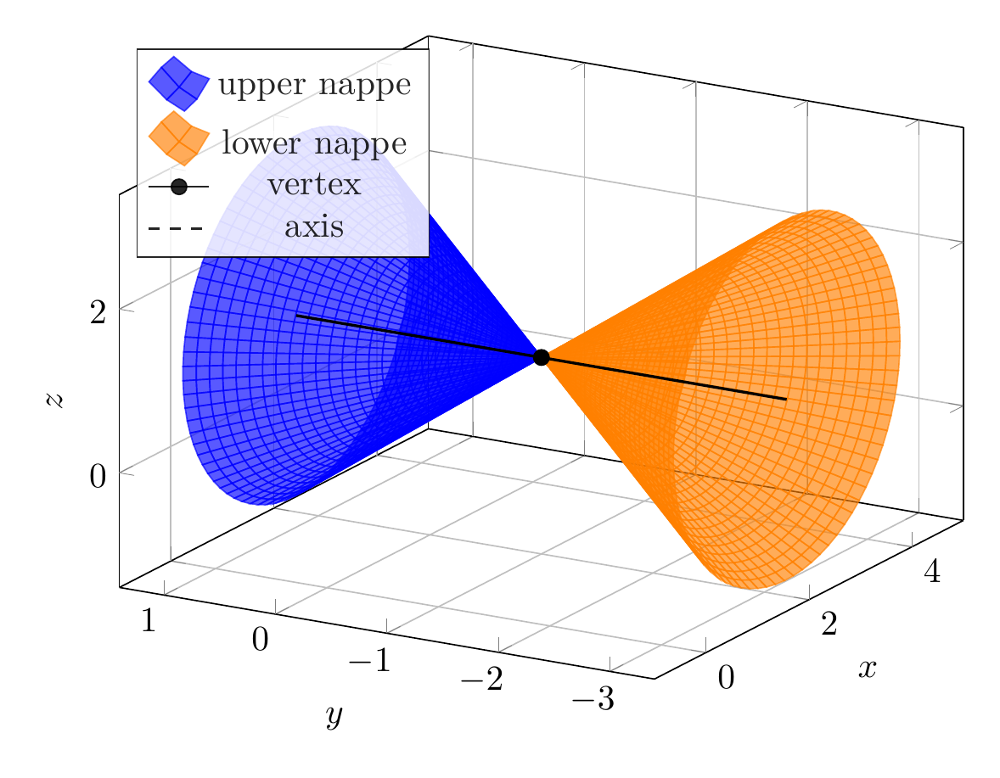
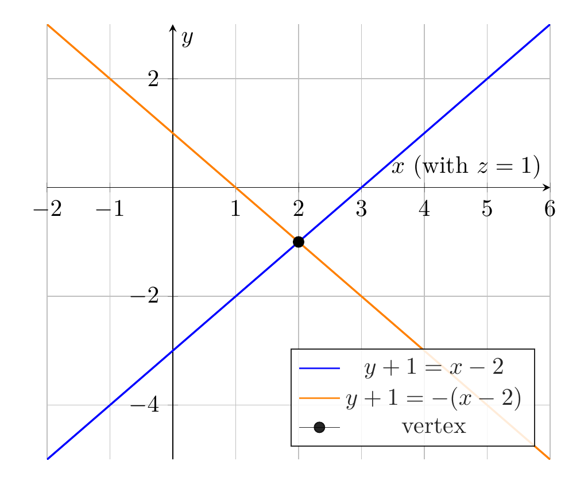

`[ Begin message. Type: HumanMessage. ]`

`[Begin Problem]`

Please solve the math problem in the image.


(Image `problem.png`. Alt text: Problem.)


`[End Problem]`

`[ End message. Type: HumanMessage. ]`

`[ Begin message. Type: AIMessage. ]`

`[Begin Answer]`

Complete the squares in $x$, $y$, and $z$:

\[
\begin{aligned}
x^2-y^2+z^2-4x-2y-2z+4
&=(x^2-4x+4)-(y^2+2y+1)+(z^2-2z+1)\\
&=(x-2)^2-(y+1)^2+(z-1)^2.
\end{aligned}
\]

So the given equation becomes

\[
(x-2)^2-(y+1)^2+(z-1)^2=0,
\]

or equivalently,

\[
\boxed{(x-2)^2+(z-1)^2=(y+1)^2.}
\]

This is the standard form of a **double circular cone** with vertex

\[
\boxed{(2,-1,1)}
\]

and axis the line

\[
\boxed{x=2,\quad z=1.}
\]

The cone opens in the positive and negative $y$-directions. In the cross-section $z=1$, the trace is

\[
(x-2)^2=(y+1)^2,
\]

so

\[
y+1=\pm(x-2),
\]

which are two intersecting lines through the vertex.

\[
\boxed{\text{The surface is a double circular cone.}}
\]

---


(Image `20260825_022222_039416_utc_0800_pyplot_0.png`. Alt text: pyplot-generated plot.)



(Image `20260825_022222_039416_utc_0800_pyplot_1.png`. Alt text: pyplot-generated plot.)




---

[PGFplots / tikz plot.](./20260825_022222_039416_utc_0800_pgfplots_0.tex)

```latex
\documentclass[border=10pt]{standalone}
\usepackage{pgfplots}
\pgfplotsset{compat=1.18}
\begin{document}
\begin{tikzpicture}
\begin{axis}[
  width=10cm,
  height=8cm,
  view={-60}{25},
  xlabel={$x$}, ylabel={$y$}, zlabel={$z$},
  domain=0:2.2,
  y domain=0:360,
  samples=28,
  samples y=80,
  grid=major,
  xmin=-1, xmax=5,
  ymin=-3.4, ymax=1.4,
  zmin=-1.4, zmax=3.4,
  legend style={at={(0.02,0.98)}, anchor=north west, fill=white, opacity=0.85}
]
\addplot3[surf, shader=flat, blue, opacity=0.65]
  ({2+x*cos(y)}, {-1+x}, {1+x*sin(y)});
\addlegendentry{upper nappe}
\addplot3[surf, shader=flat, orange, opacity=0.65]
  ({2+x*cos(y)}, {-1-x}, {1+x*sin(y)});
\addlegendentry{lower nappe}
\addplot3[black, mark=*, mark size=2.2pt] coordinates {(2,-1,1)};
\addlegendentry{vertex}
\addplot3[black, dashed, thick, domain=-2.2:2.2, samples=2]
  ({2}, {-1+x}, {1});
\addlegendentry{axis}
\end{axis}
\end{tikzpicture}
\end{document}

```


(Image `20260825_022222_039416_utc_0800_pgfplots_0.png`. Alt text: PGFplots / tikz plot (converted to PNG).)




[PGFplots / tikz plot.](./20260825_022222_039416_utc_0800_pgfplots_1.tex)

```latex
\documentclass[border=10pt]{standalone}
\usepackage{pgfplots}
\pgfplotsset{compat=1.18}
\begin{document}
\begin{tikzpicture}
\begin{axis}[
  width=9cm,
  height=8cm,
  axis lines=middle,
  xlabel={$x$ (with $z=1$)},
  ylabel={$y$},
  grid=major,
  xmin=-2, xmax=6,
  ymin=-5, ymax=3,
  legend pos=south east,
  legend style={fill=white, opacity=0.85}
]
\addplot[blue, thick, domain=-2:6, samples=2] {x-3};
\addlegendentry{$y+1=x-2$}
\addplot[orange, thick, domain=-2:6, samples=2] {-x+1};
\addlegendentry{$y+1=-(x-2)$}
\addplot[black, mark=*, mark size=2.2pt] coordinates {(2,-1)};
\addlegendentry{vertex}
\end{axis}
\end{tikzpicture}
\end{document}

```


(Image `20260825_022222_039416_utc_0800_pgfplots_1.png`. Alt text: PGFplots / tikz plot (converted to PNG).)



`[End Answer]`

`[ End message. Type: AIMessage. ]`