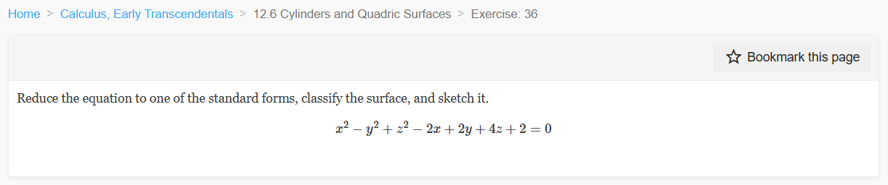
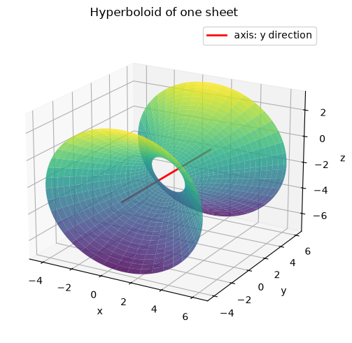
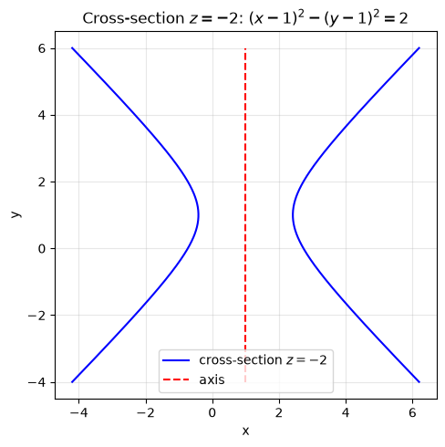
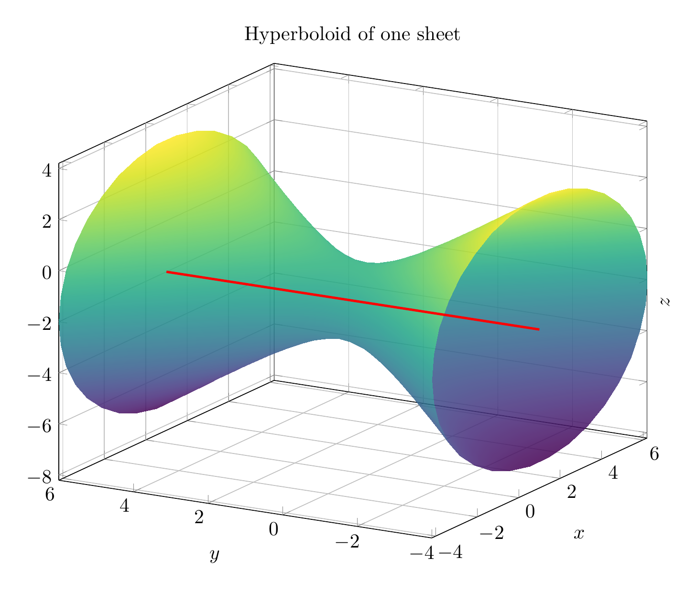
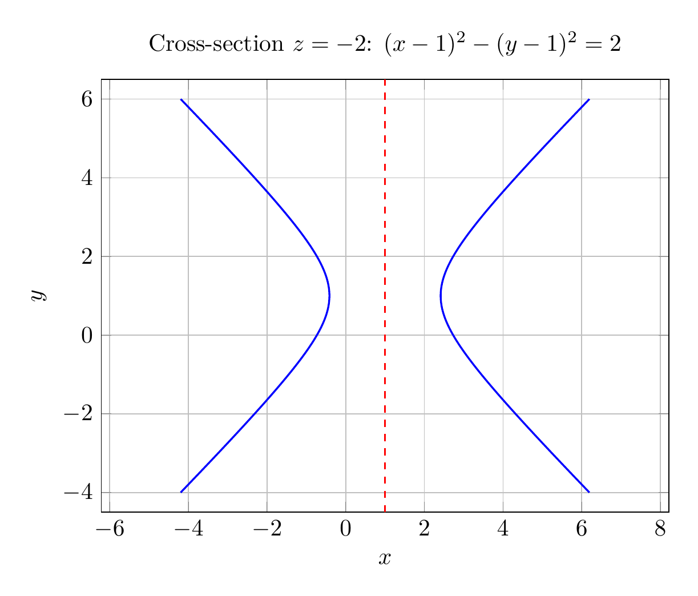

`[ Begin message. Type: HumanMessage. ]`

`[Begin Problem]`

Please solve the math problem in the image.


(Image `problem.png`. Alt text: Problem.)



`[End Problem]`

`[ End message. Type: HumanMessage. ]`

`[ Begin message. Type: AIMessage. ]`

`[Begin Answer]`

Complete the squares:

\[
x^2-2x=(x-1)^2-1,\qquad -y^2+2y=-(y-1)^2+1,\qquad z^2+4z=(z+2)^2-4.
\]

So the equation becomes

\[
(x-1)^2-(y-1)^2+(z+2)^2-2=0,
\]

or, in standard form,

\[
\frac{(x-1)^2}{2}+\frac{(z+2)^2}{2}-\frac{(y-1)^2}{2}=1.
\]

This is a **hyperboloid of one sheet**, centered at \((1,1,-2)\), with its axis parallel to the \(y\)-axis. Cross-sections \(y=\text{constant}\) are circles/ellipses, and the cross-section \(z=-2\) is the hyperbola \((x-1)^2-(y-1)^2=2\).

\[
\boxed{\frac{(x-1)^2}{2}+\frac{(z+2)^2}{2}-\frac{(y-1)^2}{2}=1,\ \text{hyperboloid of one sheet, axis parallel to the }y\text{-axis}}
\]

---


(Image `20260825_022650_329295_utc_0800_pyplot_0.png`. Alt text: pyplot-generated plot.)



(Image `20260825_022650_329295_utc_0800_pyplot_1.png`. Alt text: pyplot-generated plot.)




---

[PGFplots / tikz plot.](./20260825_022650_329295_utc_0800_pgfplots_0.tex)

```latex
\documentclass[border=10pt]{standalone}
\usepackage{pgfplots}
\pgfplotsset{compat=1.18}
\begin{document}
\begin{tikzpicture}
\begin{axis}[
  width=12cm, height=10cm,
  xlabel={$x$}, ylabel={$y$}, zlabel={$z$},
  title={Hyperboloid of one sheet},
  view={-60}{20},
  grid=major,
  domain=0:2*pi,
  y domain=-4:6,
  samples=35,
  samples y=25,
  colormap/viridis,
  zlabel style={at={(axis description cs:1.05,.5)}}
]
\addplot3[surf, shader=interp, opacity=0.85]
({1 + sqrt(2 + (y-1)^2)*cos(deg(x))},
 {y},
 {-2 + sqrt(2 + (y-1)^2)*sin(deg(x))});
\addplot3[red, very thick, samples y=0] coordinates {(1,-4,-2) (1,6,-2)};
\end{axis}
\end{tikzpicture}
\end{document}
```


(Image `20260825_022650_329295_utc_0800_pgfplots_0.png`. Alt text: PGFplots / tikz plot (converted to PNG).)




[PGFplots / tikz plot.](./20260825_022650_329295_utc_0800_pgfplots_1.tex)

```latex
\documentclass[border=10pt]{standalone}
\usepackage{pgfplots}
\pgfplotsset{compat=1.18}
\begin{document}
\begin{tikzpicture}
\begin{axis}[
  width=10cm, height=8cm,
  xlabel={$x$}, ylabel={$y$},
  title={Cross-section $z=-2$: $(x-1)^2-(y-1)^2=2$},
  grid=major,
  domain=-4:6,
  samples=200,
  axis equal,
  xmin=-4.5, xmax=6.5,
  ymin=-4.5, ymax=6.5
]
\addplot[blue, thick, domain=-4:6] ({1 + sqrt(2 + (x-1)^2)}, {x});
\addplot[blue, thick, domain=-4:6] ({1 - sqrt(2 + (x-1)^2)}, {x});
\addplot[red, dashed, thick] coordinates {(1,-4.5) (1,6.5)};
\end{axis}
\end{tikzpicture}
\end{document}
```


(Image `20260825_022650_329295_utc_0800_pgfplots_1.png`. Alt text: PGFplots / tikz plot (converted to PNG).)



`[End Answer]`

`[ End message. Type: AIMessage. ]`