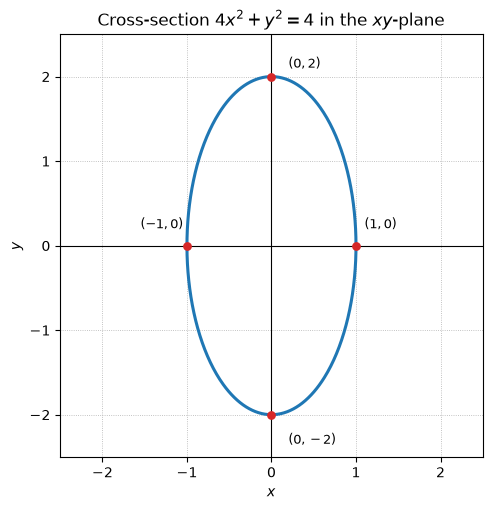
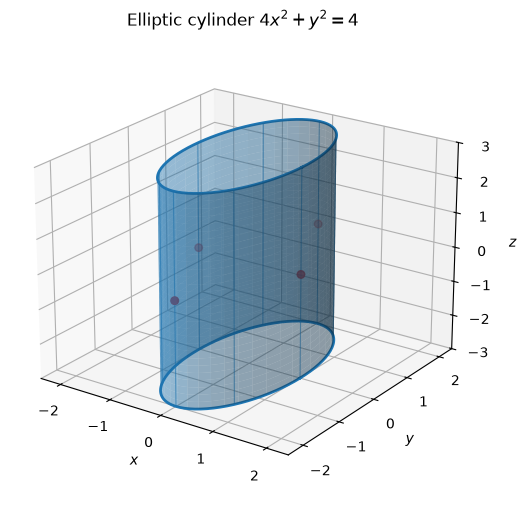
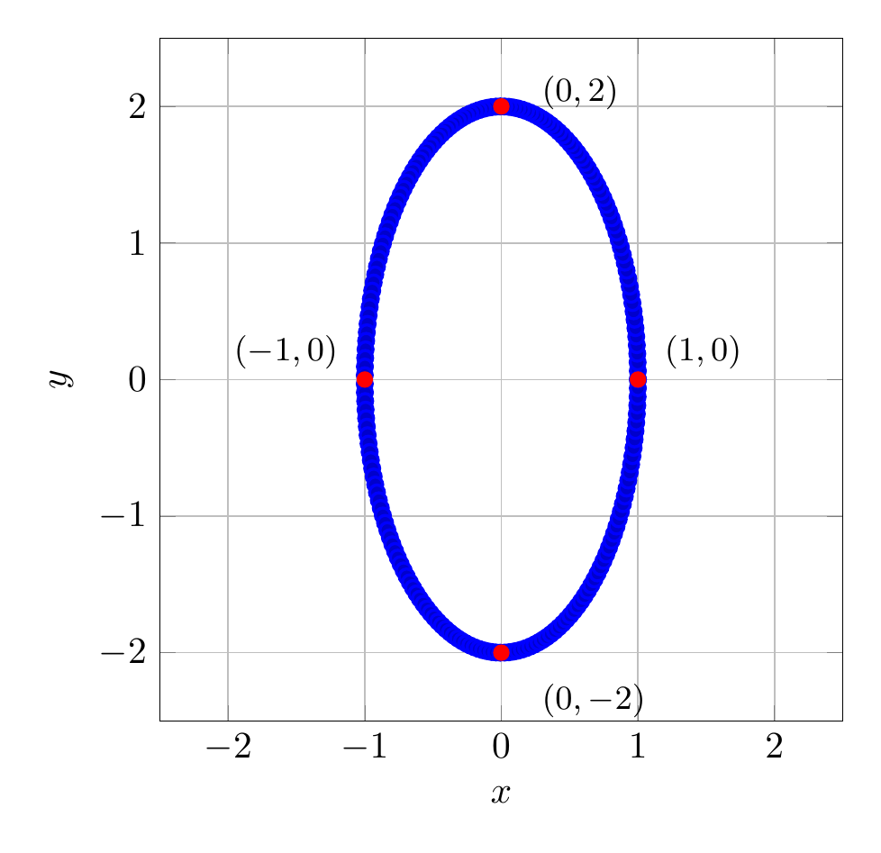
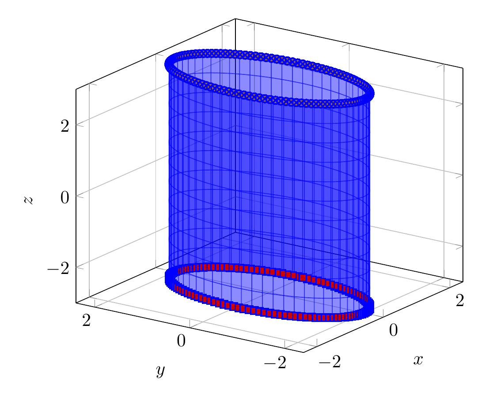

`[ Begin message. Type: HumanMessage. ]`

`[Begin Problem]`

Please solve the math problem in the image.


(Image `problem.png`. Alt text: Problem.)


`[End Problem]`

`[ End message. Type: HumanMessage. ]`

`[ Begin message. Type: AIMessage. ]`

`[Begin Answer]`

To describe the surface, rewrite the equation in standard ellipse form:

$$
4x^2+y^2=4
\quad\Longrightarrow\quad
\frac{x^2}{1^2}+\frac{y^2}{2^2}=1.
$$

Because there is no $z$ variable, $z$ can be any real number. So the cross-section in every horizontal plane $z=c$ is the same ellipse

$$
\frac{x^2}{1^2}+\frac{y^2}{2^2}=1,
$$

centered on the $z$-axis. The ellipse has semi-axis $1$ in the $x$-direction and semi-axis $2$ in the $y$-direction.

Therefore, the surface is an elliptic cylinder with axis along the $z$-axis. To sketch it, draw the ellipse in the $xy$-plane and extend it vertically in both the positive and negative $z$ directions.

$\boxed{\text{The surface }4x^2+y^2=4\text{ is an elliptic cylinder along the }z\text{-axis.}}$

---


(Image `20260824_172312_180486_utc_0800_pyplot_0.png`. Alt text: pyplot-generated plot.)



(Image `20260824_172312_180486_utc_0800_pyplot_1.png`. Alt text: pyplot-generated plot.)




---

[PGFplots / tikz plot.](./20260824_172312_180486_utc_0800_pgfplots_0.tex)

```latex
\documentclass[border=10pt]{standalone}
\usepackage{pgfplots}
\pgfplotsset{compat=1.18}
\begin{document}
\begin{tikzpicture}
\begin{axis}[
    axis equal,
    xlabel={$x$},
    ylabel={$y$},
    grid=major,
    xmin=-2.5, xmax=2.5,
    ymin=-2.5, ymax=2.5,
    width=8cm,
    height=8cm
]
\addplot+[domain=0:360, samples=200, thick, blue] ({cos(x)}, {2*sin(x)});
\addplot[only marks, mark=*, red] coordinates {(1,0) (-1,0) (0,2) (0,-2)};
\node[anchor=west, font=\small] at (axis cs:1.1,0.2) {$(1,0)$};
\node[anchor=east, font=\small] at (axis cs:-1.1,0.2) {$(-1,0)$};
\node[anchor=west, font=\small] at (axis cs:0.2,2.1) {$(0,2)$};
\node[anchor=west, font=\small] at (axis cs:0.2,-2.35) {$(0,-2)$};
\end{axis}
\end{tikzpicture}
\end{document}
```


(Image `20260824_172312_180486_utc_0800_pgfplots_0.png`. Alt text: PGFplots / tikz plot (converted to PNG).)




[PGFplots / tikz plot.](./20260824_172312_180486_utc_0800_pgfplots_1.tex)

```latex
\documentclass[border=10pt]{standalone}
\usepackage{pgfplots}
\pgfplotsset{compat=1.18}
\begin{document}
\begin{tikzpicture}
\begin{axis}[
    view={-55}{22},
    xlabel={$x$}, ylabel={$y$}, zlabel={$z$},
    xmin=-2.4, xmax=2.4,
    ymin=-2.4, ymax=2.4,
    zmin=-3, zmax=3,
    width=9cm, height=8cm,
    grid=major
]
\addplot3[
    surf, shader=flat, opacity=0.45,
    domain=0:360, y domain=-3:3,
    samples=60, samples y=12,
    blue
] ({cos(x)}, {2*sin(x)}, {y});
\addplot3+[domain=0:360, samples=120, thick, blue] ({cos(x)}, {2*sin(x)}, {-3});
\addplot3+[domain=0:360, samples=120, thick, blue] ({cos(x)}, {2*sin(x)}, {3});
\end{axis}
\end{tikzpicture}
\end{document}
```


(Image `20260824_172312_180486_utc_0800_pgfplots_1.png`. Alt text: PGFplots / tikz plot (converted to PNG).)



`[End Answer]`

`[ End message. Type: AIMessage. ]`