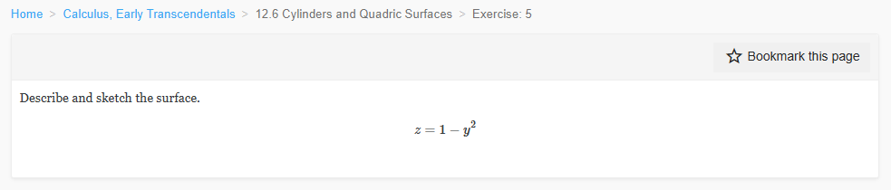
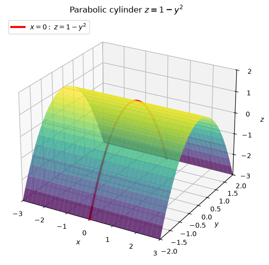
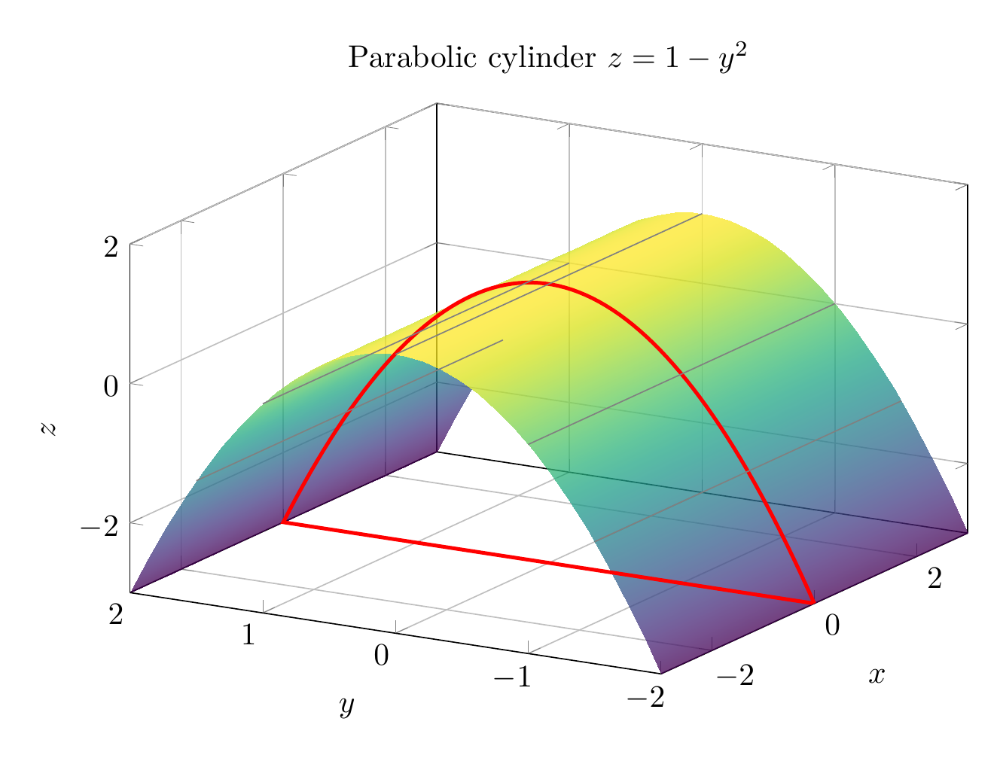

`[ Begin message. Type: HumanMessage. ]`

`[Begin Problem]`

Please solve the math problem in the image.


(Image `problem.png`. Alt text: Problem.)



`[End Problem]`

`[ End message. Type: HumanMessage. ]`

`[ Begin message. Type: AIMessage. ]`

`[Begin Answer]`

The surface is

$$
z=1-y^2.
$$

Notice that the equation does **not** contain $x$. Therefore, for every fixed $x$, the same parabola appears in the $yz$-plane. This makes the surface a **parabolic cylinder**.

Key traces:

- In the plane $x=0$, the trace is the parabola
  $$
  z=1-y^2,
  $$
  which opens downward, has vertex $(0,0,1)$, and crosses the $y$-axis at $y=\pm1$ when $z=0$.

- For any fixed $x=c$, the trace is the same parabola
  $$
  z=1-y^2.
  $$

- For any fixed $y=c$, the trace is a horizontal line parallel to the $x$-axis:
  $$
  z=1-c^2.
  $$

So the surface is generated by translating the parabola $z=1-y^2$ along the $x$-axis.

$$
\boxed{\text{The surface } z=1-y^2 \text{ is a parabolic cylinder extending along the } x\text{-axis.}}
$$

---


(Image `20260824_172346_533253_utc_0800_pyplot_0.png`. Alt text: pyplot-generated plot.)




---

[PGFplots / tikz plot.](./20260824_172346_533253_utc_0800_pgfplots_0.tex)

```latex
\documentclass[border=10pt]{standalone}
\usepackage{pgfplots}
\pgfplotsset{compat=1.18}
\begin{document}
\begin{tikzpicture}
\begin{axis}[
    width=11cm, height=8cm,
    view={-60}{25},
    xlabel={$x$}, ylabel={$y$}, zlabel={$z$},
    title={Parabolic cylinder $z=1-y^2$},
    grid=major,
    zmin=-3, zmax=2,
    xmin=-3, xmax=3,
    ymin=-2, ymax=2,
]
\addplot3[
    surf,
    shader=interp,
    colormap/viridis,
    opacity=0.75,
    domain=-3:3,
    y domain=-2:2,
    samples=30,
    samples y=30
] {1-y^2};
\addplot3[
    red, very thick,
    domain=-2:2,
    samples=80
] (0,x,{1-x^2});
\addplot3[gray, no marks] coordinates {(-3,-1.5,-1.25) (3,-1.5,-1.25)};
\addplot3[gray, no marks] coordinates {(-3,-1,0) (3,-1,0)};
\addplot3[gray, no marks] coordinates {(-3,0,1) (3,0,1)};
\addplot3[gray, no marks] coordinates {(-3,1,0) (3,1,0)};
\addplot3[gray, no marks] coordinates {(-3,1.5,-1.25) (3,1.5,-1.25)};
\end{axis}
\end{tikzpicture}
\end{document}
```


(Image `20260824_172346_533253_utc_0800_pgfplots_0.png`. Alt text: PGFplots / tikz plot (converted to PNG).)



`[End Answer]`

`[ End message. Type: AIMessage. ]`