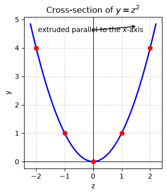
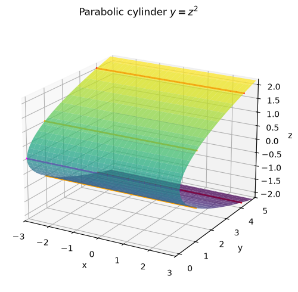
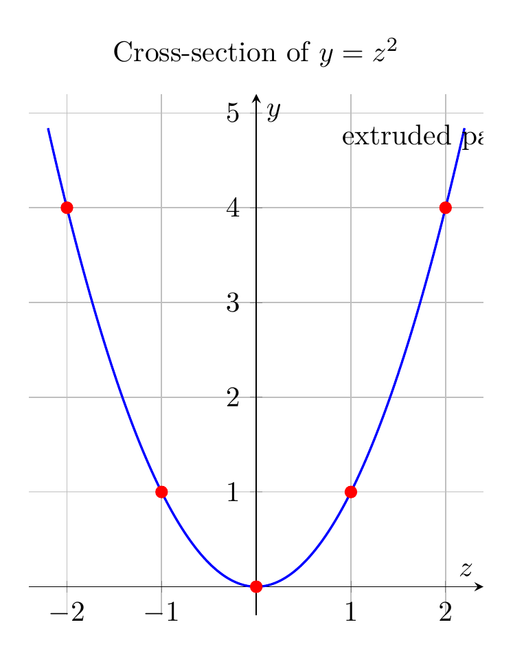
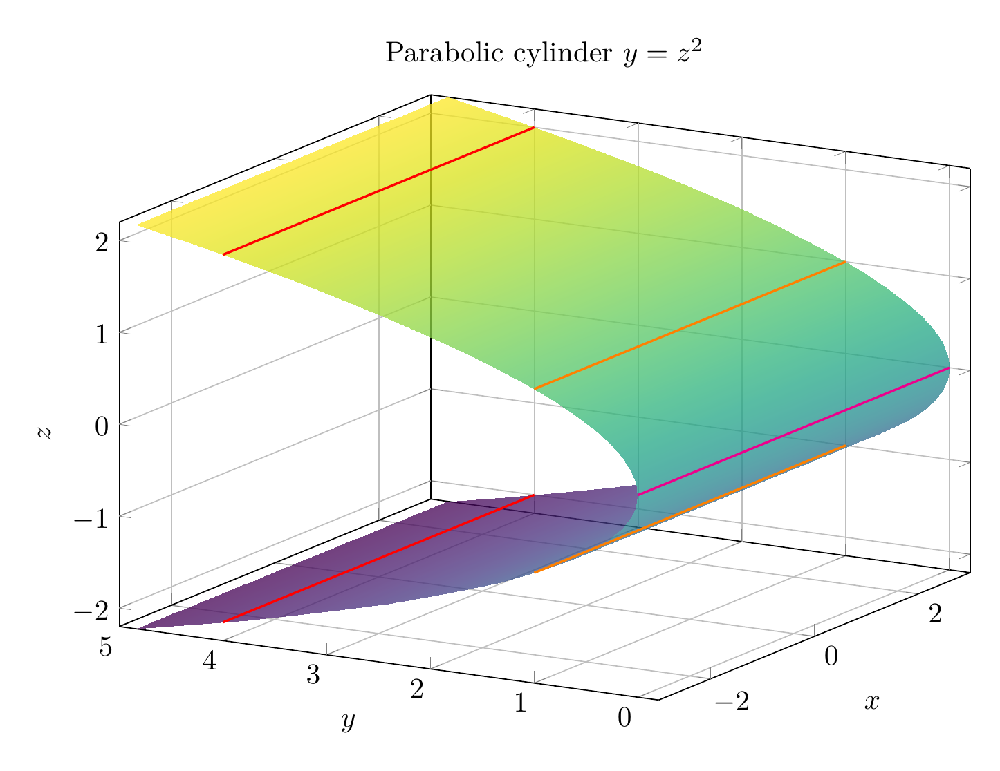

`[ Begin message. Type: AIMessage. ]`

The equation is
$$
y=z^2.
$$

Because the equation does **not** involve $x$, the same curve in the $yz$-plane is repeated for every value of $x$. In the plane $x=0$, the trace is the parabola
$$
y=z^2
$$
opening in the positive $y$-direction with vertex at $(0,0,0)$. Extruding this parabola parallel to the $x$-axis gives the surface.

A useful parametrization is
$$
\mathbf r(x,z)=(x,z^2,z), \qquad x,z\in\mathbb R.
$$

So the surface is a **parabolic cylinder** whose axis is parallel to the $x$-axis. Its cross-sections perpendicular to the $x$-axis are identical parabolas, and its rulings are the lines obtained by fixing $z=c$, giving
$$
(x,c^2,c), \qquad x\in\mathbb R.
$$

$\boxed{\text{The surface } y=z^2 \text{ is a parabolic cylinder extending parallel to the } x\text{-axis.}}$

---


(Image `20260824_172500_549518_utc_0800_pyplot_0.png`. Alt text: pyplot-generated plot.)



(Image `20260824_172500_549518_utc_0800_pyplot_1.png`. Alt text: pyplot-generated plot.)




---

[PGFplots / tikz plot.](./20260824_172500_549518_utc_0800_pgfplots_0.tex)

```latex
\documentclass[border=10pt]{standalone}
\usepackage{pgfplots}
\pgfplotsset{compat=1.18}
\begin{document}
\begin{tikzpicture}
\begin{axis}[
    axis lines=middle,
    xlabel={$z$}, ylabel={$y$},
    title={Cross-section of $y=z^2$},
    domain=-2.2:2.2,
    samples=200,
    grid=major,
    width=10cm,
    height=8cm,
    xmin=-2.4, xmax=2.4,
    ymin=-0.3, ymax=5.2,
    axis equal image,
]
\addplot[blue, thick] {x^2};
\addplot[only marks, red, mark=*] coordinates {(0,0) (1,1) (-1,1) (2,4) (-2,4)};
\node[anchor=south west] at (axis cs:0.8,4.5) {extruded parallel to the $x$-axis};
\end{axis}
\end{tikzpicture}
\end{document}
```


(Image `20260824_172500_549518_utc_0800_pgfplots_0.png`. Alt text: PGFplots / tikz plot (converted to PNG).)




[PGFplots / tikz plot.](./20260824_172500_549518_utc_0800_pgfplots_1.tex)

```latex
\documentclass[border=10pt]{standalone}
\usepackage{pgfplots}
\pgfplotsset{compat=1.18}
\begin{document}
\begin{tikzpicture}
\begin{axis}[
    view={-60}{20},
    xlabel={$x$}, ylabel={$y$}, zlabel={$z$},
    title={Parabolic cylinder $y=z^2$},
    domain=-3:3,
    y domain=-2.2:2.2,
    samples=35,
    samples y=35,
    colormap/viridis,
    width=12cm,
    height=9cm,
    xmin=-3, xmax=3,
    ymin=-0.2, ymax=5,
    zmin=-2.2, zmax=2.2,
    grid=major,
]
\addplot3[surf, opacity=0.75, shader=interp] ({x}, {y^2}, {y});
\addplot3[red, thick, domain=-3:3, samples=100] ({x}, {4}, {-2});
\addplot3[orange, thick, domain=-3:3, samples=100] ({x}, {1}, {-1});
\addplot3[magenta, thick, domain=-3:3, samples=100] ({x}, {0}, {0});
\addplot3[orange, thick, domain=-3:3, samples=100] ({x}, {1}, {1});
\addplot3[red, thick, domain=-3:3, samples=100] ({x}, {4}, {2});
\end{axis}
\end{tikzpicture}
\end{document}
```


(Image `20260824_172500_549518_utc_0800_pgfplots_1.png`. Alt text: PGFplots / tikz plot (converted to PNG).)



`[ End message. Type: AIMessage. ]`