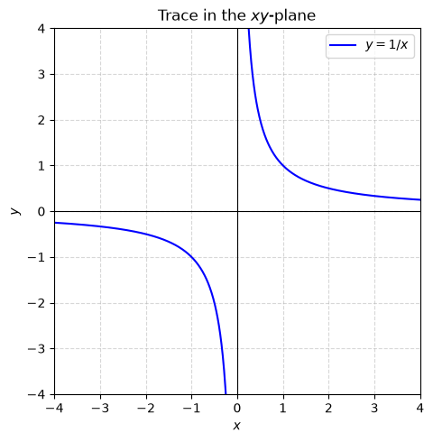
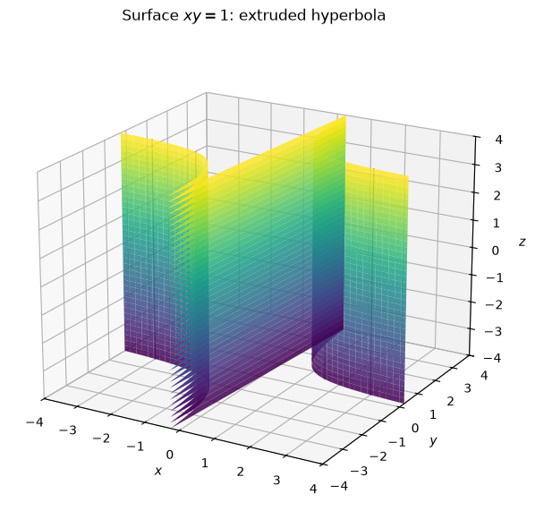
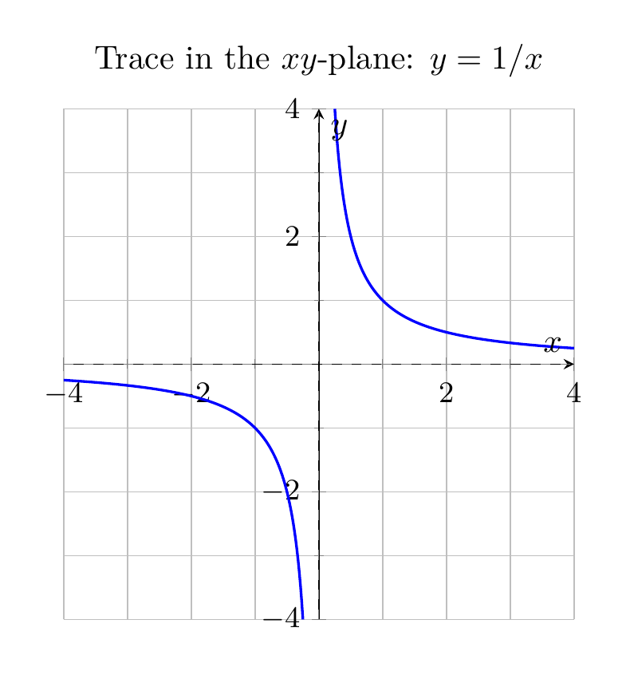
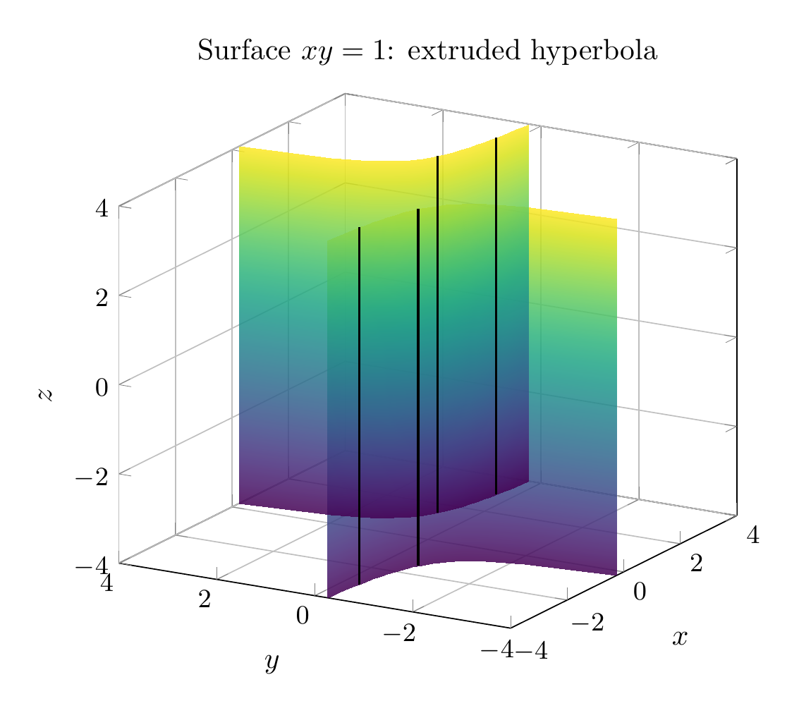

The equation is
\[
xy=1.
\]
Because the variable \(z\) does not appear, \(z\) is free. Thus the surface is obtained by taking the hyperbola
\[
y=\frac1x
\]
in the \(xy\)-plane and extending it parallel to the \(z\)-axis.

A useful parametrization is
\[
\mathbf r(t,z)=\left(t,\frac1t,z\right),\qquad t\neq 0.
\]
For each fixed \(z=c\), the trace is the same rectangular hyperbola \(xy=1\). For each fixed \(x=a\neq 0\), the trace is the vertical line \(y=1/a\). Similarly, for each fixed \(y=b\neq 0\), the trace is the vertical line \(x=1/b\).

So the surface is a **hyperbolic cylinder** with two sheets, one over the first-quadrant branch and one over the third-quadrant branch of \(xy=1\). It is asymptotic to the vertical coordinate planes \(x=0\) and \(y=0\).

\[
\boxed{\text{The surface }xy=1\text{ is a hyperbolic cylinder: }y=1/x\text{ extruded parallel to the }z\text{-axis.}}
\]

---





---

[PGFplots / tikz plot.](./20260824_172604_541387_utc_0800_pgfplots_0.tex)

```latex
\documentclass[border=10pt]{standalone}
\usepackage{pgfplots}
\pgfplotsset{compat=1.18}
\begin{document}
\begin{tikzpicture}
\begin{axis}[
    axis lines=middle,
    xlabel={$x$},
    ylabel={$y$},
    xmin=-4, xmax=4,
    ymin=-4, ymax=4,
    width=8cm, height=7cm,
    grid=both,
    minor tick num=1,
    tick label style={font=\small},
    axis equal image,
    title={Trace in the $xy$-plane: $y=1/x$},
]
\addplot[blue, thick, domain=-4:-0.25, samples=200] {1/x};
\addplot[blue, thick, domain=0.25:4, samples=200] {1/x};
\addplot[dashed, gray, very thin, domain=-4:4, samples=2] {0};
\addplot[dashed, gray, very thin, samples=2] coordinates {(0,-4) (0,4)};
\end{axis}
\end{tikzpicture}
\end{document}
```



[PGFplots / tikz plot.](./20260824_172604_541387_utc_0800_pgfplots_1.tex)

```latex
\documentclass[border=10pt]{standalone}
\usepackage{pgfplots}
\pgfplotsset{compat=1.18}
\begin{document}
\begin{tikzpicture}
\begin{axis}[
    view={-60}{20},
    xlabel={$x$},
    ylabel={$y$},
    zlabel={$z$},
    xmin=-4, xmax=4,
    ymin=-4, ymax=4,
    zmin=-4, zmax=4,
    width=9cm, height=8cm,
    grid=major,
    tick label style={font=\small},
    title={Surface $xy=1$: extruded hyperbola},
]
\addplot3[
    surf, shader=interp, opacity=0.85,
    colormap/viridis,
    domain=-4:-0.25, samples=20,
    domain y=-4:4, samples y=8,
] ({x},{1/x},{y});
\addplot3[
    surf, shader=interp, opacity=0.85,
    colormap/viridis,
    domain=0.25:4, samples=20,
    domain y=-4:4, samples y=8,
] ({x},{1/x},{y});
\addplot3[black, thick, samples=2] coordinates {(3,1/3,-4) (3,1/3,4)};
\addplot3[black, thick, samples=2] coordinates {(1.5,2/3,-4) (1.5,2/3,4)};
\addplot3[black, thick, samples=2] coordinates {(-1.5,-2/3,-4) (-1.5,-2/3,4)};
\addplot3[black, thick, samples=2] coordinates {(-3,-1/3,-4) (-3,-1/3,4)};
\end{axis}
\end{tikzpicture}
\end{document}
```

