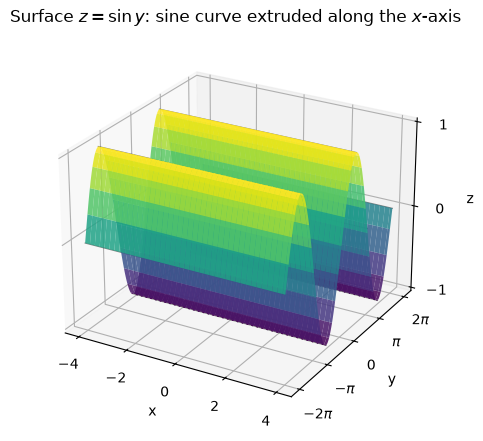
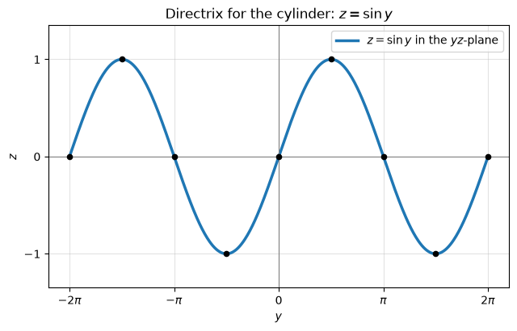
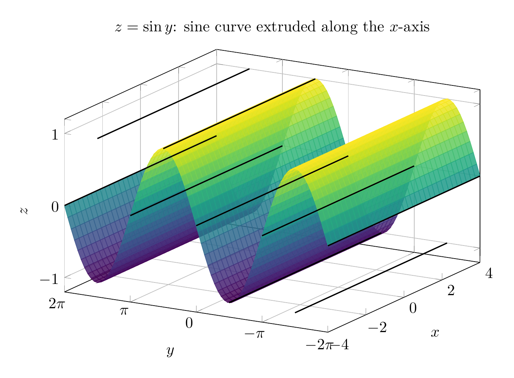
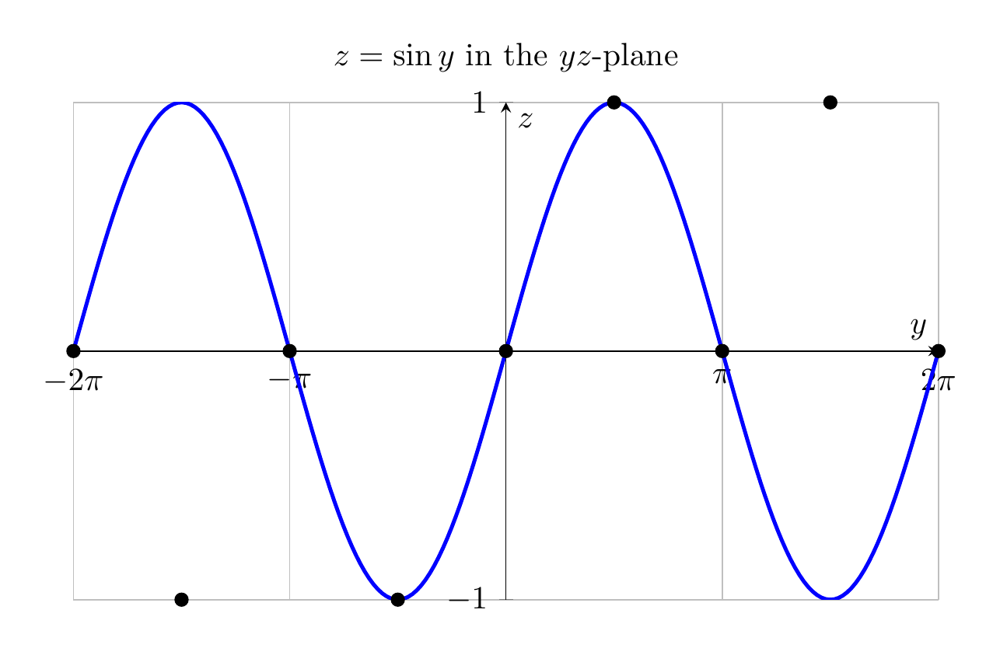

For the surface
\[
z=\sin y,
\]
the variable \(x\) is absent. That means \(z\) depends only on \(y\), so for a fixed value of \(y\), the height \(z\) is the same for every \(x\).

Key traces:

- In the \(yz\)-plane \((x=0)\), the trace is the sine curve \(z=\sin y\).
- In any plane \(x=x_0\), the trace is the same sine curve \(z=\sin y\).
- In any plane \(y=y_0\), the trace is the horizontal line
  \[
  z=\sin y_0
  \]
  parallel to the \(x\)-axis.
- The surface crosses the \(xy\)-plane when \(z=0\), i.e. when \(y=n\pi\), \(n\in\mathbb Z\).
- It is bounded between the planes \(z=1\) and \(z=-1\), and is periodic in the \(y\)-direction with period \(2\pi\).

Therefore the surface is a sinusoidal cylinder: the sine curve \(z=\sin y\) in the \(yz\)-plane is extruded parallel to the \(x\)-axis.

\[
\boxed{\text{\(z=\sin y\) is a sinusoidal cylinder with rulings parallel to the \(x\)-axis.}}
\]

---





---

[PGFplots / tikz plot.](./20260824_172702_272813_utc_0800_pgfplots_0.tex)

```latex
\documentclass[border=10pt]{standalone}
\usepackage{pgfplots}
\pgfplotsset{compat=1.18}
\begin{document}
\begin{tikzpicture}
\begin{axis}[
  width=11cm, height=8cm,
  xlabel={$x$}, ylabel={$y$}, zlabel={$z$},
  title={$z=\sin y$: sine curve extruded along the $x$-axis},
  domain=-4:4,
  y domain=-2*pi:2*pi,
  samples=35,
  samples y=80,
  view={-60}{25},
  ztick={-1,0,1},
  ytick={-6.283,-3.142,0,3.142,6.283},
  yticklabels={$-2\pi$,$-\pi$,$0$,$\pi$,$2\pi$},
  grid=major,
  colormap/viridis,
]
\addplot3[surf,shader=flat,opacity=0.85] {sin(deg(y))};
% Rulings parallel to x-axis at key y-values
\addplot3[domain=-4:4, samples=2, black, thick] ({x}, {-2*pi}, {0});
\addplot3[domain=-4:4, samples=2, black, thick] ({x}, {-3*pi/2}, {-1});
\addplot3[domain=-4:4, samples=2, black, thick] ({x}, {-pi}, {0});
\addplot3[domain=-4:4, samples=2, black, thick] ({x}, {-pi/2}, {-1});
\addplot3[domain=-4:4, samples=2, black, thick] ({x}, {0}, {0});
\addplot3[domain=-4:4, samples=2, black, thick] ({x}, {pi/2}, {1});
\addplot3[domain=-4:4, samples=2, black, thick] ({x}, {pi}, {0});
\addplot3[domain=-4:4, samples=2, black, thick] ({x}, {3*pi/2}, {1});
\addplot3[domain=-4:4, samples=2, black, thick] ({x}, {2*pi}, {0});
\end{axis}
\end{tikzpicture}
\end{document}
```



[PGFplots / tikz plot.](./20260824_172702_272813_utc_0800_pgfplots_1.tex)

```latex
\documentclass[border=10pt]{standalone}
\usepackage{pgfplots}
\pgfplotsset{compat=1.18}
\begin{document}
\begin{tikzpicture}
\begin{axis}[
  width=11cm, height=7cm,
  xlabel={$y$}, ylabel={$z$},
  title={$z=\sin y$ in the $yz$-plane},
  domain=-2*pi:2*pi,
  samples=200,
  ytick={-1,0,1},
  xtick={-6.283,-3.142,0,3.142,6.283},
  xticklabels={$-2\pi$,$-\pi$,$0$,$\pi$,$2\pi$},
  grid=major,
  axis lines=middle,
]
\addplot[blue, very thick] {sin(deg(x))};
\addplot[only marks, black, mark=*] coordinates {
  (-2*pi,0) (-3*pi/2,-1) (-pi,0) (-pi/2,-1)
  (0,0) (pi/2,1) (pi,0) (3*pi/2,1) (2*pi,0)
};
\end{axis}
\end{tikzpicture}
\end{document}
```

