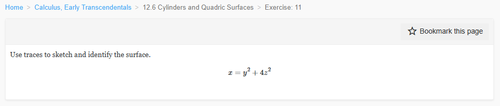
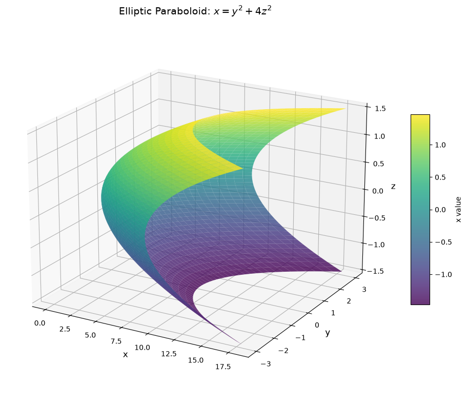
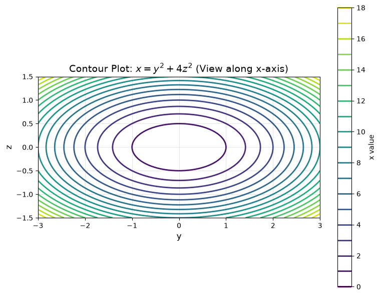
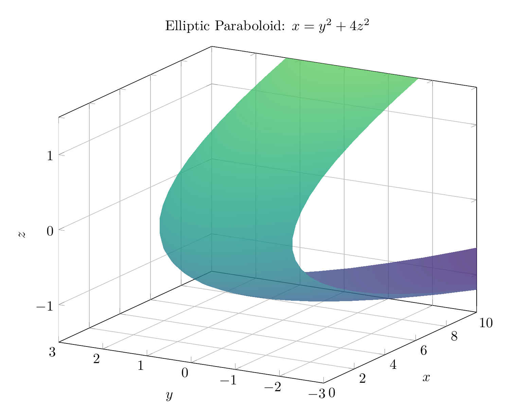
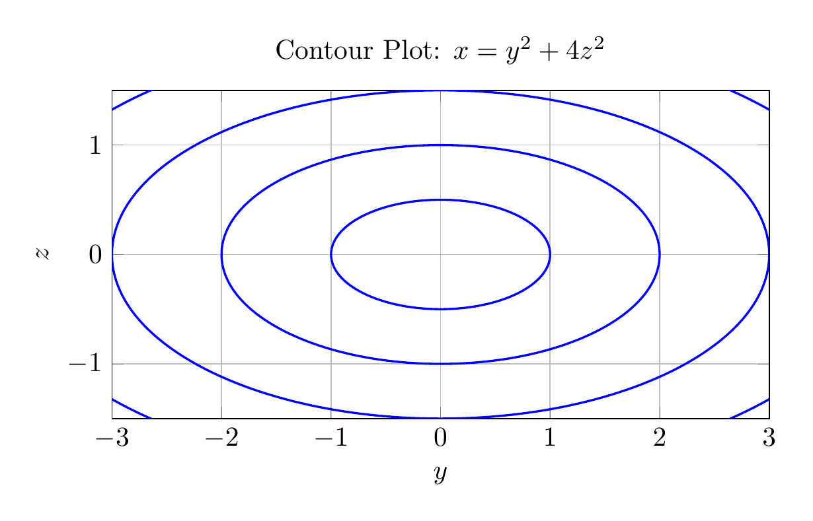

`[ Begin message. Type: HumanMessage. ]`

`[Begin Problem]`

Please solve the math problem in the image.


(Image `problem.png`. Alt text: Problem.)



`[End Problem]`

`[ End message. Type: HumanMessage. ]`

`[ Begin message. Type: AIMessage. ]`

`[Begin Answer]`

# Solution: Identifying the Surface $x = y^2 + 4z^2$

## Step 1: Analyze the Equation

The given equation is:
$$x = y^2 + 4z^2$$

This is a quadratic equation in three variables. To identify the surface, we'll examine its traces (cross-sections) in different planes.

## Step 2: Examine Traces

### Trace in planes $x = k$ (constant):
Setting $x = k$ where $k > 0$:
$$k = y^2 + 4z^2$$

This is the equation of an **ellipse** in the $yz$-plane with:
- Semi-axis in $y$-direction: $\sqrt{k}$
- Semi-axis in $z$-direction: $\frac{\sqrt{k}}{2}$

As $k$ increases, the ellipses get larger. When $k = 0$, we get a single point at the origin. When $k < 0$, there are no real solutions.

### Trace in planes $y = k$ (constant):
Setting $y = k$:
$$x = k^2 + 4z^2$$

This is a **parabola** in the $xz$-plane opening in the positive $x$-direction with vertex at $(k^2, k, 0)$.

### Trace in planes $z = k$ (constant):
Setting $z = k$:
$$x = y^2 + 4k^2$$

This is a **parabola** in the $xy$-plane opening in the positive $x$-direction with vertex at $(4k^2, 0, k)$.

## Step 3: Identify the Surface

The equation $x = y^2 + 4z^2$ has the standard form of an **elliptic paraboloid**:
$$x = Ay^2 + Bz^2$$

where $A = 1 > 0$ and $B = 4 > 0$.

**Key characteristics:**
- The surface opens along the **positive $x$-axis**
- Cross-sections perpendicular to the $x$-axis are **ellipses**
- Cross-sections parallel to the $xy$-plane and $xz$-plane are **parabolas**
- The vertex is at the **origin** $(0, 0, 0)$

## Conclusion

The surface $x = y^2 + 4z^2$ is an **elliptic paraboloid** opening in the positive $x$-direction.

The elliptical cross-sections become wider as $x$ increases, and the surface extends infinitely in the positive $x$-direction. The factor of 4 in front of $z^2$ means the ellipses are stretched more in the $y$-direction than in the $z$-direction (specifically, the $y$-semi-axis is twice as long as the $z$-semi-axis for any given $x$ value).

$\boxed{\text{Elliptic Paraboloid}}$

---


(Image `20260825_142105_876301_utc_0800_pyplot_0.png`. Alt text: pyplot-generated plot.)



(Image `20260825_142105_876301_utc_0800_pyplot_1.png`. Alt text: pyplot-generated plot.)




---

[PGFplots / tikz plot.](./20260825_142105_876301_utc_0800_pgfplots_0.tex)

```latex
\documentclass[border=10pt]{standalone}
\usepackage{pgfplots}
\pgfplotsset{compat=1.18}
\usepgfplotslibrary{colormaps}

\begin{document}
\begin{tikzpicture}
\begin{axis}[
    width=12cm,
    height=10cm,
    xlabel={$x$},
    ylabel={$y$},
    zlabel={$z$},
    title={Elliptic Paraboloid: $x = y^2 + 4z^2$},
    view={-60}{20},
    colormap/viridis,
    grid=major,
    zmin=-1.5,
    zmax=1.5,
    ymin=-3,
    ymax=3,
    xmin=0,
    xmax=10,
]
\addplot3[
    surf,
    domain=-3:3,
    y domain=-1.5:1.5,
    samples=40,
    samples y=30,
    shader=interp,
    opacity=0.8
] 
(y^2 + 4*x^2, y, x);
\end{axis}
\end{tikzpicture}
\end{document}
```


(Image `20260825_142105_876301_utc_0800_pgfplots_0.png`. Alt text: PGFplots / tikz plot (converted to PNG).)




[PGFplots / tikz plot.](./20260825_142105_876301_utc_0800_pgfplots_1.tex)

```latex
\documentclass[border=10pt]{standalone}
\usepackage{pgfplots}
\pgfplotsset{compat=1.18}

\begin{document}
\begin{tikzpicture}
\begin{axis}[
    width=10cm,
    height=8cm,
    xlabel={$y$},
    ylabel={$z$},
    title={Contour Plot: $x = y^2 + 4z^2$},
    grid=major,
    xmin=-3,
    xmax=3,
    ymin=-1.5,
    ymax=1.5,
    axis equal image,
]
% Ellipses for different x values: y^2 + 4z^2 = k
% For k=1: y^2/1 + z^2/(1/4) = 1, so a=1, b=0.5
% For k=4: y^2/4 + z^2/1 = 1, so a=2, b=1
% For k=9: y^2/9 + z^2/(9/4) = 1, so a=3, b=1.5
\draw[blue, thick] (axis cs:0,0) ellipse [x radius=1, y radius=0.5];
\draw[blue, thick] (axis cs:0,0) ellipse [x radius=2, y radius=1];
\draw[blue, thick] (axis cs:0,0) ellipse [x radius=3, y radius=1.5];
\draw[blue, thick] (axis cs:0,0) ellipse [x radius=4, y radius=2];
\draw[blue, thick] (axis cs:0,0) ellipse [x radius=5, y radius=2.5];
\end{axis}
\end{tikzpicture}
\end{document}
```


(Image `20260825_142105_876301_utc_0800_pgfplots_1.png`. Alt text: PGFplots / tikz plot (converted to PNG).)



`[End Answer]`

`[ End message. Type: AIMessage. ]`